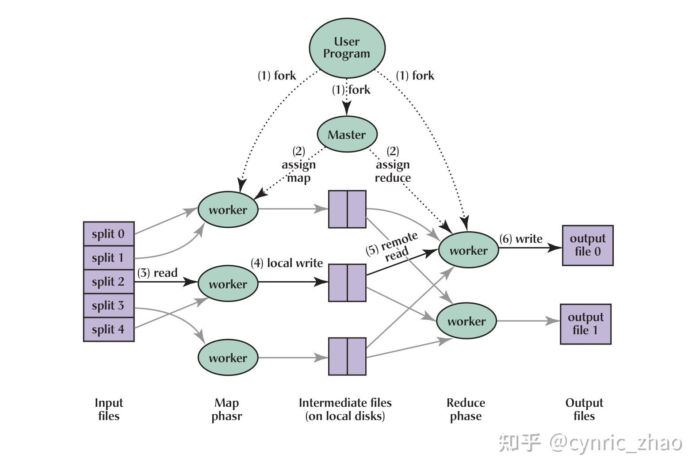

update later

## Lecture 1-Introduciton

### 1.6一致性：

**弱一致性：**常常会使用弱一致系统，只需要更新最近的数据副本，并且只需要从最近的副本获取数据。在学术界和现实世界（工业界），有大量关于构建弱一致性保证的研究。所以，弱一致对于应用程序来说很有用，并且它可以用来获取高的性能。

**强一致性：**能保证获取最新的数据，但是代价很高

### 1.7 MapReduce基本工作方式

​	MapReduce是由Google设计，开发和使用的一个系统。MapReduce的思想是，应用程序设计人员和分布式运算的使用者，只需要写简单的Map函数和Reduce函数，而不需要知道任何有关分布式的事情，MapReduce框架会处理剩下的事情。

​	抽象来看，MapReduce假设有一些输入，这些输入被分割成大量的不同的文件或者数据块。所以，我们假设现在有输入文件1，输入文件2和输入文件3，这些输入可能是从网上抓取的网页，更可能是包含了大量网页的文件。MapReduce启动时，会查找Map函数。之后，MapReduce框架会为每个输入文件运行Map函数。这里很明显有一些可以并行运算的地方，比如说可以并行运行多个只关注输入和输出的Map函数。Map函数以文件作为输入，文件又是整个输入数据的一部分。Map函数的输出是一个key-value对的列表。假设我们在实现一个最简单的MapReduce Job：单词计数器。它会统计每个单词出现的次数。在这个例子中，Map函数会输出key-value对，其中key是单词，而value是1。Map函数会将输入中的每个单词拆分，并输出一个key-value对，key是该单词，value是1。最后需要对所有的key-value进行计数，以获得最终的输出。所以，假设输入文件1包含了单词a和单词b，Map函数的输出将会是key=a，value=1，key=b，value=1。第二个Map函数只从输入文件2看到了b，那么输出将会是key=b，value=1。第三个输入文件有一个a和一个c。我们对所有的输入文件都运行了Map函数，并得到了论文中称之为中间输出（intermediate output），也就是每个Map函数输出的key-value对。

运算的第二阶段是运行Reduce函数。MapReduce框架会收集所有Map函数输出的每一个单词的统计。比如说，MapReduce框架会先收集每一个Map函数输出的key为a的key-value对。收集了之后，会将它们提交给Reduce函数。

### 1.8 Map函数和Reduce函数

