[TOC]

# Redis核心技术与实战

## 01. 基本架构：一个键值数据库包含什么？

**可以存哪些数据？**

对于键值数据库而言，基本的数据模型是 key-value 模型。 Redis 支持的 value 类型包括了 String、哈希表、列表、集合等。

**可以对数据做什么操作？**

PUT/GET/DELETE/SCAN是一个键值数据库的基本操作集合。scan操作，根据一段key的范围返回响应的value值。

**采用什么访问模式？**

一种是通过函数库调用的方式供外部应用使用，另一种是通过网络框架以 Socket 通信的形式对外提供键值对操作。例如，RocksDB 以动态链接库的形式使用，而 Memcached 和 Redis 则是通过网络框架访问。

**如何确定键值对的位置？**

索引的作用是让键值数据库根据 key 找到相应 value 的存储位置，进而执行操作。，例如，Memcached 和 Redis 采用哈希表作为 key-value 索引，而 RocksDB 则采用跳表作为内存中 key-value 的索引。内存键值数据库（例如 Redis）采用哈希表作为索引，很大一部分原因在于，其键值数据基本都是保存在内存中的，而内存的高性能随机访问特性可以很好地与哈希表O(1) 的操作复杂度相匹配。

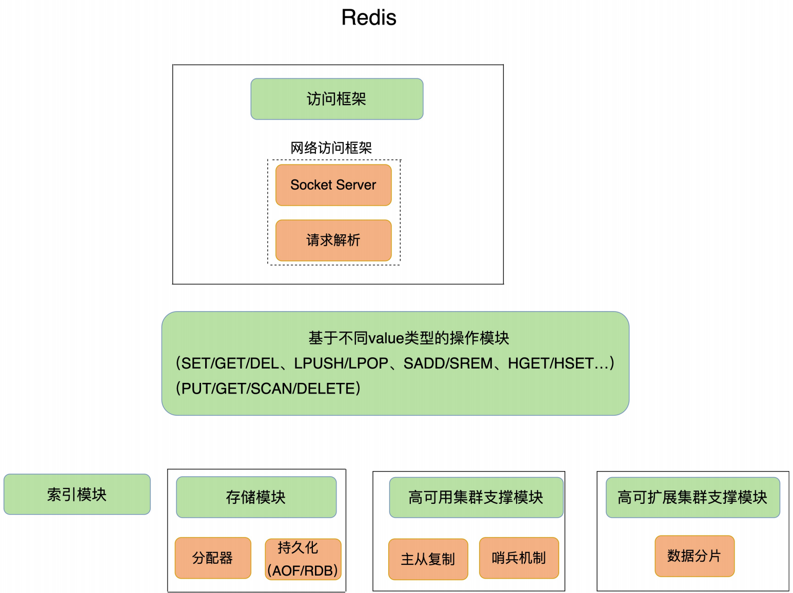

## 02. 数据结构：快速的Redis有哪些慢操作？

为什么 Redis速度快？一方面，这是因为它是内存数据库，所有操作都在内存上完成，内存的访问速度本身就很快。另一方面，这要归功于它的数据结构。


**键和值用什么结构组织？**

Redis使用了一个哈希表来保存所有键值对。哈希桶中的entry元素中保存了*key和*value指针，分别指向了时机的键和值。

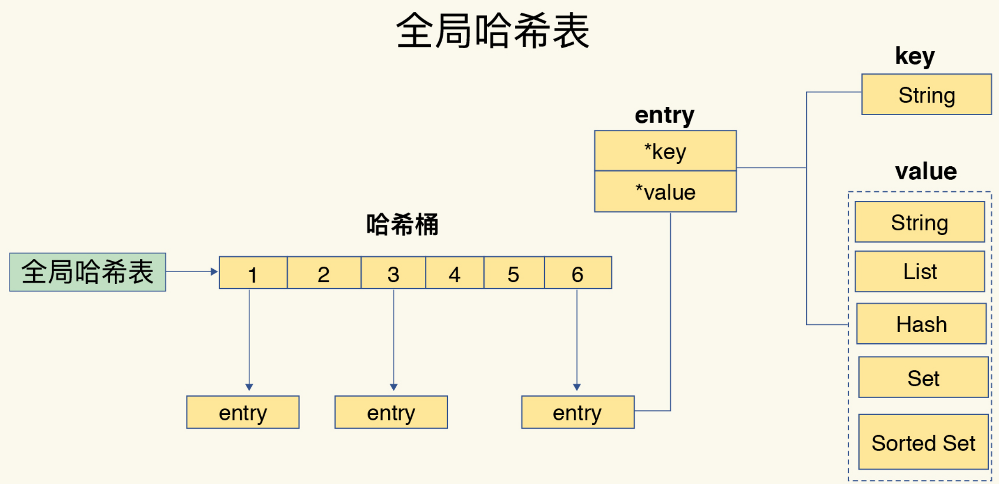

Redis 解决哈希冲突的方式，就是链式哈希。Redis会对哈希表做rehash操作。增加现有哈希桶数量，让增多的entry元素能在更多的桶之间分散保存。Redis 默认使用了两个全局哈希表：哈希表 1 和哈希表 2。一开始，当你刚插入数据时，默认使用哈希表 1，此时的哈希表 2 并没有被分配空间。随着数据逐步增多，Redis 开始执行 rehash，这个过程分为三步：

1. 给哈希表 2 分配更大的空间，例如是当前哈希表 1 大小的两倍；
2. 把哈希表 1 中的数据重新映射并拷贝到哈希表 2 中；
3. 释放哈希表 1 的空间。

如果一次性把哈希表 1 中的数据都迁移完，会造成 Redis 线程阻塞，无法服务其他请求。Redis 采用了**渐进式 rehash**。每处理一个请求

时，从哈希表 1 中的第一个索引位置开始，顺带着将这个索引位置上的所有 entries 拷贝到哈希表 2 中；等处理下一个请求时，再顺带拷贝哈希表 1 中的下一个索引位置的entries。

对于范围操作，是指集合中的遍历操作，可以返回集合中的所有数据。复杂度一般是O（N），比较耗时，尽量避免。Redis从2.8版本开始提供了SCAN系列操作，(HSCAN,SSCAN,ZSCAN)，这类操作实现了渐进式遍历，每次只返回有限数量的数据。相比于HGETALL、SMEMBERS 这类操作来说，就避免了一次性返回所有元素而导致的 Redis 阻塞。

## 03. 高性能IO模型：为什么单线程Redis能这么快？

**Redis的持久化、异步删除和集群数据同步**，是由额外的线程执行的。Redis的单线程是指它对网络IO和数据读写的操作采用了一个线程。采用单线程的一个核心原因是避免多线程开发的并发控制问题。单线程的 Redis 也能获得高性能。

**多线程的开销：**使用多线程，可以增加系统吞吐率，或是可以增加系统扩展性，但是多线程编程模式面临共享资源并发访问控制问题。

**单线程Redis为什么那么快？**

1. Redis的大部分操作在内存上完成，外加采用了搞笑的数据结构，例如哈希表和调表。
2.  Redis 采用了**多路复用机制**，使其在网络 IO 操作中能并发处理大量的客户端请求，实现高吞吐率。在Redis只运行单线程的情况下，该机制允许内核中，同时存在多个监听套接字和已连接套接字。

## 04. AOF日志：宕机了，Redis如何避免数据丢失？

**AOF日志**

Redis是先执行命令，把数据写入内存，然后才记录日志。因为Redis在向AOF里面记录日志的时候，并不会对命令进行语法检查。所以，如果先记日志再执行命令的话，日志中就有可能记录了错误的命令，Redis 在使用日志恢复数据时，就可能会出错。AOF 还有一个好处：它是在命令执行后才记录日志，所以**不会阻塞当前的写操作**，但可能会给下一个操作带来阻塞风险，因为AOF日志也是在主线程中执行的。所以需要控制一个写命令执行完后AOF日志写回磁盘的时机。

**三种写回策略**

1. **Always**，同步写回：每个写命令执行完，立马同步地将日志写回磁盘；
2. **Everysec**，每秒写回：每个写命令执行完，只是先把日志写到 AOF 文件的内存缓冲区，每隔一秒把缓冲区中的内容写入磁盘；
3. **No**，操作系统控制的写回：每个写命令执行完，只是先把日志写到 AOF 文件的内存缓冲区，由操作系统决定何时将缓冲区内容写回磁盘。

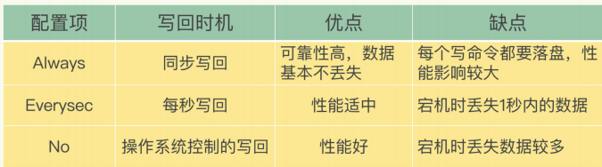

**AOF重写**

和 AOF 日志由主线程写回不同，重写过程是由后台子进程 bgrewriteaof 来完成的。在进行AOF重写时，新的操作也会被写到重写日志的缓冲区。这样，重写日志也不会丢失最新的操作。等到拷贝数据的所有操作记录重写完成后，重写日志记录的这些最新操作也会写入新的 AOF 文件，以保证数据库最新状态的记录。此时，就可以用新的 AOF 文件替代旧文件了。

## 05. 内存快照：宕机后，Redis如何实现快速恢复？

另一种持久化方法：内存快照。

**给哪些内存数据做快照？**

Redis执行的是**全量快照**，Redis 提供了两个命令来生成 RDB 文件，分别是 save 和 bgsave。save：在主线程中执行，会导致阻塞；bgsave：创建一个子进程，专门用于写入 RDB 文件，避免了主线程的阻塞，这也是Redis RDB 文件生成的默认配置。

**快照时数据能修改吗？**

为了快照而暂停写操作，肯定是不能接受的。所以这个时候，Redis 就会借助操作系统提供的写时复制技术，在执行快照的同时，正常处理写操作。bgsave 子进程是由主线程 fork 生成的，可以共享主线程的所有内存数据。bgsave 子进程运行后，开始读取主线程的内存数据，并把它们写入 RDB 文件。，如果主线程要修改一块数据这块数据就会被复制一份，生成该数据的副本。

**可以每秒做一次快照吗？**

虽然 bgsave 执行时不阻塞主线程，但是，**如果频繁地执行全量快照，也会带来两方面的开销**。，bgsave 子进程需要通过 fork 操作从主线程创建出来。虽然，子进程在创建后不会再阻塞主线程，但是，fork 这个创建过程本身会阻塞主线程，而且主线程的内存越大，阻塞时间越长。如果频繁 fork 出 bgsave 子进程，这就会频繁阻塞主线程了。

**混合使用 AOF 日志和内存快照**

Redis 4.0 中提出了一个**混合使用 AOF 日志和内存快照**的方法。内存快照以一定的频率执行，在两次快照之间，使用 AOF 日志记录这期间的所有命令操作。

## 06. 数据同步：主从库如何实现数据一致？

**服务尽量少中断**

Redis 的做法就是**增加副本冗余量**，将一份数据同时保存在多个实例上。即使有一个实例出现了故障，需要过一段时间才能恢复，其他实例也可以对外提供服务，不会影响业务使用。Redis提供了主从模式，以保证数据副本的一致，主从库之间采用的是读写分离的方式。**读操作**：主库、从库都可以接收；**写操作**：首先到主库执行，然后，主库将写操作同步给从库。可以**通过“主 - 从 - 从”模式将主库生成 RDB 和传输 RDB 的压力，以级联的方式分散到从库上**。


**主从库间如何进行第一次同步？**

启动多个 Redis 实例的时候，它们相互之间就可以通过 replicaof（Redis 5.0 之前使用 slaveof）命令形成主库和从库的关系，之后会按照三个阶段完成数据的第一次同步。

1. 在这一步，从库和主库建立起连接，并告诉主库即将进行同步，主库确认回复后，主从库间就可以开始同步了。**第一次复制采用的全量复制**。
2. **主库将所有数据同步给从库。从库收到数据后，在本地完成数据加载**。依赖于内存快照生成的 RDB 文件。
3. 当主库完成 RDB 文件发送后，就会把此时 `replication buffer` 中的修改操作发给从库，从库再重新执行这些操作。

**主从库间网络断了怎么办？**

主从库之间通过`repl_backlog_buffer`同步，是个环形缓冲区，**主库会记录自己写到的位置，从库则会记录自己已经读到的位置**。主库偏移量 `master_repl_offset`，`slave_repl_offset`从库偏移量当主从库断连后，主库会把断连期间收到的写操作命令，写入 `replication buffer`，同时也会把这些操作命令也写入 `repl_backlog_buffer` 这个缓冲区。因为 repl_backlog_buffer 是一个环形缓冲区，所以在缓冲区写满后，主库会继续写入，此时，就会覆盖掉之前写入的操作。如果从库的读取速度比较慢，就有可能导致从库还未读取的操作被主库新写的操作覆盖了，这会导致主从库间的数据不一致。

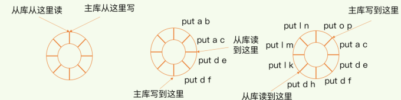

## 07. 哨兵机制：主库挂了，如何不间断服务？

主库挂了，需要运行一个新主库，涉及到三个问题：

1. 主库真的挂了吗？
2. 该选择哪个从库作为主库？
3. 怎么把新主库的相关信息通知给从库和客户端？

**哨兵机制**

哨兵其实就是一个运行在特殊模式下的 `Redis` 进程，主从库实例运行的同时，它也在运行。哨兵主要负责的就是三个任务：监控、选主（选择主库）和通知。

- **监控：**监控是指哨兵进程在运行时，周期性地给所有的主从库发送 `PING` 命令，检测它们是否仍然在线运行。如果从库没有在规定时间内响应哨兵的 `PING` 命令，哨兵就会把它标记为“下线状态”；同样，如果主库也没有在规定时间内响应哨兵的 `PING` 命令，哨兵就会判定主库下线，然后开始**自动切换主库**的流程。
- **选主：**主库挂了以后，哨兵从多个从库里，按照一定的规则选择一个从库实例，把它作为新的主库。
- **通知：**哨兵会把新主库的连接信息发给其他从库，让它们执行 `replicaof` 命令，和新主库建立连接，并进行数据复制。同时，哨兵会把新主库的连接信息通知给客户端，让它们把请求操作发到新主库上。

**判断主库下线**

分为主观下线和客观下线。

- **主观下线：**如果哨兵发现主库或从库的PING命令超时了，那么哨兵会将它标记为”主观下线“。
- **客观下线：**和哨兵集群中的其他节点商量过后，大多数的哨兵实例判断主库主观下线了，主库才真的下线了。这样能避免误判带来的主从库切换开销。

哨兵机制，**通常会采用多实例组成的集群模式进行部署，这也被称为哨兵集群**。

**如何选定新主库？**

把哨兵选择新主库的过程称为“筛选 + 打分”。在多个从库中，先按照**一定的筛选条件**，把不符合条件的从库去掉。然后，我们再按照**一定的规则**，给剩下的从库逐个打分，将得分最高的从库选为新主库。筛选：从库在线，并且网络连接状体好。打分：从库优先级、从库复制进度以及从库ID号。根据这三个规则进行打分，只要在某一轮中，有从库得分最高，就选它，如果没有就进行下一轮。

## 08. 哨兵集群：哨兵挂了，主从库还能切换吗？

部署哨兵集群时，配置哨兵信息时，设置主库的IP和端口，不用配置其他哨兵的连接信息。哨兵实例不知道彼此的地址。

**基于pub/sub(发布/订阅)机制的哨兵集群组成**

​	实例之间的相互发现，就是通过发布/订阅机制。哨兵只要和主库建立起了连接，就可以在主库上发布消息了，比如说发布它自己的连接信息（IP 和端口）。同时，它也可以从主库上订阅消息，获得其他哨兵发布的连接信息。当多个哨兵实例都在主库上做了发布和订阅操作后，它们之间就能知道彼此的 IP 地址和端口。

​	不只是从库的连接信息，也可以有其他类型的消息，Redis以频道的方式区分不同应用的消息。**只有订阅了同一个频道的应用，才能通过发布的消息进行消息交换。**主库上有一个`__sentinel__:hello`的频道，实现不同哨兵实例之间的发现和消息通信。

**哨兵如何知道从库的IP得知和端口？**
	哨兵除了和其他哨兵实例连接形成集群外，还要和从库建立连接。原因：1.需要对主从库进行心跳判断 2. 主从切换完成后，需要通知从库，让它们和新主库同步。

​	哨兵想主库发送`INFO`命令，然后主库会把从库列表返回给哨兵。哨兵可以根据从库列表中的连接信息和每个从库建立连接。

**基于pub/sub机制的客户端事件通知**

​	哨兵不只和其他哨兵和主从库连接，在完成主从切换后，哨兵还要将新主库的信息通知客户端。仍然可以依赖 `pub/su`b 机制，来帮助我们完成哨兵和客户端间的信息同步。

​	每个哨兵实例提供`pub/sub`机制，客户端可以从哨兵订阅消息。客户端读取哨兵的配置文件获取哨兵的地址和端口，然后和哨兵建立网络廉价而。然后可以在客户端执行订阅命令，获取不同的事件消息。

**由哪个哨兵执行主从切换？**

​	任何一个实例只要自身判断主库“主观下线”后，给其他实例发送命令。其他实例会根据自己和主库的连接情况投票主库是否下线。当票数超过多数时，这个哨兵就可以再给其他哨兵发送命令，表明希望由自己来执行主从切换，并让所有其他哨兵进行投票。这个投票过程称为“Leader 选举”。因为最终执行主从切换的哨兵称为 Leader，投票过程就是确定 Leader。

## 09. 切片集群：数据增多了，是该加内存还是加实例？

​	在使用 RDB 进行持久化时，Redis 会 fork 子进程来完成，fork 操作的用时和 Redis 的数据量是正相关的，而 fork 在执行时会阻塞主线程。数据量越大，fork 操作造成的主线程阻塞的时间越长。所以，在使用 RDB 对 25GB 的数据进行持久化时，数据量较大，后台运行的子进程在 fork 创建时阻塞了主线程，于是就导致Redis 响应变慢了。解决方案使用切片集群。

**切片集群**

切片集群，也叫分片集群，指启动多个 Redis 实例组成一个集群，然后按照一定的规则，把收到的数据划分成多份，每一份用一个实例来保存。数据量小了很多，fork子进程不会给主线程带来较长事件的阻塞。如下图所示：

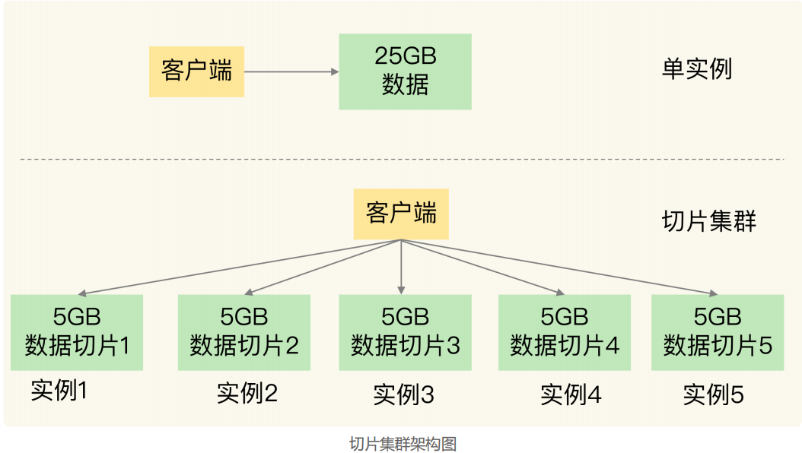

**数据切片和实例的对应分布关系**
Redis3.0之后，官方提供了一个名为`Redis Cluster`的方案，用于实现切片集群方案。`Redis Cluster`方案采用哈希槽来处理数据和实例之间的映射关系，一个切片集群共有16384个哈希槽，每个键值对都会根据它的key，被映射到一个哈希槽中。首先根据键值对的 key，按照CRC16 算法计算一个 16 bit的值；然后，再用这个 16bit 值对 16384 取模，得到 0~16383 范围内的模数，每个模数代表一个相应编号的哈希槽。在部署`Redis Cluster`方案时，可以使用 `cluster create` 命令创建集群，此时，Redis会自动把这些槽平均分布在集群实例上。例如，如果集群中有 N 个实例，那么，每个实例上的槽个数为 16384/N 个。每个实例的硬件条件不同，可以自己手动分配哈希槽，但是需要把16384个槽都分配完，否则Redis集群无法正常工作。下图举例：

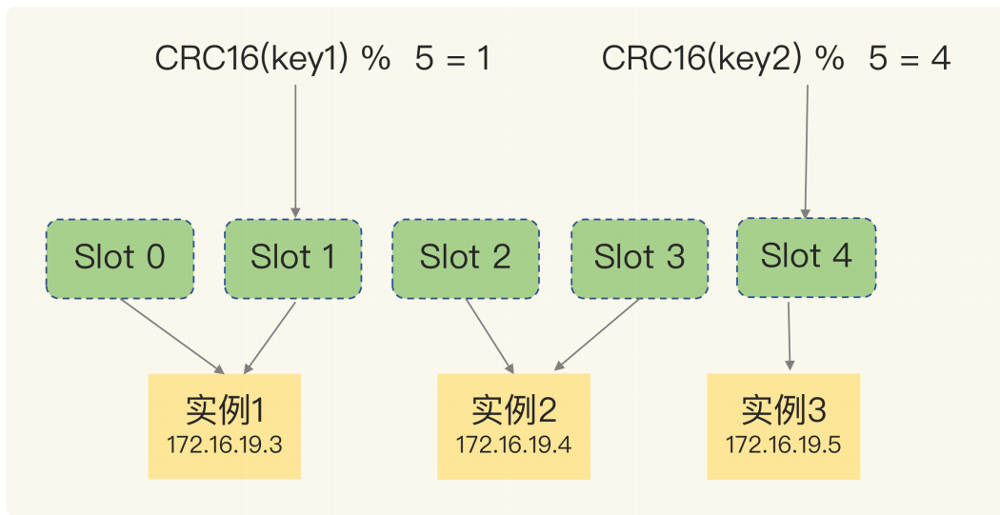

**客户端如何定位数据？**

​	哈希槽可以通过计算得到，想要定位实例，需要知道哈希槽分布在哪个实例上。客户端和集群实例建立连接后，实例就会把哈希槽的分配信息发给客户端。但是，在集群刚刚创建的时候，每个实例只知道自己被分配了哪些哈希槽，是不知道其他实例拥有的哈希槽信息的。Redis 实例会把自己的哈希槽信息发给和它相连接的其它实例，来完成哈希槽分配信息的扩散。当实例之间相互连接后，每个实例就有所有哈希槽的映射关系了。客户端收到哈希槽信息后，会把哈希槽信息缓存在本地。当客户端请求键值对时，会先计算键所对应的哈希槽，然后就可以给相应的实例发送请求了。

​	实例和哈希槽的对应关系并不是一成不变的，最常见的变化有两个：

- 在集群中，实例有新增或删除，Redis 需要重新分配哈希槽；
- 为了负载均衡，Redis 需要把哈希槽在所有实例上重新分布一遍。

​	从新分配后，实例之间相互传递消息获得最新的哈希槽分配信息，但客户端无法感知，所以有**重定向机制**，客户端给实例发送读写操作时，实例没有数据，给客户端返回MOVED命令响应结果，它包含了新示例的访问地址。MOVED会更改本地缓存，让后续所有命令都发往新实例。

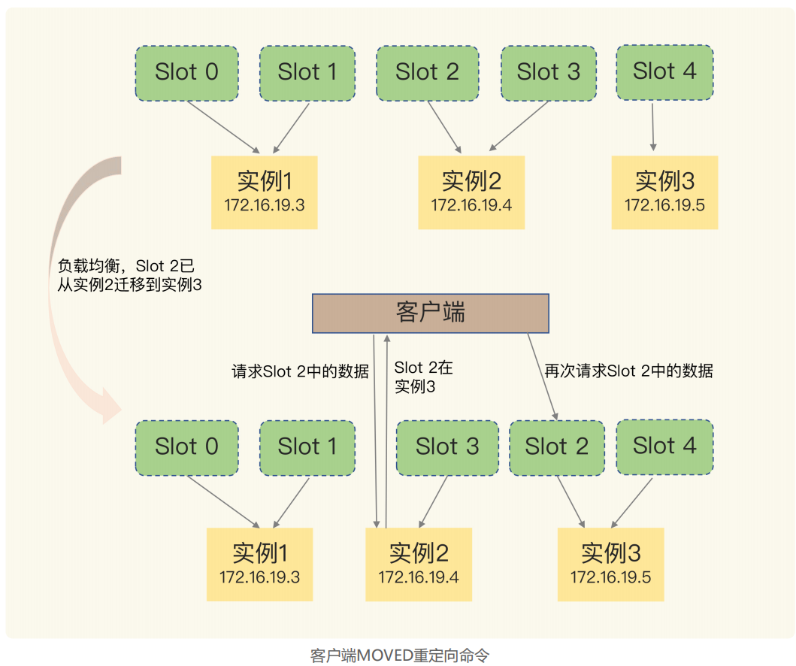

## 10. 第1~9讲课后思考题答案以及常见问题答疑

## 11. ”万金油“的String，为什么不好用了？

**为什么String类型内存开销大？**

​	场景：需要保存1亿张图片，用String类型的key和value分别保存图片id和图片存储id。图片 ID 和图片存储对象 ID 都是 10 位数，可以用两个 8 字节的Long 类型表示这两个 ID。而String类型除了记录实际数据，还需要额外的内存空间记录数据长度、空间使用等信息，这些信息叫做元数据，当实际保存的数据较小时，元数据的开销占比会大。

​	**String保存数据的方式。**当保存64位有符号整数时，String 类型会把它保存为一个 8 字节的 Long 类型整数，这种保存方式通常也叫作 int 编码方式。当保存的数据中包含字符时，String 类型就会用简单动态字符串（SimpleDynamic String，SDS）结构体来保存，如下图所示：

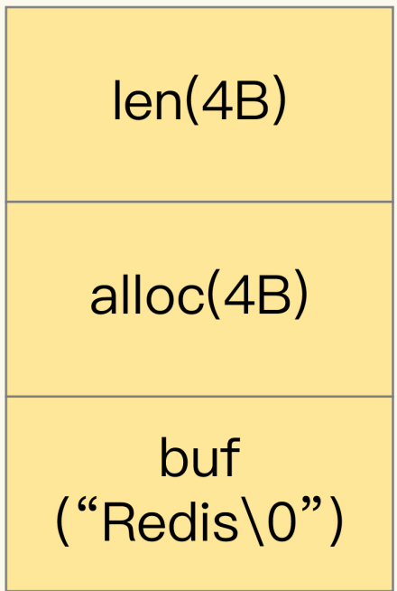

buf保存实际数据，最后会有一个字节"\0"。len占4字节，表示buf已用长度。alloc占4字节，表示buf的是分配长度。

​	除了SDS的额外开销，还有RedisObject结构体的开销，会记录一些元数据（8字节）和实际数据的指针（8字节），如下所示。

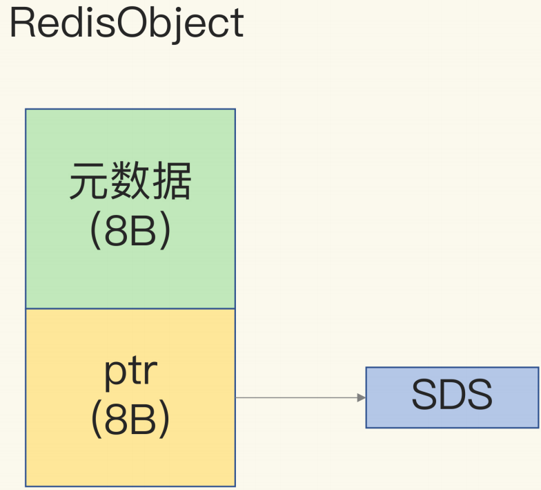

​	当保存 Long 类型整数时，RedisObject 中的指针就直接赋值为整数数据，节省开销。当保存字符串数据并且小于等于 44 字节时，RedisObject 中的元数据、指针和 SDS 是一块连续的内存区域，避免内存碎片，这种被称为 embstr 编码方式。当字符串大于 44 字节时，会给 SDS 分配独立的空间，并用指针指向 SDS 结构，这种被称为 raw 编码模式。如下图所示。

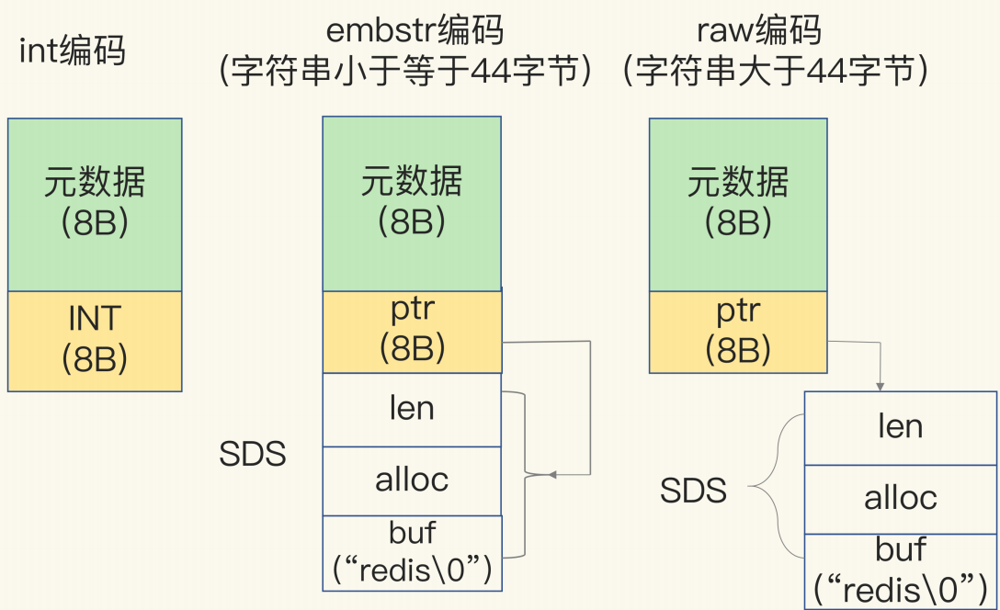

**用什么数据结构可以节省内存？**

回顾压缩列表，一种节省内存的结构。表头有三个字段 zlbytes、zltail 和 zllen，分别表示列表长

度、列表尾的偏移量，以及列表中的 entry 个数。压缩列表尾还有一个 zlend，表示列表结束。每个entry的元数据包括四部分：prev_len表示前一个entry的长度（前一个entry的长度小于254字节时为1字节，否则5字节），len表示自身长度4字节，encoding表示编码方式1字节，content保存实际数据。一个图片的存储对象ID(8字节)所占用的内存大小是14字节，实际分配16字节，很节省空间。

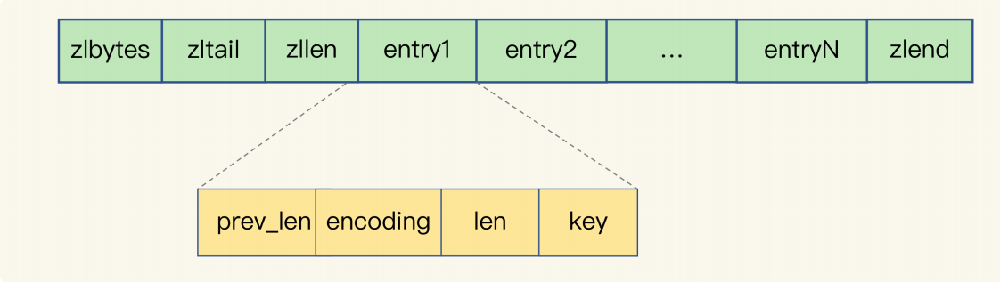

**如何用集合类型保存单值的键值对？**

​	可以采用基于 Hash 类型的二级编码方法。这里说的二级编码，就是把一个单值的数据拆分成两部分，前一部分作为 Hash 集合的 key，后一部分作为Hash 集合的 value，这样一来，我们就可以把单值数据保存到 Hash 集合中了。

​	以图片 ID 1101000060 和图片存储对象 ID 3302000080 为例，我们可以把图片 ID 的前7 位（1101000）作为 Hash 类型的键，把图片 ID 的最后 3 位（060）和图片存储对象ID 分别作为 Hash 类型值中的 key 和 value。因为Hash集合的元素个数超过了hash-max-ziplist-entries，就从压缩列表转换成哈希表了，所以**为了能充分使用压缩列表的精简内存布局，我们一般要控制保存在 Hash 集合中的元素个数**。所以，在刚才的二级编码中，12. 我们只用图片 ID 最后 3 位作为 Hash 集合的 key，也就保证了 Hash 集合的元素个数不超过 1000。

## 12.  有一亿个keys要统计，应该用那种集合？

有场景：一个key对应了一个数据集合，比如手机App中的每天的用户登录信息：一天对应一系列用户ID或移动设备ID，集合类型的特点就是一个键对应一系列的数据，所以非常适合用来存取这些数据。但是，除了记录信息，还需要对集合中的数据进行统计，比如统计一个月内连续打卡的用户数。通常信息量会很大，所以要选择能够非常高效统计大量数据的集合类型。集合类型的四种统计方式，聚合统计、排序统计、二值状态统计和基数统计。

**聚合统计**

所谓的聚合统计，就是指统计多个集合元素的聚合结果，包括：统计多个集合的共有元素（交集统计）；把两个集合相比，统计其中一个集合独有的元素（差集统计）；统计多个集合的所有元（并集统计）。比如统计手机 App 每天的新增用户数和第二天的留存用户数，可以用一个集合记录所有登录过 App 的用户 ID，同时，用另一个集合记录每一天登录过 App 的用户 ID。然后，再对这两个集合做聚合统计。使用Set类型记录所有登录过App的用户ID，把key设置为user:id。累计用户的Set中没有日期信息，不能直接统计每天新增用户。需要把每一天登录的用户ID记录到一个新的集合中，叫做每日用户Set，有两个特点：1.key是user:id以及当前日期，例如uesr:id20200803 2. value是Set集合，记录当天登录的用户ID。在统计每天新增用户时，计算差集就行。统计留存用户时，计算交集即可。

Set的缺点：Set 的差集、并集和交集的计算复杂度较高，在数据量较大的情况下，如果直接执行这些计算，会导致 Redis 实例阻塞。所以**可以从主从集群中选择一个从库，让它专门负责聚合计算，或者是把数据读取到客户端，在客户端来完成聚合统计**，这样就可以规避阻塞主库实例和其他从库实例的风险了。

**排序统计**

场景：电商网站上提供最新评论列表的场景。需要集合中的元素有序。在Redis中，List和Sorted List属于有序集合，List是按照元素进入List的顺序进行排序的，而Sorted Set可以根据元素的权重来排序。实际中，设计分页操作时，List会出现问题：显示完第一页时，准备显示第二页时，来了一条新评论，第一个中的一条会被挤到第二页重新显示。Sorted List就不会出现这个问题。

**二值状态统计**
指集合中元素的状态只有0和1，例如签到打卡场景，每个用户一天的签到用1个bit位就能表示，选择Bitmap。Bitmap本身是用String类型作为底层数据结构实现的一种统计二值状态的数据类型。String 类型是会保存为二进制的字节数组，所以，Redis 就把字节数组的每个 bit 位利用起来，用来表示一个元素的二值状态。可以把 Bitmap 看作是一个 bit 数组。

问题：如果记录了1亿个用户10天签到情况，统计出这10天连续签到的用户总数？

把每天的日期作为key，每个key对应一个1亿位的Bitmap，每个bit位对应一个用户当前的签到情况。对10个Bitmap做“与”操作，得到一个Bitmap，在这个Bitmap中，只有10天都签到的用户对应的bit位才是1，再用BITCOUNT统计Bitmap中1的个数就是连续签到10天的用户的总数了。**在记录海量数据时，Bitmap能够有效地节省内存空间。** 

**基数统计**

基数统计就是指统计一个集合中不重复元素个数，例如统计网页的UV。网页 UV 的统计有个独特的地方，就是需要去重，一个用户一天内的多次访问只能算作一次。在 Redis 的集合类型中，Set 类型默认支持去重，所以看到有去重需求时，我们可能第一时间就会想到用 Set 类型。但是每个页面都用要给Set，会消耗很大的内存空间。HyperLogLog是一种用于统计基数的数据集合类型，它的最大优势就在于，当集合元素数量非常多时，它计算基数所需的空间总是固定的，而且还很小。HyperLogLog 的统计规则是基于概率完成的，所以它给出的统计结果是有一定误差的，标准误算率是 0.81%。这也就意味着，使用HyperLogLog 统计的 UV 是 100 万，但实际的 UV 可能是 101万。虽然误差率不算大，但是，如果你需要精确统计结果的话，最好还是继续用 Set 或 Hash 类型。

**总结：**

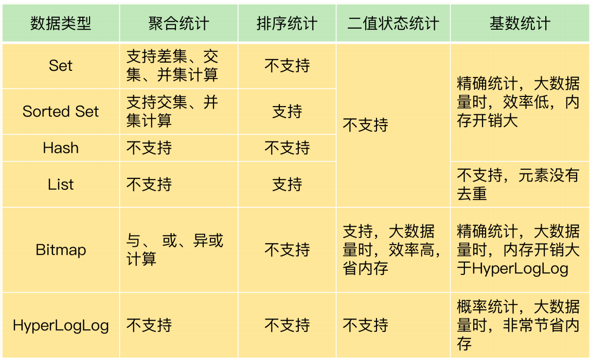

## 13. GEO是什么？还可以定义新的数据类型吗？

​	Redis除了五大基本数据类型，还有三种扩展数据类型，Bitmap、HyperLogLog和GEO。

**面向** **LBS** **应用的** **GEO** **数据类型**

​	位置信息服务（Location-Based Service，LBS）。LBS 应用访问的数据是和人或物关联的一组经纬度信息，而且要能查询相邻的经纬度范围，GEO 就非常适合应用在LBS 服务的场景中。

**GEO** **的底层结构**

​	网约车场景：一个key（车ID）对应一个value（一组经纬度）。可以用Hash集合保存，但是需要根据用户的经纬度新消息在车辆的Hash集合中进行范围查询，需要集合中元素有序，Hash集合是无需的，故不满足要求。

​	Sorted Set 类型也支持key ， value ，其中key 就是 SortedSet 中的元素，而 value 则是元素的权重分数。而且，Sorted Set 可以根据元素的权重分数排序，支持范围查询。这就能满足 LBS 服务中查找相邻位置的需求了。实际上，GEO类型的底层数据结构就是Sorted Set。

​	用 Sorted Set 来保存车辆的经纬度信息时，Sorted Set 的元素是车辆 ID，元素的权重分

数是经纬度信息，如下图所示：

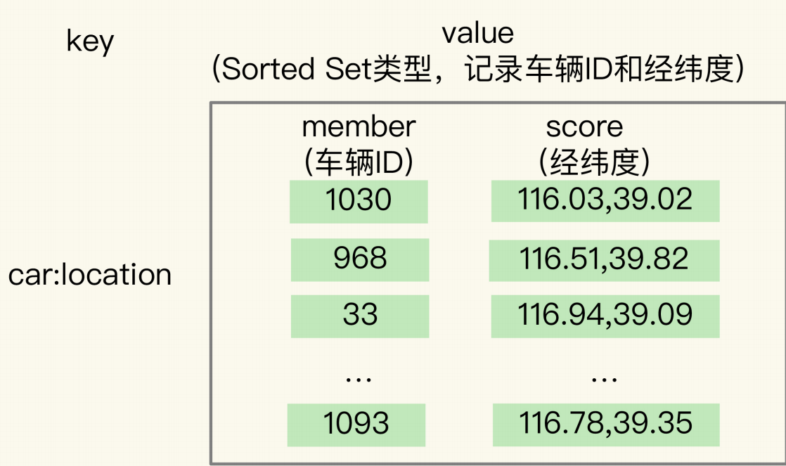

​	Sorted Set 元素的权重分数是一个浮点数（float 类型），而一组经纬度包含的是经度和纬度两个值，所以需要 GEO 类型中的 GeoHash 编码。

**GeoHash** **的编码方法**

​	基本原理：二分区间，区间编码。先对经度和纬度分别编码，然后再把经纬度编码组合成员给最终编码。经度的范围为[-180,180]，把经度值编码成一个N位的二进制，对经度的范围[-180,180]做N次的而分区操作，N可自定义。进行一次二分区时，经度范围会被分成两个子区间:[-180,0)和[0,180]，如果要编码的经度值落在左分区，就用0表示，如果落在右分区，就用1表示。一次二分区就可以得到1位编码值。对于纬度的编码方式和经度一样，只是范围为[-90,90]。最后的组合规则是，偶数位上依次是经度的编码值，奇数位上依次是维度的编码值。使用GeoHash编码相当于把整个地理空间划分成了一个个方格，每个放个对应了GeoHash中的一个分区。

​	举个例子。我们把经度区间[-180,180]做一次二分区，把纬度区间[-90,90]做一次二分区，就会得到 4 个分区。我们来看下它们的经度和纬度范围以及对应的 GeoHash 组合编码。

- 分区一：[-180,0) 和[-90,0)，编码 00；
- 分区二：[-180,0) 和[0,90]，编码 01；
- 分区三：[0,180]和[-90,0)，编码 10；
- 分区四：[0,180]和[0,90]，编码 11；

这 4 个分区对应了 4 个方格，每个方格覆盖了一定范围内的经纬度值，分区越多，每个方格能覆盖到的地理空间就越小，也就越精准。把所有方格的编码值映射到一维空间时，相邻方格的GeoHash 编码值基本也是接近的，如下图所示：

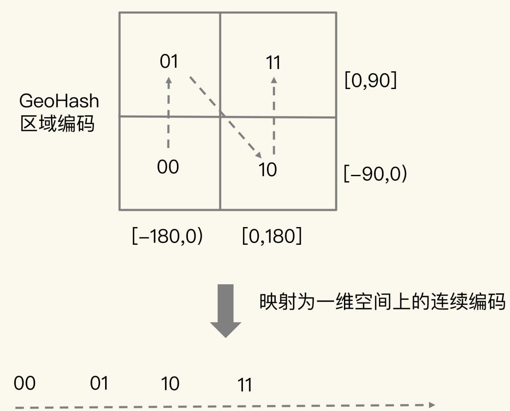

使用 Sorted Set 范围查询得到的相近编码值，在实际的地理空间上，也是相邻的方格，这就可以实现 LBS 应用“搜索附近的人或物”的功能了。

**如何操作** **GEO** **类型？**

GEOADD 命令：用于把一组经纬度信息和相对应的一个 ID 记录到 GEO 类型集合中；

GEORADIUS 命令：会根据输入的经纬度位置，查找以这个经纬度为中心的一定范围内

的其他元素。当然，我们可以自己定义这个范围。

```shell
//假设车辆id为33，经纬度(116.034579,39.030452) 集合key是cars:loactions
GEOADD cars:locations 116.034579 39.030452 33
//查询5公里内车辆信息
GEORADIUS cars:locations 116.034579 39.030452 5 km ASC COUNT 10
```

## 14. 如何在Redis中保存事件序列数据？

​	时间序列数据是与发生时间相关的一组数据。**这些数据的特点是没有严格的关系模型，记录的信息可以表示成键和值的关系**（例如，一个设备 ID 对应一条记录），所以，并不需要专门用关系型数据库（例如 MySQL）来保存。而 Redis 的键值数据模型，正好可以满足这里的数据存取需求。Redis 基于自身数据结构以及扩展模块，提供了两种解决方案。

**时间序列数据的读写特点**

​	在实际应用中，时间序列数据通常是持续高并发写入的，例如，需要连续记录数万个设备的实时状态值。同时，时间序列数据的写入主要就是插入新数据，而不是更新一个已存在的数据,，例如一个设备在某个时刻的温度测量值。**要求在进行数据插入时，复杂度要低，尽量不阻塞。Redis的String、Hash类型复杂度都是O(1)，但是在String在记录小数据时，元数据的内存开销较大，不适合保存大量数据。**

​	时间序列数据的读特点：有对单条记录的查询（某个设备在某个时刻的运行状态信息），也有对某个时间范围内的数据的查询（每天早上8点到10点的所有设备的状态信息），还有更复杂的查询聚合计算（计算某个时间段内的设备压力的最大值）。

**基于Hash和Sorted Set保存时间序列数据**

​	Hash类型，可以实现对单键的快速查询，把时间戳作为Hash的key，把记录的设备状态值作为Hash的value。**但是Hash类型有个短板：不支持对数据行进行范围查询。**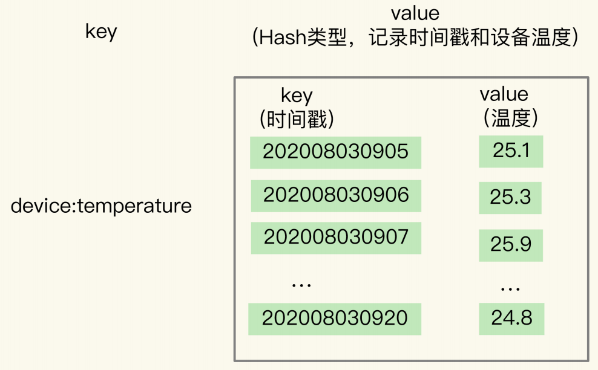

为了能同时支持按时间戳范围查询，可以用Sorted Set保存时间序列数据，把时间戳作为Sorted Set结合的元素分数，把时间点上记录的数据作为元素本身。

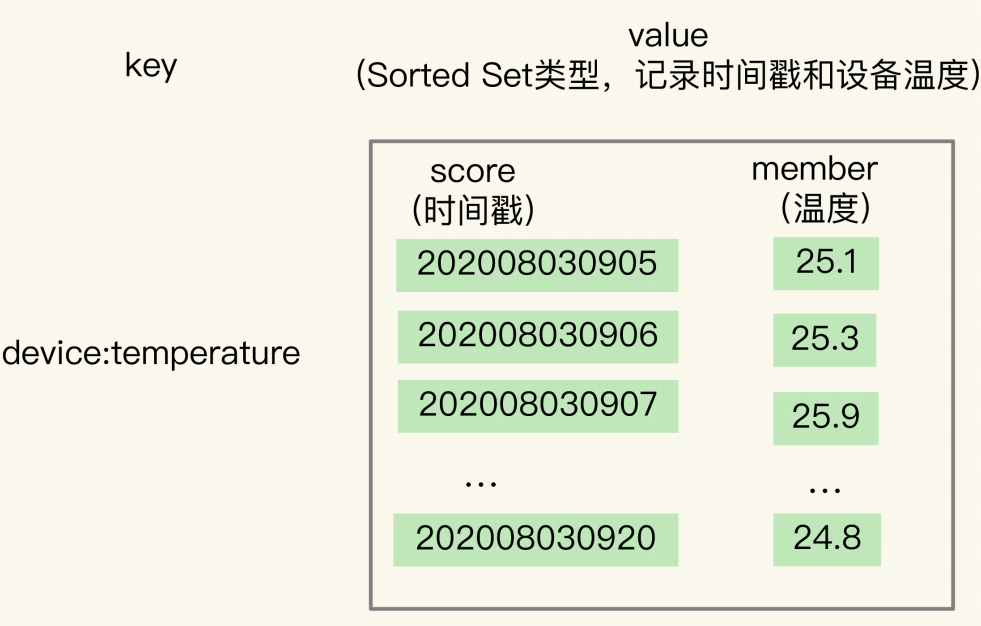

**如何保证写入Hash和Sorted Set是一个原子性的操作呢？**

​	原子性的操作是指我们执行多个写命令操作时（例如用 HSET 命令和 ZADD命令分别把数据写入 Hash 和 Sorted Set），这些命令操作要么全部完成，要么都不完成。 Redis 用来实现简单的事务的MULTI 和 EXEC 命令。MULTI 和 EXEC 命令可以保证执行这些命令时的原子性。

- MULTI 命令：表示一系列原子性操作的开始。收到这个命令后，Redis 就知道，接下来再收到的命令需要放到一个内部队列中，后续一起执行，保证原子性。
- EXEC 命令：表示一系列原子性操作的结束。一旦 Redis 收到了这个命令，就表示所有要保证原子性的命令操作都已经发送完成了。此时，Redis 开始执行刚才放到内部队列中的所有命令操作。

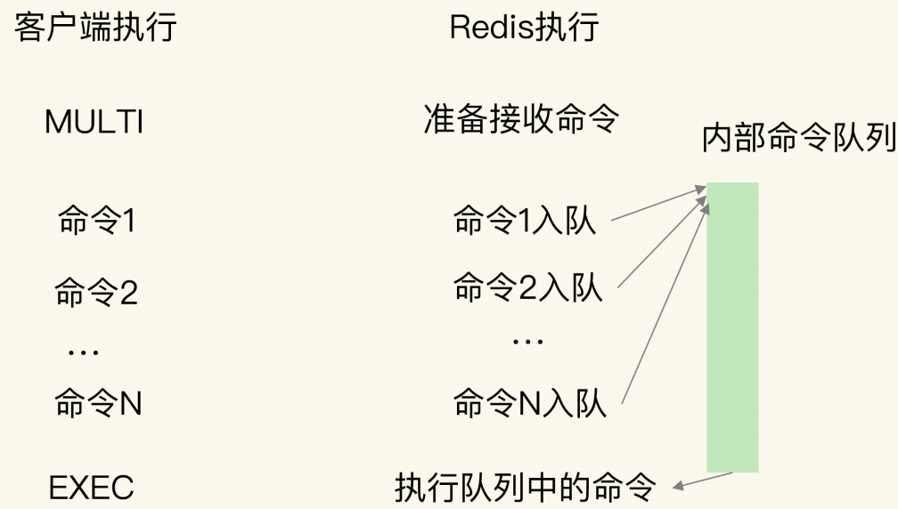

​	首先，Redis 收到了客户端执行的 MULTI 命令。然后，客户端再执行 HSET 和ZADD 命令后，Redis 返回的结果为“QUEUED”，表示这两个命令暂时入队，先不执行；执行了 EXEC 命令后，HSET 命令和 ZADD 命令才真正执行，并返回成功结果。

**如何对时间序列数据进行聚合计算？**

​	Sorted Set只支持范围查询，不支持聚合计算，只能先把时间范围内的数据取回客户端，再完成计算。**但是会有大量数据在Redis实例和客户端间传输。**

**基于** **RedisTimeSeries** **模块保存时间序列数据**

​	RedisTimeSeries 是 Redis 的一个扩展模块。它专门面向时间序列数据提供了数据类型和访问接口，并且支持在 Redis 实例上直接对数据进行按时间范围的聚合计算。当用于时间序列数据存取时，RedisTimeSeries 的操作主要有 5 个：

- 用 TS.CREATE 命令创建时间序列数据集合；
- 用 TS.ADD 命令插入数据；
- 用 TS.GET 命令读取最新数据；
- 用 TS.MGET 命令按标签过滤查询数据集合；
- 用 TS.RANGE 支持聚合计算的范围查询。

**1. 用TS.CREATE命令创建一个时间序列数据集合**

​	需要设置时间序列数据集合的 key 和数据的过期时间（以毫秒为单位）。此外，还可以为数据集合设置标签，来表示数据集合的属性。例如，我们执行下面的命令，创建一个 key 为device:temperature、数据有效期为 600s的时间序列数据集合。也就是说，这个集合中的数据创建了 600s 后，就会被自动删除。最后，给这个集合设置了一个标签属性{device_id:1}，表明这个数据集合中记录的是属于设备 ID 号为 1 的数据。

```c++
TS.CREATE device:temperature RETENION 600000 LABELS device_id 1
```

**2. 用TS.ADD命令插入数据，用TS.GET命令读取最新数据**

​	可以用 TS.ADD 命令往时间序列集合中插入数据，包括时间戳和具体的数值，并使用TS.GET 命令读取数据集合中的最新一条数据。例如，往 device:temperature 集合中插入了一条数据，记录的是设备在 2020 年 8 月 3 日 9 时 5 分的设备温度；再执行 TS.GET 命令时，就会把刚刚插入的最新数据读取出来。

```c++
TS.ADD device:temperature 1596416700 25.1
1596416700
    
TS.GET device:temperature
25.1
```

**3.用TS.MEGET命令按标签过滤查询数据结合**

​	在使用TS.CREATE 创建数据集合时，我们可以给集合设置标签属性。当我们进行查询时，就可以在查询条件中对集合标签属性进行匹配，最后的查询结果里只返回匹配上的集合中的最新数据。

​	假设我们一共用 4 个集合为 4 个设备保存时间序列数据，设备的 ID 号是 1、2、3、4，我们在创建数据集合时，把 device_id 设置为每个集合的标签。此时，我们就可以使用下列 TS.MGET 命令，以及 FILTER 设置（这个配置项用来设置集合标签的过滤条件），查询 device_id 不等于 2 的所有其他设备的数据集合，并返回各自集合中的最新的一条数据。

```c++
TS.MGET FILTER device_id != 2
1) 1) "device:temperature:1"
   2) (empty list or set)
   3) 1) (integer) 1596417000
      2) "25.3
2) 1) "device:temperature:3"
   2) (empty list or set)
   3) 1) (integer) 1596417000
      2) "29.5"
3) 1) "device:temperature:4"
   2) (empty list or set)
   3) 1) (integer) 1596417000
      2) "30.1"
```

**4. 用TS.RANGE支持需要聚合计算的范围查询**

​	在对时间序列数据进行聚合计算时，我们可以使用 TS.RANGE 命令指定要查询的数据的时间范围，同时用 AGGREGATION 参数指定要执行的聚合计算类型。RedisTimeSeries 支持的聚合计算类型很丰富，包括求均值（avg）、求最大 / 最小值（max/min），求和（sum）等。

​	例如，按照每180s的时间窗口，对2020年8月3日9时5分和2020年8月3日9时12分的数据进行均值计算。

```c++
TS.RANGE device:temperature 1596416700 1596417120 AGGREGATION avg 180000
1) 1) (integer) 1596416700
   2) "25.6"
2) 1) (integer) 1596416880
   2) "25.8"
3) 1) (integer) 1596417060
   2) "26.1"
```

## 15. 消息队列的考验：Redis有哪些解决方案？

​	消息队列要能支持组件通信消息的快速读写，`Redis`本身支持数据的告诉访问，可以满足消息队列的读写性能需求。

**消息队列的消息存取需求**

​	在分布式系统中，当两个组件要基于消息队列进行通信时，一个组件会把要处理的数据以消息的形式传递给消息队列，然后，这个组件就可以继续执行其他操作了；远端的另一个组件从消息队列中把消息读取出来，再在本地进行处理。

​	假设组件 1 需要对采集到的数据进行求和计算，并写入数据库，但是，消息到达的速度很快组件 1 没有办法及时地既做采集，又做计算，并且写入数据库。所以，我们可以使用基于消息队列的通信，让组件 1 把数据 x 和 y 保存为 JSON 格式的消息，再发到消息队列，这样它就可以继续接收新的数据了。组件 2 则异步地从消息队列中把数据读取出来，在服务器 2 上进行求和计算后，再写入数据库。这个过程如下图所示：

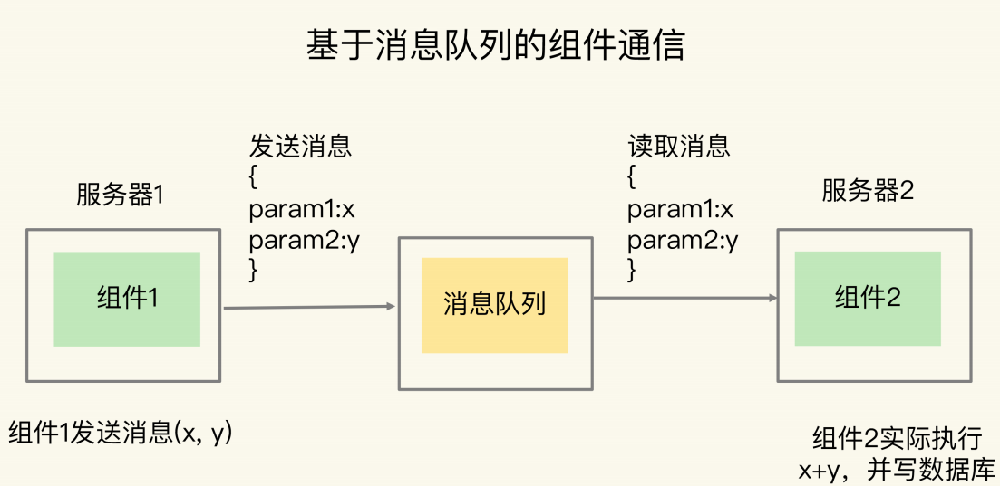

**消息队列在存取消息时，必须要满足三个需求，分别是消息保序、处理重复的消息和保证消息可靠性。**

**需求一：消息保序**

​	虽然消费者是异步处理消息，但是，消费者仍然需要按照生产者发送消息的顺序来处理消息，避免后发送的消息被先处理了。

**需求二：重复消息处理**

​	消费者从消息队列读取消息时，有时会因为网络堵塞而出现消息重传的情况。此时，消费者可能会收到多条重复的消息。对于重复的消息，消费者如果多次处理的话，就可能造成一个业务逻辑被多次执行，如果业务逻辑正好是要修改数据，那就会出现数据被多次修改的问题了。

**需求三：消息可靠性保证**

​	消费者在处理消息的时候，还可能出现因为故障或宕机导致消息没有处理完成的情况。此时，消息队列需要能提供消息可靠性的保证，也就是说，当消费者重启后，可以重新读取消息再次进行处理，否则，就会出现消息漏处理的问题了。

**Redis 的 List 和 Streams 两种数据类型，就可以满足消息队列的这三个需求。**

**基于List的消息队列解决方案**

​	List 本身就是按先进先出的顺序对数据进行存取的，所以，如果使用 List 作为消息队列保存消息的话，就已经能满足消息保序的需求了。生产者可以使用 LPUSH 命令把要发送的消息依次写入 List，而消费者则可以使用 RPOP 命令，从 List 的另一端按照消息的写入顺序，依次读取消息并进行处理。

​	但是在消费者读取数据时，有潜在的性能风险点。在生产者往 List 中写入数据时，List 并不会主动地通知消费者有新消息写入，如果消费者想要及时处理消息，就需要在程序中不停地调用 RPOP 命令。如果有新消息写入，RPOP 命令就会返回结果，否则，RPOP 命令返回空值，再继续循环。这会导致消费者的CPU一直在执行RPOP命令上，带来不必要的性能损失。

​	重复消息处理方法，需要消息队列能给每个消息提供全局唯一的ID号，消费者程序就可以对比收到的消息 ID 和记录的已处理过的消息 ID，来判断当前收到的消息有没有经过处理。如果已经处理过，那么，消费者程序就不再进行处理了。这种处理特性也称为幂等性，幂等性就是指，对于同一条消息，消费者收到一次的处理结果和收到多次的处理结果是一致的。List 本身是不会为每个消息生成 ID 号的，所以，消息的全局唯一 ID 号就需要生产者程序在发送消息前自行生成。生成之后，我们在用 LPUSH 命令把消息插入 List 时，需要在消息中包含这个全局唯一 ID。

​	对于List，当消费者读取一条消息后，List就不会再留存这条消息了。为了留存消息，List 类型提供了 BRPOPLPUSH 命令，这个命令的作用是让消费者程序从一个 List 中读取消息，同时，Redis 会把这个消息再插入到另一个 List（可以叫作备份List）留存。这样一来，如果消费者程序读了消息但没能正常处理，等它重启后，就可以从备份 List 中重新读取消息并进行处理了。List还有问题：**生产者消息发送很快，而消费者处理消息的速度比较慢，这就导致 List 中的消息越积越多，给 Redis 的内存带来很大压力。**这时需要多个消费者程序组成一个消费组，一起分担List中的消息，List类型不支持消费组，Redis从5.0版本开始提供了Streams类型。

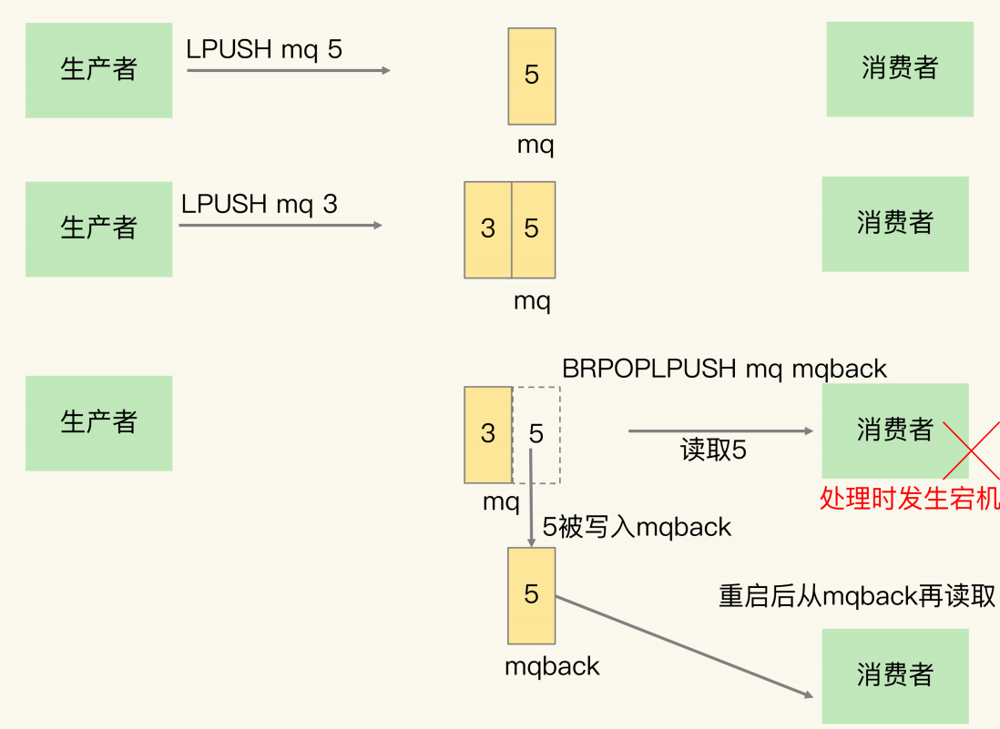

**基于Streams的消息队列解决方案**

Streams 是 Redis 专门为消息队列设计的数据类型，它提供了丰富的消息队列操作命令。

- XADD：插入消息，保证有序，可以自动生成全局唯一 ID；
- XREAD：用于读取消息，可以按 ID 读取数据；
- XREADGROUP：按消费组形式读取消息；
- XPENDING 和 XACK：XPENDING 命令可以用来查询每个消费组内所有消费者已读取但尚未确认的消息，而 XACK 命令用于向消息队列确认消息处理已完成。

消费者可以在第哦啊用XREAD时设定block配置项，实现类似BRPOP的阻塞读操作，时长可在block配置项进行设置。$表示读取最新消息。

```c++
XREAD block 10000 streams mqstream $
```

Streams本身可以使用XGROUP创建消费组，然后使用XREADGROUP让消费组内的消费者读取消息。消息队列中的消息一旦被消费组里的一个消费者读取了，就不能再被该消费组内的其他消费者读取了。使用消费组的目的是让组内的多个消费者共同分担读取消息，所以，我们通常会让每个消费者读取部分消息，从而实现消息读取负载在多个消费者间是均衡分布的。

```shell
//创建一个名字为group1的消费组，消息队列为mqstream
XGROUP create mqstream group1 0
//让group1消费组里的消费者consumer1从mqstream中读取所有消息，>表示从第一条尚未被消费的消息开始读取
XREADGROUP group group1 consumer1 streams mqstream >
//读一条消息
XREADGROUP group group1 consumer1 count 1 streams mqstream >
```

​	为了保证消费者在发生故障或宕机再次重启后，仍然可以读取未处理完的消息，Streams 会自动使用内部队列（也称为 PENDING List）留存消费组里每个消费者读取的消息，直到消费者使用 XACK 命令通知 Streams“消息已经处理完成”。如果消费者没有成功处理消息，它就不会给 Streams 发送 XACK 命令，消息仍然会留存。此时，消费者可以在重启后，用 XPENDING 命令查看已读取、但尚未确认处理完成的消息。

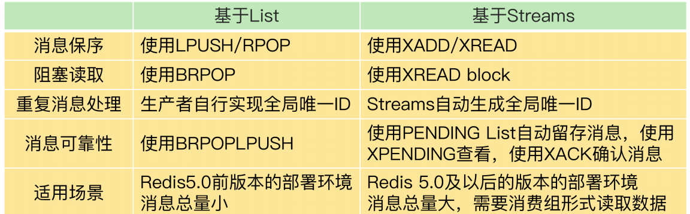

**Redis是否适合做消息队列？**

​	其实，关于 Redis 是否适合做消息队列，业界一直是有争论的。很多人认为，要使用消息队列，就应该采用 Kafka、RabbitMQ 这些专门面向消息队列场景的软件，而 Redis 更加适合做缓存。

​	根据这些年做 Redis 研发工作的经验，我的看法是：Redis 是一个非常轻量级的键值数据库，部署一个 Redis 实例就是启动一个进程，部署 Redis 集群，也就是部署多个 Redis 实例。而Kafka、RabbitMQ 部署时，涉及额外的组件，例如 Kafka 的运行就需要再部署ZooKeeper。相比 Redis 来说，Kafka 和 RabbitMQ 一般被认为是重量级的消息队列。

​	所以，关于是否用 Redis 做消息队列的问题，不能一概而论，我们需要考虑业务层面的数据体量，以及对性能、可靠性、可扩展性的需求。如果分布式系统中的组件消息通信量不大，那么，Redis 只需要使用有限的内存空间就能满足消息存储的需求，而且，Redis 的高性能特性能支持快速的消息读写，不失为消息队列的一个好的解决方案。

## 16. 异步机制：如何避免单线程模型的阻塞？

**影响Redis性能的5方面潜在因素：**

- Redis 内部的阻塞式操作；
- CPU 核和 NUMA 架构的影响；
- Redis 关键系统配置；
- Redis 内存碎片；
- Redis 缓冲区。

**Redis实例有哪些阻塞点？**

- **客户端：**网络IO、键值对增删改查操作、数据库操作；
- **磁盘：**生成RDB快照、记录AOF日志、AOF日志重写；
- **主从节点**：主库生成、传输 RDB 文件，从库接收 RDB 文件、清空数据库、加载 RDB文件；
- **切片集群实例**：向其他实例传输哈希槽信息，数据迁移。

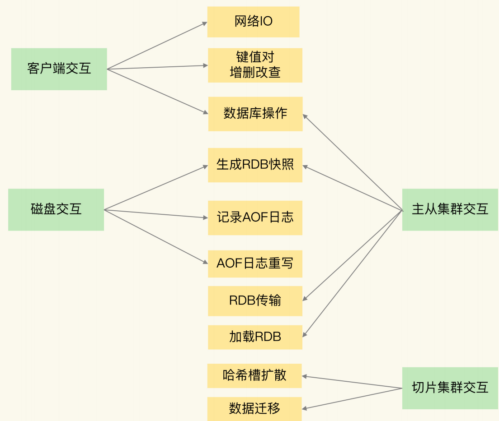

**1. 和客户端交互时的阻塞点**

​	Redis 使用了 IO 多路复用机制，避免了主线程一直处在等待网络连接或请求到来的状态，所以，网络 IO 不是导致 Redis 阻塞的因素。键值对的增删改查操作是 Redis 和客户端交互的主要部分,所以，复杂度高的增删改查操作肯定会阻塞 Redis。Redis 中涉及集合的操作复杂度通常为 O(N)，例如集合元素全量查询操作 HGETALL、SMEMBERS，以及集合的聚合统计操作，例如求交、并和差集。这些操作可以作为 Redis 的**第一个阻塞点：集合全量查询和聚合操作**。

​	删除操作也有阻塞风险，删除操作的本质是要释放键值对占用的内存空间。在应用程序释放内存时，操作系统需要把释放掉的内存块插入一个空闲内存块的链表，以便后续进行管理和再分配。这个过程本身需要一定时间，而且会阻塞当前释放内存的应用程序，所以，如果一下子释放了大量内存，空闲内存块链表操作时间就会增加，相应地就会造成 Redis 主线程的阻塞。**最典型的就是删除包含了大量元素的集合，也称为 bigkey 删除**。

​	清空数据库与bigkey删除类似，也是阻塞点。

**2. 和磁盘交互时的阻塞点**

​	Redis 开发者早已认识到磁盘 IO 会带来阻塞，所以就把 Redis 进一步设计为采用子进程的方式**生成 RDB 快照文件，以及执行 AOF 日志重写操作**。

​	但是，Redis 直接记录 AOF 日志时，会根据不同的写回策略对数据做落盘保存。一个同步写磁盘的操作的耗时大约是 1～2ms，如果有大量的写操作需要记录在 AOF 日志中，并同步写回的话，就会阻塞主线程了。这就得到了 Redis 的**第四个阻塞点了：AOF 日志同步写**。

**3. 主从节点交互时的阻塞点**

​	在主从集群中，对于从库来说，它在接收了RDB 文件后，需要使用 FLUSHDB 命令清空当前数据库，这就正好撞上了刚才我们分析的**第三个阻塞点。**

​	此外，从库在清空当前数据库后，还需要把 RDB 文件加载到内存，这个过程的快慢和RDB 文件的大小密切相关，RDB 文件越大，加载过程越慢，所以，**加载 RDB 文件就成为了 Redis 的第五个阻塞点**。

**4. 切片集群实例交互时的阻塞点**

​	当我们部署 Redis 切片集群时，每个 Redis 实例上分配的哈希槽信息需要在不同实例间进行传递，同时，当需要进行负载均衡或者有实例增删时，数据会在不同的实例间进行迁移。不过，哈希槽的信息量不大，而数据迁移是渐进式执行的，所以，一般来说，这两类操作对 Redis 主线程的阻塞风险不大。

​	如果你使用了 Redis Cluster 方案，而且同时正好迁移的是 bigkey 的话，就会造成主线程的阻塞，因为 Redis Cluster 使用了同步迁移。

**哪些阻塞点可以异步执行？**

​	Redis 提供了异步线程机制。所谓的异步线程机制，就是指，Redis 会启动一些子线程，然后把一些任务交给这些子线程，让它们在后台完成，而不再由主线程来执行这些任务。使用异步线程机制执行操作，可以避免阻塞主线程。

​	bigkey删除、清空数据库、AOF日志同步写都可以用后台子线程来异步执行删除操作。

**异步的子线程机制**

​	Redis 主线程启动后，会使用操作系统提供的 pthread_create 函数创建 3 个子线程，分别由它们负责 AOF 日志写操作、键值对删除以及文件关闭的异步执行。

​	主线程通过一个链表形式的任务队列和子线程进行交互。当收到键值对删除和清空数据库的操作时，主线程会把这个操作封装成一个任务，放入到任务队列中，然后给客户端返回一个完成信息，表明删除已经完成。

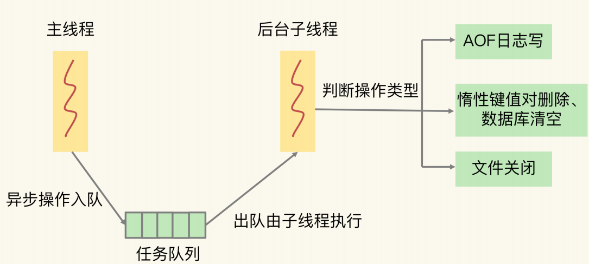


## 36. Redis支撑秒杀场景的关键技术和实践都有哪些？

秒杀场景的负载特征对支撑系统的要求：

- **瞬时并发访问量非常高**
- **读多写少，而且读操作是简单的查询操作：**用户需要先查验商品是否还有库存，只有库存有余量时，秒杀系统才能进行库存扣减和下单操作。只有少部分用户能成功下单，所以，商品库存查询操作（读操作）要远多于库存扣减和下单操作（写操作）。

**秒杀分为三个阶段：**

- **秒杀前：**用户会刷新页面，请求剧增。解决方案把商品页面元素静态化，然后使用CDN或者浏览器进行缓存。
- **秒杀开始：**这个阶段有三个操作：库存查验、库存扣减和订单处理。前两个操作用redis，订单处理用数据库。订单处理时只有少数人，请求压力不大而S且设计多张表需要事务，所以在数据库完成。如果把库存扣减放到数据库执行有两个问题：1. **额外的开销**，数据库和redis需要对库存量进行同步。2. **下单量超过实际库存量，出现超售**，数据库处理慢，redis更新不及时。
- **秒杀后：**请求已经下降，不讨论。

**秒杀场景对 Redis 操作的根本要求有两个：**

- **支持高并发：**`redis`天然支持，可以用切片集群，将不同商品的库存保存到不同的实例。注意一致性`hash`。
- **保证库存查验和库存扣减原子执行：**使用`redis`原子操作或者分布式锁实现。

**保证库存查验和库存扣减原子执行：**

因为库存查验和库存扣减这两个操作要保证一起执行，**一个直接的方法就是使用 Redis 的原子操作**。

- **基于原子操作支撑秒杀场景：**原子操作可以是自身提供的原子命令，或者是`Lua`脚本。
- **基于分布式锁来支撑秒杀场景：**使用分布式锁来支撑秒杀场景的具体做法是，先让客户端向 `Redis` 申请分布式锁，只有拿到锁的客户端才能执行库存查验和库存扣减。可以使用切片集群中的不同实例来分别保存分布式锁和商品库存信息，可以减轻库存实例的压力。

## 37. 数据分布优化，如果应对数据倾斜？

**在切片集群中，数据会按照一定的分布规则分散到不同的实例上保存。会导致数据倾斜问题，有两种情况：**

- **数据量倾斜**：在某些情况下，实例上的数据分布不均衡，某个实例上的数据特别多。
- **数据访问倾斜**：虽然每个集群实例上的数据量相差不大，但是某个实例上的数据是热点数据，被访问得非常频繁。

**数据量倾斜：**

- **bigkey导致倾斜：**bigkey的value值会很大或保存大量的集合元素，会导致该实例数据量增加，内存消耗增加。而且bigkey的操作会造成实例阻塞。**要尽量避免把过多的数据保存在同一个键值对中，例如是集合类型，拆分成多个小集合保存在不同实例。**

- **Slot分配不均衡导致倾斜：**如果有大量的数据被分配到同一个 Slot 中，一个 Slot 只会在一个实例上分布，会大量数据被集中到一个实例上。

- **Hash Tag导致倾斜：**Hash Tag 是指加在键值对 key 中的一对花括号{}。这对括号会把 key 的一部分括起来，客户端在计算 key 的 CRC16 值时，只对 Hash Tag 花括号中的 key 内容进行计算。如果没用 Hash Tag 的话，客户端计算整个 key 的 CRC16 的值。Hash Tag 的好处是，如果不同 key 的 Hash Tag是一样的，那么，这些 key对应的数据会被映射到同一个 Slot 中，同时会被分配到同一个实例上。Hash Tag应用的场景是 把要执行事务操作或是范围查询

  的数据映射到同一个实例上，这样就能很轻松地实现事务或范围查询了。**使用 Hash Tag 的潜在问题，就是大量的数据可能被集中到一个实例上，导致数据倾斜，集群中的负载不均衡。**解决方法是进行取舍，如果出现数据倾斜造成较大的访问压力，优先考虑避免数据倾斜，最好不要使用 Hash Tag 进行数据切片。因为事务和范围查询都还可以放在客户端来执行。

**数据访问倾斜：**

发生数据访问倾斜的根本原因，就是实例上存在热点数据。**对于只读的热点数据**，采用**热点数据多副本**的方法来应对。把热点数据复制多份，在每一个数据副本的 key 中增加一个随机前缀，让它和其它副本数据不会被映射到同一个 Slot 中。这样，热点数据既有多个副本可以同时服务请求，同时，这些副本数据的 key 又不一样，会被映射到不同的 Slot中。在给这Slot 分配实例时，我们也要注意把它们分配到不同的实例上，那么，热点数据的访问压力就被分散到不同的实例上了。对于有读有写的热点数据不适合多副本方法，需要保证多副本数据的一致性，有开销，直接升级硬件。

总结：

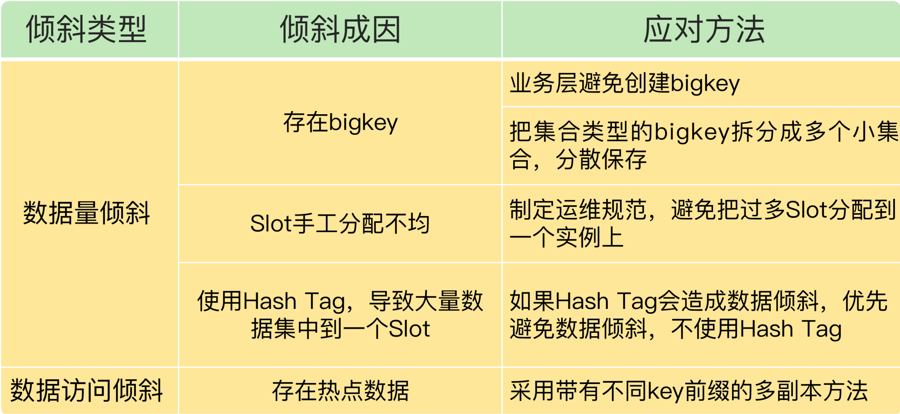

## 38. 通信开销：限制Redis Cluster规模的关键因素

​	Redis 官方给出了 Redis Cluster 的规模上限，就是一个集群运行 1000 个实例。关键因素：**实例间的通信开销会随着实例规模增加而增大**，规模过大，集群吞吐量会下降。

**实例通信方法和对集群规模的影响：**

​	Redis Cluster的每个实例上都会保存 Slot 和实例的对应关系。实例之间的通信协议为Gossip协议。Gossip 协议可以保证在一段时间后，集群中的每一个实例都能获得其它所有实例的状态信息。有新节点加入、节点故障、Slot 变更等事件发生，实例间也可以通过PING、PONG 消息的传递，完成集群状态在每个实例上的同步。

**Gossip协议工作原理：**

1. **PING消息：** 每个实例之间会按照一定的频率，从集群中随机挑选一些实例，发送PING 消息，检测这些实例是否在线，并交换彼此的状态信息。PING 消息中封装了发送消息的实例自身的状态信息、部分其它实例(集群中1/10的实例)的状态信息，以及 Slot 映射表，如果是1000个实例，PING消息大概12KB。
2. **PONG消息：** 实例在接收到 PING 消息后，会返回一个 PONG 消息。PONG 内容和 PING 消息一样。

**Gossip通信开销受到通信消息大小和通信频率影响。**

​	Redis Cluster 的实例启动后，默认会每1秒从本地的实例列表中随机选出 5 个实例，再从这5个实例中找出一个最久没有通信的实例，发送PING。防止有实例一直不被选中，每100ms扫描所有实例，发现最近一次接收PONG消息的时间，超过配置项 cluster-node-timeout(定义了集群实例被判断为故障的心跳超时时间,默认15s)的一半，立刻发送PING。

**如果降低实例间的通信开销：**

每 1 秒发送一条 PING 消息，频率不高，不能改。100ms也不用改。就增大配置项 cluster-node-timeou就可以了，增加到25s或者20s。

## 17. 为什么CPU结构也会影响Redis的性能？

**主流的cpu架构**

​	一个 CPU 处理器中一般有多个运行核心，我们把一个运行核心称为一个物理核，每个物理核都可以运行应用程序。每个物理核都拥有私有的一级缓存（Level 1 cache，简称 L1cache），包括一级指令缓存和一级数据缓存，以及私有的二级缓存（Level 2 cache，简称 L2 cache）。

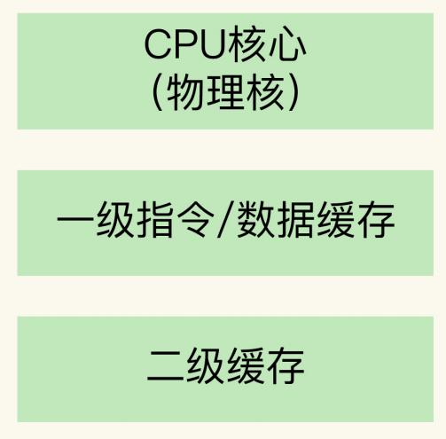

​	因为 L1 和 L2 缓存是每个物理核私有的，所以，当数据或指令保存在 L1、L2 缓存时，物理核访问它们的延迟不超过 10 纳秒，速度非常快。那么，如果 Redis 把要运行的指令或存取的数据保存在 L1 和 L2 缓存的话，就能高速地访问这些指令和数据。不同的物理核还会共享一个共同的三级缓存（Level 3 cache，简称为 L3 cache）。L3 缓存能够使用的存储资源比较多，所以一般比较大，能达到几 MB 到几十 MB，这就能让应用程序缓存更多的数据。当 L1、L2 缓存中没有数据缓存时，可以访问 L3，尽可能避免访问内存。

​	现在主流的 CPU 处理器中，每个物理核通常都会运行两个超线程，也叫作逻辑核。同一个物理核的逻辑核会共享使用 L1、L2 缓存。

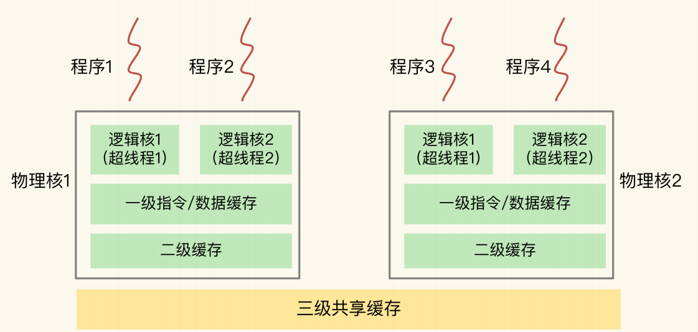

​	在主流的服务器上，一个 CPU 处理器会有 10 到 20 多个物理核。同时，为了提升服务器的处理能力，服务器上通常还会有多个 CPU 处理器（也称为多 CPU Socket），每个处理器有自己的物理核（包括 L1、L2 缓存），L3 缓存，以及连接的内存，同时，不同处理器间通过总线连接。

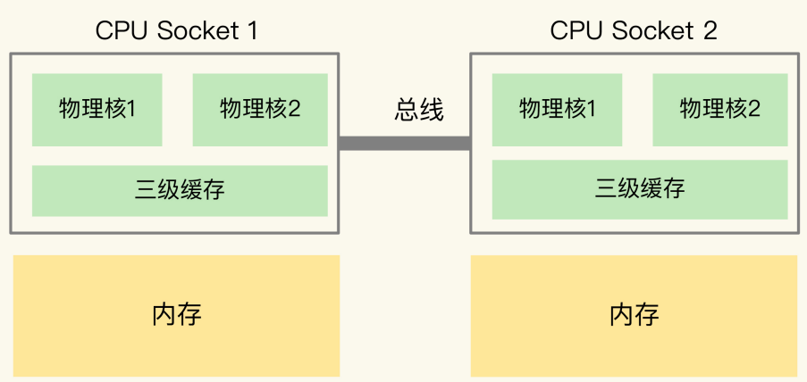

​	**在多 CPU 架构上，应用程序可以在不同的处理器上运行**。在刚才的图中，Redis 可以先在Socket 1 上运行一段时间，然后再被调度到 Socket 2 上运行。如果应用程序先在一个 Socket 上运行，并且把数据保存到了内存，然后被调度到另一个 Socket 上运行，此时，应用程序再进行内存访问时，就需要访问之前 Socket 上连接的内存，这种访问属于**远端内存访问**。**和访问 Socket 直接连接的内存相比，远端内存访问会增加应用程序的延迟。**在多 CPU 架构下，一个应用程序访问所在 Socket 的本地内存和访问远端内存的延迟并不一致，所以，我们也把这个架构称为非统一内存访问架构（Non-Uniform MemoryAccess，NUMA 架构）。

**CPU多核对Redis性能的影响**


## 39. Redis6.0新特性：多线程、客户端缓存与安全

**从单线程处理网络请求到多线程处理**

原来redis是单线程架构，但是数据删除、快照生成、AOF重写是子进程或子线程。网络IO村里到实际的读写命令处理是单线程。但是**单个主线程处理网络请求的速度跟不上底层网络硬件的速度**。有两种解决方法，1.用用户态网络协议栈（例如 DPDK）取代内核网络协议栈，让网络请求的处理不用在内核里执行，直接在用户态完成处理就行。2. 采用多个IO线程来处理网络请求(让多个io线程负责socket的读写，而接收新连接和命令的执行还是在主线程)，提高网络请求处理的并行度。

**Redis6.0主线程和IO线程具体协作流程：**

- **阶段一：服务端和客户端建立Socket连接，并分配处理线程**

首先，主线程负责接收建立连接请求。当有客户端请求和实例建立 Socket 连接时，主线程会创建和客户端的连接，并把 Socket 放入全局等待队列中。紧接着，主线程通过轮询方法把 Socket 连接分配给 IO 线程。

- **阶段二：IO 线程读取并解析请求**

主线程一旦把 Socket 分配给 IO 线程，就会进入阻塞状态，等待 IO 线程完成客户端请求读取和解析。因为有多个 IO 线程在并行处理，所以，这个过程很快就可以完成。

- **阶段三：主线程执行请求操作**

等到 IO 线程解析完请求，主线程还是会以单线程的方式执行这些命令操作。下面这张图显示了刚才介绍的这三个阶段，你可以看下，加深理解。

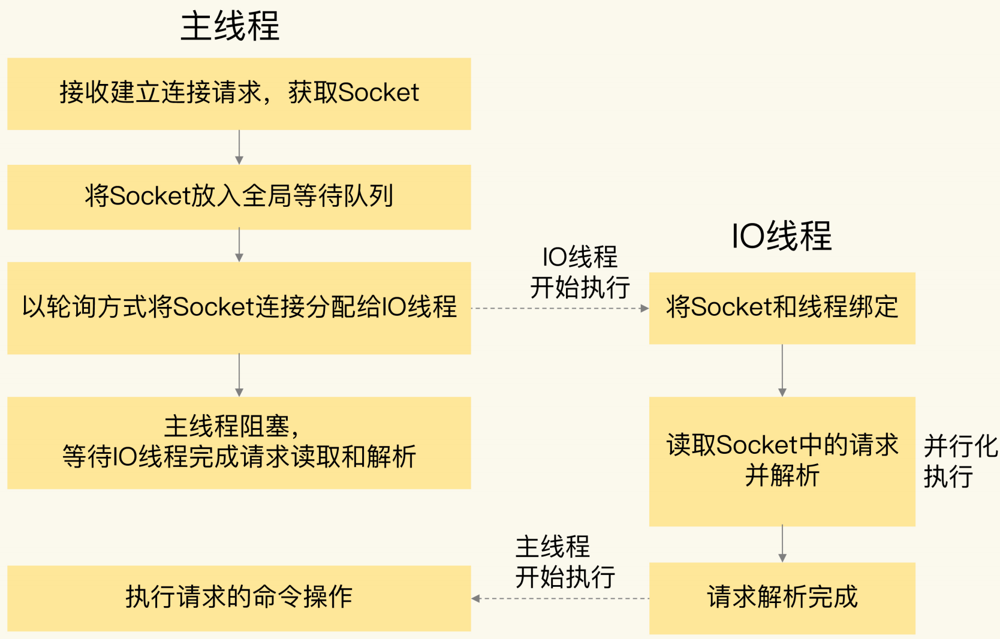

- **阶段四：IO 线程回写 Socket 和主线程清空全局队列**

当主线程执行完请求操作后，会把需要返回的结果写入缓冲区，然后，主线程会阻塞等待IO 线程把这些结果回写到 Socket 中，并返回给客户端。和 IO 线程读取和解析请求一样，IO 线程回写 Socket 时，也是有多个线程在并发执行，所以回写 Socket 的速度也很快。等到 IO 线程回写 Socket 完毕，主线程会清空全局队列，等待客户端的后续请求。如下图所示。

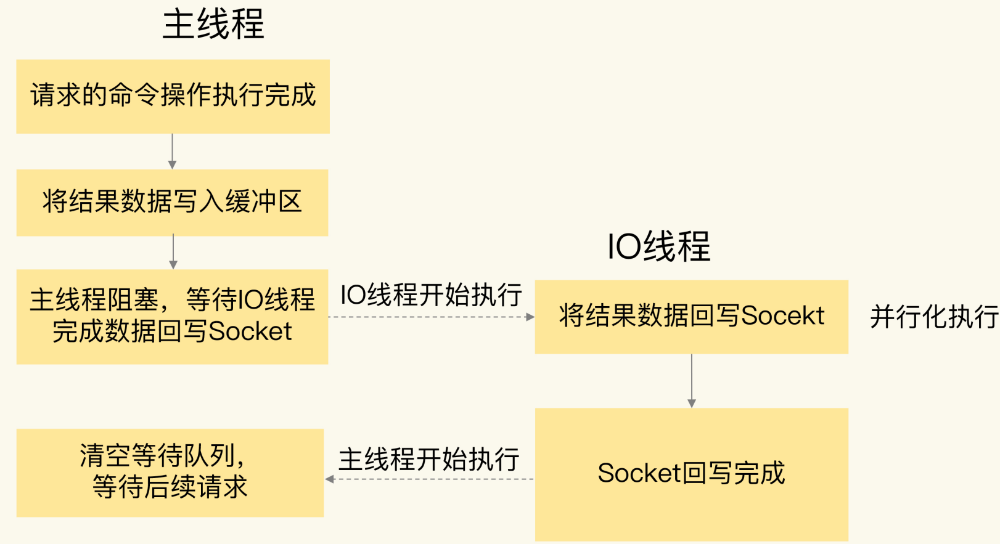

**在Redis6.0中默认是关闭多线程的：** 设置`io-thread-do-reads`配置项为yes，表示启用多线程。线程个数要小于cpu核个数。

**实现服务端协助的客户端缓存**

此为Redis6.0新功能，也称为跟踪(Tracking)功能。此功能，Redis客户端可以把读取的数据缓存在业务应用本地。发呢为两种模式。

**第一种模式是普通模式**

​	此模式，实例会在服务端记录客户端读取过的 key，并监测 key 是否有修改。一旦 key 的值发生变化，服务端会给客户端发送 invalidate 消息，通知客户端缓存失效。只能报告一个invalidate消息，客户端再次读才能再次检测。

**第二种模式是广播模式**

​	服务端会给客户端广播所有 key 的失效情况，但是 key 被频繁修改，服务端会发送大量的失效广播消息，消耗网络带宽。所以，在实际应用时，让客户端注册希望跟踪的 key 的前缀，当带有注册前缀的key 被修改时，服务端会把失效消息广播给所有注册的客户端。和普通模式不同，在广播模式下，即使客户端还没有读取过 key，但只要它注册了要跟踪的 key，服务端都会把key 失效消息通知给这个客户端。

**从简单的基于密码访问到细粒度的权限控制**

6.0 版本支持创建不同用户来使用 Redis。6.0 版本还支持以用户为粒度设置命令操作的访问权限。也支持key的粒度。

**启用 RESP 3 协议**

在 RESP 2 中，客户端和服务器端的通信内容都是以字节数组形式进行编码的，客户端需要根据操作的命令或是数据类型自行对传输的数据进行解码，增加了客户端开发复杂度。RESP 3 直接支持多种数据类型的区分编码，包括空值、浮点数、布尔值、有序的字典集合、无序的集合等。RESP 3 协议还可以支持客户端以普通模式和广播模式实现客户端缓存。

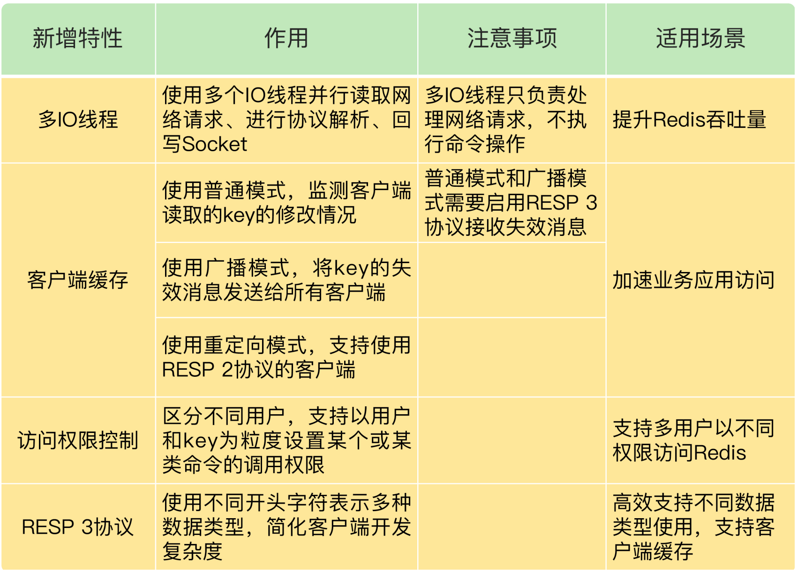

## 40. Redis的下一步：基于NVM内存的实践   (不用看)
