# Redis核心技术与实战

## 01. 基本架构：一个键值数据库包含什么？

**可以存哪些数据？**

对于键值数据库而言，基本的数据模型是 key-value 模型。 Redis 支持的 value 类型包括了 String、哈希表、列表、集合等。

**可以对数据做什么操作？**

PUT/GET/DELETE/SCAN是一个键值数据库的基本操作集合。scan操作，根据一段key的范围返回响应的value值。

**采用什么访问模式？**

一种是通过函数库调用的方式供外部应用使用，另一种是通过网络框架以 Socket 通信的形式对外提供键值对操作。例如，RocksDB 以动态链接库的形式使用，而 Memcached 和 Redis 则是通过网络框架访问。

**如何确定键值对的位置？**

索引的作用是让键值数据库根据 key 找到相应 value 的存储位置，进而执行操作。例如，Memcached 和 Redis 采用哈希表作为 key-value 索引，而 RocksDB 则采用跳表作为内存中 key-value 的索引。内存键值数据库（例如 Redis）采用哈希表作为索引，很大一部分原因在于，其键值数据基本都是保存在内存中的，而内存的高性能随机访问特性可以很好地与哈希表O(1) 的操作复杂度相匹配。


## 02. 数据结构：快速的Redis有哪些慢操作？ Redis数据结构

为什么 Redis速度快？一方面，这是因为它是内存数据库，所有操作都在内存上完成，内存的访问速度本身就很快。另一方面，这要归功于它的数据结构。


**键和值用什么结构组织？**

Redis使用了一个哈希表来保存所有键值对。哈希桶中的entry元素中保存了*key和*value指针，分别指向了时机的键和值。


​	Redis 解决哈希冲突的方式，就是链式哈希。Redis会对哈希表做rehash操作。增加现有哈希桶数量，让增多的entry元素能在更多的桶之间分散保存。Redis 默认使用了两个全局哈希表：哈希表 1 和哈希表 2。一开始，当你刚插入数据时，默认使用哈希表 1，此时的哈希表 2 并没有被分配空间。随着数据逐步增多，Redis 开始执行 rehash，这个过程分为三步：

1. 给哈希表 2 分配更大的空间，例如是当前哈希表 1 大小的两倍；
2. 把哈希表 1 中的数据重新映射并拷贝到哈希表 2 中；
3. 释放哈希表 1 的空间。

​	如果一次性把哈希表 1 中的数据都迁移完，会造成 Redis 线程阻塞，无法服务其他请求。Redis 采用了**渐进式 rehash**。每处理一个请求时，从哈希表 1 中的第一个索引位置开始，顺带着将这个索引位置上的所有 entries 拷贝到哈希表 2 中；等处理下一个请求时，再顺带拷贝哈希表 1 中的下一个索引位置的entries。

​	对于范围操作，是指集合中的遍历操作，可以返回集合中的所有数据。复杂度一般是O(N)，比较耗时，尽量避免。Redis从2.8版本开始提供了SCAN系列操作，(HSCAN,SSCAN,ZSCAN)，这类操作实现了渐进式遍历，每次只返回有限数量的数据。相比于HGETALL、SMEMBERS 这类操作来说，就避免了一次性返回所有元素而导致的 Redis 阻塞。

## 03. 高性能IO模型：为什么单线程Redis能这么快？

**Redis的持久化、异步删除和集群数据同步**，是由额外的线程执行的。Redis的单线程是指它对网络IO和数据读写的操作采用了一个线程。采用单线程的一个核心原因是避免多线程开发的并发控制问题。单线程的 Redis 也能获得高性能。

**多线程的开销：**使用多线程，可以增加系统吞吐率，或是可以增加系统扩展性，但是多线程编程模式面临共享资源并发访问控制问题。

**单线程Redis为什么那么快？**

1. Redis的大部分操作在内存上完成，外加采用了高效的数据结构，例如哈希表和跳表。
2. Redis 采用了**多路复用机制**，使其在网络 IO 操作中能并发处理大量的客户端请求，实现高吞吐率。在Redis只运行单线程的情况下，该机制允许内核中，同时存在多个监听套接字和已连接套接字。

## 04. AOF日志：宕机了，Redis如何避免数据丢失？

**AOF日志**

Redis是先执行命令，把数据写入内存，然后才记录日志。因为Redis在向AOF里面记录日志的时候，并不会对命令进行语法检查。所以，如果先记日志再执行命令的话，日志中就有可能记录了错误的命令，Redis 在使用日志恢复数据时，就可能会出错。AOF 还有一个好处：它是在命令执行后才记录日志，所以**不会阻塞当前的写操作**，但可能会给下一个操作带来阻塞风险，因为AOF日志也是在主线程中执行的。所以需要控制一个写命令执行完后AOF日志写回磁盘的时机。

**三种写回策略**

1. **Always**，同步写回：每个写命令执行完，立马同步地将日志写回磁盘；
2. **Everysec**，每秒写回：每个写命令执行完，只是先把日志写到 AOF 文件的内存缓冲区，每隔一秒把缓冲区中的内容写入磁盘；
3. **No**，操作系统控制的写回：每个写命令执行完，只是先把日志写到 AOF 文件的内存缓冲区，由操作系统决定何时将缓冲区内容写回磁盘。


**AOF重写**

和 AOF 日志由主线程写回不同，重写过程是由后台子进程 `bgrewriteaof` 来完成的。在进行AOF重写时，新的操作也会被写到重写日志的缓冲区。这样，重写日志也不会丢失最新的操作。等到拷贝数据的所有操作记录重写完成后，重写日志记录的这些最新操作也会写入新的 AOF 文件，以保证数据库最新状态的记录。此时，就可以用新的 AOF 文件替代旧文件了。

## 05. 内存快照：宕机后，Redis如何实现快速恢复？

另一种持久化方法：内存快照。

**给哪些内存数据做快照？**

Redis执行的是**全量快照**，Redis 提供了两个命令来生成 RDB 文件，分别是 `save` 和 `bgsave`。`save`：在主线程中执行，会导致阻塞；bgsave：创建一个子进程，专门用于写入 RDB 文件，避免了主线程的阻塞，这也是Redis RDB 文件生成的默认配置。

**快照时数据能修改吗？**

为了快照而暂停写操作，肯定是不能接受的。所以这个时候，Redis 就会借助操作系统提供的写时复制技术，在执行快照的同时，正常处理写操作。`bgsave` 子进程是由主线程 `fork` 生成的，可以共享主线程的所有内存数据。`bgsave` 子进程运行后，开始读取主线程的内存数据，并把它们写入 RDB 文件。，如果主线程要修改一块数据这块数据就会被复制一份，生成该数据的副本。

**可以每秒做一次快照吗？**

虽然 `bgsave` 执行时不阻塞主线程，但是，**如果频繁地执行全量快照，也会带来两方面的开销**。`bgsave` 子进程需要通过 `fork` 操作从主线程创建出来。虽然，子进程在创建后不会再阻塞主线程，但是，fork 这个创建过程本身会阻塞主线程，而且主线程的内存越大，阻塞时间越长。如果频繁 `fork` 出 `bgsave` 子进程，这就会频繁阻塞主线程了。

**混合使用 AOF 日志和内存快照**

Redis 4.0 中提出了一个**混合使用 AOF 日志和内存快照**的方法。内存快照以一定的频率执行，在两次快照之间，使用 AOF 日志记录这期间的所有命令操作。

## 06. 数据同步：主从库如何实现数据一致？

**服务尽量少中断**

`Redis` 的做法就是**增加副本冗余量**，将一份数据同时保存在多个实例上。即使有一个实例出现了故障，需要过一段时间才能恢复，其他实例也可以对外提供服务，不会影响业务使用。`Redis`提供了主从模式，以保证数据副本的一致，主从库之间采用的是读写分离的方式。**读操作**：主库、从库都可以接收；**写操作**：首先到主库执行，然后，主库将写操作同步给从库。可以**通过“主 - 从 - 从”模式将主库生成 RDB 和传输 RDB 的压力，以级联的方式分散到从库上**。


**主从库间如何进行第一次同步？**

启动多个 Redis 实例的时候，它们相互之间就可以通过 `replicaof`（`Redis 5.0` 之前使用 `slaveof`）命令形成主库和从库的关系，之后会按照三个阶段完成数据的第一次同步。

1. 在这一步，从库和主库建立起连接，并告诉主库即将进行同步，主库确认回复后，主从库间就可以开始同步了。**第一次复制采用的全量复制**。
2. **主库将所有数据同步给从库。从库收到数据后，在本地完成数据加载**。依赖于内存快照生成的 RDB 文件。
3. 当主库完成 RDB 文件发送后，就会把此时 `replication buffer` 中的修改操作发给从库，从库再重新执行这些操作。

**主从库间网络断了怎么办？**

主从库之间通过`repl_backlog_buffer`同步，是个环形缓冲区，**主库会记录自己写到的位置，从库则会记录自己已经读到的位置**。主库偏移量 `master_repl_offset`，`slave_repl_offset`从库偏移量当主从库断连后，主库会把断连期间收到的写操作命令，写入 `replication buffer`，同时也会把这些操作命令也写入 `repl_backlog_buffer` 这个缓冲区。因为 `repl_backlog_buffer` 是一个环形缓冲区，所以在缓冲区写满后，主库会继续写入，此时，就会覆盖掉之前写入的操作。如果从库的读取速度比较慢，就有可能导致从库还未读取的操作被主库新写的操作覆盖了，这会导致主从库间的数据不一致。


## 07. 哨兵机制：主库挂了，如何不间断服务？

主库挂了，需要运行一个新主库，涉及到三个问题：

1. 主库真的挂了吗？
2. 该选择哪个从库作为主库？
3. 怎么把新主库的相关信息通知给从库和客户端？

**哨兵机制**

哨兵其实就是一个运行在特殊模式下的 `Redis` 进程，主从库实例运行的同时，它也在运行。哨兵主要负责的就是三个任务：监控、选主（选择主库）和通知。

- **监控：**监控是指哨兵进程在运行时，周期性地给所有的主从库发送 `PING` 命令，检测它们是否仍然在线运行。如果从库没有在规定时间内响应哨兵的 `PING` 命令，哨兵就会把它标记为“下线状态”；同样，如果主库也没有在规定时间内响应哨兵的 `PING` 命令，哨兵就会判定主库下线，然后开始**自动切换主库**的流程。
- **选主：**主库挂了以后，哨兵从多个从库里，按照一定的规则选择一个从库实例，把它作为新的主库。
- **通知：**哨兵会把新主库的连接信息发给其他从库，让它们执行 `replicaof` 命令，和新主库建立连接，并进行数据复制。同时，哨兵会把新主库的连接信息通知给客户端，让它们把请求操作发到新主库上。

**判断主库下线**

分为主观下线和客观下线。

- **主观下线：**如果哨兵发现主库或从库的`PING`命令超时了，那么哨兵会将它标记为”主观下线“。
- **客观下线：**和哨兵集群中的其他节点商量过后，大多数的哨兵实例判断主库主观下线了，主库才真的下线了。这样能避免误判带来的主从库切换开销。

哨兵机制，**通常会采用多实例组成的集群模式进行部署，这也被称为哨兵集群**。

**如何选定新主库？**

把哨兵选择新主库的过程称为“筛选 + 打分”。在多个从库中，先按照**一定的筛选条件**，把不符合条件的从库去掉。然后，我们再按照**一定的规则**，给剩下的从库逐个打分，将得分最高的从库选为新主库。筛选：从库在线，并且网络连接状体好。打分：从库优先级、从库复制进度以及从库ID号。根据这三个规则进行打分，只要在某一轮中，有从库得分最高，就选它，如果没有就进行下一轮。

## 08. 哨兵集群：哨兵挂了，主从库还能切换吗？

部署哨兵集群时，配置哨兵信息时，设置主库的IP和端口，不用配置其他哨兵的连接信息。哨兵实例不知道彼此的地址。

**基于pub/sub(发布/订阅)机制的哨兵集群组成**

​	实例之间的相互发现，就是通过发布/订阅机制。哨兵只要和主库建立起了连接，就可以在主库上发布消息了，比如说发布它自己的连接信息（IP 和端口）。同时，它也可以从主库上订阅消息，获得其他哨兵发布的连接信息。当多个哨兵实例都在主库上做了发布和订阅操作后，它们之间就能知道彼此的 IP 地址和端口。

​	不只是从库的连接信息，也可以有其他类型的消息，Redis以频道的方式区分不同应用的消息。**只有订阅了同一个频道的应用，才能通过发布的消息进行消息交换。**主库上有一个`__sentinel__:hello`的频道，实现不同哨兵实例之间的发现和消息通信。

**哨兵如何知道从库的IP地址和端口？**
	哨兵除了和其他哨兵实例连接形成集群外，还要和从库建立连接。原因：1.需要对主从库进行心跳判断 2. 主从切换完成后，需要通知从库，让它们和新主库同步。

​	哨兵向主库发送`INFO`命令，然后主库会把从库列表返回给哨兵。哨兵可以根据从库列表中的连接信息和每个从库建立连接。

**基于pub/sub机制的客户端事件通知**

​	哨兵不只和其他哨兵和主从库连接，在完成主从切换后，哨兵还要将新主库的信息通知客户端。仍然可以依赖 `pub/sub` 机制，来帮助我们完成哨兵和客户端间的信息同步。

​	每个哨兵实例提供`pub/sub`机制，客户端可以从哨兵订阅消息。客户端读取哨兵的配置文件获取哨兵的地址和端口，然后和哨兵建立网络。然后可以在客户端执行订阅命令，获取不同的事件消息。

**由哪个哨兵执行主从切换？**

​	任何一个实例只要自身判断主库“主观下线”后，给其他实例发送命令。其他实例会根据自己和主库的连接情况投票主库是否下线。当票数超过多数时，这个哨兵就可以再给其他哨兵发送命令，表明希望由自己来执行主从切换，并让所有其他哨兵进行投票。这个投票过程称为“Leader 选举”。因为最终执行主从切换的哨兵称为 Leader，投票过程就是确定 Leader。

## 09. 切片集群：数据增多了，是该加内存还是加实例？

​	在使用 RDB 进行持久化时，`Redis` 会 `fork` 子进程来完成，`fork` 操作的用时和 `Redis` 的数据量是正相关的，而 `fork` 在执行时会阻塞主线程。数据量越大，`fork` 操作造成的主线程阻塞的时间越长。所以，在使用 RDB 对 25GB 的数据进行持久化时，数据量较大，后台运行的子进程在 `fork` 创建时阻塞了主线程，于是就导致`Redis` 响应变慢了。解决方案使用切片集群。

**切片集群**

切片集群，也叫分片集群，指启动多个 `Redis` 实例组成一个集群，然后按照一定的规则，把收到的数据划分成多份，每一份用一个实例来保存。数据量小了很多，`fork`子进程不会给主线程带来较长事件的阻塞。如下图所示：


**数据切片和实例的对应分布关系**
Redis3.0之后，官方提供了一个名为`Redis Cluster`的方案，用于实现切片集群方案。`Redis Cluster`方案采用哈希槽来处理数据和实例之间的映射关系，一个切片集群共有16384个哈希槽，每个键值对都会根据它的key，被映射到一个哈希槽中。首先根据键值对的 key，按照CRC16 算法计算一个 16 bit的值；然后，再用这个 16bit 值对 16384 取模，得到 0~16383 范围内的模数，每个模数代表一个相应编号的哈希槽。在部署`Redis Cluster`方案时，可以使用 `cluster create` 命令创建集群，此时，Redis会自动把这些槽平均分布在集群实例上。例如，如果集群中有 N 个实例，那么，每个实例上的槽个数为 16384/N 个。每个实例的硬件条件不同，可以自己手动分配哈希槽，但是需要把16384个槽都分配完，否则`Redis`集群无法正常工作。下图举例：


**客户端如何定位数据？**

​	哈希槽可以通过计算得到，想要定位实例，需要知道哈希槽分布在哪个实例上。客户端和集群实例建立连接后，实例就会把哈希槽的分配信息发给客户端。但是，在集群刚刚创建的时候，每个实例只知道自己被分配了哪些哈希槽，是不知道其他实例拥有的哈希槽信息的。`Redis` 实例会把自己的哈希槽信息发给和它相连接的其它实例，来完成哈希槽分配信息的扩散。当实例之间相互连接后，每个实例就有所有哈希槽的映射关系了。客户端收到哈希槽信息后，会把哈希槽信息缓存在本地。当客户端请求键值对时，会先计算键所对应的哈希槽，然后就可以给相应的实例发送请求了。

​	实例和哈希槽的对应关系并不是一成不变的，最常见的变化有两个：

- 在集群中，实例有新增或删除，`Redis` 需要重新分配哈希槽；
- 为了负载均衡，Redis 需要把哈希槽在所有实例上重新分布一遍。

​	从新分配后，实例之间相互传递消息获得最新的哈希槽分配信息，但客户端无法感知，所以有**重定向机制**，客户端给实例发送读写操作时，实例没有数据，给客户端返回MOVED命令响应结果，它包含了新示例的访问地址。MOVED会更改本地缓存，让后续所有命令都发往新实例。


## 10. 第1~9讲课后思考题答案以及常见问题答疑

### 整数数组和压缩列表作为底层数据结构的优势是什么？

节省内存空间。整数数组和压缩列表都是在内存中分配一块地址连续的空间，然后把集合中的元素一个接一个地放在这块空间内，非常紧凑。因为元素是挨个连续放置的，我们不用再通过额外的指针把元素串接起来，这就避免了额外指针带来的空间开销。


### Redis基本 IO 模型中还有哪些潜在的性能瓶颈？

在 Redis 基本 IO模型中，主要是主线程在执行操作，任何耗时的操作，例如 bigkey、全量返回等操作，都是潜在的性能瓶颈。

### AOF重写过程中有没有其他潜在的阻塞风险？

**风险一：**

​	Redis 主线程 fork 创建 `bgrewriteaof` 子进程时，内核需要创建用于管理子进程的相关数据结构，这些数据结构在操作系统中通常叫作进程控制块（Process ControlBlock，简称为 PCB）。内核要把主线程的 PCB 内容拷贝给子进程。这个创建和拷贝过程由内核执行，是会阻塞主线程的。而且，在拷贝过程中，子进程要拷贝父进程的页表，这个过程的耗时和 Redis 实例的内存大小有关。如果 Redis 实例内存大，页表就会大，fork执行时间就会长，这就会给主线程带来阻塞风险。

**风险二：**

​	`bgrewriteaof` 子进程会和主线程共享内存。当主线程收到新写或修改的操作时，主线程会申请新的内存空间，用来保存新写或修改的数据，如果操作的是 bigkey，也就是数据量大的集合类型数据，那么，主线程会因为申请大空间而面临阻塞风险。因为操作系统在分配内存空间时，有查找和锁的开销，这就会导致阻塞。

### AOF重写为什么不共享使用AOF本身的日志？

​	如果都用 AOF 日志的话，主线程要写，bgrewriteaof 子进程也要写，这两者会竞争文件系统的锁，这就会对 Redis 主线程的性能造成影响。

### 为什么主从库间的复制不使用AOF？

1. RDB 文件是二进制文件，无论是要把 RDB 写入磁盘，还是要通过网络传输 RDB，IO效率都比记录和传输 AOF 的高。

2. 在从库端进行恢复时，用 RDB 的恢复效率要高于用 AOF。

### 在主从切换过程中，客户端能够正常地进行请求操作呢？

​	主从集群一般是采用读写分离模式，当主库故障后，客户端仍然可以把读请求发送给从库，让从库服务。但是，对于写请求操作，客户端就无法执行了。

### 如果想要应用程序不感知服务的中断，还需要哨兵或客户端再做些什么？

​	一方面，客户端需要能缓存应用发送的写请求。只要不是同步写操作（Redis 应用场景一般也没有同步写），写请求通常不会在应用程序的关键路径上，所以，客户端缓存写请求后，给应用程序返回一个确认就行。

另一方面，主从切换完成后，客户端要能和新主库重新建立连接，哨兵需要提供订阅频道，让客户端能够订阅到新主库的信息。同时，客户端也需要能主动和哨兵通信，询问新主库的信息。

### 为什么Redis不直接用一个表，把键值对和实例的对应关系记录下来？

​	如果使用表记录键值对和实例的对应关系，一旦键值对和实例的对应关系发生了变化（例如实例有增减或者数据重新分布），就要修改表。如果是单线程操作表，那么所有操作都要串行执行，性能慢；如果是多线程操作表，就涉及到加锁开销。此外，如果数据量非常大，使用表记录键值对和实例的对应关系，需要的额外存储空间也会增加。

​	基于哈希槽计算时，虽然也要记录哈希槽和实例的对应关系，但是哈希槽的个数要比键值对的个数少很多，无论是修改哈希槽和实例的对应关系，还是使用额外空间存储哈希槽和实例的对应关系，都比直接记录键值对和实例的关系的开销小得多。

### rehash的触发时机和渐进式执行机制

#### Redis什么时候做rehash？

**两种情况：**

- 装载因子≥1，同时，哈希表被允许进行 rehash；
- 装载因子≥5。

#### 采用渐进式 hash 时，如果实例暂时没有收到新请求，是不是就不做 rehash 了？

其实不是的。Redis 会执行定时任务，定时任务中就包含了 rehash 操作。所谓的定时任务，就是按照一定频率（例如每 100ms/ 次）执行的任务。在 rehash 被触发后，即使没有收到新请求，Redis 也会定时执行一次 rehash 操作，而且，每次执行时长不会超过 1ms，以免对其他任务造成影响。

## 11. ”万金油“的String，为什么不好用了？

**为什么String类型内存开销大？**

​	场景：需要保存1亿张图片，用String类型的key和value分别保存图片id和图片存储id。图片 ID 和图片存储对象 ID 都是 10 位数，可以用两个 8 字节的Long 类型表示这两个 ID。而String类型除了记录实际数据，还需要额外的内存空间记录数据长度、空间使用等信息，这些信息叫做元数据，当实际保存的数据较小时，元数据的开销占比会大。

​	**String保存数据的方式。**当保存64位有符号整数时，String 类型会把它保存为一个 8 字节的 Long 类型整数，这种保存方式通常也叫作 int 编码方式。当保存的数据中包含字符时，String 类型就会用简单动态字符串（SimpleDynamic String，SDS）结构体来保存，如下图所示：


buf保存实际数据，最后会有一个字节"\0"。len占4字节，表示buf已用长度。alloc占4字节，表示buf的是分配长度。

​	除了SDS的额外开销，还有RedisObject结构体的开销，会记录一些元数据（8字节）和实际数据的指针（8字节），如下所示。


​	当保存 Long 类型整数时，RedisObject 中的指针就直接赋值为整数数据，节省开销。当保存字符串数据并且小于等于 44 字节时，RedisObject 中的元数据、指针和 SDS 是一块连续的内存区域，避免内存碎片，这种被称为 embstr 编码方式。当字符串大于 44 字节时，会给 SDS 分配独立的空间，并用指针指向 SDS 结构，这种被称为 raw 编码模式。如下图所示。


**用什么数据结构可以节省内存？**

​	回顾压缩列表，一种节省内存的结构。表头有三个字段 zlbytes、zltail 和 zllen，分别表示列表长度、列表尾的偏移量，以及列表中的 entry 个数。压缩列表尾还有一个 zlend，表示列表结束。每个entry的元数据包括四部分：prev_len表示前一个entry的长度（前一个entry的长度小于254字节时为1字节，否则5字节），len表示自身长度4字节，encoding表示编码方式1字节，content保存实际数据。一个图片的存储对象ID(8字节)所占用的内存大小是14字节，实际分配16字节，很节省空间。


**如何用集合类型保存单值的键值对？**

​	可以采用基于 Hash 类型的二级编码方法。这里说的二级编码，就是把一个单值的数据拆分成两部分，前一部分作为 Hash 集合的 key，后一部分作为Hash 集合的 value，这样一来，我们就可以把单值数据保存到 Hash 集合中了。

​	以图片 ID 1101000060 和图片存储对象 ID 3302000080 为例，我们可以把图片 ID 的前7 位（1101000）作为 Hash 类型的键，把图片 ID 的最后 3 位（060）和图片存储对象ID 分别作为 Hash 类型值中的 key 和 value。因为Hash集合的元素个数超过了hash-max-ziplist-entries，就从压缩列表转换成哈希表了，所以**为了能充分使用压缩列表的精简内存布局，我们一般要控制保存在 Hash 集合中的元素个数**。所以，在刚才的二级编码中，12. 我们只用图片 ID 最后 3 位作为 Hash 集合的 key，也就保证了 Hash 集合的元素个数不超过 1000。

## 12.  有一亿个keys要统计，应该用那种集合？

​	场景：一个key对应了一个数据集合，比如手机App中的每天的用户登录信息：一天对应一系列用户ID或移动设备ID，集合类型的特点就是一个键对应一系列的数据，所以非常适合用来存取这些数据。但是，除了记录信息，还需要对集合中的数据进行统计，比如统计一个月内连续打卡的用户数。通常信息量会很大，所以要选择能够非常高效统计大量数据的集合类型。集合类型的四种统计方式，聚合统计、排序统计、二值状态统计和基数统计。

**聚合统计**

​	所谓的聚合统计，就是指统计多个集合元素的聚合结果，包括：统计多个集合的共有元素（交集统计）；把两个集合相比，统计其中一个集合独有的元素（差集统计）；统计多个集合的所有元（并集统计）。比如统计手机 App 每天的新增用户数和第二天的留存用户数，可以用一个集合记录所有登录过 App 的用户 ID，同时，用另一个集合记录每一天登录过 App 的用户 ID。然后，再对这两个集合做聚合统计。使用Set类型记录所有登录过App的用户ID，把key设置为user:id。累计用户的Set中没有日期信息，不能直接统计每天新增用户。需要把每一天登录的用户ID记录到一个新的集合中，叫做每日用户Set，有两个特点：1.key是user:id以及当前日期，例如uesr:id20200803 2. value是Set集合，记录当天登录的用户ID。在统计每天新增用户时，计算差集就行。统计留存用户时，计算交集即可。

​	Set的缺点：Set 的差集、并集和交集的计算复杂度较高，在数据量较大的情况下，如果直接执行这些计算，会导致 Redis 实例阻塞。所以**可以从主从集群中选择一个从库，让它专门负责聚合计算，或者是把数据读取到客户端，在客户端来完成聚合统计**，这样就可以规避阻塞主库实例和其他从库实例的风险了。

**排序统计**

​	场景：电商网站上提供最新评论列表的场景。需要集合中的元素有序。在Redis中，List和Sorted Set属于有序集合，List是按照元素进入List的顺序进行排序的，而Sorted Set可以根据元素的权重来排序。实际中，设计分页操作时，List会出现问题：显示完第一页时，准备显示第二页时，来了一条新评论，第一个中的一条会被挤到第二页重新显示。Sorted List就不会出现这个问题。

**二值状态统计**
	指集合中元素的状态只有0和1，例如签到打卡场景，每个用户一天的签到用1个bit位就能表示，选择Bitmap。Bitmap本身是用String类型作为底层数据结构实现的一种统计二值状态的数据类型。String 类型是会保存为二进制的字节数组，所以，Redis 就把字节数组的每个 bit 位利用起来，用来表示一个元素的二值状态。可以把 Bitmap 看作是一个 bit 数组。

​	问题：如果记录了1亿个用户10天签到情况，统计出这10天连续签到的用户总数？

​	把每天的日期作为key，每个key对应一个1亿位的Bitmap，每个bit位对应一个用户当前的签到情况。对10个Bitmap做“与”操作，得到一个Bitmap，在这个Bitmap中，只有10天都签到的用户对应的bit位才是1，再用BITCOUNT统计Bitmap中1的个数就是连续签到10天的用户的总数了。**在记录海量数据时，Bitmap能够有效地节省内存空间。** 

**基数统计**

​	基数统计就是指统计一个集合中不重复元素个数，例如统计网页的UV。网页 UV 的统计有个独特的地方，就是需要去重，一个用户一天内的多次访问只能算作一次。在 Redis 的集合类型中，Set 类型默认支持去重，所以看到有去重需求时，我们可能第一时间就会想到用 Set 类型。但是每个页面都用要给Set，会消耗很大的内存空间。HyperLogLog是一种用于统计基数的数据集合类型，它的最大优势就在于，当集合元素数量非常多时，它计算基数所需的空间总是固定的，而且还很小。HyperLogLog 的统计规则是基于概率完成的，所以它给出的统计结果是有一定误差的，标准误算率是 0.81%。这也就意味着，使用HyperLogLog 统计的 UV 是 100 万，但实际的 UV 可能是 101万。虽然误差率不算大，但是，如果你需要精确统计结果的话，最好还是继续用 Set 或 Hash 类型。

**总结：**


## 13. GEO是什么？还可以定义新的数据类型吗？

​	Redis除了五大基本数据类型，还有三种扩展数据类型，Bitmap、HyperLogLog和GEO。

**面向** **LBS** **应用的** **GEO** **数据类型**

​	位置信息服务（Location-Based Service，LBS）。LBS 应用访问的数据是和人或物关联的一组经纬度信息，而且要能查询相邻的经纬度范围，GEO 就非常适合应用在LBS 服务的场景中。

**GEO** **的底层结构**

​	网约车场景：一个key（车ID）对应一个value（一组经纬度）。可以用Hash集合保存，但是需要根据用户的经纬度新消息在车辆的Hash集合中进行范围查询，需要集合中元素有序，Hash集合是无需的，故不满足要求。

​	Sorted Set 类型也支持key ， value ，其中key 就是 SortedSet 中的元素，而 value 则是元素的权重分数。而且，Sorted Set 可以根据元素的权重分数排序，支持范围查询。这就能满足 LBS 服务中查找相邻位置的需求了。实际上，GEO类型的底层数据结构就是Sorted Set。

​	用 Sorted Set 来保存车辆的经纬度信息时，Sorted Set 的元素是车辆 ID，元素的权重分

数是经纬度信息，如下图所示：

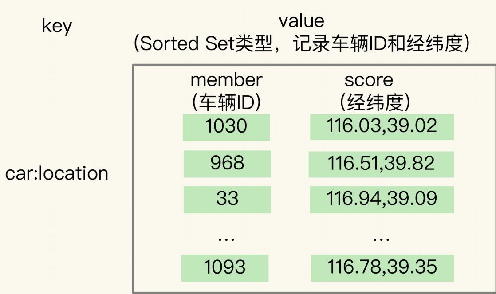

​	Sorted Set 元素的权重分数是一个浮点数（float 类型），而一组经纬度包含的是经度和纬度两个值，所以需要 GEO 类型中的 GeoHash 编码。

**GeoHash** **的编码方法**

​	基本原理：二分区间，区间编码。先对经度和纬度分别编码，然后再把经纬度编码组合成员给最终编码。经度的范围为[-180,180]，把经度值编码成一个N位的二进制，对经度的范围[-180,180]做N次的而分区操作，N可自定义。进行一次二分区时，经度范围会被分成两个子区间:[-180,0)和[0,180]，如果要编码的经度值落在左分区，就用0表示，如果落在右分区，就用1表示。一次二分区就可以得到1位编码值。对于纬度的编码方式和经度一样，只是范围为[-90,90]。最后的组合规则是，偶数位上依次是经度的编码值，奇数位上依次是维度的编码值。使用GeoHash编码相当于把整个地理空间划分成了一个个方格，每个放个对应了GeoHash中的一个分区。

​	举个例子。我们把经度区间[-180,180]做一次二分区，把纬度区间[-90,90]做一次二分区，就会得到 4 个分区。我们来看下它们的经度和纬度范围以及对应的 GeoHash 组合编码。

- 分区一：[-180,0) 和[-90,0)，编码 00；
- 分区二：[-180,0) 和[0,90]，编码 01；
- 分区三：[0,180]和[-90,0)，编码 10；
- 分区四：[0,180]和[0,90]，编码 11；

这 4 个分区对应了 4 个方格，每个方格覆盖了一定范围内的经纬度值，分区越多，每个方格能覆盖到的地理空间就越小，也就越精准。把所有方格的编码值映射到一维空间时，相邻方格的GeoHash 编码值基本也是接近的，如下图所示：

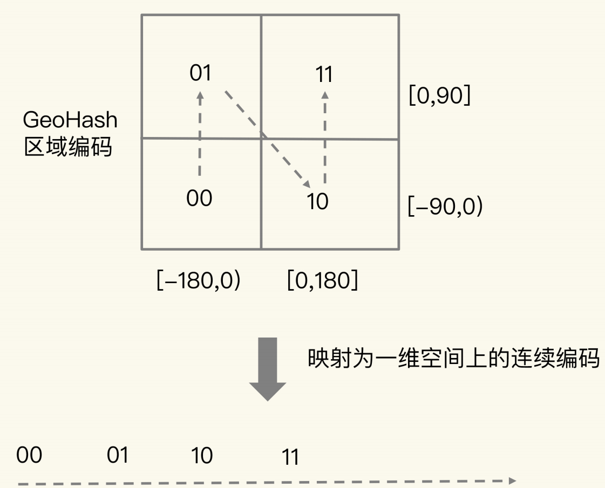

使用 Sorted Set 范围查询得到的相近编码值，在实际的地理空间上，也是相邻的方格，这就可以实现 LBS 应用“搜索附近的人或物”的功能了。

**如何操作** **GEO** **类型？**

GEOADD 命令：用于把一组经纬度信息和相对应的一个 ID 记录到 GEO 类型集合中；

GEORADIUS 命令：会根据输入的经纬度位置，查找以这个经纬度为中心的一定范围内

的其他元素。当然，我们可以自己定义这个范围。

```shell
//假设车辆id为33，经纬度(116.034579,39.030452) 集合key是cars:loactions
GEOADD cars:locations 116.034579 39.030452 33
//查询5公里内车辆信息
GEORADIUS cars:locations 116.034579 39.030452 5 km ASC COUNT 10
```

## 14. 如何在Redis中保存时间序列数据？

​	时间序列数据是与发生时间相关的一组数据。**这些数据的特点是没有严格的关系模型，记录的信息可以表示成键和值的关系**（例如，一个设备 ID 对应一条记录），所以，并不需要专门用关系型数据库（例如 MySQL）来保存。而 Redis 的键值数据模型，正好可以满足这里的数据存取需求。Redis 基于自身数据结构以及扩展模块，提供了两种解决方案。

**时间序列数据的读写特点**

​	在实际应用中，时间序列数据通常是持续高并发写入的，例如，需要连续记录数万个设备的实时状态值。同时，时间序列数据的写入主要就是插入新数据，而不是更新一个已存在的数据,，例如一个设备在某个时刻的温度测量值。**要求在进行数据插入时，复杂度要低，尽量不阻塞。Redis的String、Hash类型复杂度都是O(1)，但是在String在记录小数据时，元数据的内存开销较大，不适合保存大量数据。**

​	时间序列数据的读特点：有对单条记录的查询（某个设备在某个时刻的运行状态信息），也有对某个时间范围内的数据的查询（每天早上8点到10点的所有设备的状态信息），还有更复杂的查询聚合计算（计算某个时间段内的设备压力的最大值）。

**基于Hash和Sorted Set保存时间序列数据**

​	Hash类型，可以实现对单键的快速查询，把时间戳作为Hash的key，把记录的设备状态值作为Hash的value。**但是Hash类型有个短板：不支持对数据行进行范围查询。**


为了能同时支持按时间戳范围查询，可以用Sorted Set保存时间序列数据，把时间戳作为Sorted Set结合的元素分数，把时间点上记录的数据作为元素本身。


**如何保证写入Hash和Sorted Set是一个原子性的操作呢？**

​	原子性的操作是指我们执行多个写命令操作时（例如用 HSET 命令和 ZADD命令分别把数据写入 Hash 和 Sorted Set），这些命令操作要么全部完成，要么都不完成。 Redis 用来实现简单的事务的MULTI 和 EXEC 命令。MULTI 和 EXEC 命令可以保证执行这些命令时的原子性。

- MULTI 命令：表示一系列原子性操作的开始。收到这个命令后，Redis 就知道，接下来再收到的命令需要放到一个内部队列中，后续一起执行，保证原子性。
- EXEC 命令：表示一系列原子性操作的结束。一旦 Redis 收到了这个命令，就表示所有要保证原子性的命令操作都已经发送完成了。此时，Redis 开始执行刚才放到内部队列中的所有命令操作。


​	首先，Redis 收到了客户端执行的 MULTI 命令。然后，客户端再执行 HSET 和ZADD 命令后，Redis 返回的结果为“QUEUED”，表示这两个命令暂时入队，先不执行；执行了 EXEC 命令后，HSET 命令和 ZADD 命令才真正执行，并返回成功结果。

**如何对时间序列数据进行聚合计算？**

​	Sorted Set只支持范围查询，不支持聚合计算，只能先把时间范围内的数据取回客户端，再完成计算。**但是会有大量数据在Redis实例和客户端间传输。**

**基于** **RedisTimeSeries** **模块保存时间序列数据**

​	`RedisTimeSeries` 是 Redis 的一个扩展模块。它专门面向时间序列数据提供了数据类型和访问接口，并且支持在 Redis 实例上直接对数据进行按时间范围的聚合计算。当用于时间序列数据存取时，`RedisTimeSeries` 的操作主要有 5 个：

- 用 TS.CREATE 命令创建时间序列数据集合；
- 用 TS.ADD 命令插入数据；
- 用 TS.GET 命令读取最新数据；
- 用 TS.MGET 命令按标签过滤查询数据集合；
- 用 TS.RANGE 支持聚合计算的范围查询。

**1. 用TS.CREATE命令创建一个时间序列数据集合**

​	需要设置时间序列数据集合的 key 和数据的过期时间（以毫秒为单位）。此外，还可以为数据集合设置标签，来表示数据集合的属性。例如，我们执行下面的命令，创建一个 key 为device:temperature、数据有效期为 600s的时间序列数据集合。也就是说，这个集合中的数据创建了 600s 后，就会被自动删除。最后，给这个集合设置了一个标签属性{device_id:1}，表明这个数据集合中记录的是属于设备 ID 号为 1 的数据。

```c++
TS.CREATE device:temperature RETENION 600000 LABELS device_id 1
```

**2. 用TS.ADD命令插入数据，用TS.GET命令读取最新数据**

​	可以用 TS.ADD 命令往时间序列集合中插入数据，包括时间戳和具体的数值，并使用TS.GET 命令读取数据集合中的最新一条数据。例如，往 device:temperature 集合中插入了一条数据，记录的是设备在 2020 年 8 月 3 日 9 时 5 分的设备温度；再执行 TS.GET 命令时，就会把刚刚插入的最新数据读取出来。

```c++
TS.ADD device:temperature 1596416700 25.1
1596416700
    
TS.GET device:temperature
25.1
```

**3.用TS.MEGET命令按标签过滤查询数据结合**

​	在使用TS.CREATE 创建数据集合时，我们可以给集合设置标签属性。当我们进行查询时，就可以在查询条件中对集合标签属性进行匹配，最后的查询结果里只返回匹配上的集合中的最新数据。

​	假设我们一共用 4 个集合为 4 个设备保存时间序列数据，设备的 ID 号是 1、2、3、4，我们在创建数据集合时，把 device_id 设置为每个集合的标签。此时，我们就可以使用下列 TS.MGET 命令，以及 FILTER 设置（这个配置项用来设置集合标签的过滤条件），查询 device_id 不等于 2 的所有其他设备的数据集合，并返回各自集合中的最新的一条数据。

```c++
TS.MGET FILTER device_id != 2
1) 1) "device:temperature:1"
   2) (empty list or set)
   3) 1) (integer) 1596417000
      2) "25.3
2) 1) "device:temperature:3"
   2) (empty list or set)
   3) 1) (integer) 1596417000
      2) "29.5"
3) 1) "device:temperature:4"
   2) (empty list or set)
   3) 1) (integer) 1596417000
      2) "30.1"
```

**4. 用TS.RANGE支持需要聚合计算的范围查询**

​	在对时间序列数据进行聚合计算时，我们可以使用 TS.RANGE 命令指定要查询的数据的时间范围，同时用 AGGREGATION 参数指定要执行的聚合计算类型。RedisTimeSeries 支持的聚合计算类型很丰富，包括求均值（avg）、求最大 / 最小值（max/min），求和（sum）等。

​	例如，按照每180s的时间窗口，对2020年8月3日9时5分和2020年8月3日9时12分的数据进行均值计算。

```c++
TS.RANGE device:temperature 1596416700 1596417120 AGGREGATION avg 180000
1) 1) (integer) 1596416700
   2) "25.6"
2) 1) (integer) 1596416880
   2) "25.8"
3) 1) (integer) 1596417060
   2) "26.1"
```

## 15. 消息队列的考验：Redis有哪些解决方案？

​	消息队列要能支持组件通信消息的快速读写，`Redis`本身支持数据的告诉访问，可以满足消息队列的读写性能需求。

**消息队列的消息存取需求**

​	在分布式系统中，当两个组件要基于消息队列进行通信时，一个组件会把要处理的数据以消息的形式传递给消息队列，然后，这个组件就可以继续执行其他操作了；远端的另一个组件从消息队列中把消息读取出来，再在本地进行处理。

​	假设组件 1 需要对采集到的数据进行求和计算，并写入数据库，但是，消息到达的速度很快组件 1 没有办法及时地既做采集，又做计算，并且写入数据库。所以，我们可以使用基于消息队列的通信，让组件 1 把数据 x 和 y 保存为 `JSON` 格式的消息，再发到消息队列，这样它就可以继续接收新的数据了。组件 2 则异步地从消息队列中把数据读取出来，在服务器 2 上进行求和计算后，再写入数据库。这个过程如下图所示：

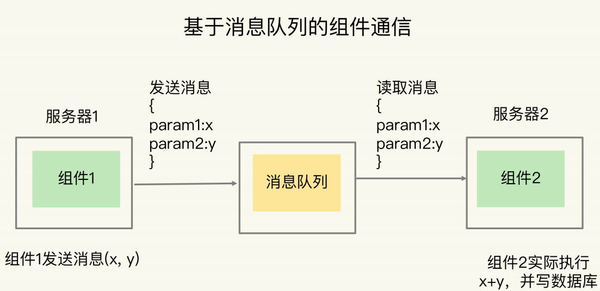

**消息队列在存取消息时，必须要满足三个需求，分别是消息保序、处理重复的消息和保证消息可靠性。**

**需求一：消息保序**

​	虽然消费者是异步处理消息，但是，消费者仍然需要按照生产者发送消息的顺序来处理消息，避免后发送的消息被先处理了。

**需求二：重复消息处理**

​	消费者从消息队列读取消息时，有时会因为网络堵塞而出现消息重传的情况。此时，消费者可能会收到多条重复的消息。对于重复的消息，消费者如果多次处理的话，就可能造成一个业务逻辑被多次执行，如果业务逻辑正好是要修改数据，那就会出现数据被多次修改的问题了。

**需求三：消息可靠性保证**

​	消费者在处理消息的时候，还可能出现因为故障或宕机导致消息没有处理完成的情况。此时，消息队列需要能提供消息可靠性的保证，也就是说，当消费者重启后，可以重新读取消息再次进行处理，否则，就会出现消息漏处理的问题了。

**Redis 的 List 和 Streams 两种数据类型，就可以满足消息队列的这三个需求。**

**基于List的消息队列解决方案**

​	List 本身就是按先进先出的顺序对数据进行存取的，所以，如果使用 List 作为消息队列保存消息的话，就已经能满足消息保序的需求了。生产者可以使用 LPUSH 命令把要发送的消息依次写入 List，而消费者则可以使用 RPOP 命令，从 List 的另一端按照消息的写入顺序，依次读取消息并进行处理。

​	但是在消费者读取数据时，有潜在的性能风险点。在生产者往 List 中写入数据时，List 并不会主动地通知消费者有新消息写入，如果消费者想要及时处理消息，就需要在程序中不停地调用 RPOP 命令。如果有新消息写入，RPOP 命令就会返回结果，否则，RPOP 命令返回空值，再继续循环。这会导致消费者的CPU一直在执行RPOP命令上，带来不必要的性能损失。

​	重复消息处理方法，需要消息队列能给每个消息提供全局唯一的ID号，消费者程序就可以对比收到的消息 ID 和记录的已处理过的消息 ID，来判断当前收到的消息有没有经过处理。如果已经处理过，那么，消费者程序就不再进行处理了。这种处理特性也称为幂等性，幂等性就是指，对于同一条消息，消费者收到一次的处理结果和收到多次的处理结果是一致的。List 本身是不会为每个消息生成 ID 号的，所以，消息的全局唯一 ID 号就需要生产者程序在发送消息前自行生成。生成之后，我们在用 LPUSH 命令把消息插入 List 时，需要在消息中包含这个全局唯一 ID。

​	对于List，当消费者读取一条消息后，List就不会再留存这条消息了。为了留存消息，List 类型提供了 BRPOPLPUSH 命令，这个命令的作用是让消费者程序从一个 List 中读取消息，同时，Redis 会把这个消息再插入到另一个 List（可以叫作备份List）留存。这样一来，如果消费者程序读了消息但没能正常处理，等它重启后，就可以从备份 List 中重新读取消息并进行处理了。List还有问题：**生产者消息发送很快，而消费者处理消息的速度比较慢，这就导致 List 中的消息越积越多，给 Redis 的内存带来很大压力。**这时需要多个消费者程序组成一个消费组，一起分担List中的消息，List类型不支持消费组，Redis从5.0版本开始提供了Streams类型。

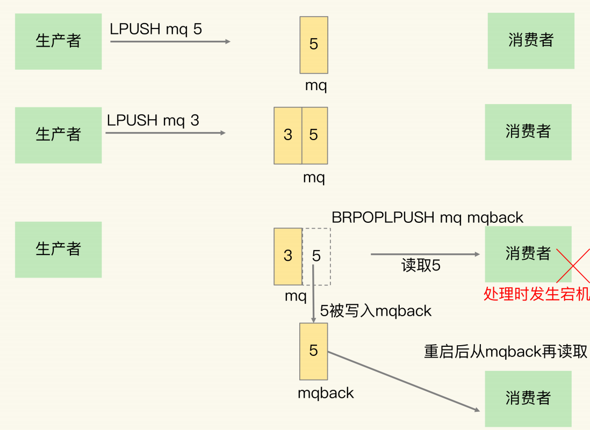

**基于Streams的消息队列解决方案**

Streams 是 Redis 专门为消息队列设计的数据类型，它提供了丰富的消息队列操作命令。

- XADD：插入消息，保证有序，可以自动生成全局唯一 ID；
- XREAD：用于读取消息，可以按 ID 读取数据；
- XREADGROUP：按消费组形式读取消息；
- XPENDING 和 XACK：XPENDING 命令可以用来查询每个消费组内所有消费者已读取但尚未确认的消息，而 XACK 命令用于向消息队列确认消息处理已完成。

消费者可以在第哦啊用XREAD时设定block配置项，实现类似BRPOP的阻塞读操作，时长可在block配置项进行设置。$表示读取最新消息。

```c++
XREAD block 10000 streams mqstream $
```

Streams本身可以使用XGROUP创建消费组，然后使用XREADGROUP让消费组内的消费者读取消息。消息队列中的消息一旦被消费组里的一个消费者读取了，就不能再被该消费组内的其他消费者读取了。使用消费组的目的是让组内的多个消费者共同分担读取消息，所以，我们通常会让每个消费者读取部分消息，从而实现消息读取负载在多个消费者间是均衡分布的。

```shell
//创建一个名字为group1的消费组，消息队列为mqstream
XGROUP create mqstream group1 0
//让group1消费组里的消费者consumer1从mqstream中读取所有消息，>表示从第一条尚未被消费的消息开始读取
XREADGROUP group group1 consumer1 streams mqstream >
//读一条消息
XREADGROUP group group1 consumer1 count 1 streams mqstream >
```

​	为了保证消费者在发生故障或宕机再次重启后，仍然可以读取未处理完的消息，Streams 会自动使用内部队列（也称为 PENDING List）留存消费组里每个消费者读取的消息，直到消费者使用 XACK 命令通知 Streams“消息已经处理完成”。如果消费者没有成功处理消息，它就不会给 Streams 发送 XACK 命令，消息仍然会留存。此时，消费者可以在重启后，用 XPENDING 命令查看已读取、但尚未确认处理完成的消息。


**Redis是否适合做消息队列？**

​	其实，关于 Redis 是否适合做消息队列，业界一直是有争论的。很多人认为，要使用消息队列，就应该采用 Kafka、RabbitMQ 这些专门面向消息队列场景的软件，而 Redis 更加适合做缓存。

​	根据这些年做 Redis 研发工作的经验，我的看法是：Redis 是一个非常轻量级的键值数据库，部署一个 Redis 实例就是启动一个进程，部署 Redis 集群，也就是部署多个 Redis 实例。而Kafka、RabbitMQ 部署时，涉及额外的组件，例如 Kafka 的运行就需要再部署ZooKeeper。相比 Redis 来说，Kafka 和 RabbitMQ 一般被认为是重量级的消息队列。

​	所以，关于是否用 Redis 做消息队列的问题，不能一概而论，我们需要考虑业务层面的数据体量，以及对性能、可靠性、可扩展性的需求。如果分布式系统中的组件消息通信量不大，那么，Redis 只需要使用有限的内存空间就能满足消息存储的需求，而且，Redis 的高性能特性能支持快速的消息读写，不失为消息队列的一个好的解决方案。

## 16. 异步机制：如何避免单线程模型的阻塞？

**影响Redis性能的5方面潜在因素：**

- Redis 内部的阻塞式操作；
- CPU 核和 NUMA 架构的影响；
- Redis 关键系统配置；
- Redis 内存碎片；
- Redis 缓冲区。

**Redis实例有哪些阻塞点？**

- **客户端：**网络IO、键值对增删改查操作、数据库操作；
- **磁盘：**生成RDB快照、记录AOF日志、AOF日志重写；
- **主从节点**：主库生成、传输 RDB 文件，从库接收 RDB 文件、清空数据库、加载 RDB文件；
- **切片集群实例**：向其他实例传输哈希槽信息，数据迁移。


**1. 和客户端交互时的阻塞点**

​	Redis 使用了 IO 多路复用机制，避免了主线程一直处在等待网络连接或请求到来的状态，所以，网络 IO 不是导致 Redis 阻塞的因素。键值对的增删改查操作是 Redis 和客户端交互的主要部分,所以，复杂度高的增删改查操作肯定会阻塞 Redis。Redis 中涉及集合的操作复杂度通常为 O(N)，例如集合元素全量查询操作 `HGETALL`、`SMEMBERS`，以及集合的聚合统计操作，例如求交、并和差集。这些操作可以作为 Redis 的**第一个阻塞点：集合全量查询和聚合操作**。

​	删除操作也有阻塞风险，删除操作的本质是要释放键值对占用的内存空间。在应用程序释放内存时，操作系统需要把释放掉的内存块插入一个空闲内存块的链表，以便后续进行管理和再分配。这个过程本身需要一定时间，而且会阻塞当前释放内存的应用程序，所以，如果一下子释放了大量内存，空闲内存块链表操作时间就会增加，相应地就会造成 Redis 主线程的阻塞。**最典型的就是删除包含了大量元素的集合，也称为 bigkey 删除**。

​	清空数据库与bigkey删除类似，也是阻塞点。

**2. 和磁盘交互时的阻塞点**

​	Redis 开发者早已认识到磁盘 IO 会带来阻塞，所以就把 Redis 进一步设计为采用子进程的方式**生成 RDB 快照文件，以及执行 AOF 日志重写操作**。

​	但是，Redis 直接记录 AOF 日志时，会根据不同的写回策略对数据做落盘保存。一个同步写磁盘的操作的耗时大约是 1～2ms，如果有大量的写操作需要记录在 AOF 日志中，并同步写回的话，就会阻塞主线程了。这就得到了 Redis 的**第四个阻塞点了：AOF 日志同步写**。

**3. 主从节点交互时的阻塞点**

​	在主从集群中，对于从库来说，它在接收了RDB 文件后，需要使用 FLUSHDB 命令清空当前数据库，这就正好撞上了刚才我们分析的**第三个阻塞点。**

​	此外，从库在清空当前数据库后，还需要把 RDB 文件加载到内存，这个过程的快慢和RDB 文件的大小密切相关，RDB 文件越大，加载过程越慢，所以，**加载 RDB 文件就成为了 Redis 的第五个阻塞点**。

**4. 切片集群实例交互时的阻塞点**

​	当我们部署 Redis 切片集群时，每个 Redis 实例上分配的哈希槽信息需要在不同实例间进行传递，同时，当需要进行负载均衡或者有实例增删时，数据会在不同的实例间进行迁移。不过，哈希槽的信息量不大，而数据迁移是渐进式执行的，所以，一般来说，这两类操作对 Redis 主线程的阻塞风险不大。

​	如果你使用了 `Redis Cluster` 方案，而且同时正好迁移的是 bigkey 的话，就会造成主线程的阻塞，因为 `Redis Cluster` 使用了同步迁移。

**哪些阻塞点可以异步执行？**

​	Redis 提供了异步线程机制。所谓的异步线程机制，就是指，Redis 会启动一些子线程，然后把一些任务交给这些子线程，让它们在后台完成，而不再由主线程来执行这些任务。使用异步线程机制执行操作，可以避免阻塞主线程。

​	bigkey删除、清空数据库、AOF日志同步写都可以用后台子线程来异步执行删除操作。

**异步的子线程机制**

​	Redis 主线程启动后，会使用操作系统提供的 `pthread_create` 函数创建 3 个子线程，分别由它们负责 AOF 日志写操作、键值对删除以及文件关闭的异步执行。

​	主线程通过一个链表形式的任务队列和子线程进行交互。当收到键值对删除和清空数据库的操作时，主线程会把这个操作封装成一个任务，放入到任务队列中，然后给客户端返回一个完成信息，表明删除已经完成。

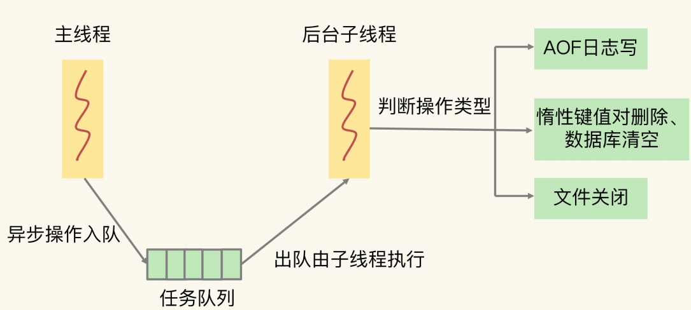

## 17. 为什么CPU结构也会影响Redis的性能？

**主流的cpu架构**

​	一个 CPU 处理器中一般有多个运行核心，我们把一个运行核心称为一个物理核，每个物理核都可以运行应用程序。每个物理核都拥有私有的一级缓存（Level 1 cache，简称 L1cache），包括一级指令缓存和一级数据缓存，以及私有的二级缓存（Level 2 cache，简称 L2 cache）。

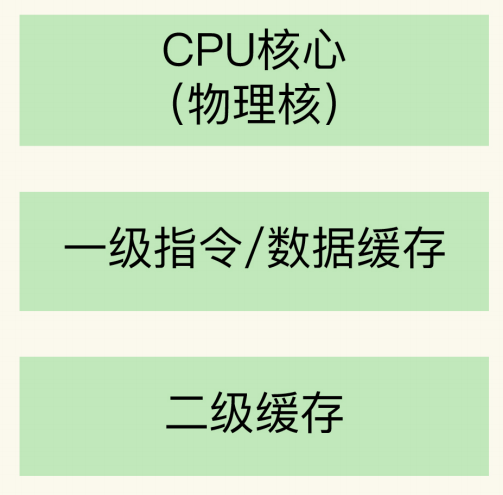

​	因为 L1 和 L2 缓存是每个物理核私有的，所以，当数据或指令保存在 L1、L2 缓存时，物理核访问它们的延迟不超过 10 纳秒，速度非常快。那么，如果 Redis 把要运行的指令或存取的数据保存在 L1 和 L2 缓存的话，就能高速地访问这些指令和数据。不同的物理核还会共享一个共同的三级缓存（Level 3 cache，简称为 L3 cache）。L3 缓存能够使用的存储资源比较多，所以一般比较大，能达到几 MB 到几十 MB，这就能让应用程序缓存更多的数据。当 L1、L2 缓存中没有数据缓存时，可以访问 L3，尽可能避免访问内存。

​	现在主流的 CPU 处理器中，每个物理核通常都会运行两个超线程，也叫作逻辑核。同一个物理核的逻辑核会共享使用 L1、L2 缓存。

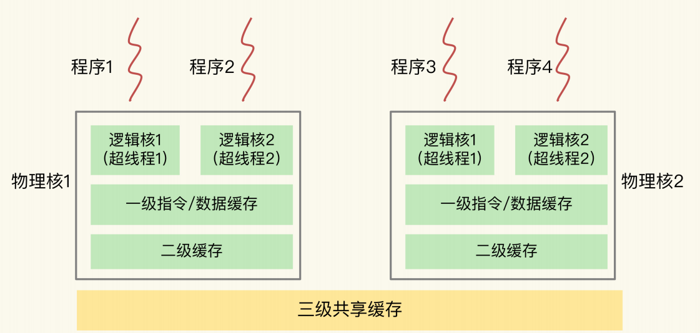

​	在主流的服务器上，一个 CPU 处理器会有 10 到 20 多个物理核。同时，为了提升服务器的处理能力，服务器上通常还会有多个 CPU 处理器（也称为多 CPU Socket），每个处理器有自己的物理核（包括 L1、L2 缓存），L3 缓存，以及连接的内存，同时，不同处理器间通过总线连接。

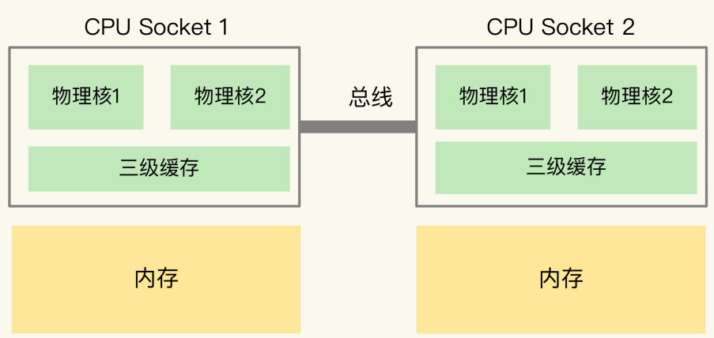

​	**在多 CPU 架构上，应用程序可以在不同的处理器上运行**。在刚才的图中，Redis 可以先在Socket 1 上运行一段时间，然后再被调度到 Socket 2 上运行。如果应用程序先在一个 Socket 上运行，并且把数据保存到了内存，然后被调度到另一个 Socket 上运行，此时，应用程序再进行内存访问时，就需要访问之前 Socket 上连接的内存，这种访问属于**远端内存访问**。**和访问 Socket 直接连接的内存相比，远端内存访问会增加应用程序的延迟。**在多 CPU 架构下，一个应用程序访问所在 Socket 的本地内存和访问远端内存的延迟并不一致，所以，我们也把这个架构称为非统一内存访问架构（Non-Uniform MemoryAccess，NUMA 架构）。

**CPU多核对Redis性能的影响**

​	在多核 CPU 的场景下，一旦应用程序需要在一个新的 CPU 核上运行，那么，运行时信息就需要重新加载到新的 CPU 核上。而且，新的 CPU 核的 L1、L2 缓存也需要重新加载数据和指令，这会导致程序的运行时间增加。

​	一个线程先在一个 CPU 核上运行，之后又切换到另一个 CPU 核上运行，这时就会发生context switch。当 context switch 发生后，Redis 主线程的运行时信息需要被重新加载到另一个 CPU 核上，而且，此时，另一个 CPU 核上的 L1、L2 缓存中，并没有 Redis 实例之前运行时频繁访问的指令和数据，所以，这些指令和数据都需要重新从 L3 缓存，甚至是内存中加载。这个重新加载的过程是需要花费一定时间的。而且，Redis 实例需要等待这个重新加载的过程完成后，才能开始处理请求，所以，这也会导致一些请求的处理时间增加。

​	如果在 CPU 多核场景下，Redis 实例被频繁调度到不同 CPU 核上运行的话，那么，对Redis 实例的请求处理时间影响就更大了。**每调度一次，一些请求就会受到运行时信息、指令和数据重新加载过程的影响，这就会导致某些请求的延迟明显高于其他请求**。

​	为了避免 Redis 总是在不同 CPU 核上来回调度执行。我们可以使用**taskset 命令**把一个程序绑定在一个核上运行。

**CPU的NUMA架构堆Redis性能的影响**
	在实际应用 Redis 时，有一种做法，为了提升 Redis 的网络性能，把操作系统的网络中断处理程序和 CPU 核绑定。这可以避免网络中断处理程序在不同核上来回调度执行，能有效提升 Redis 的网络处理性能。

​	在 CPU 的 NUMA 架构下，当网络中断处理程序、Redis 实例分别和 CPU 核绑定后，就会有一个潜在的风险：**如果网络中断处理程序和 Redis 实例各自所绑的 CPU 核不同一个 CPU Socket 上，那么，Redis 实例读取网络数据时，就需要跨 CPU Socket 访问内存，这个过程会花费较多时间**。

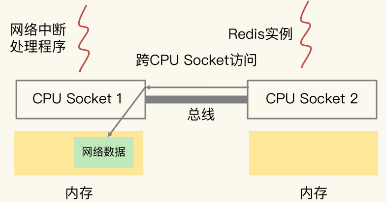

​	为了避免 Redis 跨 CPU Socket 访问网络数据，我们最好把网络中断程序和 Redis实例绑在同一个 CPU Socket 上，这样一来，Redis 实例就可以直接从本地内存读取网络数据了。

**绑核的风险和解决方案**

​	当我们把 Redis 实例绑到一个 CPU 逻辑核上时，就会导致子进程、后台线程和 Redis 主线程竞争 CPU 资源，一旦子进程或后台线程占用 CPU 时，主线程就会被阻塞，导致Redis 请求延迟增加。

- **方案一：一个Redis实例对应帮一个物理核(包含两个逻辑核)。**在给 Redis 实例绑核时，我们不要把一个实例和一个逻辑核绑定，而要和一个物理核绑定，也就是说，把一个物理核的 2 个逻辑核都用上。把 Redis 实例和物理核绑定，可以让主线程、子进程、后台线程共享使用 2 个逻辑核，可以在一定程度上缓解 CPU 资源竞争。但是，因为只用了 2 个逻辑核，它们相互之间的 CPU 竞争仍然还会存在。
- **方案二：优化Redis源码**。把 Redis 实例和物理核绑定，可以让主线程、子进程、后台线程共享使用 2 个逻辑核，可以在一定程度上缓解 CPU 资源竞争。但是，因为只用了 2 个逻辑核，它们相互之间的 CPU 竞争仍然还会存在。如果你还想进一步减少 CPU 竞争。使用源码优化方案，既可以实现 Redis 实例绑核，避免切换核带来的性能影响，还可以让子进程、后台线程和主线程不在同一个核上运行，避免了它们之间的 CPU 资源竞争。相比使用 taskset 绑核来说，这个方案可以进一步降低绑核的风险。

## 18. 波动的响应延迟：如何应对变慢的Redis？（上）

**Reids真的变慢了吗？**

 	1. 查看Redis的响应延迟。大部分时候，Redis 延迟很低，但是在某些时刻，有些 Redis 实例会出现很高的响应延迟，甚至能达到几秒到十几秒，不过持续时间不长，这也叫延迟“毛刺”。Redis 命令的执行时间突然就增长到了几秒，基本就可以认定 Redis 变慢了。但是在不同的软硬件环境下，Redis本身的绝对性能并不相同。
 	2. 基于当前环境下的Redis基线性能做判断，所谓的基线性能呢，也就是一个系统在低压力、无干扰下的基本性能，这个性能只由当前的软硬件配置决定。从 2.8.7 版本开始，redis-cli 命令提供了–intrinsic-latency 选项，可以用来监测和统计测试期间内的最大延迟，这个延迟可以作为 Redis 的基线性能。

**如何应对Redis变慢？**

​	 Redis 自身的操作特性、文件系统和操作系统，它们是影响 Redis 性能的三大要素。

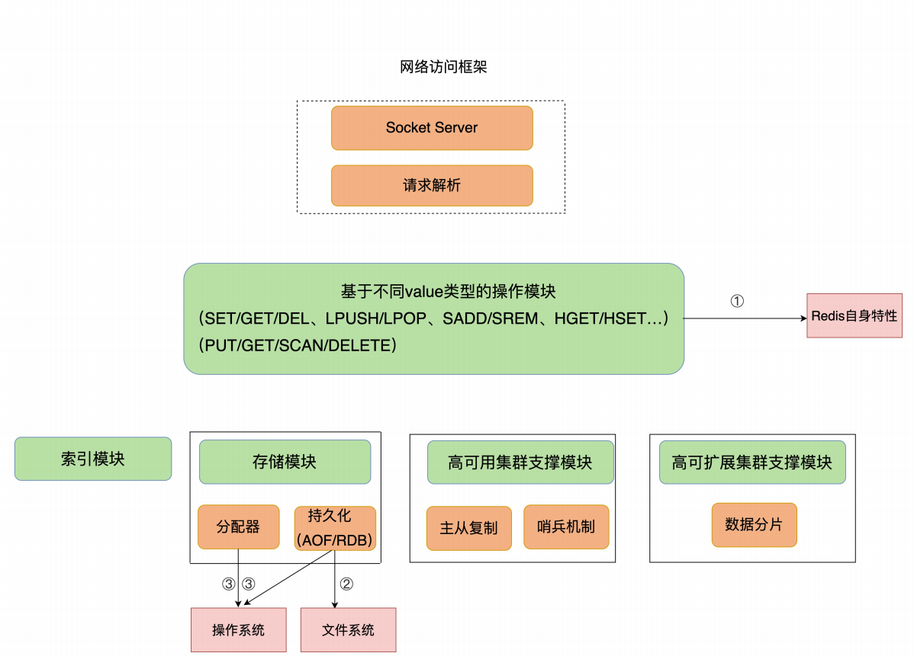

**Redis自身操作特性的影响**

​	**慢查询命令**：是指在 Redis 中执行速度慢的命令，这会导致 Redis 延迟增加。Redis 提供的命令操作很多，并不是所有命令都慢，这和命令操作的复杂度有关。String的GET/SET操作主要是操作Redis的哈希表索引，O(1)，但是，当 Value 类型为 Set 时，SORT、SUNION/SMEMBERS 操作复杂度分别为 O(N+M*log(M)) 和 O(N)。其中，N 为 Set 中的元素个数，M 为 SORT 操作返回的元素个数。这个复杂度就增加了很多。当你发现 Redis 性能变慢时，可以通过 Redis 日志，或者是 latency monitor 工具，查询变慢的请求，根据请求对应的具体命令以及官方文档，确认下是否采用了复杂度高的慢查询命令。如果的确有大量的慢查询命令，有两种处理方式：

1. **用其他高效命令代替**。比如说，如果你需要返回一个 SET 中的所有成员时，不要使用SMEMBERS 命令，而是要使用 SSCAN 多次迭代返回，避免一次返回大量数据，造成线程阻塞。
2. **当你需要执行排序、交集、并集操作时，可以在客户端完成，而不要用 SORT、SUNION、SINTER 这些命令，以免拖慢 Redis 实例**。

​	还有一个比较容易忽略的慢查询命令，就是 KEYS。它用于返回和输入模式匹配的所有key，例如，以下命令返回所有包含“name”字符串的 keys。**因为 KEYS 命令需要遍历存储的键值对，所以操作延时高**。如果你不了解它的实现而使用了它，就会导致 Redis 性能变慢。所以，**KEYS 命令一般不被建议用于生产环境中**。

```c++
redis> KEYS *name*
1) "lastname"
2) "firstname"
```

​	**过期key操作**：过期 key 的自动删除机制。它是 Redis 用来回收内存空间的常用机制，应用广泛，本身就会引起 Redis 操作阻塞，导致性能变慢。Redis 键值对的 key 可以设置过期时间。默认情况下，Redis 每 100 毫秒会删除一些过期key，具体的算法如下：

1. 采样 `ACTIVE_EXPIRE_CYCLE_LOOKUPS_PER_LOOP` 个数的 key，并将其中过期的key 全部删除；
2. 如果超过 25% 的 key 过期了，则重复删除的过程，直到过期 key 的比例降至 25% 以下。

如果触发了上面这个算法的第二条，Redis 就会一直删除以释放内存空间。注意，**删除操作是阻塞的**（Redis 4.0 后可以用异步线程机制来减少阻塞影响）。所以，一旦该条件触发，Redis 的线程就会一直执行删除，这样一来，就没办法正常服务其他的键值操作了，就会进一步引起其他键值操作的延迟增加，Redis 就会变慢。触发第二条的原因：**频繁使用带有相同时间参数的 EXPIREAT 命令设置过期 key**，这就会导致，在同一秒内有大量的 key 同时过期。解决方案检查业务代码使用EXPIREAT命令设置key过期时间时，是否使用了相同的UNIX时间戳有没有使用 EXPIRE 命令给批量的 key 设置相同的过期秒数。因为，这都会造成大量 key 在同一时间过期，导致性能变慢。

## 19. 波动的响应延迟：如何应对变慢的Redis？（下）

​	发现 Redis 没有执行大量的慢查询命令，也没有同时删除大量过期 keys。需要关注影响性能的其他机制了，也就是文件系统和操作系统。

​	Redis 会持久化保存数据到磁盘，这个过程要依赖文件系统来完成，所以，文件系统将数据写回磁盘的机制，会直接影响到 Redis 持久化的效率。而且，在持久化的过程中，Redis也还在接收其他请求，持久化的效率高低又会影响到 Redis 处理请求的性能。

​	Redis 是内存数据库，内存操作非常频繁，所以，操作系统的内存机制会直接影响到 Redis 的处理效率。比如说，如果 Redis 的内存不够用了，操作系统会启动 swap机制，这就会直接拖慢 Redis。

**文件系统：AOF模式**

​	为了保证数据可靠性，Redis 会采用 AOF 日志或 RDB 快照。其中，AOF日志提供了三种日志写回策略：`no`、`everysec`、`always`。这三种写回策略依赖文件系统的两个系统调用完成，也就是 `write` 和 `fsync`。

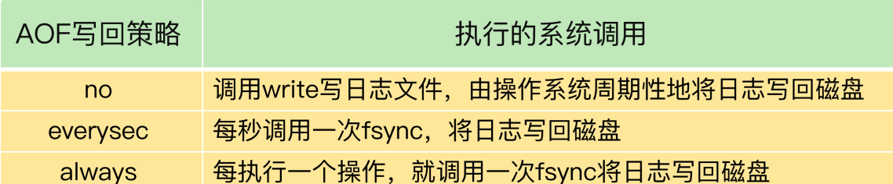

​	`fsync` 的执行时间很长，如果是在 Redis 主线程中执行 `fsync`，就容易阻塞主线程。所以，当写回策略配置为 `everysec` 时，Redis 会使用后台的子线程异步完成 `fsync` 的操作。

​	对于 `always` 策略来说，Redis 需要确保每个操作记录日志都写回磁盘，如果用后台子线程异步完成，主线程就无法及时地知道每个操作是否已经完成了，这就不符合 `always` 策略的要求了。所以，`always` 策略并不使用后台子线程来执行。

​	当主线程使用后台子线程执行了一次 `fsync`，需要再次把新接收的操作记录写回磁盘时，如果主线程发现上一次的 `fsync` 还没有执行完，那么它就会阻塞。所以，如果后台子线程执行的 `fsync` 频繁阻塞的话（比如 AOF 重写占用了大量的磁盘 IO 带宽），主线程也会阻塞，导致 Redis 性能变慢。

​	AOF日志写回策略：


**操作系统：swap**

​	内存 `swap` 是操作系统里将内存数据在内存和磁盘间来回换入和换出的机制，涉及到磁盘的读写，所以，一旦触发 `swap`，无论是被换入数据的进程，还是被换出数据的进程，其性能都会受到慢速磁盘读写的影响。`Redis` 是内存数据库，内存使用量大，如果没有控制好内存的使用量，或者和其他内存需求大的应用一起运行了，就可能受到 `swap` 的影响，而导致性能变慢。

​	与 AOF 日志文件读写使用 `fsync` 线程不同，`swap` 触发后影响的是 Redis 主 IO 线程，这会极大地增加 Redis 的响应时间。

​	触发 swap 的原因主要是**物理机器内存不足**，对于 Redis 而言，有两种常见的情况：

1. Redis 实例自身使用了大量的内存，导致物理机器的可用内存不足；

2. 和 Redis 实例在同一台机器上运行的其他进程，在进行大量的文件读写操作。文件读写

   本身会占用系统内存，这会导致分配给 Redis 实例的内存量变少，进而触发 Redis 发生

   `swap`。

解决方法：**增加机器的内存或者使用Redis集群**

**操作系统：内存大页**

​	除了内存 swap，还有一个和内存相关的因素，即内存大页机制（Transparent HugePage, THP），也会影响 Redis 性能。

​	Linux 内核从 2.6.38 开始支持内存大页机制，该机制支持 2MB 大小的内存页分配，而常规的内存页分配是按 4KB 的粒度来执行的。

​	虽然内存大页可以给 Redis 带来内存分配方面的收益，但是，不要忘了，Redis 为了提供数可靠性保证，需要将数据做持久化保存。这个写入过程由额外的线程执行，所以，此时，Redis 主线程仍然可以接收客户端写请求。客户端的写请求可能会修改正在进行持久化的数据。在这一过程中，Redis 就会采用写时复制机制，也就是说，一旦有数据要被修改，Redis 并不会直接修改内存中的数据，而是将这些数据拷贝一份，然后再进行修改。生产环境中建议不要使用内存大页机制。

```c++
echo never /sys/kernel/mm/transparent_hugepage/enabled
```

## 20. 删除数据后，为什么内存占用率还是很高？

​	当数据删除后，Redis 释放的内存空间会由内存分配器管理，并不会立即返回给操作系统。所以，操作系统仍然会记录着给 Redis 分配了大量内存。

​	但是，这往往会伴随一个潜在的风险点：Redis 释放的内存空间可能并不是连续的，那么，这些不连续的内存空间很有可能处于一种闲置的状态。这就会导致一个问题：虽然有空闲空间，Redis 却无法用来保存数据，不仅会减少 Redis 能够实际保存的数据量，还会降低 Redis 运行机器的成本回报率。

**什么是内存碎片？**


**内存碎片是如何形成的？**

内因是操作系统的内存分配机制，外因是Redis的负载特征。

1. **内因：内存分配器的分配策略**，内存分配器的分配策略就决定了操作系统无法做到“按需分配”。这是因为，内存分配器一般是按固定大小来分配内存，而不是完全按照应用程序申请的内存空间大小给程序分配。
2. **外因：键值对大小不一样和删改操作**，Redis 通常作为共用的缓存系统或键值数据库对外提供服务，所以，不同业务应用的数据都可能保存在 Redis 中，这就会带来不同大小的键值对。这样一来，Redis 申请内存空间分配时，本身就会有大小不一的空间需求。这是第一个外因。第二个外因是，这些键值对会被修改和删除，这会导致空间的扩容和释放。具体来说，一方面，如果修改后的键值对变大或变小了，就需要占用额外的空间或者释放不用的空间。另一方面，删除的键值对就不再需要内存空间了，此时，就会把空间释放出来，形成空闲空间。


**如何判断是否有内存碎片？**

​	Redis提供了INFO命令查询内存使用的详细信息。如果`mem_fragmentation_ratio`大于1但小于1.5，这种情况是合理的。当大于1.5时，表明内存碎片率已经超过了50%，这时，需要采取一些措施来降低内存碎片率了。

```c++
INFO memory
# Memory
used_memory:1073741736
used_memory_human:1024.00M
used_memory_rss:19971596792
used_memory_rss_human:1.86G
...
mem_fragmentation_ratio:1.86//表示Reids当前的内存碎片率
```

**如何清理内存碎片？**

1. 重启Redis实例，但是会带来连个后果，如果Redis中的数据没有持久化，数据就会丢失；即使Redis 数据持久化了，我们还需要通过 AOF 或 RDB 进行恢复，恢复时长取决于AOF 或 RDB 的大小，如果只有一个 Redis 实例，恢复阶段无法提供服务。
2. 从4.0-RC3版本以后，Redis自身提供了一种内存碎片自动清理的方法。


需要注意的是：**碎片清理是有代价的**，操作系统需要把多份数据拷贝到新位置，把原有空间释放出来，这会带来时间开销。因为 Redis 是单线程，在数据拷贝时，Redis 只能等着，这就导致 Redis 无法及时处理请求，性能就会降低。而且，有的时候，数据拷贝还需要注意顺序，就像刚刚说的清理内存碎片的例子，操作系统需要先拷贝 D，并释放 D的空间后，才能拷贝 B。这种对顺序性的要求，会进一步增加 Redis 的等待时间，导致性能降低。

## 21. 缓冲区：一个可能引发“惨案”的地方

​	缓冲区的功能其实很简单，主要就是用一块内存空间来暂时存放命令数据，以免出现因为数据和命令的处理速度慢于发送速度而导致的数据丢失和性能问题。但因为缓冲区的内存空间有限，如果往里面写入数据的速度持续地大于从里面读取数据的速度，就会导致缓冲区需要越来越多的内存来暂存数据。当缓冲区占用的内存超出了设定的上限阈值时，就会出现缓冲区溢出。

​	如果不给缓冲区的大小设置上限，随着累积的数据越来越多，缓冲区占用内存空间越来越大，一旦耗尽了 Redis 实例所在机器的可用内存，就会导致 Redis 实例崩溃。

​	缓冲区在 Redis 中的一个主要应用场景，**就是在客户端和服务器端之间进行通信时，用来暂存客户端发送的命令数据**，或者是服务器端返回给客户端的数据结果。此外，缓冲区的另一个主要应用场景，是**在主从节点间进行数据同步时，用来暂存主节点接收的写命令和数据。**

**客户端输入和输出缓冲区**

​	为了避免客户端和服务器端的请求发送和处理速度不匹配，服务器端给每个连接的客户端都设置了一个输入缓冲区和输出缓冲区，我们称之为客户端输入缓冲区和输出缓冲区。输入缓冲区会先把客户端发送过来的命令暂存起来，Redis 主线程再从输入缓冲区中读取命令，进行处理。当 Redis 主线程处理完数据后，会把结果写入到输出缓冲区，再通过输出缓冲区返回给客户端，如下图所示：


**如何应对输入缓冲区溢出？**

​	输入缓冲区溢出两种情况：

1. 写入了`bigkey`；
2. 服务器端处理i请求的速度过慢，Redis主线程出现了间歇性阻塞， 无法及时处理正常发送的请求，导致客户端发送的请求在缓冲区越积越多。

​	使用`CLIENT LIST`查看每个客户端输入缓冲区的使用情况。

```shell
CLIENT LIST
id=5 addr=127.0.0.1:50487 fd=9 name= age=4 idle=0 flags=N db=0 sub=0 psub=0 multi=-1 qbuf=26 qbuf-free=32742 obl=0 oll=0 omem=0 events=r cmd=client

```

与输入缓冲区相关的三个参数：

- `cmd`，表示客户端最新执行的命令。这个例子中执行的是 CLIENT 命令。
- `qbuf`，表示输入缓冲区已经使用的大小。这个例子中的 CLIENT 命令已使用了 26 字节大小的缓冲区。
- `qbuf-free`，表示输入缓冲区尚未使用的大小。这个例子中的 CLIENT 命令还可以使用32742 字节的缓冲区。qbuf 和 qbuf-free 的总和就是，Redis 服务器端当前为已连接的这个客户端分配的缓冲区总大小。这个例子中总共分配了 26 + 32742 = 32768 字节，也就是 32KB 的缓冲区。

​	通常情况下，Redis 服务器端不止服务一个客户端，当多个客户端连接占用的内存总量，超过了 Redis 的 maxmemory 配置项时（例如 4GB），就会触发 Redis 进行数据淘汰。一旦数据被淘汰出 Redis，再要访问这部分数据，就需要去后端数据库读取，这就降低了业务应用的访问性能。此外，更糟糕的是，如果使用多个客户端，导致 Redis 内存占用过大，也会导致内存溢出（out-of-memory）问题，进而会引起 Redis 崩溃，给业务应用造成严重影响。

​	避免输入缓冲区溢出：**我们可以从两个角度去考虑如何避免，一是把缓冲区调大，二是从数据命令的发送和处理速度入手。**Redis 的客户端输入缓冲区大小的上限阈值，在代码中就设定为了 1GB，不能调整。方法只能是前面提到的避免客户端写入 bigkey，以及避免 Redis 主线程阻塞。

**如何应对输出缓冲区溢出？**

​	Redis 的输出缓冲区暂存的是 Redis 主线程要返回给客户端的数据。Redis 为每个客户端设置的输出缓冲区也包括两部分：一部分，是一个大小为 16KB的固定缓冲空间，用来暂存 OK 响应和出错信息；另一部分，是一个可以动态增加的缓冲空间，用来暂存大小可变的响应结果。

​	输出缓冲区溢出三种情况：

- 服务器端返回 `bigkey` 的大量结果；
- 执行了 `MONITOR` 命令；
- 缓冲区大小设置得不合理。

`MONITOR` 命令是用来监测 Redis 执行的，会持续输出监测到的各个命令操作，如下所示：

```shell
MONITOR
OK
1600617456.437129 [0 127.0.0.1:50487] "COMMAND"
1600617477.289667 [0 127.0.0.1:50487] "info" "memory"
```

​	`MONITOR` 的输出结果会持续占用输出缓冲区，并越占越多，最后的结果就是发生溢出。**MONITOR 命令主要用在调试环境中，线上生产环境中可偶尔使用 MONITOR**。

​	可通过`client-output-buffer-limit`来设置输出缓冲区的大小。主要有两类客户端和Redis服务器端交互，分别是常规和Reids服务器端进行读写命令交互的普通客户端，以及订阅了 Redis 频道的订阅客户端。此外，在 Redis 主从集群中，主节点上也有一类客户端（从节点客户端）用来和从节点进行数据同步。这几种输出缓冲区大小分别设置。

**主从集群中的缓冲区**

​	主从集群间的数据复制包括全量复制和增量复制两种。全量复制是同步所有数据，而增量复制只会把主从库网络断连期间主库收到的命令，同步给从库。无论在哪种形式的复制中，为了保证主从节点的数据一致，都会用到缓冲区。但是，这两种复制场景下的缓冲区，在溢出影响和大小设置方面并不一样。

**复制缓冲区的溢出问题**

​	在全量复制过程中，主节点在向从节点传输 RDB 文件的同时，会继续接收客户端发送的写命令请求。这些写命令就会先保存在复制缓冲区中，等 RDB 文件传输完成后，再发送给从节点去执行。主节点上会为每个从节点都维护一个复制缓冲区，来保证主从节点间的数据同步。

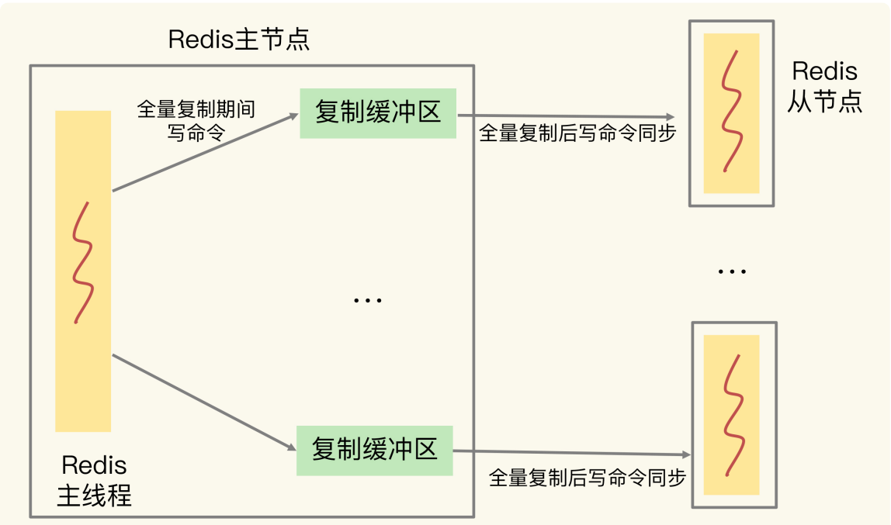

可以通过控制主节点保存的数据量大小。按通常的使用经验，我们会把主节点的数据量控制在 2~4GB，让全量同步执行得更快些，避免复制缓冲区累积过多命令。

​	关于复制缓冲区，我们还会遇到一个问题。主节点上复制缓冲区的内存开销，会是每个从节点客户端输出缓冲区占用内存的总和。如果集群中的从节点数非常多的话，主节点的内存开销就会非常大。所以，我们还必须得控制和主节点连接的从节点个数，不要使用大规模的主从集群。

**复制积压缓冲区的溢出问题**

​	主节点在把接收到的写命令同步给从节点时，同时会把这些写命令写入复制积压缓冲区。一旦从节点发生网络闪断，再次和主节点恢复连接后，从节点就会从复制积压缓冲区中，读取断连期间主节点接收到的写命令，进而进行增量同步，如下图所示：


英文名是`repl_backlog_buffer`。首先，复制积压缓冲区是一个大小有限的环形缓冲区。当主节点把复制积压缓冲区写满后，会覆盖缓冲区中的旧命令数据。如果从节点还没有同步这些旧命令数据，就会造成主从节点间重新开始执行全量复制。其次，为了应对复制积压缓冲区的溢出问题，可以调整复制积压缓冲区的大小，也就是设置 `repl_backlog_size` 这个参数的值。

## 22. 第11~21讲课后思考题答案及常见问题答疑

## 23. 旁路缓存：Redis是如何工作的？

​	如果 Redis 做缓存时出现了问题，比如说缓存失效，那么，大量请求就会直接积压到数据库层，必然会给数据库带来巨大的压力，很可能会导致数据库宕机或是故障，那么，业务应用就没有办法存取数据、响应用户请求了。这种生产事故，肯定不是我们希望看到的。

**缓存的特征**

​	计算机系统中，默认有两种缓存：

- CPU 里面的末级缓存，即 LLC，用来缓存内存中的数据，避免每次从内存中存取数据；
- 内存中的高速页缓存，即 page cache，用来缓存磁盘中的数据，避免每次从磁盘中存取数据。


​	缓存的**第一个特征**：在一个层次化的系统中，缓存一定是一个快速子系统，数据存在缓存中时，能避免每次从慢速子系统中存取数据。对应到互联网应用来说，Redis 就是快速子系统，而数据库就是慢速子系统了。

​	缓存的**第二个特征：缓存系统的容量大小总是小于后端慢速系统的，我们不可能把所有数据都放在缓存系统中**。

​	缓存的容量终究是有限的，缓存中的数据量也是有限的，不能时刻都满足访问需求的。所以，缓存和后端慢速系统之间，必然存在数据写回和再读取的交互过程。缓存中的数据需要按一定规则淘汰出去，写回后端系统，而新的数据又要从后端系统中读取进来，写入缓存。

**Redis 缓存处理请求的两种情况**

​	业务应用在访问数据时，会先查询 Redis 中是否保存了相应的数据。此时，根据数据是否存在缓存中，会有两种情况。

- **缓存命中**：Redis 中有相应数据，就直接读取 Redis，性能非常快。
- **缓存缺失**：Redis 中没有保存相应数据，就从后端数据库中读取数据，性能就会变慢。而且，一旦发生缓存缺失，为了让后续请求能从缓存中读取到数据，需要把缺失的数据写入 Redis，这个过程叫作缓存更新。缓存更新操作会涉及到保证缓存和数据库之间的数据一致性问题。


​	使用 Redis 缓存时，基本有三个操作：

1. 应用读取数据时，需要先读取 Redis；
2. 发生缓存缺失时，需要从数据库读取数据；
3. 发生缓存缺失时，还需要更新缓存。

**Redis作为旁路缓存的使用操作**

​	Redis 是一个独立的系统软件，和业务应用程序是两个软件，当部署了 Redis 实例后，它只会被动地等待客户端发送请求，然后再进行处理。所以，如果应用程序想要使用Redis 缓存，就要在程序中增加相应的缓存操作代码。所以，也把 Redis 称为旁路缓存，也就是说，读取缓存、读取数据库和更新缓存的操作都需要在应用程序中来完成。

​	使用 Redis 缓存时，需要在应用程序中增加三方面的代码：

- 当应用程序需要读取数据时，需要在代码中显式调用 Redis 的 GET 操作接口，进行查询；
- 如果缓存缺失了，应用程序需要再和数据库连接，从数据库中读取数据；
- 当缓存中的数据需要更新时，也需要在应用程序中显式地调用 SET 操作接口，把更新的数据写入缓存。

​	在使用 Redis 缓存时，有一个地方就需要注意了：因为需要新增程序代码来使用缓存，所以，Redis 并不适用于那些无法获得源码的应用。在使用旁路缓存时，需要在应用程序中增加操作代码，增加了使用 Redis 缓存的额外工作量，但是，也正因为 Redis 是旁路缓存，是一个独立的系统，可以单独对 Redis缓存进行扩容或性能优化。而且，只要保持操作接口不变，在应用程序中增加的代码就不用再修改了。

​	应用程序可能会对数据进行修改，这时，既可以在缓存中修改，也可以在后端数据库中进行修改，该怎么选择呢？这就涉及到了 Redis 缓存的两种类型：**只读缓存和读写缓存**。只读缓存能加速读请求，而读写缓存可以同时加速读写请求。而且，读写缓存又有两种数据写回策略，可以根据业务需求，在保证性能和保证数据可靠性之间进行选择。

**只读缓存**

​	当 Redis 用作只读缓存时，应用要读取数据的话，会先调用 Redis GET 接口，查询数据是否存在。而所有的数据写请求，会直接发往后端的数据库，在数据库中增删改。对于删改的数据来说，如果 Redis 已经缓存了相应的数据，应用需要把这些缓存的数据删除，Redis中就没有这些数据了。当应用再次读取这些数据时，会发生缓存缺失，应用会把这些数据从数据库中读出来，并写到缓存中。这样一来，这些数据后续再被读取时，就可以直接从缓存中获取了，能起到加速访问的效果。

**读写缓存**

​	对于读写缓存来说，除了读请求会发送到缓存进行处理（直接在缓存中查询数据是否存在)，所有的写请求也会发送到缓存，在缓存中直接对数据进行增删改操作。此时，得益于Redis 的高性能访问特性，数据的增删改操作可以在缓存中快速完成，处理结果也会快速返回给业务应用，这就可以提升业务应用的响应速度。

​	在使用读写缓存时，最新的数据是在 Redis 中，而 Redis是内存数据库，一旦出现掉电或宕机，内存中的数据就会丢失。这也就是说，应用的最新数据可能会丢失，给应用业务带来风险。所以，根据业务应用对数据可靠性和缓存性能的不同要求，会有同步直写和异步写回两种策略。其中，同步直写策略优先保证数据可靠性，而异步写回策略优先提供快速响应。

​	同步直写是指，写请求发给缓存的同时，也会发给后端数据库进行处理，等到缓存和数据库都写完数据，才给客户端返回。这样，即使缓存宕机或发生故障，最新的数据仍然保存在数据库中，这就提供了数据可靠性保证。但是，同步直写会降低缓存的访问性能。这是因为缓存中处理写请求的速度是很快的，而数据库处理写请求的速度较慢。即使缓存很快地处理了写请求，也需要等待数据库处理完所有的写请求，才能给应用返回结果，这就增加了缓存的响应延迟。

​	异步写回策略，则是优先考虑了响应延迟。此时，所有写请求都先在缓存中处理。等到这些增改的数据要被从缓存中淘汰出来时，缓存将它们写回后端数据库。这样一来，处理这些数据的操作是在缓存中进行的，很快就能完成。只不过，如果发生了掉电，而它们还没有被写回数据库，就会有丢失的风险了。


关于是选择只读缓存，还是读写缓存，主要看我们对写请求是否有加速的需求。

- 如果需要对写请求进行加速，我们选择读写缓存；
- 如果写请求很少，或者是只需要提升读请求的响应速度的话，我们选择只读缓存。

举例：在商品大促的场景中，商品的库存信息会一直被修改。如果每次修改都需到数据库中处理，就会拖慢整个应用，此时，我们通常会选择读写缓存的模式。而在短视频App 的场景中，虽然视频的属性有很多，但是，一般确定后，修改并不频繁，此时，在数据库中进行修改对缓存影响不大，所以只读缓存模式是一个合适的选择。

## 24. 替换策略：缓存满了怎么办？

​	为了保证较高的性价比，缓存的空间容量必然要小于后端数据库的数据总量。不过，内存大小毕竟有限，随着要缓存的数据量越来越大，有限的缓存空间不可避免地会被写满。此时，该怎么办呢？解决这个问题就涉及到缓存系统的一个重要机制，即**缓存数据的淘汰机制**。数据淘汰机制包括两步：第一，根据一定的策略，筛选出对应用访问来说“不重要”的数据；第二，将这些数据从缓存中删除，为新来的数据腾出空间。

**设置多大的缓存容量合适？**

​	二八原理，20%的数据贡献了80%的访问量。所以按照二八原理把缓存空间容量设置为总数据量的20%，就有可能拦截到80%的访问。但是数据访问的规律会和具体的业务场景有关，可能超过80%，也可能不到80%。还有可能是80%的数据贡献了更多的访问量。所以需要结合应用数据实际访问特征二号成本开销来综合考虑。**缓存被写满是不可避免的，所以需要数据淘汰策略。**

**Redis缓存有哪些淘汰策略？**

​	Redis 4.0 之前一共实现了 6 种内存淘汰策略，在 4.0 之后，又增加了 2 种策略。我们可以按照是否会进行数据淘汰把它们分成两类：

- 不进行数据淘汰的策略，只有 noeviction 这一种。
- 会进行淘汰的 7 种其他策略。

会进行淘汰的 7 种策略，我们可以再进一步根据淘汰候选数据集的范围把它们分成两类：

- 在设置了过期时间的数据中进行淘汰，包括 volatile-random、volatile-ttl、volatile-lru、volatile-lfu（Redis 4.0 后新增）四种。
- 在所有数据范围内进行淘汰，包括 allkeys-lru、allkeys-random、allkeys-lfu（Redis4.0 后新增）三种。

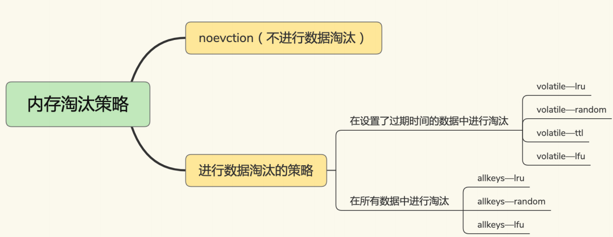

**noeviction策略：**不淘汰数据，一旦缓存写满，Redis不在提供服务，直接返回错误。一般不用着这个策略。

使用 EXPIRE 命令对一批键值对设置了过期时间后，无论是这些键值对的过期时间是快到了，还是 Redis 的内存使用量达到了 maxmemory 阈值，Redis 都会进一步按照 volatile-ttl、volatile-random、volatile-lru、volatile-lfu 这四种策略的具体筛选规则进行淘汰。

- volatile-ttl 在筛选时，会针对设置了过期时间的键值对，根据过期时间的先后进行删除，越早过期的越先被删除。
- volatile-random 就像它的名称一样，在设置了过期时间的键值对中，进行随机删除。
- volatile-lru 会使用 LRU 算法筛选设置了过期时间的键值对。
- volatile-lfu 会使用 LFU 算法选择设置了过期时间的键值对。

allkeys-lru、allkeys-random、allkeys-lfu 这三种淘汰策略的备选淘汰数据范围，就扩大到了所有键值对，无论这些键值对是否设置了过期时间。它们筛选数据进行淘汰的规则是：

- allkeys-random 策略，从所有键值对中随机选择并删除数据；
- allkeys-lru 策略，使用 LRU 算法在所有数据中进行筛选。
- allkeys-lfu 策略，使用 LFU 算法在所有数据中进行筛选。

​	LRU 算法在实际实现时，需要用链表管理所有的缓存数据，这会**带来额外的空间开销**。而且，当有数据被访问时，需要在链表上把该数据移动到 MRU 端，如果有大量数据被访问，就会带来很多链表移动操作，会很耗时，进而会降低 Redis 缓存性能。

​	在 Redis 中，LRU 算法被做了简化，以减轻数据淘汰对缓存性能的影响。具体来说，Redis 默认会记录每个数据的最近一次访问的时间戳（由键值对数据结构RedisObject 中的 lru 字段记录）。然后，Redis 在决定淘汰的数据时，第一次会随机选出N 个数据，把它们作为一个候选集合。接下来，Redis 会比较这 N 个数据的 lru 字段，把lru 字段值最小的数据从缓存中淘汰出去。

​	当需要再次淘汰数据时，Redis 需要挑选数据进入第一次淘汰时创建的候选集合。这儿的挑选标准是：**能进入候选集合的数据的 lru 字段值必须小于候选集合中最小的 lru 值**。当有新数据进入候选数据集后，如果候选数据集中的数据个数达到了 maxmemorysamples，Redis 就把候选数据集中 lru 字段值最小的数据淘汰出去。这样一来，Redis 缓存不用为所有的数据维护一个大链表，也不用在每次数据访问时都移动链表项，提升了缓存的性能。

**使用建议**

- **优先使用 allkeys-lru 策略**。这样，可以充分利用 LRU 这一经典缓存算法的优势，把最近最常访问的数据留在缓存中，提升应用的访问性能。如果你的业务数据中有明显的冷热数据区分，我建议你使用 allkeys-lru 策略。如果业务应用中的数据访问频率相差不大，没有明显的冷热数据区分，建议使用allkeys-random 策略，随机选择淘汰的数据就行。
- **如果你的业务中有置顶的需求**，比如置顶新闻、置顶视频，那么，可以使用 volatile-lru策略，同时不给这些置顶数据设置过期时间。这样一来，这些需要置顶的数据一直不会被删除，而其他数据会在过期时根据 LRU 规则进行筛选。

**如何处理被淘汰的数据？**

​	一旦被淘汰的数据选定后，如果这个数据是干净数据，就直接删除；如果这个数据是脏数据，需要把它写回数据库。

​	干净数据和脏数据的区别就在于，和最初从后端数据库里读取时的值相比，有没有被修改过。干净数据一直没有被修改，所以后端数据库里的数据也是最新值。在替换时，它可以被直接删除。而脏数据就是曾经被修改过的，已经和后端数据库中保存的数据不一致了。此时，如果不把脏数据写回到数据库中，这个数据的最新值就丢失了，就会影响应用的正常使用。

​	对于 Redis 来说，它决定了被淘汰的数据后，会把它们删除。即使淘汰的数据是脏数据，Redis 也不会把它们写回数据库。所以，我们在使用 Redis 缓存时，如果数据被修改了，需要在数据修改时就将它写回数据库。否则，这个脏数据被淘汰时，会被 Redis 删除，而数据库里也没有最新的数据了。

## 25. 缓存异常（上）：如何解决缓存和数据库的数据不一致问题？

**缓存和数据库的数据不一致是如何发生的？**

​	一致性包含了两种情况：数据中有数据，缓存的数据值需要和数据库中的值相同；缓存中没有数据，数据库中的值必须是最新值。不符合这两种情况的，就属于缓存和数据库的数据不一致问题了。但是，当缓存的读写模式不同时，缓存数据不一致的发生情况不一样。

​	对于读写缓存来说，如果要对数据进行增删改，就需要在缓存中进行，同时还要根据采取的写回策略，决定是否同步写回到数据库中。

- 同步直写策略：写缓存时，也同步写数据库，缓存和数据库中的数据一致；
- 异步写回策略：写缓存时不同步写数据库，等到数据从缓存中淘汰时，再写回数据库。使用这种策略时，如果数据还没有写回数据库，缓存就发生了故障，那么，此时，数据库就没有最新的数据了。

对于只读缓存来说，会直接写入数据库；而有数据删改时，就需要把只读缓存中的数据标记为无效。应用后续再访问这些增删改的数据时，因为缓存中没有相应的数据，就会发生缓存缺失。此时，应用再从数据库中把数据读入缓存，这样后续再访问数据时，就能够直接从缓存中读取了。

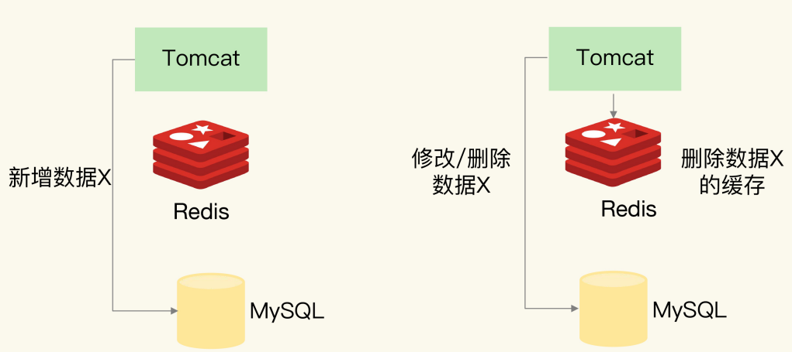

分析过程中出现数据不一致的情况。

**1.新增数据**

​	如果是新增数据，数据会直接写到数据库中，不用对缓存做任何操作，此时，缓存中本身就没有新增数据，而数据库中是最新值，这种情况符合我们刚刚所说的一致性的第 2 种情况，所以，此时，缓存和数据库的数据是一致的。

**2.删改数据**

​	如果发生删改操作，应用既要更新数据库，也要在缓存中删除数据。这两个操作如果无法保证原子性，也就是说，要不都完成，要不都没完成，此时，就会出现数据不一致问题。

- 假设应用先删除缓存，再更新数据库，如果缓存删除成功，但是数据库更新失败，那么，应用再访问数据时，缓存中没有数据，就会发生缓存缺失。然后，应用再访问数据库，但是数据库中的值为旧值，应用就访问到旧值了。


- 先更新数据库，再删除缓存中的值。如果应用先完成了数据库的更新，但是，在删除缓存时失败了，那么，数据库中的值是新值，而缓存中的是旧值，这肯定是不一致的。这个时候，如果有其他的并发请求来访问数据，按照正常的缓存访问流程，就会先在缓存中查询，但此时，就会读到旧值了。

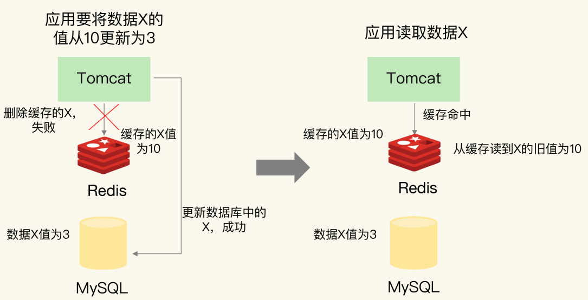


**如何解决数据不一致问题？**

​	第一种方法：重试机制。可以把要删除的缓存值或者是要更新的数据库值暂存到消息队列中（例如使用Kafka 消息队列）。当应用没有能够成功地删除缓存值或者是更新数据库值时，可以从消息队列中重新读取这些值，然后再次进行删除或更新。如果能够成功地删除或更新，我们就要把这些值从消息队列中去除，以免重复操作，此时，我们也可以保证数据库和缓存的数据一致了。否则的话，我们还需要再次进行重试。如果重试超过的一定次数，还是没有成功，我们就需要向业务层发送报错信息了。

​	下图显示了先更新数据库，再删除缓存值时，如果缓存删除失败，再次重试后删除成功的情况。


实际上，即使这两个操作第一次执行时都没有失败，当有大量并发请求时，应用还是有可能读到不一致的数据。按照不同的删除和更新顺序，分成两种情况来看。

**情况一：先删除缓存，再更新数据库**

​	假设线程 A 删除缓存值后，还没有来得及更新数据库（比如说有网络延迟），线程 B 就开始读取数据了，那么这个时候，线程 B 会发现缓存缺失，就只能去数据库读取。这会带来两个问题：

1. 线程 B 读取到了旧值；
2. 线程 B 是在缓存缺失的情况下读取的数据库，所以，它还会把旧值写入缓存，这可能会导致其他线程从缓存中读到旧值。

​	等到线程 B 从数据库读取完数据、更新了缓存后，线程 A 才开始更新数据库，此时，缓存中的数据是旧值，而数据库中的是最新值，两者就不一致了。用表汇总这种情况。


​	解决方案：**在线程 A 更新完数据库值以后，我们可以让它先 sleep 一小段时间，再进行一次缓存删除操作。**以要加上 sleep 的这段时间，就是为了让线程 B 能够先从数据库读取数据，再把缺失的数据写入缓存，然后，线程 A 再进行删除。当其它线程读取数据时，会发现缓存缺失，所以会从数据库中读取最新值。因为这个方案会在第一次删除缓存值后，延迟一段时间再次进行删除，所以我们也把它叫做“延迟双删”。

**情况二：先更新数据库值，再删除缓存值**

​	如果线程 A 删除了数据库中的值，但还没来得及删除缓存值，线程 B 就开始读取数据了，那么此时，线程 B 查询缓存时，发现缓存命中，就会直接从缓存中读取旧值。不过，在这种情况下，如果其他线程并发读缓存的请求不多，那么，就不会有很多请求读取到旧值。而且，线程 A 一般也会很快删除缓存值，这样一来，其他线程再次读取时，就会发生缓存缺失，进而从数据库中读取最新值。所以，这种情况对业务的影响较小。画一张表，带你总结下先更新数据库、再删除缓存值的情况。

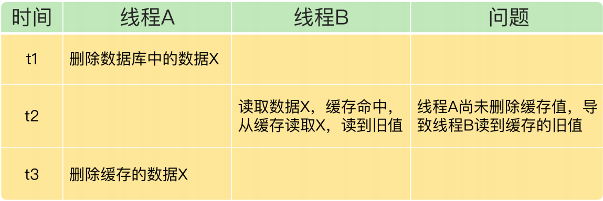

**小结**


​	针对只读缓存来说，我们既可以先删除缓存值再更新数据库，也可以先更新数据库再删除缓存。我的建议是，**优先使用先更新数据库再删除缓存的方法**，原因主要有两个：

1. 先删除缓存值再更新数据库，有可能导致请求因缓存缺失而访问数据库，给数据库带来压力；
2. 如果业务应用中读取数据库和写缓存的时间不好估算，那么，延迟双删中的等待时间就不好设置。

不过，当使用先更新数据库再删除缓存时，也有个地方需要注意，**如果业务层要求必须读取一致的数据，那么，我们就需要在更新数据库时，先在 Redis 缓存客户端暂存并发读请求，等数据库更新完、缓存值删除后，再读取数据，从而保证数据一致性。**

## 26. 缓存异常（下）：如何解决缓存雪崩、击穿、穿透难题？

**缓存雪崩**

​	缓存雪崩是指大量的应用请求无法在 Redis 缓存中进行处理，紧接着，应用将大量请求发送到数据库层，导致数据库层的压力激增。缓存雪崩一般是由两个原因导致的，应对方案也有所不同。

​	第一种：缓存中有大量数据同时过期，导致大量请求无法得到处理。当数据保存在缓存中，并且设置了过期时间时，如果在某一个时刻，大量数据同时过期，此时，应用再访问这些数据的话，就会发生缓存缺失。紧接着，应用就会把请求发送给数据库，从数据库中读取数据。如果应用的并发请求量很大，那么数据库的压力也就很大，这会进一步影响到数据库的其他正常业务请求处理。解决方案，第一种是微调过期时间，可以避免给大量的数据设置相同的过期时间。如果业务层的确要求有些数据同时失效，可以在用 EXPIRE 命令给每个数据设置过期时间时，给这些数据的过期时间增加一个较小的随机数（例如，随机增加 1~3 分钟），这样一来，不同数据的过期时间有所差别，但差别又不会太大，既避免了大量数据同时过期，同时也保证了这些数据基本在相近的时间失效，仍然能满足业务需求。第二种解决方法是通过**服务降级**，来应对缓存雪崩。所谓的服务降级，是指发生缓存雪崩时，针对不同的数据采取不同的处理方式。当业务应用访问的是非核心数据（例如电商商品属性）时，暂时停止从缓存中查询这些数据，而是直接返回预定义信息、空值或是错误信息；当业务应用访问的是核心数据（例如电商商品库存）时，仍然允许查询缓存，如果缓存缺失，也可以继续通过数据库读取。

​	第二种：Redis缓存实例发生故障宕机，无法处理请求，会导致大量请求一下子积压到数据库层，从而发生缓存雪崩。一个 Redis 实例可以支持数万级别的请求处理吞吐量，而单个数据库可能只能支持数千级别的请求处理吞吐量，它们两个的处理能力可能相差了近十倍。因此，需要通过其他方法来应对缓存雪崩。

​	方案一：**在业务系统中实现服务熔断或请求限流机制**，所谓的服务熔断，是指在发生缓存雪崩时，为了防止引发连锁的数据库雪崩，甚至是整个系统的崩溃，我们暂停业务应用对缓存系统的接口访问。再具体点说，就是业务应用调用缓存接口时，缓存客户端并不把请求发给 Redis 缓存实例，而是直接返回，等到 Redis 缓存实例重新恢复服务后，再允许应用请求发送到缓存系统。在业务系统运行时，我们可以监测 Redis 缓存所在机器和数据库所在机器的负载指标，例如每秒请求数、CPU 利用率、内存利用率等。如果我们发现 Redis 缓存实例宕机了，而数据库所在机器的负载压力突然增加（例如每秒请求数激增），此时，就发生缓存雪崩了。大量请求被发送到数据库进行处理。我们可以启动服务熔断机制，暂停业务应用对缓存服务的访问，从而降低对数据库的访问压力。服务熔断虽然可以保证数据库的正常运行，但是暂停了整个缓存系统的访问，对业务应用的影响范围大。为了尽可能减少这种影响，我们也可以进行请求限流。这里说的请求限流，就是指，我们在业务系统的请求入口前端控制每秒进入系统的请求数，避免过多的请求被发送到数据库。假设业务系统正常运行时，请求入口前端允许每秒进入系统的请求是 1万个，其中，9000 个请求都能在缓存系统中进行处理，只有 1000 个请求会被应用发送到数据库进行处理。此时，我们就可以启动请求限流机制，在请求入口前端只允许每秒进入系统的请求数为 1000 个，再多的请求就会在入口前端被直接拒绝服务。所以，使用了请求限流，就可以避免大量并发请求压力传递到数据库层。

​	Redis缓存实例发生故障宕机的第二个解决方案是事前预防。通过主从节点的方式构建 Redis 缓存高可靠集群。如果 Redis 缓存的主节点故障宕机了，从节点还可以切换成为主节点，继续提供缓存服务，避免了由于缓存实例宕机而导致的缓存雪崩问题。

**缓存击穿**

​	缓存击穿是指，针对某个访问非常频繁的热点数据的请求，无法在缓存中进行处理，紧接着，访问该数据的大量请求，一下子都发送到了后端数据库，导致了数据库压力激增，会影响数据库处理其他请求。缓存击穿的情况，经常发生在热点数据过期失效时。解决方法：对于访问特别频繁的热点数据，我们就不设置过期时间了。

**缓存穿透**

​	缓存穿透是指要访问的数据既不在 Redis 缓存中，也不在数据库中，导致请求在访问缓存时，发生缓存缺失，再去访问数据库时，发现数据库中也没有要访问的数据。此时，应用也无法从数据库中读取数据再写入缓存，来服务后续请求，这样一来，缓存也就成了“摆设”，如果应用持续有大量请求访问数据，就会同时给缓存和数据库带来巨大压力。

​	缓存穿透发生时机：

- 业务层误操作：缓存中的数据和数据库中的数据被误删除了，所以缓存和数据库中都没有数据；
- 恶意攻击：专门访问数据库中没有的数据。

应对方案：

**一、缓存空值或缺省值**

​	在 Redis 中缓存一个空值或是和业务层协商确定的缺省值（例如，库存的缺省值可以设为 0）。紧接着，应用发送的后续请求再进行查询时，就可以直接从 Redis 中读取空值或缺省值，返回给业务应用了。

**二、使用布隆过滤器快速判断数据是否存在，避免从数据库中查询数据是否存在**

​	布隆过滤器由一个初值都为 0 的 bit 数组和 N 个哈希函数组成，可以用来快速判断某个数据是否存在。当我们想标记某个数据存在时（例如，数据已被写入数据库），布隆过滤器会通过三个操作完成标记：如果数据不存在（例如，数据库里没有写入数据），我们也就没有用布隆过滤器标记过数据，那么，bit 数组对应 bit 位的值仍然为 0。当需要查询某个数据时，我们就执行刚刚说的计算过程，先得到这个数据在 bit 数组中对应的 N 个位置。紧接着，我们查看 bit 数组中这 N 个位置上的 bit 值。只要这 N 个 bit 值有一个不为 1，这就表明布隆过滤器没有对该数据做过标记，所以，查询的数据一定没有在数据库中保存。为了便于你理解，我画了一张图，你可以看下。首先，使用 N 个哈希函数，分别计算这个数据的哈希值，得到 N 个哈希值。然后，我们把这 N 个哈希值对 bit 数组的长度取模，得到每个哈希值在数组中的对应位置。最后，我们把对应位置的 bit 位设置为 1，这就完成了在布隆过滤器中标记数据的操作。

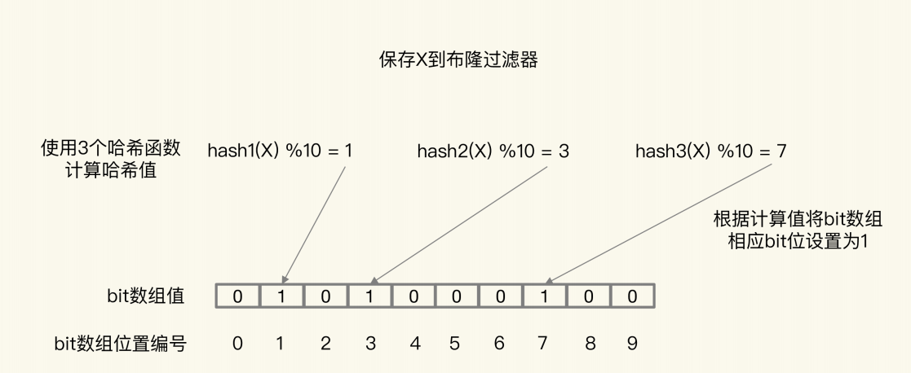

**三、在请求入口的前端进行请求检测**

最后一种方案是，在请求入口的**前端进行请求检测。**缓存穿透的一个原因是有大量的恶意请求访问不存在的数据，所以，一个有效的应对方案是在请求入口前端，对业务系统接收到的请求进行合法性检测，把恶意的请求（例如请求参数不合理、请求参数是非法值、请求字段不存在）直接过滤掉，不让它们访问后端缓存和数据库。这样一来，也就不会出现缓存穿透问题了。

**小结**


​	服务熔断、服务降级、请求限流这些方法都是属于“有损”方案，在保证数据库和整体系统稳定的同时，会对业务应用带来负面影响。例如使用服务降级时，有部分数据的请求就只能得到错误返回信息，无法正常处理。如果使用了服务熔断，那么，整个缓存系统的服务都被暂停了，影响的业务范围更大。而使用了请求限流机制后，整个业务系统的吞吐率会降低，能并发处理的用户请求会减少，会影响到用户体验。所以，尽量使用预防式方案：针对缓存雪崩，合理地设置数据过期时间，以及搭建高可靠缓存集群；针对缓存击穿，在缓存访问非常频繁的热点数据时，不要设置过期时间；针对缓存穿透，提前在入口前端实现恶意请求检测，或者规范数据库的数据删除操作，避免误删除。

## 27. 缓存被污染了，该怎么办？

**缓存污染**

​	在一些场景下，有些数据被访问的次数非常少，甚至只会被访问一次。当这些数据服务完访问请求后，如果还继续留存在缓存中的话，就只会白白占用缓存空间。

**如何解决缓存污染**

​	把不会再被访问的数据筛选出来并淘汰掉，由缓存的淘汰策略决定。

​	 **volatile-random 和 allkeys-random** 这两种策略。它们都是采用随机挑选数据的方式，来筛选即将被淘汰的数据。随机挑选，就不会根据数据的访问情况来筛选数据，所以这两种策略在避免缓存污染整个问题上的效果非常有限。

​	**volatile-ttl策略：**针对设置了过期时间的数据，把这些数据中剩余存活时间最短的筛选出来并淘汰掉。剩余存活时间并不能直接反映数据再次访问的情况，也可能出现数据被淘汰后，被再次访问导致的缓存缺失问题。在明确知道数据再次访问的情况，可以根据访问情况设置过期时间。业务部门知道数据被访问的时长就是一个小时，并把数据的过期时间设置为一个小时后。

​	**小结：**除了在明确知道数据被再次访问的情况下，volatile-ttl 可以有效避免缓存污染。在其他情况下，volatile-random、allkeys-random、volatile-ttl 这三种策略并不能应对缓存污染问题。

​	**LRU缓存策略：**LRU 策略的确能有效留存访问时间最近的数据。**因为只看数据的访问时间，使用 LRU 策略在处理扫描式单次查询操作时，无法解决缓存污染**。所谓的扫描式单次查询操作，就是指应用对大量的数据进行一次全体读取，每个数据都会被读取，而且只会被读取一次。此时，因为这些被查询的数据刚刚被访问过，所以 lru 字段值都很大。在使用 LRU 策略淘汰数据时，这些数据会留存在缓存中很长一段时间，造成缓存污染。如果查询的数据量很大，这些数据占满了缓存空间，却又不会服务新的缓存请求，此时，再有新数据要写入缓存的话，还是需要先把这些旧数据替换出缓存才行，这会影响缓存的性能。

​	**LFU缓存策略的优化：**LFU 缓存策略是在 LRU 策略基础上，为每个数据增加了一个计数器，来统计这个数据的访问次数。当使用 LFU 策略筛选淘汰数据时，首先会根据数据的访问次数进行筛选，把访问次数最低的数据淘汰出缓存。如果两个数据的访问次数相同，LFU 策略再比较这两个数据的访问时效性，把距离上一次访问时间更久的数据淘汰出缓存。扫描式单次查询的数据因为不会被再次访问，所以它们的访问次数不会再增加。因此，LFU 策略会优先把这些访问次数低的数据淘汰出缓存。

## 28. Pika：如何基于SSD实现大容量Redis？

​	基于大内存的大容量实例在实例恢复、主从同步过程中会引起一系列潜在问题，例如恢复时间增长、主从切换开销大、缓冲区易溢出。推荐使用固态硬盘，成本低，容量大，读写速度快。

​	360公司DBA和基础架构组联合开发的Pika键值数据库，实现了基于SSD实现的大容量Redis实例。Pika有两个目标：一是，单实例可以保存大容量数据，同时避免了实例恢复和主从同步时的潜在问题；二是，和 Redis 数据类型保持兼容，可以支持使用Redis 的应用平滑地迁移到 Pika 上。所以，，想使用 SSD来扩展Redis单实例容量，Pika 就是一个很好的选择。

**大内存Redis实例的潜在问题**

​	Redis 使用内存保存数据，内存容量增加后，就会带来两方面的潜在问题，分别是，内存快照 RDB 生成和恢复效率低，以及主从节点全量同步时长增加、缓冲区易溢出。

​	内存快照 RDB 受到的影响：内存大小和内存快照 RDB 的关系是非常直接的：实例内存容量大，RDB 文件也会相应增大，那么，RDB 文件生成时的 fork 时长就会增加，这就会导致 Redis 实例阻塞。而且，RDB 文件增大后，使用 RDB 进行恢复的时长也会增加，会导致 Redis 较长时间无法对外提供服务。

​	主从同步收到的影响：主从节点间的同步的第一步就是要做全量同步。全量同步是主节点生成 RDB 文件，并传给从节点，从节点再进行加载。试想一下，如果 RDB 文件很大，肯定会导致全量同步的时长增加，效率不高，而且还可能会导致复制缓冲区溢出。一旦缓冲区溢出了，主从节点间就会又开始全量同步，影响业务应用的正常使用。如果增加复制缓冲区的容量，又会消耗内存资源。

​	此外，如果主库发生了故障，进行主从切换后，其他从库都需要和新主库进行一次全量同步。如果 RDB 文件很大，也会导致主从切换的过程耗时增加，同样会影响业务的可用性。

**Pika的整体架构**

​	Pika 键值数据库的整体架构中包括了五部分，分别是网络框架、Pika 线程模块、Nemo 存储模块、RocksDB 和 binlog 机制，如下图所示：


​	**网络框架：**网络框架主要负责底层网络请求的接收和发送。Pika 的网络框架是对操作系统底层的网络函数进行了封装。

​	**Pika线程模块：**Pika 线程模块采用了多线程模型来具体处理客户端请求，包括一个请求分发线程（DispatchThread）、一组工作线程（WorkerThread）以及一个线程池（ThreadPool）。请求分发线程专门监听网络端口，一旦接收到客户端的连接请求后，就和客户端建立连接，并把连接交由工作线程处理。工作线程负责接收客户端连接上发送的具体命令请求，并把命令请求封装成 Task，再交给线程池中的线程，由这些线程进行实际的数据存取处理，如下图所示：

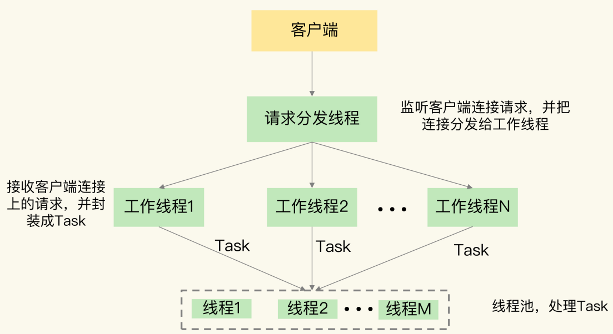

可以通过增加工作线程数和线程池中的线程数提升Pika的请求处理吞吐率。

​	**Nemo模块：**实现了Pika和Redis的数据类型兼容。把Reids服务迁移到Pika时，不用修改业务中Redis的代码。

​	**RocksDB：**提供基于SSD保存数据的功能。使得Pika可以不用大容量的内存保存更多数据，可以避免内存快照。Piak使用binlog记录写命令，用于主从节点的命令同步，避免大内存实例的问题。

**Pika如何基于SSD保存更多数据？**

## 29. 无锁的原子操作：Redis如何应对并发访问？

为了保证并发访问的正确性，Redis 提供了两种方法，分别是加锁和原子操作。

**加锁的两个问题：**

1. 如果加锁操作多，会降低系统的并发访问性能；
2. Redis 客户端要加锁时，需要用到分布式锁，而分布式锁实现复杂，需要用额外的存储系统来提供加解锁操作。

**并发访问中需要对什么进行控制？**

需要控制错做同一份数据的过程。

客户端修改数据流程：

1. 客户端先把数据读取到本地，在本地进行修改；
2. 客户端修改完数据后，再写回Redis。

**举例：对商品库存执行减1操作**

```c++
current = GET(id)
--current
SET(id, current)
```

**Redis的两种原子操作方法：**

1. 把多个操作在 Redis 中实现成一个操作，也就是单命令操作，Redis提供了INCR/DECR命令对数据进行增值/减值操作。
2. 把多个操作写到一个 Lua 脚本中，以原子性方式执行单个 Lua 脚本。

如果把很多操作都放在 Lua 脚本中原子执行，会导致 Redis 执行脚本的时间增加，同样也会降低 Redis 的并发性能。所以，我给你一个小建议：**在编写 Lua脚本时，你要避免把不需要做并发控制的操作写入脚本中**。

## 30. 如何使用Redis实现分布式锁？

**单机上的锁和分布式锁的联系与区别：**

​	单机上的锁可以用一个变量来实现。分布式锁同样可以**用一个变量来实现**。在分布式场景下，**锁变量需要由一个共享存储系统来维护**，只有这样，多个客户端才可以通过访问共享存储系统来访问锁变量。相应的**加锁和释放锁的操作就变成了读取、判断和设置共享存储系统中的锁变量值**。

**分布式锁的要求：**

- 分布式锁的加锁和释放锁的过程，涉及多个操作。所以，在实现分布式锁时，我们需要保证这些锁操作的原子性；
- 共享存储系统保存了锁变量，如果共享存储系统发生故障或宕机，那么客户端也就无法进行锁操作了。在实现分布式锁时，我们需要考虑保证共享存储系统的可靠性，进而保证锁的可靠性。

**基于单个Redis节点实现分布式锁**

 SETNX 命令，它用于设置键值对的值。具体来说，就是这个命令在执行时会判断键值对是否存在，如果不存在，就设置键值对的值，如果存在，就不做任何设置。

```c++
SETNX key value
DEL key
```

​	**给锁变量设置一个过期时间**。这样一来，即使持有锁的客户端发生了异常，无法主动地释放锁，Redis 也会根据锁变量的过期时间，在锁变量过期后，把它删除。

​	防止客户端A把客户端B上的锁释放了，需要区分来自不同客户端的锁操作。在加锁操作时，可以让每个客户端给锁变量设置一个唯一值，这里的唯一值就可以用来标识当前操作的客户端。在释放锁操作时，客户端需要判断，当前锁变量的值是否和自己的唯一标识相等，只有在相等的情况下，才能释放锁。这样释放锁的时候需要判断锁变量的值，所以需要lua脚本保证原子操作。

```c++
if redis.call("get",KEYS[1]) == ARGV[1] then
    return redis.call("del",KEYS[1])
else 
   	return 0
end
```

**基于Redis节点实现高可靠的分布式锁：**

**分布式锁算法Redlock：**

Redlock 算法的基本思路，是让客户端和多个独立的 Redis 实例依次请求加锁，如果客户端能够和半数以上的实例成功地完成加锁操作，那么我们就认为，客户端成功地获得分布式锁了，否则加锁失败。这样一来，即使有单个 Redis 实例发生故障，因为锁变量在其它实例上也有保存，所以，客户端仍然可以正常地进行锁操作，锁变量并不会丢失。

**Redlock步骤：**

1. 客户端获取当前时间
2. 客户端按顺序依次向N个Redis实例执行加锁操作，这个加锁操作和在单实例上一样，需要给加锁操作设置超时时间，如果客户端和某个Redis实例请求加锁时超时了，客户端就和下一个Redis实例继续请求加锁。
3. **一旦客户端完成了和所有 Redis 实例的加锁操作，客户端就要计算整个加锁过程的总耗时。**

客户端满足两个条件，才认为加锁成功：

1. 客户端从超过半数（大于等于 N/2+1）的 Redis 实例上成功获取到了锁；
2. 客户端获取锁的总耗时没有超过锁的有效时间。

没能同时满足这两个条件，那么，客户端向所有 Redis 节点发起释放锁的操作。

​	在满足了这两个条件后，我们需要重新计算这把锁的有效时间，计算的结果是锁的最初有效时间减去客户端为获取锁的总耗时。如果锁的有效时间已经来不及完成共享数据的操作了，我们可以释放锁，以免出现还没完成数据操作，锁就过期了的情况。

## 31. 事务机制：Redis能实现ACID属性吗？

**Redis如何实现事务？**

事务的执行过程包含三个步骤，Redis 提供了 MULTI、EXEC 两个命令来完成这三个步骤。

1. 客户端要使用一个命令显式地表示一个事务的开启，在 Redis 中，这个命令就是MULTI。
2. 客户端把事务中本身要执行的具体操作（例如增删改数据）发送给服务器端。这些操作就是 Redis 本身提供的数据读写命令，例如 GET、SET 等。不过，这些命令虽然被客户端发送到了服务器端，但 Redis 实例只是把这些命令暂存到一个命令队列中，并不会立即执行。
3. 客户端向服务器端发送提交事务的命令，让数据库实际执行第二步中发送的具体操作。Redis 提供的 **EXEC 命令**就是执行事务提交的。当服务器端收到 EXEC 命令后，才会实际执行命令队列中的所有命令。

**Redis的事务机制能保证哪些属性？**

**原子性：**

- 命令入队时就报错，例如语法错误，会放弃事务执行，保证原子性；
- 命令入队时没报错，例如命令和操作的数据类型不匹配，实际执行时报错，会有一部分命令成功，一部分失败，不保证原子性，而且不能回滚；
- EXEC 命令执行时实例故障，如果开启了 AOF 日志，可以把已完成的事务擦欧总从AOF文件中去除，可以保证原子性。

**一致性：**

​	事务的一致性保证会受到错误命令、实例故障的影响。所以，我们按照命令出错和实例故障的发生时机，分成三种情况来看。

**情况一：命令入队时就报错**

​	在这种情况下，事务本身就会被放弃执行，所以可以保证数据库的一致性。

**情况二：命令入队时没报错，实际执行时报错**

​	在这种情况下，有错误的命令不会被执行，正确的命令可以正常执行，也不会改变数据库的一致性。

**情况三：EXEC命令执行时实例发生故障**

​	在这种情况下，实例故障后会进行重启，这就和数据恢复的方式有关了，我们要根据实例是否开启了 RDB 或 AOF 来分情况讨论下。

​	如果我们没有开启 RDB 或 AOF，那么，实例故障重启后，数据都没有了，数据库是一致的。

​	如果我们使用了 RDB 快照，因为 RDB 快照不会在事务执行时执行，所以，事务命令操作的结果不会被保存到 RDB 快照中，使用 RDB 快照进行恢复时，数据库里的数据也是一致的。

​	如果我们使用了 AOF 日志，而事务操作还没有被记录到 AOF 日志时，实例就发生了故障，那么，使用 AOF 日志恢复的数据库数据是一致的。如果只有部分操作被记录到了AOF 日志，我们可以使用 redis-check-aof 清除事务中已经完成的操作，数据库恢复后也是一致的。

​	所以，总结来说，在命令执行错误或 Redis 发生故障的情况下，Redis 事务机制对一致性属性是有保证的。接下来，我们再继续分析下隔离性。

**隔离性：**

事务的隔离性保证，会受到和事务一起执行的并发操作的影响。而事务执行又可以分成命令入队（EXEC 命令执行前）和命令实际执行（EXEC 命令执行后）两个阶段，所以，我们就针对这两个阶段，分成两种情况来分析：

1. 并发操作在 EXEC 命令前执行，此时，隔离性的保证要使用 WATCH 机制来实现，否则隔离性无法保证；

2. 并发操作在 EXEC 命令后执行，此时，隔离性可以保证。

​	一个事务的 EXEC 命令还没有执行时，事务的命令操作是暂存在命令队列中的。此时，如果有其它的并发操作，我们就需要看事务是否使用了 WATCH 机制。WATCH 机制的作用是，在事务执行前，监控一个或多个键的值变化情况，当事务调用EXEC 命令执行时，WATCH 机制会先检查监控的键是否被其它客户端修改了。如果修改了，就放弃事务执行，避免事务的隔离性被破坏。然后，客户端可以再次执行事务，此时，如果没有并发修改事务数据的操作了，事务就能正常执行，隔离性也得到了保证。

​	因为 Redis 是用单线程执行命令，而且，EXEC 命令执行后，Redis 会保证先把命令队列中的所有命令执行完。所以，在并发操作在 EXEC 命令后执行的情况下，并发操作不会破坏事务的隔离性。

**持久性：**

​	因为 Redis 是内存数据库，所以，数据是否持久化保存完全取决于 Redis 的持久化配置模式。

​	如果 Redis 没有使用 RDB 或 AOF，那么事务的持久化属性肯定得不到保证。

​	如果 Redis使用了 RDB 模式，那么，在一个事务执行后，而下一次的 RDB 快照还未执行前，如果发生了实例宕机，这种情况下，事务修改的数据也是不能保证持久化的。

​	如果 Redis 采用了 AOF 模式，因为 AOF 模式的三种配置选项 no、everysec 和 always都会存在数据丢失的情况，所以，事务的持久性属性也还是得不到保证。

所以，不管 Redis 采用什么持久化模式，事务的持久性属性是得不到保证的。

## 32. Redis主从同步与故障切换，有哪些坑？

介绍3个坑，分别是**主从数据不一致、读到过期数据，以及配置项设置得不合理从而导致服务挂掉**。

**主从数据不一致：**

指客户端从从库中读取到的值和主库中的最新值并不一致，是因为**主从库间的命令复制是异步进行的**。

从库滞后执行命令的情况：

1. 主从库间的网络可能会有传输延迟，所以从库不能及时地收到主库发送的命令，从库上执行同步命令的时间就会被延后。
2. 即使从库及时收到了主库的命令，但是，也可能会因为正在处理其它复杂度高的命令（例如集合操作命令）而阻塞。此时，从库需要处理完当前的命令，才能执行主库发送的命令操作，这就会造成主从数据不一致。

解决方法：

1. **在硬件环境配置方面，我们要尽量保证主从库间的网络连接状况良好**。例如，我们要避免把主从库部署在不同的机房，或者是避免把网络通信密集的应用（例如数据分析应用）和 Redis 主从库部署在一起。
2. **我们还可以开发一个外部程序来监控主从库间的复制进度**。如果某个从库的进度差值大于我们预设的阈值，我们可以让客户端不再和这个从库连接进行数据读取，这样就可以减少读到不一致数据的情况。不过，为了避免出现客户端和所有从库都不能连接的情况，我们需要把复制进度差值的阈值设置得大一些。

**读到过期数据：**

​	我们在使用 Redis 主从集群时，有时会读到过期数据。例如，数据 X 的过期时间是202010240900，但是客户端在 202010240910 时，仍然可以从从库中读到数据 X。一个数据过期后，应该是被删除的，客户端不能再读取到该数据，但是，Redis 为什么还能在从库中读到过期的数据呢？其实，这是由 Redis 的过期数据删除策略引起的。

​	无论是定期删除还是惰性删除，都会有过期数据留存。如果客户端从主库上读取留存的过期数据，主库会触发删除操作，此时，客户端并不会读到过期数据。但是，从库本身不会执行删除操作，如果客户端在从库中访问留存的过期数据，从库并不会触发数据删除。3.2版本之后，如果读取的数据已经过期了，从库虽然不会删除，但是会返回空值。3.2版本之后还是可能读到过期数据，这跟 Redis 用于设置过期时间的命令有关系，有些命令给数据设置的过期时间在从库上可能会被延后，导致应该过期的数据又在从库上被读取到了。

**不合理配置项导致的服务挂掉：**

**protected-mode配置项：**

这个配置项的作用是限定哨兵实例能否被其他服务器访问。当这个配置项设置为 yes 时，哨兵实例只能在部署的服务器本地进行访问。当设置为 no 时，其他服务器也可以访问这个哨兵实例。所以要设置为no。

**cluster-node-timeout配置项：**

**这个配置项设置了 Redis Cluster 中实例响应心跳消息的超时时间**。如果执行主从切换的实例超过半数，而主从切换时间又过长的话，就可能有半数以上的实例心跳超时，从而可能导致整个集群挂掉。所以，**我建议你将 cluster-nodetimeout 调大些（例如 10 到 20 秒）**。

## 33. 脑裂：一次奇怪的数据丢失

**为什么会发生脑裂？**

脑裂会发生数据丢失，所以先弄明白数据为什么丢失。

第一步确认是不是数据同步出现了问题：

​	在主从集群中发生数据丢失，最常见的原因就是**主库的数据还没有同步到从库，结果主库发生了故障，等从库升级为主库后，未同步的数据就丢失了。**这种情况可以通过计算 `master_repl_offset` 和 `slave_repl_offset` 的差值判断是不是数据同步未完成导致的。

第二步：排查客户端的操作日志，发现脑裂现象

​	在主从切换后的一段时间内，有一个客户端仍然在和原主库通信，并没有和升级的新主库进行交互。这就相当于主从集群中同时有了两个主库。

第三步：发现是原主库假故障导致的脑裂

​	既然客户端仍然和原主库通信，这就表明，**原主库并没有真的发生故障**（例如主库进程挂掉）。我们猜测，主库是由于某些原因无法处理请求，也没有响应哨兵的心跳，才被哨兵错误地判断为客观下线的。结果，在被判断下线之后，原主库又重新开始处理请求了，而此时，哨兵还没有完成主从切换，客户端仍然可以和原主库通信，客户端发送的写操作就会在原主库上写入数据了。


**为什么脑裂会导致数据丢失？**

​	主从切换后，从库一旦升级为新主库，哨兵就会让原主库执行 slave of 命令，和新主库重新进行全量同步。而在全量同步执行的最后阶段，原主库需要清空本地的数据，加载新主库发送的 RDB 文件，这样一来，原主库在主从切换期间保存的新写数据就丢失了。

​	在主从切换的过程中，如果原主库只是“假故障”，它会触发哨兵启动主从切换，一旦等它从假故障中恢复后，又开始处理请求，这样一来，就会和新主库同时存在，形成脑裂。等到哨兵让原主库和新主库做全量同步后，原主库在切换期间保存的数据就丢失了。

**如何应对脑裂问题？**

`min-slaves-to-write`：这个配置项设置了主库能进行数据同步的最少从库数量；

`min-slaves-max-lag`：这个配置项设置了主从库间进行数据复制时，从库给主库发送ACK 消息的最大延迟（以秒为单位）。

​	即使原主库是假故障，它在假故障期间也无法响应哨兵心跳，也不能和从库进行同步，自然也就无法和从库进行 ACK 确认了。这样一来，min-slaves-to-write 和 min-slavesmax-lag 的组合要求就无法得到满足，原主库就会被限制接收客户端请求，客户端也就不能在原主库中写入新数据了。

​	等到新主库上线时，就只有新主库能接收和处理客户端请求，此时，新写的数据会被直接写到新主库中。而原主库会被哨兵降为从库，即使它的数据被清空了，也不会有新数据丢失。

## 34. 第23~33讲课后思考题答案及常见问题答疑

## 35. Codis VS Redis Cluster：我该选哪一个集群方案？

**Codis的整体框架和基本流程：**

Codis 集群中包含了 4 类关键组件。

- codis server：这是进行了二次开发的 Redis 实例，其中增加了额外的数据结构，支持数据迁移操作，主要负责处理具体的数据读写请求。
- codis proxy：接收客户端请求，并把请求转发给 codis server。
- Zookeeper 集群：保存集群元数据，例如数据位置信息和 codis proxy 信息。
- codis dashboard 和 codis fe：共同组成了集群管理工具。其中，codis dashboard 负责执行集群管理工作，包括增删 codis server、codis proxy 和进行数据迁移。而 codisfe 负责提供 dashboard 的 Web 操作界面，便于我们直接在 Web 界面上进行集群管理。


​	首先，为了让集群能接收并处理请求，我们要先使用 codis dashboard 设置 codis server和 codis proxy 的访问地址，完成设置后，codis server 和 codis proxy 才会开始接收连接。

​	然后，当客户端要读写数据时，客户端直接和 codis proxy 建立连接。你可能会担心，既然客户端连接的是 proxy，是不是需要修改客户端，才能访问 proxy？其实，你不用担心，codis proxy 本身支持 Redis 的 RESP 交互协议，所以，客户端访问 codis proxy时，和访问原生的 Redis 实例没有什么区别，这样一来，原本连接单实例的客户端就可以轻松地和 Codis 集群建立起连接了。

​	最后，codis proxy 接收到请求，就会查询请求数据和 codis server 的映射关系，并把请求转发给相应的 codis server 进行处理。当 codis server 处理完请求后，会把结果返回给codis proxy，proxy 再把数据返回给客户端。


**Codis的关键技术原理：**

**数据如何在集群里分布？**

​	在 Codis 集群中，一个数据应该保存在哪个 codis server 上，这是通过逻辑槽（Slot）映射来完成的，具体来说，总共分成两步。

​	第一步，Codis 集群一共有 1024 个 Slot，编号依次是 0 到 1023。我们可以把这些 Slot手动分配给 codis server，每个 server 上包含一部分 Slot。当然，我们也可以让 codisdashboard 进行自动分配，例如，dashboard 把 1024 个 Slot 在所有 server 上均分。

​	第二步，当客户端要读写数据时，会使用 CRC32 算法计算数据 key 的哈希值，并把这个哈希值对 1024 取模。而取模后的值，则对应 Slot 的编号。此时，根据第一步分配的 Slot和 server 对应关系，我们就可以知道数据保存在哪个 server 上了。

​	我们把 Slot 和 codis server 的映射关系称为数据路由表（简称路由表）。我们在 codisdashboard 上分配好路由表后，dashboard 会把路由表发送给 codis proxy，同时，dashboard 也会把路由表保存在 Zookeeper 中。codis-proxy 会把路由表缓存在本地，当它接收到客户端请求后，直接查询本地的路由表，就可以完成正确的请求转发了。

​	Codis 中的路由表是我们通过 codis dashboard 分配和修改的，并被保存在 Zookeeper集群中。一旦数据位置发生变化（例如有实例增减），路由表被修改了，codisdashbaord 就会把修改后的路由表发送给 codis proxy，proxy 就可以根据最新的路由信息转发请求了。

​	在 Redis Cluster 中，数据路由表是通过每个实例相互间的通信传递的，最后会在每个实例上保存一份。当数据路由信息发生变化时，就需要在所有实例间通过网络消息进行传递。所以，如果实例数量较多的话，就会消耗较多的集群网络资源。

**集群扩容和数据迁移如何进行？**


## 36. Redis支撑秒杀场景的关键技术和实践都有哪些？

秒杀场景的负载特征对支撑系统的要求：

- **瞬时并发访问量非常高**
- **读多写少，而且读操作是简单的查询操作：**用户需要先查验商品是否还有库存，只有库存有余量时，秒杀系统才能进行库存扣减和下单操作。只有少部分用户能成功下单，所以，商品库存查询操作（读操作）要远多于库存扣减和下单操作（写操作）。

**秒杀分为三个阶段：**

- **秒杀前：**用户会刷新页面，请求剧增。解决方案把商品页面元素静态化，然后使用CDN或者浏览器进行缓存。
- **秒杀开始：**这个阶段有三个操作：库存查验、库存扣减和订单处理。前两个操作用redis，订单处理用数据库。订单处理时只有少数人，请求压力不大而S且设计多张表需要事务，所以在数据库完成。如果把库存扣减放到数据库执行有两个问题：1. **额外的开销**，数据库和redis需要对库存量进行同步。2. **下单量超过实际库存量，出现超售**，数据库处理慢，redis更新不及时。
- **秒杀后：**请求已经下降，不讨论。

**秒杀场景对 Redis 操作的根本要求有两个：**

- **支持高并发：**`redis`天然支持，可以用切片集群，将不同商品的库存保存到不同的实例。注意一致性`hash`。
- **保证库存查验和库存扣减原子执行：**使用`redis`原子操作或者分布式锁实现。

**保证库存查验和库存扣减原子执行：**

因为库存查验和库存扣减这两个操作要保证一起执行，**一个直接的方法就是使用 Redis 的原子操作**。

- **基于原子操作支撑秒杀场景：**原子操作可以是自身提供的原子命令，或者是`Lua`脚本。
- **基于分布式锁来支撑秒杀场景：**使用分布式锁来支撑秒杀场景的具体做法是，先让客户端向 `Redis` 申请分布式锁，只有拿到锁的客户端才能执行库存查验和库存扣减。可以使用切片集群中的不同实例来分别保存分布式锁和商品库存信息，可以减轻库存实例的压力。

## 37. 数据分布优化，如果应对数据倾斜？

**在切片集群中，数据会按照一定的分布规则分散到不同的实例上保存。会导致数据倾斜问题，有两种情况：**

- **数据量倾斜**：在某些情况下，实例上的数据分布不均衡，某个实例上的数据特别多。
- **数据访问倾斜**：虽然每个集群实例上的数据量相差不大，但是某个实例上的数据是热点数据，被访问得非常频繁。

**数据量倾斜：**

- **bigkey导致倾斜：**bigkey的value值会很大或保存大量的集合元素，会导致该实例数据量增加，内存消耗增加。而且bigkey的操作会造成实例阻塞。**要尽量避免把过多的数据保存在同一个键值对中，例如是集合类型，拆分成多个小集合保存在不同实例。**

- **Slot分配不均衡导致倾斜：**如果有大量的数据被分配到同一个 Slot 中，一个 Slot 只会在一个实例上分布，会大量数据被集中到一个实例上。

- **Hash Tag导致倾斜：**Hash Tag 是指加在键值对 key 中的一对花括号{}。这对括号会把 key 的一部分括起来，客户端在计算 key 的 CRC16 值时，只对 Hash Tag 花括号中的 key 内容进行计算。如果没用 Hash Tag 的话，客户端计算整个 key 的 CRC16 的值。Hash Tag 的好处是，如果不同 key 的 Hash Tag是一样的，那么，这些 key对应的数据会被映射到同一个 Slot 中，同时会被分配到同一个实例上。Hash Tag应用的场景是 把要执行事务操作或是范围查询

  的数据映射到同一个实例上，这样就能很轻松地实现事务或范围查询了。**使用 Hash Tag 的潜在问题，就是大量的数据可能被集中到一个实例上，导致数据倾斜，集群中的负载不均衡。**解决方法是进行取舍，如果出现数据倾斜造成较大的访问压力，优先考虑避免数据倾斜，最好不要使用 Hash Tag 进行数据切片。因为事务和范围查询都还可以放在客户端来执行。

**数据访问倾斜：**

发生数据访问倾斜的根本原因，就是实例上存在热点数据。**对于只读的热点数据**，采用**热点数据多副本**的方法来应对。把热点数据复制多份，在每一个数据副本的 key 中增加一个随机前缀，让它和其它副本数据不会被映射到同一个 Slot 中。这样，热点数据既有多个副本可以同时服务请求，同时，这些副本数据的 key 又不一样，会被映射到不同的 Slot中。在给这Slot 分配实例时，我们也要注意把它们分配到不同的实例上，那么，热点数据的访问压力就被分散到不同的实例上了。对于有读有写的热点数据不适合多副本方法，需要保证多副本数据的一致性，有开销，直接升级硬件。

总结：


## 38. 通信开销：限制Redis Cluster规模的关键因素

​	Redis 官方给出了 Redis Cluster 的规模上限，就是一个集群运行 1000 个实例。关键因素：**实例间的通信开销会随着实例规模增加而增大**，规模过大，集群吞吐量会下降。

**实例通信方法和对集群规模的影响：**

​	Redis Cluster的每个实例上都会保存 Slot 和实例的对应关系。实例之间的通信协议为Gossip协议。Gossip 协议可以保证在一段时间后，集群中的每一个实例都能获得其它所有实例的状态信息。有新节点加入、节点故障、Slot 变更等事件发生，实例间也可以通过PING、PONG 消息的传递，完成集群状态在每个实例上的同步。

**Gossip协议工作原理：**

1. **PING消息：** 每个实例之间会按照一定的频率，从集群中随机挑选一些实例，发送PING 消息，检测这些实例是否在线，并交换彼此的状态信息。PING 消息中封装了发送消息的实例自身的状态信息、部分其它实例(集群中1/10的实例)的状态信息，以及 Slot 映射表，如果是1000个实例，PING消息大概12KB。
2. **PONG消息：** 实例在接收到 PING 消息后，会返回一个 PONG 消息。PONG 内容和 PING 消息一样。

**Gossip通信开销受到通信消息大小和通信频率影响。**

​	Redis Cluster 的实例启动后，默认会每1秒从本地的实例列表中随机选出 5 个实例，再从这5个实例中找出一个最久没有通信的实例，发送PING。防止有实例一直不被选中，每100ms扫描所有实例，发现最近一次接收PONG消息的时间，超过配置项 cluster-node-timeout(定义了集群实例被判断为故障的心跳超时时间,默认15s)的一半，立刻发送PING。

**如果降低实例间的通信开销：**

每 1 秒发送一条 PING 消息，频率不高，不能改。100ms也不用改。就增大配置项 cluster-node-timeou就可以了，增加到25s或者20s。

## 39. Redis6.0新特性：多线程、客户端缓存与安全

**从单线程处理网络请求到多线程处理**

原来redis是单线程架构，但是数据删除、快照生成、AOF重写是子进程或子线程。网络IO村里到实际的读写命令处理是单线程。但是**单个主线程处理网络请求的速度跟不上底层网络硬件的速度**。有两种解决方法，1.用用户态网络协议栈（例如 DPDK）取代内核网络协议栈，让网络请求的处理不用在内核里执行，直接在用户态完成处理就行。2. 采用多个IO线程来处理网络请求(让多个io线程负责socket的读写，而接收新连接和命令的执行还是在主线程)，提高网络请求处理的并行度。

**Redis6.0主线程和IO线程具体协作流程：**

- **阶段一：服务端和客户端建立Socket连接，并分配处理线程**

首先，主线程负责接收建立连接请求。当有客户端请求和实例建立 Socket 连接时，主线程会创建和客户端的连接，并把 Socket 放入全局等待队列中。紧接着，主线程通过轮询方法把 Socket 连接分配给 IO 线程。

- **阶段二：IO 线程读取并解析请求**

主线程一旦把 Socket 分配给 IO 线程，就会进入阻塞状态，等待 IO 线程完成客户端请求读取和解析。因为有多个 IO 线程在并行处理，所以，这个过程很快就可以完成。

- **阶段三：主线程执行请求操作**

等到 IO 线程解析完请求，主线程还是会以单线程的方式执行这些命令操作。下面这张图显示了刚才介绍的这三个阶段，你可以看下，加深理解。


- **阶段四：IO 线程回写 Socket 和主线程清空全局队列**

当主线程执行完请求操作后，会把需要返回的结果写入缓冲区，然后，主线程会阻塞等待IO 线程把这些结果回写到 Socket 中，并返回给客户端。和 IO 线程读取和解析请求一样，IO 线程回写 Socket 时，也是有多个线程在并发执行，所以回写 Socket 的速度也很快。等到 IO 线程回写 Socket 完毕，主线程会清空全局队列，等待客户端的后续请求。如下图所示。


**在Redis6.0中默认是关闭多线程的：** 设置`io-thread-do-reads`配置项为yes，表示启用多线程。线程个数要小于cpu核个数。

**实现服务端协助的客户端缓存**

此为Redis6.0新功能，也称为跟踪(Tracking)功能。此功能，Redis客户端可以把读取的数据缓存在业务应用本地。发呢为两种模式。

**第一种模式是普通模式**

​	此模式，实例会在服务端记录客户端读取过的 key，并监测 key 是否有修改。一旦 key 的值发生变化，服务端会给客户端发送 invalidate 消息，通知客户端缓存失效。只能报告一个invalidate消息，客户端再次读才能再次检测。

**第二种模式是广播模式**

​	服务端会给客户端广播所有 key 的失效情况，但是 key 被频繁修改，服务端会发送大量的失效广播消息，消耗网络带宽。所以，在实际应用时，让客户端注册希望跟踪的 key 的前缀，当带有注册前缀的key 被修改时，服务端会把失效消息广播给所有注册的客户端。和普通模式不同，在广播模式下，即使客户端还没有读取过 key，但只要它注册了要跟踪的 key，服务端都会把key 失效消息通知给这个客户端。

**从简单的基于密码访问到细粒度的权限控制**

6.0 版本支持创建不同用户来使用 Redis。6.0 版本还支持以用户为粒度设置命令操作的访问权限。也支持key的粒度。

**启用 RESP 3 协议**

在 RESP 2 中，客户端和服务器端的通信内容都是以字节数组形式进行编码的，客户端需要根据操作的命令或是数据类型自行对传输的数据进行解码，增加了客户端开发复杂度。RESP 3 直接支持多种数据类型的区分编码，包括空值、浮点数、布尔值、有序的字典集合、无序的集合等。RESP 3 协议还可以支持客户端以普通模式和广播模式实现客户端缓存。


## 40. Redis的下一步：基于NVM内存的实践   (不用看)
