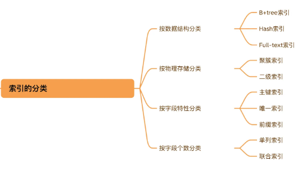
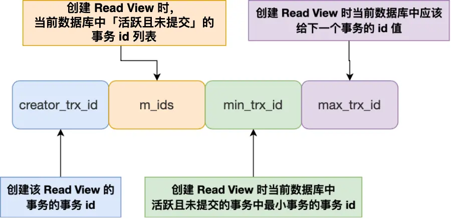

# 小林coding MySQL

## MySQL中行记录是怎么存放的


## MySQL中的NULL值是怎么存放的

在经典的compact行存储格式中，会使用NULL值列表来标记值为NULL的列，NULL值并不会存储在行格式中的真实数据部分，NULL值列表会占用一个字节空间，当有列为NULL时会设置标记，当所有列都是非NULL的就不会再有这1字节的NULL值列表

## MySQL中的varchar(n)实际占用数据大小

varchar(n)类型需要标记一下真实占用空间大小，因此和NULL值列表一样，有个变长字段大小列表，当没有变长字段的时候就不存储了，存储的列信息都倒放的，为了利好cpu，可以一次读出列信息和真实数据

## 行溢出后会怎么样

MySQL中一行数据最多能存储65535个字节，但是一页也就16k，因此有可能会有可能一页存不了一条行记录，这时候就会出现溢出页来存储，compact格式在溢出的时候，本身会存储一部分数据，剩余的部分存储在溢出页中，compressed/dynamic是仅存储数据的地址，不存储部分数据

compact

compressed/dynamic


## MySQL的索引分类



## MySQL索引优化

- **前缀索引优化**
  - 只对字段的前n个字符建立索引，减少索引项大小
  - 无法sort
  - 无法覆盖索引
- **覆盖索引优化**
  - 查询的所有字段都在索引上，避免了回表
- **主键自增**
  - 添加纪录的时候顺序添加，无需做多余的页分裂操作
- **索引设置NOT NULL**
  - 只要列中包含有 NULL 值都将不会被包含在索引中，复合索引中只要有⼀列含NULL值，那么这⼀列对于此复合索引就是⽆效的。
- **避免索引失效**
  - 左模糊查询
  - 对索引进行函数计算
  - 隐式转换
  - or后不是索引

## 什么时候需要/不需要创建索引

### 需要
  
- 字段唯一限制
- 经常用于where的，不是一个字段的需要建立联合索引
- 经常group/order by的，索引会排序

### 不需要

- where/group/order都用不到的
- 字段有很多重复数据，区分度不明显
- 表数据很少
- 经常更新的字段，需要维护红黑树的特性

## MySQL单表不要超过2000w行

记录条数计算公式,x代表一页能存储多少索引记录，y表示一页能存储多少条数据记录，x大约是1000左右z一般是3行，y的差不多15左右，差不多两千万行，一般z都是3层左右，再多就会影响查询性能
$$
Total = x ^ {z-1} * y
$$

## MySQL使用like "%x"，索引就一定失效吗

不一定，当要检索的字段全部在索引中时，就会直接遍历二级索引，来走覆盖索引，也就属于走索引了。比如下面的例子，题目二就是这样，下面的四条sql语句全部走索引


## MySQL中count(*)和count(1)哪个性能好

**count(主键字段)** 会先便利主键值，判断主键值是不是NULL，如果不是NULL就将count变量加一，当表里有二级索引的时候，就会走二级索引，因为二级索引相对聚簇索引需要的io更少

**count(1)** 也会便利主键索引，但是不会读取主键的内容，因为count的参数就是1，因此不需要判断是否有NULL值的存在

**count(\*)** 其实等于count(0)，就和count(1)一样

**count(普通字段)** 是性能最差的，因为需要全表扫描

### 为啥要通过遍历方式来计数

MyISAM引擎使用count(*)，只需要O(1)的复杂度，因为每张MyISAM的表数据都有一个meta信息有存储count值，由表级锁来保持一致性

InnoDB存储引擎支持事务，同一时刻查询由多版本并发控制(MVCC)控制，InnoDB表应该返回多少行也是不确定的，所以不行

### 如何优化count(*)

- 使用近似值 explain
- 额外的表保存计数值

## MVCC 中的Read View的工作原理

**m_ids:** 表示启动了还没有提交的事务
**min_trx_id:** 活跃事务中id最小的业务
**max_trx_id:** 当前数据库给下一个事务分配的事务id
**creator_trx_id:** 创建该read view的事务id

加上记录行的两个隐藏列，trx_id(事务对其改动时，记录其id)和roll_pointer回滚指针



## 可重复读

就是在事务启动的时候创建一个read view，整个事务中保持一个read view，使得整个事务看到的信息是一致的

## 读已提交

就是在每个sql查询的时候创建一个read view，这样每次查询看到的都是已提交的信息

## MySQL可重复读隔离级别，完全解决了幻读了吗

当快照读的时候，读了某个记录，然后另一个事务更改了记录，然后本事务当前读就不可重复读了。

## MySQL有哪些锁

主要分为三种，全局锁、表级锁和行级锁

### 全局锁

就是对整个数据库枷锁，使用下面的命令

```mysql
flush tables with read lock // 上锁

unlock tables; // 解除锁 会话断开也会解除锁
```

**应用场景** 主要做全库逻辑备份，使得备份期间不会有数据和表结构的更新，出现不一致
**加全局锁备份的缺点** 加全局锁意味着整个数据库都是只读状态，如果有很多数据，那么更新数据的业务就会停滞
**解决方法** 如果数据库支持可重复读隔离级别，备份的时候可以开启事务，这样由于MVCC的支持，备份期间依然可以执行更新的业务，使用工具`mysqldump`加上参数`single-transaction`就会在备份的时候开启事务，不支持可重复读的就不行了，比如MyISAM

### 表级锁

表级锁包括：**表锁**、**元数据锁**、**意向锁**、**AUTO-INC锁**。

**详细**
**表锁**就是对整张表上锁，分为读锁和写锁，锁粒度太大，一般不用
**元数据锁**是表结构来上锁的，mysql的crud都是会上读锁，因为没有更改表结构，如果对表结构进行改变就上写锁了，不需要显示调用，事务提交就自己释放，如果有写锁，就会阻塞后面的读，这个工作中需要注意
**意向锁**就是当对表中的数据进行读或者写的时候，自动的给上一层表级的意向读/写锁，主要是为了在加表级锁的时候快速判断表里是否有记录被加锁，不需要遍历所有记录了

**AUTO-INC**，插入数据的时候可以不指定主键的值，数据库会自动的给主键赋值递增的值，不在是一个事务提交后在释放，而是执行完插入的语句就释放，大量插入时会影响性能，目前mysql对自增主键有其他方案

  1. innodb_autoinc_lock_mode = 0 采用AUTO-INC实现
  2. innodb_autoinc_lock_mode = 2 申请到自增的主键后就释放，不需要等语句执行完
  3. innodb_autoinc_lock_mode = 1
     1. 普通的insert。申请完后直接释放
     2. insert ... select这种批量插入，等语句执行完后再释放

  可以采用innodb_autoinc_lock_mode = 2并且binlog_format=row来避免主从库不一致

### 行级锁

行级锁有记录锁、间隙锁和临键锁
普通的读数据是用的MVCC不会加锁的，使用下面的命令加锁

```mysql
select ... lock in share mode; // 读锁

select ... for update; // 写锁
```

**记录锁** 锁住一条记录
**间隙锁** 锁住一个间隙，不包含记录本身
**临键锁** 上述两种的组合，锁定一个范围，包括记录

相同的间隙锁多个事务是互相兼容的，但是记录锁不是

**插入意向锁**
是一种特殊的间隙锁，当要插入的地方有间隙锁，就会产生插入意向锁，然后阻塞。

## MySQL是咋加锁的

首先对扫描的记录机上next-key锁，下面有几种情况会next-key锁会退化，mysql是对索引加锁的。

### 唯一索引等值查询

当查询的记录是**存在**的，在索引树上定位到这一条记录后，将该记录的索引中的 next-key lock 会退化成「记录锁」。

当查询的记录是**不存在**的，在索引树找到第一条大于该查询记录的记录后，将该记录的索引中的 next-key lock 会退化成「间隙锁」。

### 唯一索引范围查询

会对每一个扫描到的索引加 next-key 锁，然后如果遇到下面这些情况，会退化成记录锁或者间隙锁：

**大于等于查询时**
当记录存在时， 等于那个记录的next-key 锁退化为记录锁

**小于或者小于等于时**
记录不存在时，第一个不符合的记录和最后一个满足的记录之间加上间隙锁
记录存在时，小于查询时，终止查询记录退化为间隙锁，小于等于时，不会退化为间隙锁。

### 非唯一索引等值查询

当查询的记录**存在**时，对于第一个不符合条件的二级索引记录，该二级索引的 next-key 锁会退化成间隙锁。同时，在符合查询条件的记录的主键索引上加记录锁。

当查询的记录**不存在**时，扫描到第一条不符合条件的二级索引记录，该二级索引的 next-key 锁会退化成间隙锁。因为不存在满足查询条件的记录，所以不会对主键索引加锁。

### 非唯一索引范围查询

不会有退化的情况

主要是从避免幻读的角度去分析就可以理解退化的原因

## Insert 语句是怎么加行级锁的？

Insert 语句在正常执行时是不会生成锁结构的，它是靠聚簇索引记录自带的 trx_id 隐藏列来作为隐式锁来保护记录的，只有在可能发生冲突时才加锁，从而减少了锁的数量，提高了系统整体性能。下面有两种场景：

- 如果记录之间加有间隙锁，为了避免幻读，此时是不能插入记录的；
- 如果 Insert 的记录和已有记录存在唯一键冲突，此时也不能插入记录；

**详细**
每插入一条新记录，都需要看一下待插入记录的下一条记录上是否已经被加了间隙锁，如果已加间隙锁，此时会生成一个插入意向锁，然后锁的状态设置为等待状态，现象就是 Insert 语句会被阻塞。

如果在插入新记录时，插入了一个与已有的记录的主键或者唯一二级索引列值相同的记录，此时插入就会失败，然后对于这条记录加上了 S 型的锁。

- 如果主键索引重复，插入新记录的事务会给已存在的主键值重复的聚簇索引记录添加 S 型记录锁。
- 如果唯一二级索引重复，插入新记录的事务都会给已存在的二级索引列值重复的二级索引记录添加 S 型 next-key 锁。

## 小林coding MySQL日志

大概分为四种日志，undo日志、redo日志、binlog和replay日志

**undo log**：是 Innodb 存储引擎层生成的日志，实现了事务中的原子性，主要用于事务回滚和 MVCC。
**redo log**：是 Innodb 存储引擎层生成的日志，实现了事务中的持久性，主要用于掉电等故障恢复；
**bin log** ：是 Server 层生成的日志，主要用于数据备份和主从复制；
**replay log** : 是用在主从复制的时候，从服务器把数据从主服务器拉取过来的时候，先放到replay日志，然后再重放日志

## redo log的作用

**实现事务的持久性，让 MySQL 有 crash-safe 的能力**，能够保证 MySQL 在任何时间段突然崩溃，重启后之前已提交的记录都不会丢失；
**将写操作从随机写变成了顺序写**，提升 MySQL 写入磁盘的性能。

## redo log啥时候刷盘

redo log也是存放在redo log buffer里面的，落盘主要有下面几个时机：

- MySQL正常关闭的时候
- 当 redo log buffer 中记录的写入量大于 redo log buffer 内存空间的一半时，会触发落盘；
- InnoDB 的后台线程每隔 1 秒，将 redo log buffer 持久化到磁盘。
- 每次事务提交时都将缓存在 redo log buffer 里的 redo log 直接持久化到磁盘

还有`innodb_flush_log_at_trx_commit`参数控制redo log落盘的策略：

- 0时，表示每次事务提交时 ，还是将 redo log 留在 redo log buffer 中 ，该模式下在事务提交时不会主动触发写入磁盘的操作。
- 1时，表示每次事务提交时，都将缓存在 redo log buffer 里的 redo log 直接持久化到磁盘，这样可以保证 MySQL 异常重启之后数据不会丢失。
- 2时，表示每次事务提交时，都只是缓存在 redo log buffer 里的 redo log 写到 redo log 文件，并不意味着写入到了磁盘，因为操作系统的文件系统中有个 Page Cache，Page Cache 是专门用来缓存文件数据的，所以写入 redo log文件意味着写入到了操作系统的文件缓存。

## binlog啥时候刷盘

事务执行过程中，先把日志写到 binlog cache（Server 层的 cache），事务提交的时候，再把 binlog cache 写到 binlog 文件中。

MySQL提供一个 sync_binlog 参数来控制数据库的 binlog 刷到磁盘上的频率：

- sync_binlog = 0 的时候，表示每次提交事务都只 write，不 fsync，后续交由操作系统决定何时将数据持久化到磁盘；
- sync_binlog = 1 的时候，表示每次提交事务都会 write，然后马上执行 fsync；
- sync_binlog =N(N>1) 的时候，表示每次提交事务都 write，但累积 N 个事务后才 fsync。

## 两阶段提交

两阶段提交就是把单个事务的提交拆分成了 2 个阶段，分别是**准备（Prepare）阶段**和**提交（Commit）阶段**，将redo log的写入拆成了两个步骤：prepare和commit阶段，这两个中间穿插binlog的写入。

**使用两阶段提交的原因:** 因为事务提交后，redo log 和 binlog 都要持久化到磁盘，但是这两个是独立的逻辑，可能出现半成功的状态，比如redo写完成了，bin没完成，或者bin写完了，redo没写完，这样就造成两份日志之间的逻辑不一致，因此采用两阶段提交来解决这个问题

**更具体的过程:** 当一条事务提交的时候，首先是prepare阶段，先将事务id写入redo log，同时将redo log对应的事务状态设置为prepare，将redo log持久化到磁盘中，然后就是commit阶段，将bin log持久化到磁盘中，然后将redo log状态设置为commit就ok了

### 两阶段提交出现的问题

虽然保证了两个日志文件的数据一致性，但是性能很差，主要有下面两个方面的影响

**磁盘IO次数较多**，个事务提交都会进行两次 fsync（刷盘），一次是 redo log 刷盘，另一次是 binlog 刷盘。

**锁竞争激烈** 两阶段提交虽然能够保证**单事务**两个日志的内容一致，但在**多事务**的情况下，却不能保证两者的提交顺序一致，因此，在两阶段提交的流程基础上，还需要加一个锁来保证提交的原子性，从而保证多事务的情况下，两个日志的提交顺序一致。

### 解决方法  组提交

MySQL 引入了 binlog 组提交（group commit）机制，当有多个事务提交的时候，会将多个 binlog 刷盘操作合并成一个，从而减少磁盘 I/O 的次数
主要是将commit过程拆分为了三个过程：

**flush 阶段**：多个事务按进入的顺序将 binlog 从 cache 写入文件（不刷盘）；
**sync 阶段**：对 binlog 文件做 fsync 操作（多个事务的 binlog 合并一次刷盘）；
**commit 阶段**：各个事务按顺序做 InnoDB commit 操作；

## Buffer Pool是啥

Buffer Pool是MySQL innodb存储引擎设计的一种缓冲池，用来提高数据库的读写性能，以页为单位缓冲数据，有参数可以调整其缓存的大小，通过下面三种链表来管理缓存页

- Free List （空闲页链表），管理空闲页；
- Flush List （脏页链表），管理脏页；
- LRU List，管理脏页+干净页，将最近且经常查询的数据缓存在其中，而不常查询的数据就淘汰出去。
