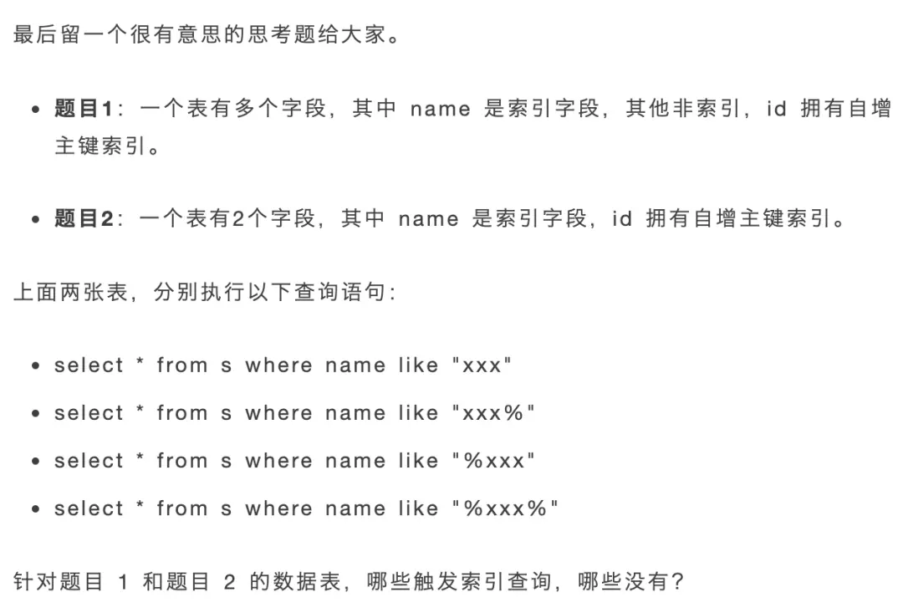

# MySQL

## MySQL中的NULL值是怎么存放的

在经典的compact行存储格式中，会使用NULL值列表来标记值为NULL的列，NULL值并不会存储在行格式中的真实数据部分，NULL值列表会占用一个字节空间，当有列为NULL时会设置标记，当所有列都是非NULL的就不会再有这1字节的NULL值列表

## MySQL中的varchar(n)实际占用数据大小

varchar(n)类型需要标记一下真实占用空间大小，因此和NULL值列表一样，有个变长字段大小列表，当没有变长字段的时候就不存储了，存储的列信息都倒放的，为了利好cpu，可以一次读出列信息和真实数据

## 行溢出后会怎么样

MySQL中一行数据最多能存储65535个字节，但是一页也就16k，因此有可能会有可能一页存不了一条行记录，这时候就会出现溢出页来存储，compact格式在溢出的时候，本身会存储一部分数据，剩余的部分存储在溢出页中，compressed/dynamic是仅存储数据的地址，不存储部分数据

compact

compressed/dynamic


## MySQL的索引分类


## MySQL索引优化

- **前缀索引优化**
  - 只对字段的前n个字符建立索引，减少索引项大小
  - 无法sort
  - 无法覆盖索引
- **覆盖索引优化**
  - 查询的所有字段都在索引上，避免了回表
- **主键自增**
  - 添加纪录的时候顺序添加，无需做多余的页分裂操作
- **索引设置NOT NULL**
  - 只要列中包含有 NULL 值都将不会被包含在索引中，复合索引中只要有⼀列含NULL值，那么这⼀列对于此复合索引就是⽆效的。
- **避免索引失效**
  - 左模糊查询
  - 对索引进行函数计算
  - 隐式转换
  - or后不是索引

## 什么时候需要/不需要创建索引

### 需要
  
- 字段唯一限制
- 经常用于where的，不是一个字段的需要建立联合索引
- 经常group/order by的，索引会排序

### 不需要

- where/group/order都用不到的
- 字段有很多重复数据，区分度不明显
- 表数据很少
- 经常更新的字段，需要维护红黑树的特性

## MySQL单表不要超过2000w行

记录条数计算公式,x代表一页能存储多少索引记录，y表示一页能存储多少条数据记录，x大约是1000左右z一般是3行，y的差不多15左右，差不多两千万行，一般z都是3层左右，再多就会影响查询性能
$$
Total = x ^ {z-1} * y
$$

## MySQL使用like "%x"，索引就一定失效吗

不一定，当要检索的字段全部在索引中时，就会直接遍历二级索引，来走覆盖索引，也就属于走索引了。比如下面的例子，题目二就是这样，下面的四条sql语句全部走索引



## MySQL中count(*)和count(1)哪个性能好

**count(主键字段)** 会先便利主键值，判断主键值是不是NULL，如果不是NULL就将count变量加一，当表里有二级索引的时候，就会走二级索引，因为二级索引相对聚簇索引需要的io更少

**count(1)** 也会便利主键索引，但是不会读取主键的内容，因为count的参数就是1，因此不需要判断是否有NULL值的存在

**count(\*)** 其实等于count(0)，就和count(1)一样

**count(普通字段)** 是性能最差的，因为需要全表扫描

### 为啥要通过遍历方式来计数

MyISAM引擎使用count(*)，只需要O(1)的复杂度，因为每张MyISAM的表数据都有一个meta信息有存储count值，由表级锁来保持一致性

InnoDB存储引擎支持事务，同一时刻查询由多版本并发控制(MVCC)控制，InnoDB表应该返回多少行也是不确定的，所以不行

### 如何优化count(*)

- 使用近似值 explain
- 额外的表保存计数值

## MVCC 中的Read View的工作原理

**m_ids:** 表示启动了还没有提交的事务
**min_trx_id:** 活跃事务中id最小的业务
**max_trx_id:** 当前数据库给下一个事务分配的事务id
**creator_trx_id:** 创建该read view的事务id

加上记录行的两个隐藏列，trx_id(事务对其改动时，记录其id)和roll_pointer回滚指针


## 可重复读

就是在事务启动的时候创建一个read view，整个事务中保持一个read view，使得整个事务看到的信息是一致的

## 读已提交

就是在每个sql查询的时候创建一个read view，这样每次查询看到的都是已提交的信息

## MySQL可重复读隔离级别，完全解决了幻读了吗

当快照读的时候，读了某个记录，然后另一个事务更改了记录，然后本事务当前读就不可重复读了。

## MySQL有哪些锁

主要分为三种，全局锁、表级锁和行级锁

### 全局锁

就是对整个数据库枷锁，使用下面的命令

```mysql
flush tables with read lock // 上锁

unlock tables; // 解除锁 会话断开也会解除锁
```

**应用场景** 主要做全库逻辑备份，使得备份期间不会有数据和表结构的更新，出现不一致
**加全局锁备份的缺点** 加全局锁意味着整个数据库都是只读状态，如果有很多数据，那么更新数据的业务就会停滞
**解决方法** 如果数据库支持可重复读隔离级别，备份的时候可以开启事务，这样由于MVCC的支持，备份期间依然可以执行更新的业务，使用工具`mysqldump`加上参数`single-transaction`就会在备份的时候开启事务，不支持可重复读的就不行了，比如MyISAM

### 表级锁

表级锁包括：**表锁**、**元数据锁**、**意向锁**、**AUTO-INC锁**。

**详细**
**表锁**就是对整张表上锁，分为读锁和写锁，锁粒度太大，一般不用
**元数据锁**是表结构来上锁的，mysql的crud都是会上读锁，因为没有更改表结构，如果对表结构进行改变就上写锁了，不需要显示调用，事务提交就自己释放，如果有写锁，就会阻塞后面的读，这个工作中需要注意
**意向锁**就是当对表中的数据进行读或者写的时候，自动的给上一层表级的意向读/写锁，主要是为了在加表级锁的时候快速判断表里是否有记录被加锁，不需要遍历所有记录了

**AUTO-INC**，插入数据的时候可以不指定主键的值，数据库会自动的给主键赋值递增的值，不在是一个事务提交后在释放，而是执行完插入的语句就释放，大量插入时会影响性能，目前mysql对自增主键有其他方案

  1. innodb_autoinc_lock_mode = 0 采用AUTO-INC实现
  2. innodb_autoinc_lock_mode = 2 申请到自增的主键后就释放，不需要等语句执行完
  3. innodb_autoinc_lock_mode = 1
     1. 普通的insert。申请完后直接释放
     2. insert ... select这种批量插入，等语句执行完后再释放

  可以采用innodb_autoinc_lock_mode = 2并且binlog_format=row来避免主从库不一致

### 行级锁

行级锁有记录锁、间隙锁和临键锁
普通的读数据是用的MVCC不会加锁的，使用下面的命令加锁

```mysql
select ... lock in share mode; // 读锁

select ... for update; // 写锁
```

**记录锁** 锁住一条记录
**间隙锁** 锁住一个间隙，不包含记录本身
**临键锁** 上述两种的组合，锁定一个范围，包括记录

相同的间隙锁多个事务是互相兼容的，但是记录锁不是

**插入意向锁**
是一种特殊的间隙锁，当要插入的地方有间隙锁，就会产生插入意向锁，然后阻塞。

## MySQL是咋加锁的

首先对扫描的记录机上next-key锁，下面有几种情况会next-key锁会退化，mysql是对索引加锁的。

### 唯一索引等值查询

当查询的记录是**存在**的，在索引树上定位到这一条记录后，将该记录的索引中的 next-key lock 会退化成「记录锁」。

当查询的记录是**不存在**的，在索引树找到第一条大于该查询记录的记录后，将该记录的索引中的 next-key lock 会退化成「间隙锁」。

### 唯一索引范围查询

会对每一个扫描到的索引加 next-key 锁，然后如果遇到下面这些情况，会退化成记录锁或者间隙锁：

**大于等于查询时**
当记录存在时， 等于那个记录的next-key 锁退化为记录锁

**小于或者小于等于时**
记录不存在时，第一个不符合的记录和最后一个满足的记录之间加上间隙锁
记录存在时，小于查询时，终止查询记录退化为间隙锁，小于等于时，不会退化为间隙锁。

### 非唯一索引等值查询

当查询的记录**存在**时，对于第一个不符合条件的二级索引记录，该二级索引的 next-key 锁会退化成间隙锁。同时，在符合查询条件的记录的主键索引上加记录锁。

当查询的记录**不存在**时，扫描到第一条不符合条件的二级索引记录，该二级索引的 next-key 锁会退化成间隙锁。因为不存在满足查询条件的记录，所以不会对主键索引加锁。

### 非唯一索引范围查询

不会有退化的情况

主要是从避免幻读的角度去分析就可以理解退化的原因
