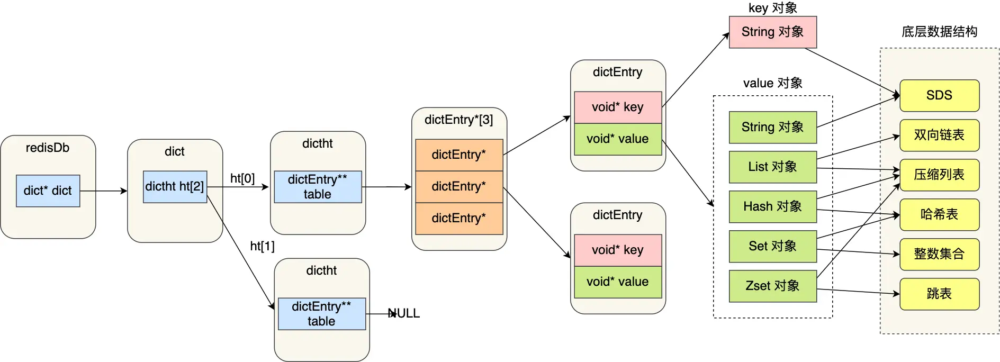
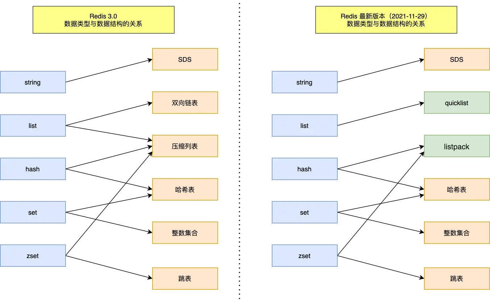
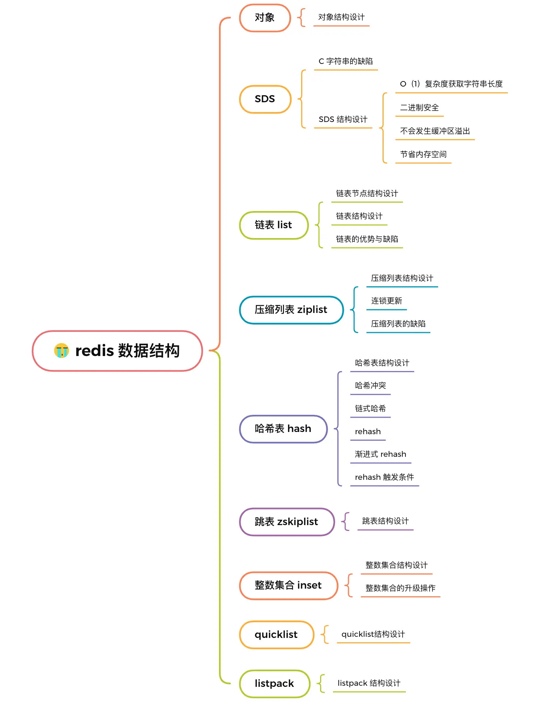
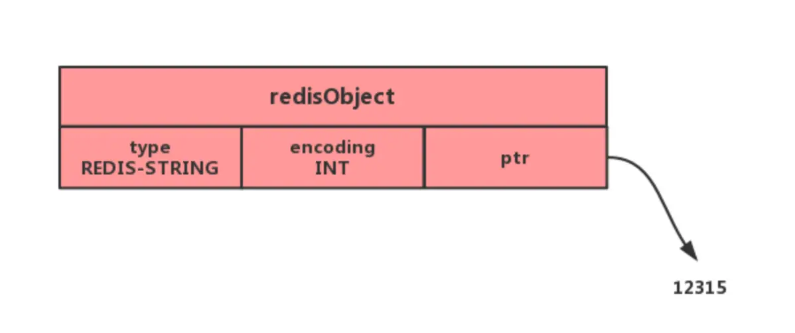
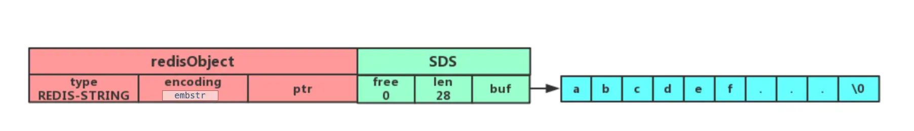
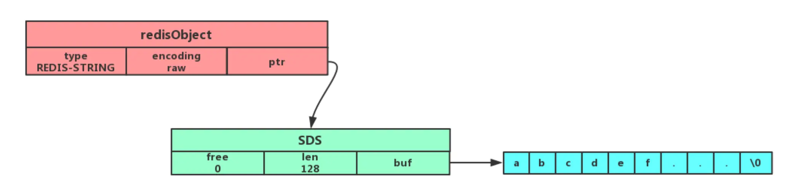
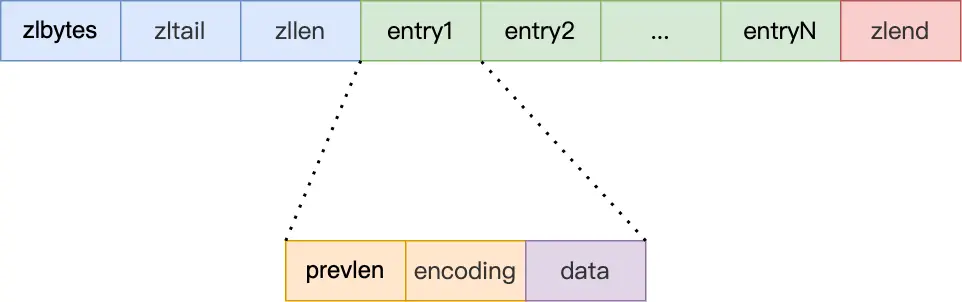
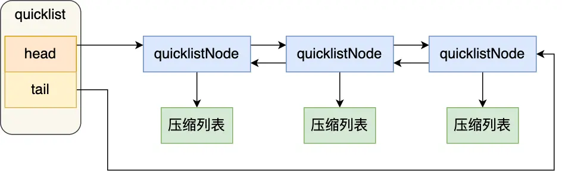
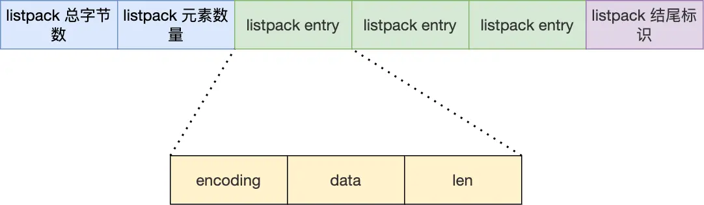
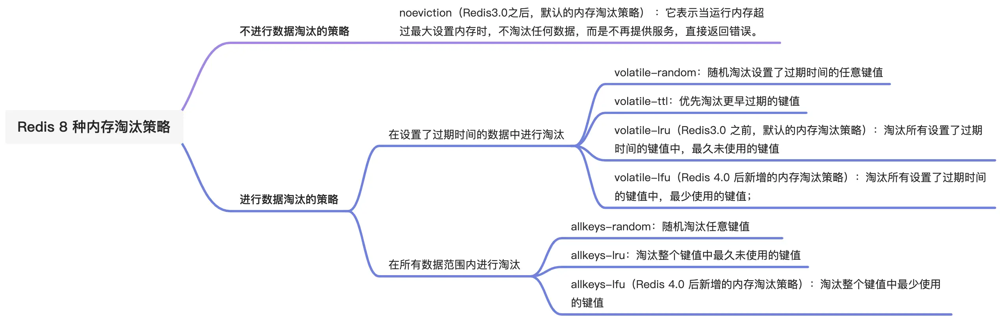

# 小林coding redis

## cby Redis kv存储架构

- **redisDb 结构**，表示 Redis 数据库的结构，结构体里存放了指向了 dict 结构的指针；
- **dict 结构**，结构体里存放了 2 个哈希表，正常情况下都是用「哈希表1」，「哈希表2」只有在 rehash 的时候才用；
- **ditctht 结构**，表示哈希表的结构，结构里存放了哈希表数组，数组中的每个元素都是指向一个哈希表节点结构（dictEntry）的指针；
- **dictEntry 结构**，表示哈希表节点的结构，结构里存放了 `void * key` 和 `void * value` 指针， key 指向的是 String 对象，而 value 则可以指向Redis上层数据结构。

## cby 上层数据结构和底层数据结构的对应关系

## cby 底层数据结构的框架图

### cby SDS三种编码格式

分别是int，embstr和raw三种类型

保存整数值，并且这个整数值可以用long类型来表示，那么字符串对象会将整数值保存在字符串对象结构的ptr属性里面（将void*转换成 long），并将字符串对象的编码设置为int。

保存字符串，并且这个字符申的长度小于等于 32 字节（redis 2.+版本），那么字符串对象将使用一个简单动态字符串（SDS）来保存这个字符串，并将对象的编码设置为embstr， embstr编码是专门用于保存短字符串的一种优化编码方式：

保存字符串，并且这个字符串的长度大于 32 字节（redis 2.+版本），那么字符串对象将使用一个简单动态字符串（SDS）来保存这个字符串，并将对象的编码设置为raw：

#### embstr好处和缺点

**优点** ：

- embstr编码将创建字符串对象所需的**内存分配次**数从 raw 编码的两次降低为一次；
- 释放 embstr编码的字符串对象同样只需要调用**一次内存释放**函数；
- 因为embstr编码的字符串对象的所有数据都保存在一块连续的内存里面可以**更好的利用 CPU 缓存**提升性能。

**缺点** ：

**增加长度需要重新分配内存**，redisObject和sds都需要，因此embstr一般是**只读的**，修改时需要转换为raw再执行修改命令

### cby 压缩列表

压缩列表的最大特点，就是它被设计成一种**内存紧凑型**的数据结构，占用一块连续的内存空间，不仅可以利用 CPU 缓存，而且会针对不同长度的数据，进行相应编码，这种方法可以有效地节省内存开销。

#### cby 压缩列表缺陷

**不能保存过多的元素**，否则查询效率就会降低；
新增或修改某个元素时，压缩列表占用的内存空间需要重新分配，甚至可能引发**连锁更新**的问题。

因此只有Redis 对象（List 对象、Hash 对象、Zset 对象）包含的元素数量较少，或者元素值不大的情况才会使用压缩列表作为底层数据结构。

#### cby 压缩列表结构

整个链表的结构主要有几个字段来记录

- **zlbytes**，记录整个压缩列表占用对内存字节数；
- **zltail**，记录压缩列表「尾部」节点距离起始地址由多少字节，也就是列表尾的偏移量；
- **zllen**，记录压缩列表包含的节点数量；
- **zlend**，标记压缩列表的结束点，固定值 0xFF（十进制255）

其中一个节点的结构

- **prevlen**，记录了「前一个节点」的长度，目的是为了实现从后向前遍历，小于254用1个字节，大于254用5个字节；
- **encoding**，记录了当前节点实际数据的「类型和长度」，类型主要有两种：字符串和整数。
- **data**，记录了当前节点的实际数据，类型和长度都由 encoding 决定；

#### cby 连锁更新

压缩列表新增某个元素或修改某个元素时，如果空间不不够，压缩列表占用的内存空间就需要重新分配。而当新插入的元素较大时，可能会导致后续元素的 prevlen 占用空间都发生变化，从而引起「连锁更新」问题，导致每个元素的空间都要重新分配，造成访问压缩列表性能的下降。

### cby hash表

采用链式hash解决冲突

#### cby rehash过程

- 给「哈希表 2」 分配空间；
- 在 rehash 进行期间，每次哈希表元素进行新增、删除、查找或者更新操作时，Redis 除了会执行对应的操作之外，还会顺序将「哈希表 1 」中索引位置上的所有 key-value 迁移到「哈希表 2」 上；
- 随着处理客户端发起的哈希表操作请求数量越多，最终在某个时间点会把「哈希表 1 」的所有 key-value 迁移到「哈希表 2」，从而完成 rehash 操作。

#### cby rehash触发条件

- 当负载因子大于等于 1 ，并且 Redis 没有在执行 bgsave 命令或者 bgrewiteaof 命令，也就是没有执行 RDB 快照或没有进行 AOF 重写的时候，就会进行 rehash 操作。
- 当负载因子大于等于 5 时，此时说明哈希冲突非常严重了，不管有没有有在执行 RDB 快照或 AOF 重写，都会强制进行 rehash 操作。

### cby 整数集合

整数集合是 Set 对象的底层实现之一。当一个 Set 对象只包含整数值元素，并且元素数量不大时，就会使用整数集这个数据结构作为底层实现。有三种元素类型分别是int16、int32和int64

#### cby 整数集合升级

当新元素的尺寸大于现有元素的尺寸就会触发整数集合升级的操作，会先分配内存，然后再进行元素的移动。期间保持元素的有序，这样的原因是为了节约内存，但是一旦升级就不可以降级了。

### cby 为啥使用跳表而不用平衡树

- **从内存占用上来比较**，平衡树每个节点包含 2 个指针，而跳表每个节点包含的指针数目平均为 1/(1-p)，具体取决于参数 p 的大小。如果像 Redis里的实现一样，取 p=1/4，那么平均每个节点包含 1.33 个指针，相对平衡树占用内存更好。
- **在做范围查找的时候**，跳表比平衡树操作要简单。在平衡树上，我们需要中序遍历才可以得到范围查询。而在跳表上只需要在找到小值之后，对第 1 层链表进行若干步的遍历就可以实现。
- **从算法实现难度上来比较**，跳表比平衡树要简单得多。平衡树的插入和删除操作可能引发子树的调整，逻辑复杂，而跳表的插入和删除只需要修改相邻节点的指针，操作简单又快速。

### cby quicklist

quicklist就是使用**双链表+压缩列表**来实现的，通过控制每个链表节点中的压缩列表的大小或者元素个数，来减少连锁更新带来的影响。因为压缩列表元素越少或越小，连锁更新带来的影响就越小，从而提供了更好的访问性能。

**如何添加元素** 在向 quicklist 添加一个元素的时候，不会像普通的链表那样，直接新建一个链表节点。而是会检查插入位置的压缩列表是否能容纳该元素，如果能容纳就直接保存到 quicklistNode 结构里的压缩列表，如果不能容纳，才会新建一个新的 quicklistNode 结构。

并没有解决连锁更新问题，因为使用的还是压缩列表，只是减少了连锁更新带来的影响。

### cby listpack

一个节点的结构

- **encoding**，定义该元素的编码类型，会对不同长度的整数和字符串进行编码；
- **data**，实际存放的数据；
- **len**，encoding+data的总长度；

listpack 没有压缩列表中记录前一个节点长度的字段了，listpack 只记录当前节点的长度，当我们向 listpack 加入一个新元素的时候，不会影响其他节点的长度字段的变化，从而避免了压缩列表的连锁更新问题。

## cby 小数据量使用压缩列表或者整数集合

1. list 如果列表的元素个数小于 512 个（默认值，可由 list-max-ziplist-entries 配置），列表每个元素的值都小于 64 字节（默认值，可由 list-max-ziplist-value 配置），Redis 会使用**压缩列表作为 List 类型的底层数据结构**；
2. hash 如果哈希类型元素个数小于 512 个（默认值，可由 hash-max-ziplist-entries 配置），所有值小于 64 字节（默认值，可由 hash-max-ziplist-value 配置）的话，Redis 会使用**压缩列表作为 Hash 类型的底层数据结构**；
3. zset 如果有序集合的元素个数小于 128 个，并且每个元素的值小于 64 字节时，Redis 会使用**压缩列表作为 Zset 类型的底层数据结构**；
4. set 如果集合中的元素都是整数且元素个数小于 512 （默认值，set-maxintset-entries配置）个，Redis 会使用**整数集合作为 Set 类型的底层数据结构**；

## cby 大key对持久化的影响

主要就是**aof的always**写策略、**aof重写和edb快照**时，会阻塞主线程

当 **AOF 写回策略配置了 Always** 策略（其他是异步的写，不影响），如果写入是一个大 Key，主线程在执行 fsync() 函数的时候，阻塞的时间会比较久，因为当写入的数据量很大的时候，数据同步到硬盘这个过程是很耗时的。

**AOF 重写机制和 RDB 快照**（bgsave 命令）的过程，都会分别通过 fork() 函数创建一个子进程来处理任务。会有两个阶段会导致阻塞父进程（主线程）：

创建子进程的时候需要复制页表，大key会导致页表变大，复制会耗时
创建完子进程后，写时复制，当主线程修改大key的时候，会触发复制大key，耗时

## cby 大key还会有啥影响

**客户端超时阻塞**。由于 Redis 执行命令是单线程处理，然后在操作大 key 时会比较耗时，那么就会阻塞 Redis，从客户端这一视角看，就是很久很久都没有响应。

**引发网络阻塞**。每次获取大 key 产生的网络流量较大，如果一个 key 的大小是 1 MB，每秒访问量为 1000，那么每秒会产生 1000MB 的流量，这对于普通千兆网卡的服务器来说是灾难性的。

**阻塞工作线程**。如果使用 del 删除大 key 时，会阻塞工作线程，这样就没办法处理后续的命令。一般使用unlink

**内存分布不均**。集群模型在 slot 分片均匀情况下，会出现数据和查询倾斜情况，部分有大 key 的 Redis 节点占用内存多。

## cby 过期键删除策略

## cby 内存淘汰策略

## cby 主从复制是如何实现的

共有三种模式，全量复制、基于长连接的命令传播、增量复制。

**全量复制** 主从服务器第一次同步的时候，就是采用全量复制，此时主服务器会有两个耗时的地方，分别是生成 RDB 文件和传输 RDB 文件。为了避免过多的从服务器和主服务器进行全量复制，可以把一部分从服务器升级为「经理角色」，让它也有自己的从服务器，通过这样可以分摊主服务器的压力。

**命令传播** 第一次同步完成后，主从服务器都会维护着一个长连接，主服务器在接收到写操作命令后，就会通过这个连接将写命令传播给从服务器，来保证主从服务器的数据一致性。

**增量复制** 如果遇到网络断开，增量复制就可以上场了，不过这个还跟 repl_backlog_size 这个大小有关系。
如果它配置的过小，主从服务器网络恢复时，可能发生「从服务器」想读的数据已经被覆盖了，那么这时就会导致主服务器采用全量复制的方式。所以为了避免这种情况的频繁发生，要调大这个参数的值，以降低主从服务器断开后全量同步的概率。

## cby 主从节点是长连接还是短链接

长连接，使用长连接来进行命令的传播

## cby 如何判断redis某个节点是否正常工作

通过**互相的 ping-pong 心态检测机制**，如果有**一半以上的节点**去 ping 一个节点的时候**没有 pong 回应**，集群就会认为这个节点挂掉了，会断开与这个节点的连接。

Redis 主从节点发送的心态间隔是不一样的，而且作用也有一点区别：

Redis 主节点默认每隔 10 秒对从节点发送 ping 命令，判断从节点的存活性和连接状态，可通过参数repl-ping-slave-period控制发送频率。
Redis 从节点每隔 1 秒发送 replconf ack{offset} 命令，给主节点上报自身当前的复制偏移量，目的是为了：

- 实时监测主从节点网络状态；
- 上报自身复制偏移量， 检查复制数据是否丢失， 如果从节点数据丢失， 再从主节点的复制缓冲区中拉取丢失数据。

## cby 主从架构中，过期键怎么处理

主节点处理了一个key或者通过淘汰算法淘汰了一个key，这个时间主节点模拟一条del命令发送给从节点，从节点收到该命令后，就进行删除key的操作。

## cby redis是同步复制还是异步复制

异步复制，Redis 主节点每次收到写命令之后，先写到内部的缓冲区，然后异步发送给从节点。

## cby 主从复制中replication buffer和repl backlog buffer有啥区别

- 出现的阶段不一样
  - repl backlog buffer 是在增量复制阶段出现，一个主节点只分配一个 repl backlog buffer；
  - replication buffer 是在全量复制阶段和增量复制阶段都会出现，主节点会给每个新连接的从节点，分配一个 replication buffer；
- 这两个 Buffer 都有大小限制的，当缓冲区满了之后，发生的事情不一样：
  - 当 repl backlog buffer 满了，因为是环形结构，会直接覆盖起始位置数据;
  - 当 replication buffer 满了，会导致连接断开，删除缓存，从节点重新连接，重新开始全量复制。

## cby 如何应对主从数据不一致的情况

因为主从日志同步是异步的，那么就可能出现数据不一致的问题，主要采用下面两种方法吧

- 尽量保证主从节点间的网络连接状况良好，避免主从节点在不同的机房。
- 可以开发一个外部程序来监控主从节点间的复制进度。
  - INFO replication 命令可以查看主和从节点的复制进度
  - 差异过大就禁止读了。

## cby 数据库和缓存保证不一致问题

1. 先删除更新数据库，再删除缓存，为了保证两个操作成功，可以使用消息队列
2. 先更新数据库再更新缓存，并发访问会出现不一致问题，
   1. 这里可以加锁保证两个操作原子执行，
   2. 并且更新完缓存给缓存加上较短的过期时间，不一致的时候key会过期再更新
3. 先删除缓存再更新数据库，可以采用延迟双删的方式保证一致性
