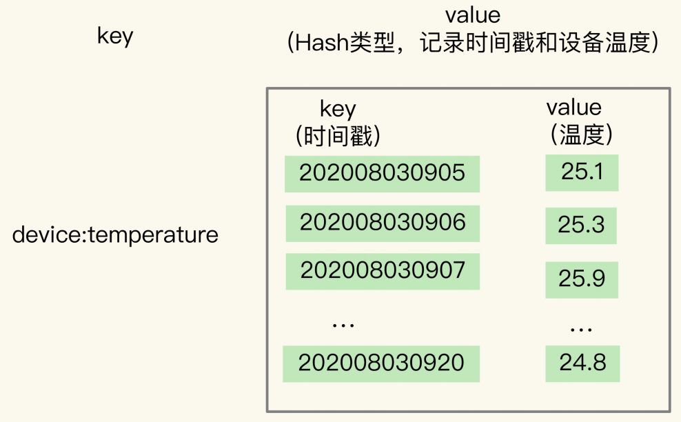
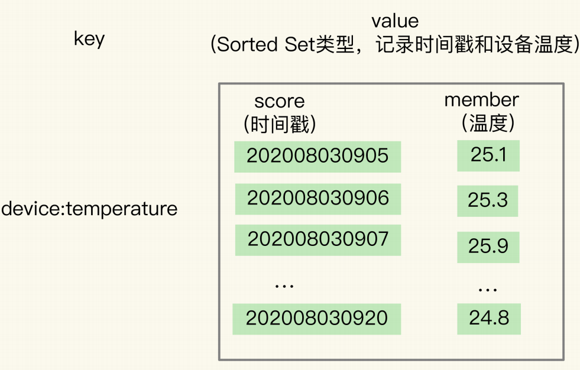
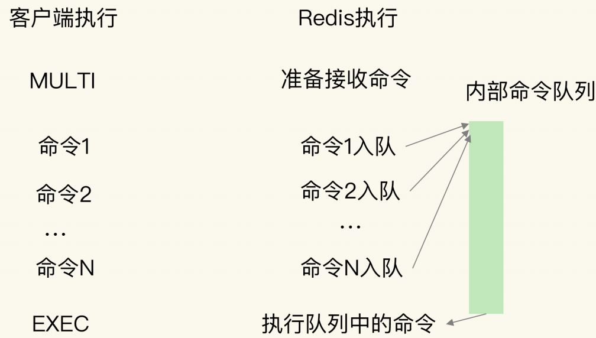
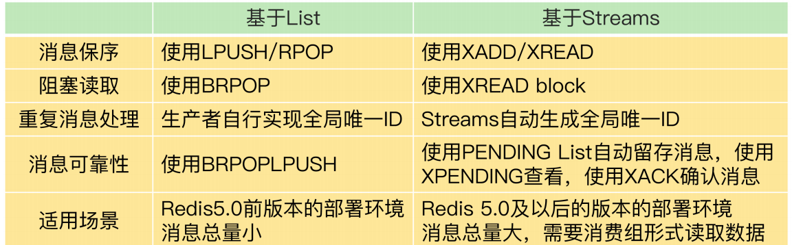
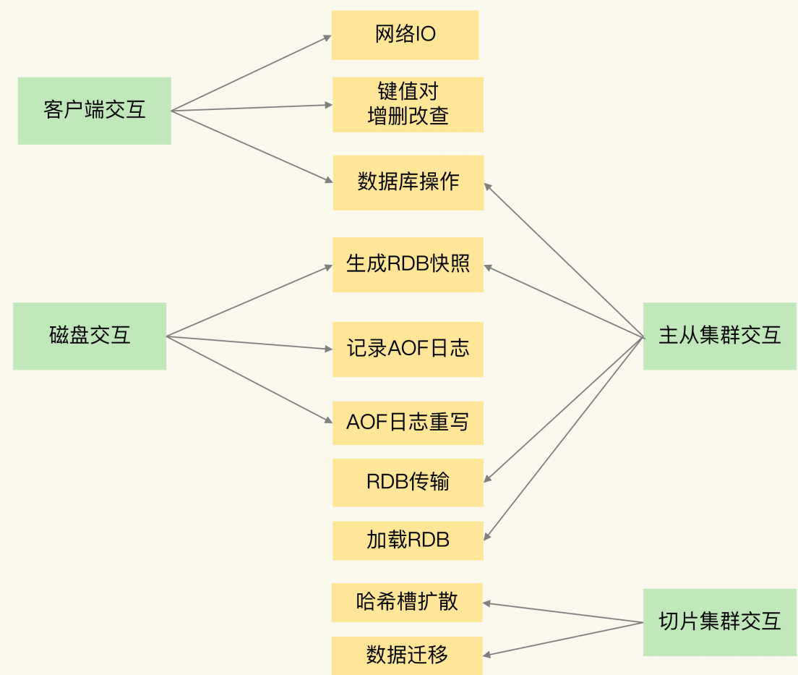

[TOC]

# 姜龙C++八股

## 动态库与静态库的区别？

**答案：**

1. **链接方式不同：**静态链接是直接把静态库编译进目标文件。动态链接没有把动态库编译进目标文件，在程序运行的时候加载动态库，使用了地址无关代码的技术，装载时重定位，在链接时只做语法检查。程序环境需要指定动态库查找路径。
2. **执行速度上： **相对来说静态库更快一点，动态库慢一点。
3. **当库文件发生变更时：**如果接口发生变化，静态库和动态库都需要重新编译。但是如果接口没变，使用静态库的程序需要重新编译，使用动态库的程序只需要重新编译库文件就行。

**下面是生成库和链接库的命令：**

**1.生成方式：**

两者的第一步都需要生成目标文件，以.o结尾。

```shell
//-c表示只编译不链接  -o表示指定输出文件名称
g++ -c add.cc -o add.o
```

静态库生成方式：

```shell
//linux下.a文件  windows下.lib文件
ar rcs libapi.a add.o
```

动态库生成方式：

```shell
//shared表示生成动态库 -fPIC表示会生成与地址无关的代码，并且装载时会帮忙进行重定位
//linux下.so文件  windows下.dll文件
g++ -shared -fPIC -o libapi.so add.o
```

**2.链接方式：**

编译代码时使用静态库

```shell
g++ -static main.cc -o static_main -L./ -lapi -I./
```

编译代码时使用动态库

```c++
g++ main.cc -o dynamic_main -L./ -lapi -I./
```


## 动态链接库的实现原理是什么？动态链接实现过程？动态链接具体过程？

程序运行的时候，系统的加载器根据导入表加载程序需要的动态库，把动态库加载到程序的地址空间中，然后解析所有的外部符号，把程序代码里对函数或变量的引用与 DLL 中的实际地址进行绑定。一般会延迟加载，在程序首次调用动态库里面的符号时才加载。

## c++/c语言为什么用头文件？


1. **可以让声明与定义分离：** 头文件一般包含函数、变量、类的声明。具体的实现细节一般放在源文件里面。
2. **能代码复用：**头文件里面的函数、类和全局变量的声明在多个源文件中共用。用 `#include` 可以在多个源文件使用同一个头文件，避免重复声明，提高复用性。
3. **能加快编译速度：**如果有源文件有改动的话，只有这个源文件需要重新编译，其他包含这个头文件的源文件不需要重新编译。可以减少编译时间，提高编译效率。
4. **可以提供外部接口：**可以通过包含库的头文件，直接使用库的功能，不需要知道库的实现细节。
5. **用头文件可以直接展开：**编译之前就把头文件的内容在源文件中展开，能检查未声明的符号。

## 项目根目录下的CMakeLists.txt内容都有什么？

```c++
cmake_minimum_required(VERSION 3.15) # 规定的最低版本 不写也行
project(cmake_study) # 起一个项目名
add_subdirectory(lesson1_1) # 添加子目录 会自动区寻找子目录下的CMakelists.txt
//lesson1_1目录下的内容 有一个add.cpp add.h main.cpp CMakelists.txt
//lesson1_1 CMakelists.txt内容
add_executable(lesson1_1 main.cpp add.cpp)
```

## Linux平台下C++代码编译流程？


**四个流程：预处理，编译，汇编，链接**

**1. 预处理** 

​	展开头文件，做宏替换，去掉注释。

**2. 编译**

​	编译的输出结果是汇编文件，输入是.i结尾的文件(预处理的结果)  输出是.s结尾的文件

**3. 汇编** 

​	会变成机器码的二进制文件，如果一个函数只有声明是可以经过预处理，编译和汇编的到达现在这步二进制文件，在最后的链接阶段才会找函数的具体实现。

**4. 链接**

​	将多个源文件的二进制文件和库链接到一起。

## Linux平台下cmake流程？

在项目目录下新建`build`目录，这个`build`目录与顶层`CMakeLists.txt`文件同层，然后`cd`到`build`下，`cmake ..`表示将编译与`build`同层的`CMakeLists.txt`，然后将生成的文件都放在当前的build目录下。

`cmake .. -DCMAKE_VERBOSE_MAKEFILE=ON`表示展示`camke`过程。其中包括生成`makefile`等过程。

## c++进程结构，c++内存模型


在 Linux 操作系统中，虚拟地址空间的内部又被分为**内核空间和用户空间**两部分。每个进程都各自有独立的虚拟内存，但是**每个虚拟内存中的内核地址，其实关联的都是相同的物理内存**。这样，进程切换到内核态后，就可以很方便地访问内核空间内存。

- 栈段，包括局部变量和函数调用的上下文等，从高地址向低地址增长；
- 文件映射段，包括动态库、共享内存等，从低地址开始向上增长；
- 堆段，包括动态分配的内存，从低地址开始向上增长；
- BSS 段，包括未初始化的静态变量和全局变量；
- 数据段，包括已初始化的静态常量和全局变量；
- 常量区：常量的存储位置，程序结束后由操作系统释放；
- 代码段，包括二进制可执行代码；

在这 6 个内存段中，堆和文件映射段的内存是动态分配的。比如说，使用 C 标准库的 `malloc()` 或者 `mmap()` ，就可以分别在堆和文件映射段动态分配内存。

## new，delete

执行`new`步骤:

1. 调用`operator new()`分配内存，通常底层用malloc，得到void*，
2. 把void指针转成对应类型指针
3. 调用对应类型构造函数

执行`delete`步骤：

1. 调用对应类型的析构函数
2. 调用`operator delete`释放内存。

`new`和`delete`是C++关键字，`operator new()`和`operator delete()` 是c++的函数，其内部会调用`malloc`和`free`，而且这两个函数可以重写。

## malloc申请内存方式

1. malloc **申请内存**，有两种方式：

- 如果用户分配的内存小于 128 KB，通过 brk() 申请内存，释放时**不会把内存归还给操作系统**，会缓存在 malloc 的内存池中；
- 如果用户分配的内存大于 128 KB，通过 mmap() 申请内存，释放时**会把内存归还给操作系统**，内存释放

2. malloc() **会预分配更大的空间作为内存池**。

3. **malloc不是系统调用，brk和mmap是系统调用。**
4. brk和mmap**分配的都是虚拟内存**，在第一次访问以分配的虚拟地址空间的时候，发生缺页中断，操作系统负责分配物理内存，然后建立虚拟内存和物理内存之间的映射关系；

## malloc申请的内存是否可以使用delete，new申请内存是否可以使用free？

1. 可以，但不提倡。
2. 如果是简单类型，比如int类型，malloc申请的本身没有构造函数，可以调用delete。
3. new之后调用free可能会导致没有调用虚析构函数，导致内存泄漏。

## malloc、free和new、delete的区别？

1. new自动计算所需内存大小，malloc需要手动计算
2. new和delete是C++**关键字**，malloc和free是**库函数**
3. new返回的是对象类型的指针，malloc返回的是void*
4. new分配失败会抛出异常，malloc分配失败返回的是NULL
5. malloc只分配内存，不调用构造。在堆上分配虚拟内存，不一定拥有物理内存。new会先申请内存，然后调用构造函数，构造函数会初始化成员变量，会分配物理内存。

## free() 函数只传入一个内存地址，为什么能知道要释放多大的内存？

**malloc会多申请16字节，多出来的 16 字节就是保存了该内存块的信息**。比如有内存块的大小。free 会对传入进来的内存地址向左偏移 16 字节，得到内存块的大小，就知道要释放多大的内存了。


## 内存泄漏及其场景和解决办法

**内存泄漏定义**：内存泄漏是指程序在动态分配内存后，不用的时候没释放，随着程序运行时间的增加，可能会耗尽系统资源。

**内存泄漏场景：**

- `new`和`delete`  `malloc`和`free`没有成对出现
- 系统资源泄漏，比如socket和文件描述符没释放
- 基类的析构函数没定义成虚函数。
- 在释放对象数组时没有使用`delete []` 而是使用了`delete`
- 智能指针循环引用

解决方法：通过智能指针可以规避大部分内存泄漏，linux环境可以使用工具`valgrind`。

## unique_ptr

**unique_ptr定义：**

1. 对动态分配的单⼀对象所有权的独占管理。确保只有⼀个 `unique_ptr` 可以拥有指定的内存资源。
2. 默认情况下，`unique_ptr`大小等于原始指针的大小,一般为8字节。
3. `unique_str`不允许拷贝，只允许移动。移动语义和右值引用可以对 `std::unique_ptr` 的所有权转移。
4. 可以自定义删除器(但是这可能会产生大`unique_ptr`对象)

## shared_ptr

**shared_ptr定义：**

1. `std::shared_ptr` 允许多个智能指针共享同一块内存资源。内部使用引用计数管理，当计数为零时，释放资源。但可能存在循环引用的问题。
2. `shared_ptr`一般是16字节大小，比正常指针大一倍
3. `shared_ptr`其中包含一个原始指针和一个指向控制块的指针。控制块内包含引用计数，自定义删除器。
4. `shared_ptr`不能指向一个数组，因为默认的删除器调用delete，不是delete []。


## shared_ptr控制块的生成时机

`shared_ptr`**控制块的生成时机:**

1. 用`make_shared`创建`shared_ptr`
2. 通过`unique_ptr`构造`shared_ptr`
3. 向`shared_ptr`的构造函数中传入一个裸指针。

## shared_ptr重复释放堆对象问题

`share_ptr`会重复释放堆对象，比如说两个控制块与同一个`T object`关联，而且连个控制块的计数不一样，就会多次释放堆对象。


**较深解释：**

```cpp
auto pt = new Test;
std::shared_ptr<Test> spt1(pt);
std::shared_ptr<Test> spt2(pt);
```

此时两个`Control Blcok`中的引用计数都为1，在`spt1`和`spt2`都会进行释放，会释放两次。所以对于同一个对象，不管有多少个`share_ptr`都应该对应同一个`Control Block`。**解决方法:**用`shared_ptr`构造`shared_ptr`这样会调用`shared_ptr`的拷贝构造，而且不会生成新的`Control Block`。然后最好不要用裸指针指向堆对象，将`new Test`的返回的地址(形成右值)放入`shared_ptr`的构造函数中。可以避免后续用裸指针构造`shared_ptr`的情况。

```cpp
//用`spt1`构造`spt2`  用`shared_ptr`构造`shared_ptr`
std::shared_ptr<Test> stp2(spt1);
//在构造shared_ptr时 直接用堆区返回的右值地址构造，避免后续用裸指针构造shared_ptr
std::shared_ptr<Test> spt1(new Test);
```

## share_ptr循环引用问题？

**定义：**栈区有个个指针a,b指针分别指向堆区对象，这2个堆区对象里面也有指针互相指向。就会产生循环引用。释放时，堆区的两个对象计数不为0，不会释放。

**解决方法：**将其中一个指针改成`weak_ptr`就可以了，不增加引用计数就不会影响堆内存释放。

## weak_ptr

**定义：**主要解决循环引用问题。`weak_ptr`不能单独使用，通常从`shared_ptr`创建。对于共享内存，如果没有`shared_ptr`指向这片区域，就会被释放。但是对于`weak_ptr`来说，如果`weak_ptr`指向这片区域，仍然会被释放，`weak_ptr`的存在并不能延长堆内存的生命周期。本质上来说，`weak_ptr`没有堆内存空间的所有权，只有借用权。

**较深解释：**

```c++
auto spw = std::make_shared<Widget>();
std::weak_ptr<Widget> spw(spw);
spw = nullptr;
```

虽然`weak_ptr`不能掌握堆对象的生死，但是`weak_ptr`知道这个堆上的对象存不存在。

```c++
wpw.expired();//返回true表明资源已经释放 
//weak_ptr不可以直接使用，需要先转成shared_ptr
std::shared_ptr<Widget> spw1 = wpw.lock();//如果wpw堆内存被释放，spw1则为空
std::shared_ptr<Widget> spw2(wpw);//如果wpw堆内存被释放，构造方式会抛异常
```

## 为什么shared_ptr不支持数组类型的内存管理？

1. `std::shared_ptr` 不直接支持数组类型的内存管理，因为它默认使用 `delete` 而不是 `delete[]` 来释放内存。

2. 可以自定义删除器让数组内存能够被正确释放

## unique_ptr可以转换成shared_ptr吗？

可以，反之不行。

## shared_ptr是线程安全的吗？

指向对象的并发读写不安全，**计数器是线程安全的**，是原子操作。

## 为什么优先使用make_unique和make_shared？

1. 好处可以减少代码重复(能稍微少写点，作用不大)

2. 更安全，可以防止new对象和把指针赋给`shared_ptr`这两个操作被打断。

3. `std::make_shared`与`new`相比有效率上的提升。如果先new申请对象的空间，然后交给`shared_ptr`管理的时候会再申请控制块的堆空间，会申请两次增加开销。如果用`make_shared`会一次将空间都申请下来。

**较深解释：**

**更安全：**

```c++
processWidget(std::shared_ptr<Widget>(new Widget), computepriority());
这里有三个动作，如果先执行new Widget，然后执行computeriority(),然后再把内存空间的指针赋值给shared_ptr。这时如果computeriority()函数出现异常，那么会打断shared_ptr的构建。
上面存在异常风险的本质是因为在new Widget和将指针赋值给shared_ptr这两个操作被打断，所以将他这两步合并即可，用make_shared<Widget>()
```

**效率提升解释**


看上面这张图片，是`shared_ptr`，它在堆区上有两个对象一个是`T Object`和`Control Block`。所以如果先new一个对象会先申请对象的空间，然后交给`shared_ptr`管理的时候会再申请`Control Block`的堆空间，会申请两次增加开销。如果用`make_shared`会一次将空间都申请下来。但是对于`unique_ptr`，只有一根指针，用不用`make_unique`没有什么区别。

## make_unique和make_shared的局限性

1. 使用自定义删除器只能用new
2. 不能通过{}初始化指向的对象 (因为{}不能完美转发)

```c++
auto spv1 = std::make_shared<std::vector<int>>(10, 20);//定义10个20的vector
auto spv2 = std::make_shared<std::vector<int>> ({10, 20});//错误 不能通过编译
```

3. 如果类中重载了`operator new/delete`，使用`make_shared`不会执行重载函数

## 内联函数报错：“函数未定义引用”？

这个问题出现的原因是内联函数的特性。内联函数是在编译时展开的，直接把代码粘贴到函数调用处，而不是在运行时通过函数调用机制调用的。**所以，编译器需要在编译时就能看到内联函数的定义**，而不只是声明。如果你在头文件中声明了一个内联函数，但是在实现文件中提供了定义，那么在包含这个头文件的其他源文件中，编译器只能看到声明，看不到定义。这就会导致“内联函数未定义引用”的错误。所以，对于内联函数，我们通常在头文件中同时提供声明和定义，确保编译器在编译任何包含这个头文件的源文件时都能看到内联函数的定义 。

##  static关键字

**static关键字作用：**

1. 修饰局部变量：在静态存储区分配内存；⾸次函数调⽤中初始化，之后的函数调⽤不再初始化；局部作⽤域内可⻅。
2. 修饰全局变量：静态存储区（全局数据区）分配内存；整个⽂件内可⻅，⽂件外不可⻅ 
3. 修饰函数：整个⽂件可见，⽂件外不可⻅，可以避免函数同名冲突 
4. 修饰成员变量：所有对象共享这个成员变量；需要在类外初始化；不需要对象实例化就可以访问 
5. 修饰成员函数：这个函数就不能访问⾮静态成员变量，也不能调⽤⾮静态成员函数，因为没有this指针；这个函数只能访问静态成员；不需要对象实例化就可以调用这个函数。

**C和C++中的区别：**

C只能修饰局部变量和全局变量、函数。C++还能修饰成员变量和成员函数

## extern关键字

`extern`用来声明变量或者函数，`extern`是声明不是定义，不分配存储空间。

如果一个函数或者变量，想在其他文件中使用，有两种方式：

1. 可以用`extern`在头文件中声明，然后引用头文件，其他文件再去包含这个头文件。

2. 直接在使用的文件中`extern`。

在同一个文件中，如果一个全局变量在下面定义的，我在当前位置调用不了这个变量，也可以用`extern`先声明一下，就能调用到下面的全局变量了。

## extern C

让编译器这部分代码按C语⾔的⽅式进⾏编译，就是能让C++代码调⽤其他C语⾔代码，因为c++会对函数名修饰，c不会。。比如 C++ 程序需要调用由C 写的库或函数时，可能会因为c++得名称修饰导致链接错误。

## gcc和g++区别？ gcc编译c++代码发生什么？

**gcc：**用于编译c代码，链接c的标准库，也可以编译c++代码，但是如果c++代码使用c++标准库的内容就会报错：`undefined reference`。

**g++:**用于编译c++代码，链接c++的标准库。


## volatile关键字

表⽰变量随时可能被改变，编译后程序读取时候直接从地址读⼊，避免编译器优化从寄存器中读。主要用于多线程环境中，变量被多个线程共享。

## 一个变量可以即是const又是volatile吗？

可以

**原因：**const表⽰程序内部只读不能改变，volatile表示程序外部条件变化下改变且编译器不会优化这个变量。

## RAII

**定义：**RAll (Resource Acquisition ls Initialization）资源获取即初始化，**使用局部对象来管理资源的技术称为资源获取即初始化**；这里的资源主要是指操作系统中有限的东西如内存(heap)、网络套接字，互斥量，文件句柄等，局部对象是指存储在栈的对象，它的生命周期是由操作系统来管理的，无需人工介入。

整个RAII有四个步骤：

1. 设计一个类封装资源

2. 在构造函数中初始化
3. 在析构函数中进行销毁操作
4. 用的时候定义一个该类的对象


## RTTI

**定义：**RTTI（Runtime Type Identification）是“运行时类型识别”的意思。C++引入这个机制是为了让程序在运行时能根据基类的指针或引用来获得该指针或引用所指的对象的实际类型。C++的数据类型是在编译期就确定的，不能在运行时更改。因为多态，C++中的指针或引用本身的类型，可能与它实际代表的类型并不一致，我们需要将一个多态指针转换为其实际指向对象的类型，就需要知道运行时的类型信息。

**详细解释：**

但是现在RTTI的类型识别已经不限于此了，它还能通过typeid操作符识别出所有的基本类型的变量对应的类型。为什么会出现RTTI这一机制呢？这和C++语言本身有关系，C++是一门静态类型语言，其数据类型是在编译期就确定的，不能在运行时更改。然而由于面向对象程序设计中多态性的要求，C++中的指针或引用本身的类型，可能与它实际代表的类型并不一致，有时我们需要将一个多态指针转换为其实际指向对象的类型，就需要知道运行时的类型信息，这就有了运行时类型识别需求。和Java相比，C++要想获得运行时类型信息，只能通过RTTI机制，并且C++最终生成的代码是直接与机器相关的。

## 结构体能在声明中初始化结构体成员吗？

不能。

```c++
//非法结构体声明
struct Date
{
    int day = 23,
    month = 8,
    year = 1983;
};
```

## public，protected，private继承

public继承：

- 基类的public成员 -> 子类的public成员
- 基类的protected成员 -> 子类的protected成员
- 基类的private成员只能通过基类的接口访问

protected继承

- 基类的public成员 -> 子类的protected成员
- 基类的protected成员 -> 子类的protected成员
- 基类的private成员只能通过基类的接口访问

private继承

- 基类的public成员 -> 子类的private成员
- 基类的protected成员 -> 子类的private成员
- 基类的private成员只能通过基类的接口访问

## 为什么拷贝构造函数的参数必须是引用 ？

因为值传递会让拷贝构造的无限递归。

## 类成员函数可以调用delete this吗？

**在类的成员函数中是可以调用delete this的。delete的本质是调用一个或多个析构函数，然后释放内存。delete this会调用本对象的析构函数。**当调用delete this时，类对象的内存空间被释放。在delete this之后进行的其他任何函数调用，只要不涉及到this指针的内容，都能够正常运行。

**深入解释：**

在类对象的内存空间中，只有数据成员和虚函数表指针，并不包含代码内容，类的成员函数单独放在代码段中。在调用成员函数时，隐含传递一个this指针，让成员函数知道当前是哪个对象在调用他。当调用delete this时，类对象的内存空间被释放。在delete this之后进行的其他任何函数调用，只要不涉及到this指针的内容，都能够正常运行。一旦涉及到this指针，如操作数据成员，调用虚函数等，就会出现不可预期的问题。

https://blog.csdn.net/qq_31597573/article/details/51438996

## 抽象类

含有纯虚函数的类被称为抽象类，抽象类只能作为派生类的基类，不能定义对象。

## 菱形继承，虚基类

​	菱形继承时最上面的基类会被继承两次，调用最上面基类的成员变量时会产生歧义，而且也会造成空间的浪费，需要用**虚继承**解决问题，让中间的两个类都虚继承最上面的基类。虚继承的目的是让某个类做出声明，承诺愿意共享它的基类。这个被共享的基类就称为**虚基类**。

​	**虚继承底层实现原理：**通过虚表偏移的方式实现虚继承，子类只继承一次父类的父类。

## static_cast,  dynamic_cast,  const_cast,  reinterpret_cast四种类型转换

`static_cast`在编译期完成，使用数值类型，指针类型，继承关系的向上类型转换。

`dynamic_cast`在运行期完成，适用于具有继承关系的类或指针类型之间的转换。动态转换会进行类型检查。在继承关系中向上向下转换均可，向上转型始终安全，向下转换有类型检查。

`const_cast`作用是去掉表达式的常量属性。

`reinterpret_cast`于进行各种类型之间的强制转换。它是一种非常危险的类型转换，因为它会改变数据的原本含义。

## 内存对齐

为什么内存对齐：

- 不是所有的硬件平台都能访问任意地址上的任意数据的，有些只能在某些地址处取某些特定类型的数，否则抛出硬件异常。
- 效率，内存对齐可以减少cpu开销，(避免一个数据被分割放在两个cpu cache上，这样读取这个数据需要读取两次将这个数据拼接而成。对齐之后可以从一个cache中直接读取到。不知道对不对)   **为了访问未对齐的内存，处理器需要两次内存访问；而对齐的内存访问仅需要一次访问。**


**深入解释：**

1. 数据成员对齐规则，`struct`，`class`的数据成员，第一个数据成员放在offset为0的地方，以后每个成员存储的起始位置都要从该成员大小或者成员的的子成员大小(只要该成员有子成员，比如所数组，结构体等)的整数倍开始(比如int在32位机为4字节，则要从4的整数倍地址开始存储)。
2. 结构体作为成员：如果一个结构A嵌套了其他结构体B，要从B最大元素整数倍地址开始存储(`struct a`有`struct b b`里有`char`，`int`，`double`等元素，那b应该从8的整数倍开始存储)
3. 收尾工作，结构体的总大小，也就是`sizeof`的结果，必须是其内部最大成员的整数倍，不够大要补齐。

```c++
//1.
struct xx
{
    long long _x1;//8
    char _x2;// 1->4char大小是1字节 但是下一个元素是int int要从4的整数倍开始 所以这里补三个字节 占4个字节
    int _x3;//4 
    char _4[2];// 2->8 struct整体大小必须是最大元素整数倍 最大元素是8 所以补6 总共24
}
```

## 空类的大小为1字节

原因：编译器需要区分这个空类的不同实例，分配一个字节，**使得空类的实例拥有独一无二的地址**。

## 模板函数和模板类的特例化

模板函数特例化：必须为所有模板参数提供实参。就是要把特例的参数全写出来。

类模板特例化：不必为所有模板参数提供实参。

## traits

在算法中我们可能会定义简单的中间变量或者设定算法的返回变量类型，这时候需要知道迭代器所指元素的类型是什么，所以需要用到`traits`。

如果需要用到迭代器所指元素的类型，就直接在迭代器的定义中将迭代器所指元素类型起个`value_type`别名即可。

```c++
template <class T>
struct MyIter {
    typedef T value_type; // 内嵌型别声明
    T* ptr;
    MyIter(T* p = 0) : ptr(p) {}
    T& operator*() const { return *ptr; }
};
```

这样可以直接使用迭代器所指类型。

```c++
MyIter::value_type
```

但是C++中的原生类型的指针类型比如`int*`里面就没有写`value_type` ,此时就需要用`traits`。

```c++
template <class Iterator> // 专门写一个iterator_traits类用来获取迭代器相关的各种类型
struct iterator_traits {
  typedef typename Iterator::iterator_category iterator_category; //迭代器类型
  typedef typename Iterator::value_type        value_type; //迭代器指向的对象类型
  typedef typename Iterator::difference_type   difference_type; //容器元素间的间隔
  typedef typename Iterator::pointer           pointer; //迭代器指向的对象的指针
  typedef typename Iterator::reference         reference; //迭代器指向的对象的引用
};
//然后为原生指针写偏特化的版本就可以了
template <class T>
struct iterator_traits<T*> {
  typedef random_access_iterator_tag iterator_category;
  typedef T                          value_type;
  typedef ptrdiff_t                  difference_type;
  typedef T*                         pointer;
  typedef T&                         reference;
};
```

## 序列式容器    关联式容器     容器适配器

序列：array、vector、deque、list、forward_list、string

关联：map、set、multiset、multimap、unordered_map、unordered_set、 unordered_multiset、unordered_multimap

容器适配器：stack、queue、priority_queue

## vector原理

**定义：**底层是数组，连续的内存空间，支持随机访问。有三个迭代器`start、finish、end_of_storage`，分别是起始字节位置，当前最后一个元素起始位置和内存空间的末尾位置。空间不够时，会扩容，申请1.5/2倍空间，把原来的数据拷贝到新的内存空间，释放原来的内存空间。

**vector扩容倍数：**微软是1.5倍，gcc是2倍。

**vector迭代器失效情况**：

- erase删除位置之后的迭代器、指针、引⽤失效，因为元素前移了
- insert，如果扩容了全部失效，没扩容就插入位置之后失效，因为后面元素后移了。
- `reserve`：仅仅设置`capacity`这个参数

  `resize`：容量变大，填充初始值；容量变小，不调整容量，只把前n个元素填充为初始值

## list原理

**定义：**带头结点的双向循环链表，非连续的内存空间，不支持随机访问。

问题：如果list的数据域很小，小于前后向指针，导致空间占用很大。Redis中的解决方案是压缩列表。

## deque原理

`deque`有一个中控器map，每个map指向一段连续的内存空间，每段连续空间有一个迭代器。`deque`的start和finish一开始指向map的中间，让前后空间保持相同。

## map set multiset multimap原理

底层使用红黑树， 增删改查`logn`

## 红黑树

红黑树：节点有红黑两种颜色，根节点是黑色的，叶子节点是null并且是黑色的，红色节点的子节点必须是黑色，从任意节点到叶子节点的路径都包括相同数量的黑色节点（黑子节点的数量称为黑高）

## 为什么用红黑树，不用平衡二叉搜索树(AVL) ？

1. AVL平衡规则太过严格，每次操作几乎都涉及左旋右旋。

2. AVL适合读取查找型密集任务，红黑树适插入密集型任务。

## unordered_map,unordered_set,unordered_multimap,unordered_multiset原理

底层用哈希表，用一个vector数组存储哈希值，并且使用拉链法、链表解决冲突


## 迭代器失效

▪ 插入：vector、deque插入之后的位置失效，list、forward_list、map、set插入操作不失效 

▪ 删除：vector、deque删除之后的位置失效，list、forward_list、map、set仅删除位置失效；递增当前iterator即可获取下⼀个位置

▪ 扩容：内存重新分配全部失效

▪ unordered迭代器意义不大，stack、queue、priority_queue没有迭代器

## stl的sort原理

▪ 数据量很大使用快速排序

▪ 递归过程中，分段之后数据量很小，使用插入排序，数据大致有序时候为O(n)，快排取元素存在不确定性，快排在数据本身有序的时候是最慢的O(n^2)

▪ 递归过程中，递归层次过深，使用堆排序处理，递归层数多浪费时间堆排序最好最坏都 是nlogn

## std::move()  std::forward()  完美转发

`std::move()`将左值转换为将亡值，所属右值。`move`虽然叫移动语义，但是没有进行移动，只是转换成右值。纯右值也可以`std::move()`。

完美转发：一个函数给另一个函数传参的时候，原参数是左值/右值，新函数还能保持左值/右值。

## 右值和左值

**左值：**指向特定内存的具名对象，可以在等号的左面，能够取地址，具名。前置自增自减是左值。

**右值：** 只能在等号右面，不能取地址，不具名。右值分为两种：纯右值和将亡值。

- 纯右值：纯右值有 字面量(例如10)，返回非引用类型的函数调用，后置自增自减，算数、逻辑和比较表达式。例外char *p = "hello,world" `是例外它会被分配空间，可以取地址。
- 将亡值：`c++11`新引入的，与右值引用(移动语义)相关的值类型。将亡值将会触发移动构造或者移动赋值构造，然后进行资源转移。可以转移堆上的资源，不可以转移栈上的资源。

**区分左值和右值的方法**：看是否能取地址。比较典型的例子：不能对`(x++)`取地址(因为返回的是临时变量)，能对`(++x)`取地址。


```c++
int geta() {
    int a = 10;
    return a;
}
int x = geta();
```

上面这段代码会产生两次拷贝，在调用`geta()`结束后局部a会被销毁，所以会用一个临时变量接收a的值（此时产生一次拷贝），然后将临时变量拷贝给x（产生第二次拷贝）。

## 左值引用和右值引用

**左值引用**：主要目的是避免对象拷贝。

**右值引用** ：主要目的是 实现移动语义  通常是对堆上资源的转移，这样对象赋值时，避免重新分配资源。右值引用可以通过`std::move()`指向左值，`std::move()`会将左值变为右值。

左值引用和右值引用都是左值，因为是具名的。

**深入解释**

**C++11表达式类型：**


**移动操作：**

```c++
int &y = -1;//错误   左值引用不能接收右值
int &&y = -1;//正确  右值引用可以接收右值
```

右值引用仍然是左值，所以会出现完美转发

## 万能引用

万能引用接收一个左值(比如为int类型)，T会被推导为左值引用，然后和后面的两个引用号发生折叠，变成左值引用int &
万能引用接收一个右值，T会被推导为右值引用，然后和后面的两个引用发生折叠，变成右值引用。

```c++
template <tyepname T>
void func(T &&param) //此为万能引用固定写法
{
    return;
}
```

## 线程join()和detach()

- 启动一个线程，需要明确等待它结束(与之汇合)，还是让它独自运行(与之分离)。如果在thread对象销毁时还没决定好，`thread`的析构函数将调用`terminate()`终止整个程序。
- **若等待线程完成：**调用`join()`，   `join()`只能调用一次，`thread`对象曾经调用过`join()`，线程就不可再汇合。
- **若让线程分离：**调用`detach()` ，并且分离时线程还未结束运行，那它将继续运行，在thread对象销毁很久后依然运行，它只有最终从线程函数返回时才会结束运行。调用`detach()`后，会令线程在后台运行，就不能直接和这个线程同通信了，也不能等待它结束，也不能获得与它关联的`thread`对象，因而无法汇合线程，分离后的线程在后台运行，其归属权和控制权转移给C++运行库(`runtime library`，又名运行库)，能保证线程退出，与之关联的资源都会被正确回收。分离出去的线程成为守护线程，往往长时间运行，几乎在程序的整个生存期内，它们都一直运行，执行后台任务。

## lock_guard()和unique_lock()

**lock_guard定义：**是RAII机制下的锁，`locak_guard()`实现基本的功能-加锁。`unique_lock()`是对`lock_guard()`的扩展，允许在声明周期内再调用`lock`和`unlock`切换锁的状态。`lock_guard`是不可移动的，即不能拷贝、赋值、移动，只能通过构造函数初始化和析构函数销毁。不能手动解锁。

**unique_lock定义：**也是RAII机制下的锁。`unique_lock()`是对`lock_guard()`的扩展，允许在声明周期内再调用`lock`和`unlock`切换锁的状态。`unique_lock` 是可移动的，可以拷贝、赋值、移动。`unique_lock` 提供了更多的控制锁的行为，比如锁超时、不锁定、条件变量等。`unique_lock` 支持手动解锁。

所以在条件变量`condition_variable`传入锁的时候需要`unique_lock`，因为过程中需要手动释放锁。

## constexpr

- 有`constexpr`关键字的表达式在编译器执行。

- `constexpr`修饰函数返回值，尽可能让其被当做⼀个常量，编译期间没有被计算出来，会被当成⼀个普通函数处理。

```c++
constexpr int func(int i){
    return i + 1;
}
int main(){
    int i = 2;
    func(i); //普通函数
    func(2); //编译期间就会被计算出来
}
```

## final  override  default  delete explicit

`final`和`override`是在C++11中引入的。

`final`：

1. 禁止当前类进⼀步派生
2. 指定某个虚函数不能在派生类中被覆盖。

```c++
class B final : public A {}
virtual void Func() final {}
```

`override`：指定子类的一个虚函数复写基类的虚函数，保证该重写的虚函数与基类的虚函数具有相同的签名；如果基类没有声明这个虚函数，编译报错。解决问题：本意想重写父类中的虚函数，但是函数签名不一致，导致没有重写，如果使用了`override`必须要重写，这样就可以在编译期就检测出问题。举例：`virtual void Func() override {}`

`explicit`：修饰构造函数，只能显式构造，不能被隐式转换。

## C++14支持了函数返回值类型推导

## 宏lkk定义与内联函数(inline)的区别？

**宏定义缺点：**

1. 会导致代码膨胀：宏定义是文件替换，需要对代码进行展开，会存在较多的冗余代码。
2. 无法进行类型检查：不能编译前就检查好类型是否匹配，而只能在编译时才知道，所以不具备类型检查功能。
3. 宏定义不能访问成员变量。

**inline内联函数:**

1. 相当于把内联函数中的内容在调用内联函数处展开。
2. 不用进行函数调用(栈帧开辟与回收，参数压栈)，直接执行函数体。
3. 不能包含循环、递归、switch等复杂操作。
4. 在类声明中定义的函数，除了虚函数的其他函数都会自动隐式地当成内联函数。
5. 内联函数可以访问成员变量。
6. 内联函数相比于宏来说，在代码展开时，会做安全检查，类型检查和自动类型转换(同普通函数)，宏定义不会。
7. 内联函数不可控，就算标为内联函数，编译器觉得不行，它就不是，决定权在编译器。

## 内联函数吗可以是虚函数？

1. 虚函数可以是内联函数，内联函数是可以修饰虚函数的，但是当虚函数表现为多态时不能内联。

2. 内联是在编译期建议编译内联，而虚函数的多态性在运行期，编译器无法知道运行期调用哪个代码，因此虚函数表现多态性时不可以内联。

## 模板函数可以是虚函数吗？模板函数可以声明成虚函数吗？

**答：模板函数不能是虚函数**

**原因：**

- 首先模板函数并不是函数，需要特定的类型去实例化成为函数。定义一个函数模板，是不生成任何函数的，只有当调用它时，才会根据的类型去实例化成为特定的函数。
- 而virtual函数是要写入虚函数表的，是必须要存在的。因此，模板函数是不能声明为virtual的。你可能会想到纯虚函数，纯虚函数只是表明这个函数还未实现，但是已经在父类的虚表里存在了。

**深入解释：**

**模板函数不能是虚函数。**这是因为模板函数并不是一个具体的函数，而是需要特定的类型去实例化成为函数。只有当你用代码去调用它时，才会根据你的类型去实例化成为特定的函数。而虚函数是要写入虚函数表的，是必须要存在的。因此，模板函数是不能声明为virtual的。另外，模板函数的实例化是在编译时进行的，而虚函数的调用是在运行时进行的。因此，模板函数的虚函数表在编译时是未确定的，无法在运行时进行虚函数的动态绑定。

## 静态函数可以是虚函数吗？

不可以，没有意义。

**原因：**

- 虚函数是为了实现运行期函数和对象（类的实例）的动态绑定，通过对象的指针或引用访问被指向的对象，只要有继承关系，被访问的对象的实际类型可以和指针或引用指向的类型不同。

- 如果没有对象，那么这种多态就没有意义，因为根本不存在需要在运行期确定对象类型的必要。


所以只从属于类而不和具体对象相关的静态成员函数作为虚函数是没有意义的，因此语言禁止这么做。

## 什么时候生成默认拷贝构造函数？

**什么时候生成默认拷贝构造函数**？https://blog.csdn.net/weixin_45031801/article/details/133993523

1. 类成员变量也是一个类，该成员类有默认拷贝构造函数。
2. 类继承自一个基类，该基类有默认拷贝构造函数。

如果不提供，会进行浅拷贝，按字节复制。

**浅拷贝危害：**

1. 多个对象拥有堆上的相同资源
2. 多个对象拥有相同文件句柄，socket

**什么时候触发拷贝构造函数？**

1. 用一个对象去构造另一个对象。赋值：`A a(b);     A a = b;`
2. 函数传参
3. 函数返回值

## 面向对象的三大特性 封装继承多态？

**封装：**目的是隐藏细节，特性是控制访问权限，

**继承：**目的是继承父类，不选哟修改原有类的基础上扩展功能 ，特性是权限继承(public protected private )，这几个关键字的作用是基类成员在子类成员中的最高权限，权限不能超过继承时的关键字。

**多态：**静态多态，比如函数重载。动态多态通过虚函数重写实现，目的是一个接口多种形态，通过实现接口重用，增强可扩展性。

## 虚函数表创建时机？虚函数表指针创建时机？

动态多态通过重写基类的虚函数实现，运行时确定。如果是基类就从基类的虚函数表中寻找函数。如果是子类就从子类的虚函数表中寻找函数。

虚函数表是虚函数地址的数组，指向的是代码段里的一个地址。

**虚函数表的创建时机：**

1. 在编译器编译的时候生成的，发现`virtual`修饰的函数时。
2. 在程序运行时，虚函数表存放在代码区，程序运行之前在只读数据段中。


**虚函数表指针的创建时机：**

1. 在类对象构造函数中会创建虚函数表指针，指向虚函数表。虚函数表指针是每个对象实例都有的。一个类的虚函数表只有一个。浅拷贝的情况下两个对象会共享一个虚函数表指针，其中一个对象释放了，会造成另一个对象的虚函数表指针丢失，用深拷贝避免。
2. 继承的情况下，虚函数表指针的赋值过程：

- 调用基类的构造函数，把基类的虚函数表地址赋值给vptr
- 调用子类的构造函数，把子类的虚函数表地址赋值给vptr

## 多态实现原理？

**静态多态**

通过**函数重载**实现，编译器确定。函数重载允许在同一作用域中声明多个功能类似的同名函数，这些函数的参数列表、参数个数、参数顺序或者参数类型不一样，注意不能通过返回值类型区别函数重载。函数重载是通过**函数名修饰**实现的。编译过程：预编译、编译（语法分析，同时进行符号汇总）、汇编（生成函数名到函数地址的映射，方便以后通过函数名找到函数定义位置从而执行函数）、链接。

**动态多态**

通过虚函数重写，运行时实现的。

## C++11中匿名函数和普通函数的区别？ function lambda bind之间的关系？

- **函数指针：**是一个指向函数内存地址的变量，函数地址的概念表示非内联函数，其中一个用途是作为回调函数。
- **仿函数等同于函数对象，**主要作用是因为函数指针无法和STL的一些组件搭配，产生更灵活的变化。
- **lambda表达式：**可以方便的定义一个匿名函数，是一段匿名的内联代码块。**lambda可以访问作用域内的动态变量**，即可通过捕获列表访问一些上下文中的数据。让函数的定义在函数使用的地方，维护性和可读性很高。**lambda原理：**就是在编译的时候将它转化为一个函数对象，就是重载了()的类，根据`lambda`参数列表重载`operator()`，lamada捕获的值相当于函数对象的成员变量。
- `function`：因为C++中有很多不同的函数对象，函数指针、仿函数、lambda和bind产生的函数对象，所以需要一个类型来描述这些函数对象。`function`是一个抽象了函数参数以及函数返回值的类模板。`function`是用来描述函数对象的类型是把任意一个函数包装成对象，该对象可以保存、传递和复制。赋值不同的`function`对象可实现动态绑定，实现类似多态的效果。

```c++
//普通函数、类静态成员函数
void hello() {
    cout << "hello, world!";
}
int main() {
    function<void(int)> f_hello1 = hello;
  	f_hello(1);
    function<void(int)> f_hello2 = &hello; //此处取地址和不取地址是一样的
    f_hello2(1);
    function<void(int)> f_hello3 = &StaticFunc::hello;//这是某个类的静态成员函数
    f_hello3(2);
	return 0;
}
```

```c++
//仿函数
class Hello {
public:
    void operator() (int count) {
        i += count;
        cout << "Hello::hello mark:" << i << endl;
    }
    void operator() (int a, int b) {
        cout << "Hello:hello mark: a+b= " << a + b << endl;
    }
    int i = 0;
};
int main() {
    function<void(int)> f_hello4 = Hello();
    f_hello4(4);
}
```

```c++
//成员函数
class CHello {
public:
    void hello(int count) {
        cout << "StaticFunc::hello mark" << count << endl;
    }
}
int main() {
    function<void(CHello *, int)> f_hello5 = &CHello::hello;
    CHello c;
    f_hello5(&c, 5);
}
```

```c++
  //lambda表达式
int main() {
    int i = 0;
    auto f_hello6 = [&i](int count) -> void {
        ++i;
        cout << " lambda hello mark:" << count << "i = " << i << endl;
    }
    f_hello6(6);  
}
```

```c++
//bind是一个函数适配器 通过绑定函数以及函数参数的方式生成函数对象的模板函数，提供占位符，实现灵活绑定
void hello(int count) {
    cout << "StaticFunc::hello mark" << count << endl;
}
class CHello {
public:
    void hello(int count) {
        cout << "StaticFunc::hello mark" << count << endl;
    }
}
int main() { 
    auto f_hello7 = bind(&hello, 9);//这个地方写hello也行，会自动转成函数指针
    f_hello7();
    CHello c;
	auto f_hello8 = bind(&CHello::hello, &c, 8);
    f_hello8();
    //可以通过占位符 保留不想绑定的参数
    auto f_hello9 = bind(&CHello::hello, &c, placeholders::_1);
    f_hello11(1000);
    
    return 0;
}

//起始bind就是生成了一个函数对象 传入了函数和参数都作为类的成员变量，然后在()重载函数中调用传入的函数和变量
//举例
class BindHello {
public:
    BindHello(function<void(int)> _fn, int _count) : fn(_fn), count(_count) {}
    void operator()(){
        fn(count);
    }
private:
    function<void(int)> fn;
    int count;
};
int main() {
    auto f_hello10 = BindHello(&hello, 10);
    f_hello10();
}
```

## 虚析构函数的作用？

如果一个基类的析构函数没有设置为虚函数。此时有一个基类指针指向一个派生类对象，通过基类指针删除派生类对象，只会调用基类的析构函数，编译器并不知到实际删除的是派生类对象，可能会导致内存泄漏。

## 网络连接断开有几种判定方式？

io网络模型，当read=0时，write=-1&&errno=EPIPE。这两种的区别是，read是读端关闭，另外一个是写端关闭。io多路复用模型，EPOLLRDHUP读端关闭，EPOLLHUP读写段都关闭。

## 函数重载

**重载规则：**同一个作用域内，可以有一组相同的函数名，不同参数列表(参数顺序不同也算重载)的函数，就叫重载。


**重载原理：**函数名修饰，两个同名函数编译后，为_z3addid和_z3adddi，以z开头，3是名字长度，add为函数名id为参数首字母，所以上面连个函数可以重载。

```c++
//下面两个函数算重载
void add(int a, double b);
void add(double a, int b);
```

## struct和class的区别?

**c中：**

1. 不支持`class`关键字
2. c中不能定义函数，仅能定义数据成员。

**C++中：**

1. `struct`默认的数据访问控制是public的，class默认的访问控制是private的，struct可以添加private/public修饰符。
2. struct也可以继承，struct默认的继承访问权限是public。class默认的继承方式为private。
3. class关键字可以用于定义模板参数，struct不能。

**总结**

c++支持struct主要是为了兼容c。struct更像是一个数据结构，class更像是一个对象。在c++中的struct加了访问控制权限

# 姜龙操作系统八股

## Linux命令和相关

Linux系统由Linux系统内核和系统级应用程序组成。

- 内核提供系统最核心的功能：CPU调度，调度内存，调度文件系统，调度网络通讯，调度IO等
- 系统级应用程序：文件管理器，任务管理器，图片查看，音乐播放。

Linux的目录结构：Linux没有盘符的概念，只有一个根目录/，所有文件都在它下面

命令格式：command [-options] [parameter]

Linux命令：

```shell
su  								#登录root用户
exit 								#退出登录
ctrl+alt+F3 						#转为命令行界面
ctrl+alt+F1							#图形界面
firewall-cmd --list-ports  			#查看防火墙开启端口
firewall-cmd --zone=public --add-port=7373/tcp --permanent  #开启指定端口
firewall-cmd --reload 				#重新加载防火墙
tty  								#查看当前是那个终端
ps -aux  							#查看当前所有进程
cd 									#进入目录
pwd									#打印当前工作目录
ls									#查看目录和文件 不加参数默认当前目录 -a表示所有  -l表示列表形式 -h显示文件大小的单位 选项可以混合使用 -al -lh

echo $$								#查看当前终端进程的id
									#命令最后加上&代表后台运行
vim命令行模式输入e可以刷新文件
getconf GNU_LIBPTHREAD_VERSION		#查看当前pthread库版本
man + 系统调用名                    	#查看命令或者系统调用详细内容
ifconfig							#查看网卡信息
netstat								#查看网络相关信息的命令
unzip								#解压zip文件 -d xxxxxx 表示解压到xxxx目录
sudo apt-get install libmysqlclient-de #安装mysql相关连接库 tinywebserver需要用到
mkdir [-p] 路径						#Make Directory 创建文件夹 -p表示自动创建不存在的父目录
touch 路径							#创建文件
cat 路径								#查看文件 cat显示文件的全部内容
more 路径								#查看文件内容 more支持翻页 空格翻页 q退出
cp [-r] 参数1 参数2					
#复制文件或文件夹 -r用于文件夹的复制 表示递归 参数1表示要复制的文件 2表示目的地

mv 参数1 参数2						
#移动文件或文件夹 参数1为被移动的文件或文件夹 参数2为目的地 不存在就改名

rm [-r -r] 参数1 参数2 ...参数N			
#删除文件或文件夹 -r用于递归删除文件夹 -f用于强制删除 参数代表删除的文件 可以有多个参数 删除的文件可以有通配符 例如test*表示所有以test开头的文件

su - root						#切换root用户 exit退出
which  命令						#查找所使用的一系列命令的程序文件存放在哪
find 起始路径 -name "被查找文件名"	#按名字查找文件
find 起始路径 -size +|-n[kMG]    	
#按大小查找文件  +和-表示大于和小于 n表示大小数字 kMG表示大小单位 k表示kb M表示MB G表示GB  
find / -size -10k #表示从根目录查找小于10kb的文件

grep [-n] 关键字 文件路径				
#从文件中通过关键字过滤文件行 -n在结果中显示匹配行的行号 关键字表示过滤的关键字，带有空格或其他特殊符号，建议使用""将关键字包裹起来 文件路径表示要过滤的文件路径，可作为内容输入端口

wc [-c -m -l -w] 文件路径			
#-c 统计bytes数量  -m 统计字符数量	-l统计行数 -w统计单词数量  参数是文件路径 可作为内容输入端口

| 		#管道符 将管道符左边命令的结果 作为管道符右边命令的输入 下面举例
cat test.txt | grep itheima					
cat test.txt | wc -l						
ls | grep test								
cat test.txt | grep itcast | grep itheima 	
echo 输出的内容  						#在命令行内输出指定内容，复杂内容可以用""包裹
``										#反引号 被``包裹的内容会作为命令去执行
>										#将重定向左侧命令的结果 覆盖写入到符号右侧指定的文件中
>>										#将重定向左侧命令的结果 追加写入到符号右侧的指定的文件中
tail [-f -num] Linux路径					#查看文件尾部的内容 -f表示持续跟踪 -num表示尾部多少行 默认10行
su [-] [用户名]							#-是可选的，表示是否在切换用户后加载环境变量 参数：用户名，表示要切换的用户，省略表示切换到root， 切换用户后exit回到上一个用户，或者ctrl+d
sudo 命令								#sudo可以为普通的命令授权，临时以root身份执行，但不是所有用户都有sudo权力


为普通用户配置sudo认证
1.切换到root用户，执行visudo命令 自动打开/etc/sudoers
在文件的最后添加
jianglong ALL=(ALL) NOPASSWD: ALL
其中NOPASSWD: ALL表示使用sudo命令 无需输入密码
最后通过wq保存退出


Linux中关于权限的管控级别有两个级别
1.针对用户的权限控制
2.针对用户组的权限控制

用户组管理
以下命令需要root用户执行
groupadd   #创建用户组
groupdel	#删除用户组

用户管理
1.useradd [-g -d] 用户名      #-g指定用户的组 不指定用户的组会创建同名的组并自动加入 -d指定用户的HOME路径，默认/home/用户名
2.userdel [-r] 用户名          #-r删除用户的HOME目录，不使用-r，删除用户时，HOME目录保留
3.id [用户名]                   #查看用户所属组
4.usermod -aG 用户组 用户名     #及那个指定用户加入指定用户组

getent passwd						#查看当前系统中有哪些用户
getent group						#查看当前系统中有哪些用户组

ls -l
权限控制信息	  所属用户   所属用户组
drwxrwxr-x 13 jianglong jianglong 4096 Jan 17 20:43 code
drwxrwxr-x  5 jianglong jianglong 4096 Jan 20 20:22 fastdfs
drwxrwxr-x  3 jianglong jianglong 4096 Dec  9 20:03 git_learn
drwxrwxr-x  3 jianglong jianglong 4096 Jan 20 19:36 heima_distributed_file_system
-rw-rw-r--  1 jianglong jianglong   23 Jan 26 21:03 hello2.txt
-rw-rw-r--  1 jianglong jianglong   21 Jan 26 21:02 hello.txt
drwxrwxr-x  2 jianglong jianglong 4096 Aug 21 15:29 java
drwxr-xr-x 13 jianglong jianglong 4096 Aug  8 15:47 neo4j-community-5.11.0
drwxrwxr-x  3 jianglong jianglong 4096 Jan 17 20:03 tools

权限控制信息
第1位：-表示文件 d表示文件夹 l表示软连接
第2-4位：表示所属用户权限 
第5-7位：表示所属用户组权限
第8-10位：表示其他用户权限
r表示读权限
w表示写权限
x表示执行权限


chmod [-R] 权限 文件或文件夹						#修改文件、文件夹的权限信息(只有文件(夹)的所属用户或root用户可以修改) -R对文件夹内的全部内容应用同样的操作

chmod举例:
chmod u=rwx,g=rx,o=x hello.txt 						#将hello.txt文件权限修改为:rwxr-x--x,其中u表示user所属用户权限,g表示group组权限,o表示other其他用户权限  也可以使用权限的数字序号:权限可以用3位数字来代表,第一位表示用户权限,第二位表示用户组权限,第三位表示其他用户权限,其中r为4,w为2,x为1

举例:
chmod 751 hello.txt    							#将hello.txt文件权限修改为:rwxr-x--x


chown [-R] [用户][:][用户组] 文件或文件夹 		#-R同chmod 对文件夹内全部内容应用相同规则 用户表示修改所属用户 用户组表示修改所属用户组 :用于分隔用户和用户组
chown root hello.txt 			#将hello.txt所属用户修改为root
chown :root hello.txt 			#将hello.txt所属用户组修改为root
chown root:itheima hello.txt 			#将hello.txt所属用户修改为root 用户组修改为itheima
chown -R root test		 			#将test所属用户修改为root 并对文件夹下所有文件修改


快捷按键:
ctrl + d #退出或登出(退出某些特定程序的专属页面 例如python)
history  #查看历史命令
ctrl + r #输入内容 去历史命令中内容 回车可以直接执行 左右键获得该命令
ctrl + a #光标跳到命令开头
ctrl + e #光标跳到命令结尾
ctrl + 左 #向左跳一个单词
ctrl + 右 #向右跳一个单词
ctrl + l 或者 clear #清空终端内容


yum:RPM包软件管理器，用于自动化安装配置Linux软件，并可以自动解决依赖问题
语法: yum [-y] [install | remove | search] 软件名称
	选项: -y自动确认 无需手动确认安装或卸载过程
	intall:安装
	remove:卸载
	search:搜索
apt:DEB包软件管理器，用于自动化安装配置Linux软件，并可以自动解决依赖问题
语法: apt [-y] [install | remove | search] 软件名称
	选项: -y自动确认 无需手动确认安装或卸载过程
	intall:安装
	remove:卸载
	search:搜索
	
	
systemctl命令
systemctl start | stop | status | enable | disable 服务名
start	#启动
stop	#关闭
status	#查看状态
enable	#开启开机自启
disable	#关闭开机自启
系统内置服务:
NetworkManager #主网络服务
network		#副网络服务
firewalld	#防火墙服务
sshd, ssh服务(FinalShell远程登录Linux)


软链接:包含了到原文件的路径信息  硬链接:对原文件起了一个别名
在系统创建软链接，可以将文件、文件夹链接到其它位置 类似快捷方式
ln -s 参数1 参数2
-s选项表示创建软链接
参数1:被链接的文件或文件夹
参数2:要链接去的目的地


date命令
在命令行中查看系统的时间
date [-d] [+格式化字符串]
-d按照给定的字符串显示日期 一般用于日期计算

修改linux时区为东八区
rm -f /etc/localtime
sudo ln -s /usr/share/zoneinfo/Asia/Shanghai /etc/localtime


ping命令
ping [-c num] ip或主机名
选项:-c检查的次数 不使用-c选项 将无限次持续检查
参数:ip或主机名 被检查的服务器的ip地址或主机地址

wget命令
wget是非交互式的文件下载器 可以在命令行内下载网络文件
wget [-b] url
选项:-b可选 后台下载 会将日志写入到当前工作目录的wget-log文件
参数:url 下载链接

curl命令
curl可以发送http网络请求 可用于:下载文件、获取信息等
语法: curl [-O] url
选项:-O 用于下载文件 当url是下载链接时 可以使用此选项保存文件
参数:url 要发起请求的网络地址


查看进程
语法: ps [-e -f]
选项: -e 显示出全部的进程
选项: -f 以完全格式化的形式展示信息


查看系统资源占用
top命令查看CPU、内存使用情况，类似windows的任务管理器 默认每五秒刷新一次
语法:直接输入top即可 按q或者ctrl+c退出
top命令选项:
选项 		功能
-p		只显示某个进程的信息
-d		设置刷新时间 默认5s
-c		显示产生进程的完整命令 默认是进程名
-n		指定刷新次数 比如top -n 3 刷新输出3次后退出
-b		以非交互非全屏模式运行 以批次的方式执行top 一般配合-n指定输出几次统计信息 将输出重定向到指定文件 比如top -b -n 3 > /tmp/top.tmp
-i		不显示闲置或无用的进程
-u		查找特定用户启动的进程

释放缓存:echo 1 > /proc/sys/vm/drop_caches


磁盘信息监控
使用df命令 查看硬盘的使用情况
df [-h]

使用iostat查看cpu 磁盘的相关信息
语法: iostat [-x][num1][num2]
选项: -x 显示更多信息
num1: 数字 刷新间隔 num2: 刷新几次

网络状态监控
sar命令查看网络的相关统计
语法:sar -n DEV num1 num2
选项:-n 查看网络 DEV表示查看网络接口
num1:刷新间隔 num2:查看次数


环境变量
在Linux系统中执行:env命令即可查看当前系统中记录的环境变量
环境变量是kv型结构
PATH=/home/jianglong/.local/bin:/usr/local/sbin:/usr/local/bin:/usr/sbin:/usr/bin:/sbin:/bin:/usr/games:/usr/local/games:/snap/bin:/usr/local/jdk/bin:/usr/local/jdk/jre/bin
PATH记录了系统执行任何命令的搜索路径，当执行任何命令，都会按照顺序从上述路径中搜索要执行的程序的本体
echo #PATH
自行设置环境变量:
Linux环境变量可以用户自行设置，其中分为:
1.临时设置 语法:export 变量名=变量值
2.永久生效
	- 针对当前用户生效 配置在当前用户的: ~/.bashrc文件中
	- 针对所有用户生效 配置在系统的: /etc/profile文件中
	- 通过语法: source配置文件，进行立刻生效


压缩和解压
压缩格式:
1.zip:Linux Windows MacOS常用
2.7zip:Windows常用
3.rar:Windows常用
4.tar:Linux MacOS常用
5.gzip:Linux MacOS常用

tar命令
Linux和Mac系统常用常用有2中压缩格式 后缀名分别是 .tar .gz
.tar 称之为tarball 归档文件 即简单的将文件组装到一个.tar的文件内 并没有太多文件体积的减少 仅仅是简单的封装
.gz 也常见为.tar.gz gzip格式压缩文件 即使用gzip压缩算法将文件压缩到一个一个文件内 可极大减少压缩后的体积
针对这两种格式 使用tar命令均可以进行压缩和解压缩的操作
语法:tar [-c -v -x -f -z -C] 参数1 参数2 ... 参数N
	-c 创建压缩文件 用于压缩模式
	-v 显示压缩 解压过程 用于查看进度
	-x 解压模式
	-f 要创建的文件或要解压的文件 -f选项必须在所有选项中位置处于最后一个
	-z gzip模式  不使用就是不同的tarball模式
	-C 选择解压的目的地 用于解压模式


zip命令
使用zip命令 压缩文件为zip压缩包
语法: zip [-r] 参数1 参数2 ...参数N
-r 被压缩的包含文件夹的时候 需要使用-r选项
示例:
zip -r test.zip test itheima a.txt

unzip命令
使用unzip命令 解压zip压缩包
语法: unzip [-d] 参数
-d 指定解压去的位置
参数 被解压的zip压缩包文件

```

在服务器上搭建一些服务的时候，经常要用到screen命令。某些服务开启的时候需要占据一整个控制台，如果关闭了就会导致进程终止。这就成了类似单进程的效果。而screen命令就是为了能够在服务器上开启多个控制面板(screen)，用以容纳不同的任务。

```shell
1、创建一个screen
screen -S  ***
2、查看当前screen列表
screen -ls
#detached：相当于最小化窗口
#attached：相当于当前窗口
#dead：相当于死了的窗口
3、重新进入已经创建的screen
screen -r ***
4、退出screen窗口
输入一下快捷键：ctrl + a + d
5、kill screen窗口
在screen窗口内部时 ： 
   输入一下快捷键：ctrl+d
在screen窗口外部时：
   1.使用screen窗口的名字
screen -S session_name -X quit
2.回到screen窗口，再退出screen窗口

1.回到screen窗口
screen -r session_name
2.利用exit退出screen窗口，退出窗口后session窗口被自动kill
exit # 可能需要多次exit命令，因为screen中正在运行的程序可能也需要使用exit命令才退出（先使用exit命令退出screen中正在运行的程序，再使用exit命令退出screen）
```

## 抓包命令

tcpdump host 192.168.10.3 port 16379 -i 网卡名 -w /tmp/r1.cap

## 进程 线程 协程

**进程和线程的区别：**

- **所属关系：**一个进程拥有多个线程，所有线程共享进程的虚拟地址空间。线程是更轻量级的进程。

- **本质区别：**进程是资源分配的基本单位，线程是cpu调度的基本单位。
- **上下文切换：**进程切换包括cpu寄存器，程序计数器，虚拟地址空间(用户空间和内核空间(pcb))。线程切换包括cpu寄存器，程序计数器，栈空间，本地存储空间。
- **健壮性：**进程之间的环境是隔离的，所以一个进程崩溃，不会影响其他的进程。线程之间的运行环境不是隔离的，访问共享变量需要加锁，而且一个线程崩溃，会导致整个进程崩溃。
- **进程通信和线程通信：**线程间的通信开销更小一点，可以直接访问变量，或通过信号量和互斥锁。进程间的通信开销更大些，需要借助操作系统。
- **使用场景：**在任务能够拆分，且加锁比较简单，会考虑多线程。使用多进程的情况：Redis的AOF日志重写。因为如果是使用线程，多线程之间会共享内存，那么在修改共享内存数据的时候，需要通过加锁来保证数据的安全，而这样就会降低性能。而使用子进程，创建子进程时，父子进程是共享内存数据的，修改数据时会发生「写时复制」，父子进程就有了独立的数据副本，就不用加锁来保证数据安全。

https://www.bilibili.com/read/cv8582207/?spm_id_from=333.999.0.0  程序喵大人

## 僵尸进程和孤儿进程、

**僵尸进程**：子进程已终止，但父进程未读取其退出状态，导致占用进程表项资源，必须通过 `wait()` 函数清理。

**孤儿进程**：父进程已终止，孤儿进程由 `init` 进程接管，不会产生问题，操作系统会自动管理这些进程。

## 什么是用户态和内核态的切换，什么时候发生切换，怎么切换？

切换时机：

1. 系统调用：这是用户态进程**主动**要求切换到内核态的一种方式，用户态进程通过系统调用申请使用操作系统提供的服务程序完成工作。
2. 异常：比如缺页异常。
3. 外围设备中断：当外围设备完成用户请求的操作后，会向CPU发出相应的中断信号，这时CPU去执行与中断信号对应的处理程序比如硬盘读写操作完成，系统会切换到硬盘读写的中断处理程序中执行后续操作等。
4. 进程或者线程调度。

csdn: https://blog.csdn.net/weixin_63566550/article/details/131039726 	

## 函数调用过程？函数栈，栈帧

**函数栈空间分配**


1. 调用函数会在栈空间给函数分配一段空间，局部变量都在函数的占空间内。

2. 当函数调用完毕后，函数的占空间会被释放，其中的局部变量也会被释放，
3. 函数栈顶指针叫rsp，栈底指针叫rbp。

## 内存交换和内存覆盖

**内存覆盖用于同一个进程内，内存交换用于不同进程间**

内存覆盖：由于程序运行时并非任何时候都要访问程序及数据的各个部分（尤其是大程序），因此可以把用户空间分为一个固定区和若干个覆盖区。将经常活跃的部分放在固定区，其余部分按照调用关系分段，首先将那些即将要访问的段放入覆盖区，其他段放在外存中，在需要调用前，系统将其调入覆盖区，替换覆盖区中原有的段。

内存交换：内存空间紧张时，系统将内存中某些进程暂时换出外存，把外存中某些**已具备运行条件**的进程换入内存(进程在内存与磁盘间动态调度)。

## 写文件时进程宕机，数据会丢失吗？

**回答问题：**

如果写文件时还没有调用fflush(与write等效)，那么进程宕机，数据会丢失。如果调用了fflush，此时数据是在pagecache中的，操作系统不宕机就没事。

**深入解释**

stdio在用户态是有缓冲区的，作用是减少系统调用的，用stdio的库函数通过调用fflush可以将用户缓冲区的数写道内核里的page cache然后通过调用fsync可以将page cache中的数据刷到磁盘上。fputs,fopen等等是写在用户缓冲区的，需要fflush才能写到page   cache中，而write是原生的系统调用，会直接写道page cache中。page cache的作用是减少磁盘io次数。

有两种磁盘io方式：缓存文件io(就是有pagecache的方式)，还有一种直接文件io从用户缓冲区直接写入磁盘。

## 什么时候使用直接文件io和缓存文件io？

大文件使用直接文件io，因为大文件会填满page cacahe， 导致其他小文件读写的时候都跑到磁盘上去了，会降低page cache的命中率。

## 请描述系统调用的流程？

**系统调用流程：**

1. 带着系统调用号的软中断，中断号是0x80，触发中断。
2. 保存运行现场，比如cpu寄存器和堆栈指针，然后陷入内核态。
3. 根据软中断的中断号在中断向量表中找到`system_call`，然后根据系统调用号在系统调用表中找到处理函数来区分不同的系统调用，然后内核线程执行代码，然后通过中断将函数的返回值返回，并从内核态回到用户态。

**中断：**中断分为硬中断和软中断。硬中断举例：网卡接收数据后由DMA写到ring_buffer中然后发硬中断给cpu。软中断举例：从用户态切换到内核态。中断包括：中断号(软中断都是0x80)，中断处理程序和中断向量表。发起中断的时候需要携带中断号，然后可以根据中断号从中断向量表中找到中断处理程序，然后中断处理程序由内核线程来执行。

**系统调用：**系统调用是内核提供给用户空间的编程接口。

**系统调用的发生的时机：**用户态需要操作进程的外部资源(操作系统的公共资源，内核资源，硬件，这些资源只能由内核操作)，此时需要由用户态转变为内核态。

**发生系统调用的流程：**应用程序调用库函数，库函数调用系统调用，由用户态转为内核态，在内核态操作具体的资源。

## 系统调用是否会引起进程或线程的切换？

不一定，如果是阻塞IO，并且IO未就绪，会引起进程或线程的切换。非阻塞IO不会引起线程切换。
## 什么时候使用线程，什么时候使用进程？

线程: 不同任务需要大量共享数据或者频繁通信的情况线程更好。

进程: 对于不同任务之间不需要进行大量交互, 上下文切换不频繁的就可以使用进程,比如守护进程, 不需要主任务进行交互, 同时可以防止多线程下线程崩溃导致的整个服务的崩溃。

## 为什么需要进程间的通信？

因为操作系统中的进程是在虚拟内存中，通过映射的方式访问物理内存，这样会导致进程间是隔离的，所以需要进程间通信。
进程通信目的:

- 数据传输：一个进程需要将它的数据发送给另一个进程。 
- 通知事件：一个进程需要向另一个或一组进程发送消息，通知它（它们）发生了某种事件（如进程终止时要通知父进程）。 
- 资源共享：多个进程之间共享同样的资源。
- 进程间的同步/互斥
- 进程控制：有些进程希望完全控制另一个进程的执行，如 Debug 进程，此时控制进程希望能够拦截另一个进程的所有陷入和异常，并能够及时知道它的状态改变。

**支撑通信的基石：**共享内核空间，共享内核页表。在`fork()`子进程的时候，会初始化页表(用户页表)，然后拷贝内核页表。每个进程的用户页表不一样，内核页表是一样的。不同进程使用同一份内核页表这样就实现了共享内核空间。

## 进程间通信有哪些？进程通信有哪些？


- **管道：**管道是在内核中维护的缓冲区，管道拥有文件的特质：读操作、写操作。可以按照操作文件的方式对管道进行操作。分为匿名管道和有名管道，匿名管道没有文件实体，一般用于父子进程，和兄弟进程间的通信。有名管道有文件实体， 但不存储数据，可以用于没有亲缘关系的进程间通信。
- **信号：**是在软件层次上对中断机制的一种模拟，目的是让进程知道已经发生了一个特定的事情,让进程执行信号处理程序。信号的特点是简单，不能携带大量信息，满足条件才发送，优先级比较高。比如 alarm 定时器到期将引起 SIGALRM 信号，Ctrl+C 给进程发中断信号。
- **共享内存：**共享内存允许两个或者多个进程共享物理内存的同一块区域。共享内存段是进程用户空间的一部分，所以无需内核介入。管道需要将用户缓冲区数据复制到内核缓冲区，所以共享内存更快。
- **消息队列：**可以让不同进程把格式化的数据流以消息队列形式发送给其他进程。管道的方式是无格式化字节流的。消息队列是内核管理的消息链表。
- **信号量 :** 信号量是一个计数器，可以用来控制多个进程对共享资源的访问。它一般和互斥量配合，实现进程对临界区的同步互斥。
- **socket：**可以用于不同主机之间的进程通信。

**深入解释：**

- **管道** : 也叫无名（匿名）管道，它是是 UNIX 系统 IPC（进程间通信）的最古老形式， 所有的 UNIX 系统都支持这种通信机制。管道其实是一个在内核内存中维护的缓冲器，这个缓冲器的存储能力是有限的，不同的操作系统大小不一定相同。管道拥有文件的特质：读操作、写操作，匿名管道没有文件实体，有名管道有文件实体， 但不存储数据。可以按照操作文件的方式对管道进行操作。一个管道是一个字节流，使用管道时不存在消息或者消息边界的概念，从管道读取数据的进程可以读取任意大小的数据块，而不管写入进程写入管道的数据块的大小是多少。通过管道传递的数据是顺序的，从管道中读取出来的字节的顺序和它们被写入管道的顺序是完全一样的。在管道中的数据的传递方向是单向的，一端用于写入，一端用于读取，管道是半双工的。从管道读数据是一次性操作，数据一旦被读走，它就从管道中被抛弃，释放空间以便写 更多的数据，在管道中无法使用 lseek() 来随机的访问数据。

  - 创建匿名管道:`int pipe(int pipefd[2]);`匿名管道，由于没有名字，只能用于亲缘关系的进程间通信。为了克服这个缺点，提 出了有名管道（FIFO），也叫命名管道、FIFO文件。匿名管道只能在具有公共祖先的进程（父进程与子进程，或者两个兄弟进程，具有亲缘 关系）之间使用。

  - 有名管道（FIFO）不同于匿名管道之处在于它提供了一个路径名与之关联，以 FIFO 的文件形式存在于文件系统中，并且其打开方式与打开一个普通文件是一样的，这样 即使与 FIFO 的创建进程不存在亲缘关系的进程，只要可以访问该路径，就能够彼此 通过 FIFO 相互通信，因此，通过 FIFO 不相关的进程也能交换数据。一旦打开了 FIFO，就能在它上面使用与操作匿名管道和其他文件的系统调用一样的 I/O系统调用了（如read()、write()和close()）。与管道一样，FIFO 也有一 个写入端和读取端，并且从管道中读取数据的顺序与写入的顺序是一样的。FIFO 的 名称也由此而来：先入先出。有名管道（FIFO)和匿名管道（pipe）有一些特点是相同的，不一样的地方在于： 

    -  FIFO 在文件系统中作为一个特殊文件存在，但 FIFO 中的内容却存放在内存中。 
    -  当使用 FIFO 的进程退出后，FIFO 文件将继续保存在文件系统中以便以后使用。 
    -  FIFO 有名字，不相关的进程可以通过打开有名管道进行通信。

    通过命令创建有名管道 :  `mkfifo`   管道名  通过函数创建有名管道 : `int mkfifo(const char *pathname, mode_t mode);` 一旦使用 `mkfifo` 创建了一个 FIFO，就可以使用 open 打开它，常见的文件 I/O 函数都可用于 fifo。如：close、read、write、unlink 等。FIFO 严格遵循先进先出（First in First out），对管道及 FIFO 的读总是 从开始处返回数据，对它们的写则把数据添加到末尾。它们不支持诸如 lseek() 等文件定位操作。

- **信号** : 信号是 Linux 进程间通信的最古老的方式之一，是事件发生时对进程的通知机制，有时也 称之为软件中断，它是在软件层次上对中断机制的一种模拟，是一种异步通信的方式。信号 可以导致一个正在运行的进程被另一个正在运行的异步进程中断，转而处理某一个突发事件。发往进程的诸多信号，通常都是源于内核。引发内核为进程产生信号的各类事件如下：

  - 对于前台进程，用户可以通过输入特殊的终端字符来给它发送信号。比如输入Ctrl+C 通常会给进程发送一个中断信号。
  - 硬件发生异常，即硬件检测到一个错误条件并通知内核，随即再由内核发送相应信号给 相关进程。比如执行一条异常的机器语言指令，诸如被 0 除，或者引用了无法访问的 内存区域。
  - 系统状态变化，比如 alarm 定时器到期将引起 SIGALRM 信号，进程执行的 CPU 时间超限，或者该进程的某个子进程退出。
  - 运行 kill 命令或调用 kill 函数。

  使用信号的两个主要目的是：让进程知道已经发生了一个特定的事情,强迫进程执行它自己代码中的信号处理程序。

  信号的特点: 简单 不能携带大量信息 满足某个特定条件才发送 优先级比较高

  `SIGINT` 终止进程    `SIGQUIT`终止进程  `SIGKILL`  终止进程 可以杀死任何进程  `SIGSEGV`终止进程并产生core文件 `SIGPIPE`终止进程

  信号产生但是没有被处理 （未决）
      - 在内核中将所有的没有被处理的信号存储在一个集合中 （未决信号集）
          - SIGINT信号状态被存储在第二个标志位上
          - 这个标志位的值为0， 说明信号不是未决状态
          - 这个标志位的值为1， 说明信号处于未决状态

  这个未决状态的信号，需要被处理，处理之前需要和另一个信号集（阻塞信号集），进行比较
      - 阻塞信号集默认不阻塞任何的信号
          - 如果想要阻塞某些信号需要用户调用系统的API

  在处理的时候和阻塞信号集中的标志位进行查询，看是不是对该信号设置阻塞了
      - 如果没有阻塞，这个信号就被处理
          - 如果阻塞了，这个信号就继续处于未决状态，直到阻塞解除，这个信号就被处理

- 共享内存 : **共享内存允许两个或者多个进程共享物理内存的同一块区域**（通常被称为段）。由于一个共享内存段会称为一个进程用户空间的一部分，因此这种 `IPC` 机制无需内核介 入。所有需要做的就是让一个进程将数据复制进共享内存中，并且这部分数据会对其他所有共享同一个段的进程可用。与管道等要求发送进程将数据从用户空间的缓冲区复制进内核内存和接收进程将数据从内核内存复制进用户空间的缓冲区的做法相比，这种 `IPC` 技术的速度更快。

  - 调用 `shmget()` 创建一个新共享内存段或取得一个既有共享内存段的标识符（即由其他进程创建的共享内存段）。这个调用将返回后续调用中需要用到的共享内存标识符。
  - 使用 `shmat()` 来附上共享内存段，即使该段成为调用进程的虚拟内存的一部分。
  - 此刻在程序中可以像对待其他可用内存那样对待这个共享内存段。为引用这块共享内存， 程序需要使用由 shmat() 调用返回的 addr 值，它是一个指向进程的虚拟地址空间中该共享内存段的起点的指针。
  - 调用 `shmdt()` 来分离共享内存段。在这个调用之后，进程就无法再引用这块共享内存 了。这一步是可选的，并且在进程终止时会自动完成这一步。
  - 调用 `shmctl()` 来删除共享内存段。只有当当前所有附加内存段的进程都与之分离之 后内存段才会销毁。只有一个进程需要执行这一步。

- 消息队列 : [消息队列](https://so.csdn.net/so/search?q=消息队列&spm=1001.2101.3001.7020)是进程间通信的最主要方法之一，相比于其他方法而言，消息队列成功克服了信号传递信息少，**管道只能承载无格式字节流以及缓冲区大小受限等缺点**。在多进程之间需要协同处理某个任务时能够合理的进行进程间的同步以及数据交流。**消息队列是 UNIX 下不同进程之间可实现共享资源的一种机制，UNIX允许不同进程将格式化的数据流以消息队列形式发送给任意进程**。消息队列（Message Queue,简称MQ）是由内核管理的消息链接表，由消息队列标识符标识，标识符简称队列ID。消息队列提供了进程之间单向传送数据的方法，每个消息包含有一个正的长整型类型的数据段、一个非负的长度以及实际数据字节数（对应于长度），消息队列总字节数是有上限的，系统上消息队列总数也有上限。MQ传递的是消息，也就是进程间需要传递的数据，系统内核中有很多MQ，这些MQ采用链表实现并由系统内核维护，每个MQ用消息队列描述符（qid)来区分，每个MQ 的pid具有唯一性。如下图：在进程间通信时，一个进程A将消息加到由内核管理的MQ 末端，另一个进程B在MQ中获取消息（获取信息时不遵循先进先出的规则，也可以按照消息类型字段获取消息）

- 信号量 : 信号量是一个计数器，可以用来控制多个进程对共享资源的访问。它常作为一种锁机制，实现进程、线程的对临界区的同步及互斥访问。

## 内存映射   mmap()

**内存映射定义** : （Memory-mapped I/O）是将磁盘文件的数据映射到内存，用户通过修改内存就能修改磁盘文件。

**深入解释：**

- 1.如果对mmap的返回值(ptr)做++操作(ptr++), munmap是否能够成功?

  ```c++
  答：不能
  void * ptr = mmap(...);
  ptr++;  可以对其进行++操作
  munmap(ptr, len);   // 错误,要保存地址  munmap不能成功
  ```

- 2.如果open时O_RDONLY, mmap时prot参数指定PROT_READ | PROT_WRITE会怎样?
  错误，返回MAP_FAILED
  open()函数中的权限建议和prot参数的权限保持一致。

- 3.如果文件偏移量为1000会怎样?
  偏移量必须是4K的整数倍，返回`MAP_FAILED`

- 4.`mmap`什么情况下会调用失败?

  - 第二个参数：length = 0
  - 第三个参数：prot
    - 只指定了写权限
    - `prot PROT_READ | PROT_WRITE`
      第5个参数fd 通过open函数时指定的 O_RDONLY / O_WRONLY 

- 5.可以open的时候`O_CREAT`一个新文件来创建映射区吗?

  - 可以的，但是创建的文件的大小如果为0的话，肯定不行
    - 可以对新的文件进行扩展
    - lseek()
    - truncate()

- 6.mmap后关闭文件描述符，对mmap映射有没有影响？
  映射区还存在，创建映射区的fd被关闭，没有任何影响。

  ```c++
  int fd = open("XXX");
  mmap(,,,,fd,0);
  close(fd); 
  ```

- 7.对ptr越界操作会怎样？
  越界操作操作的是非法的内存，产生段错误

  


## 线程的同步机制有哪些？进程同步？

信号量，条件变量，互斥量；

- 条件变量:一个线程等待某个条件为真，将自己挂起；另一个线程使得条件成立，并通知等待的线程继续，条件变量要和互斥锁一起使用。
- 信号量:最主要的是可以指明可用资源的数量。

**条件变量和信号量的最大区别就是，条件变量可以一次唤醒所有的线程，信号量一次只能唤醒一个线程。**

**条件变量唤醒丢失：**如果生产者线程进行notify的时候，消费者线程还没有处于wait状态，会出现<font color = "red">**唤醒丢失**</font>，由于错过了唤醒信号，消费者可能会一直等待。加个flag记录状态既可以解决，condition_variable的wait的参数中加个lambda表达式，判断flag状态。

## 进程写文件期间，文件被删除会出现什么情况

进程打开文件的时候，会将文件读到内存，此时内容已经和磁盘上的文件独立了，并且操作系统会将文件的inode信息关联到文件描述符，也就增加他的引用计数，文件系统中是按照目录项和inode存储文件的，删除文件的操作只是删除了文件的目录项，并没有删除inode，只有当inode的引用计数为0的时候，才会删除inode，但是进程没有结束，inode就不会被删除，因此进程可以写已经删除的文件。

### inode

是一种结构体，存储文件的属性信息，权限、类型、大小等，大多数存在磁盘，常用的会缓存到内存中，采用引用计数来存储文件

### 目录项

存储文件名和inode的映射，通过目录项可以访问到inode，并且增加inode的引用计数

### 硬链接

多个目录下对应同一个inode文件

### 软连接

引用另一个文件的路径

## 多个进程可以监听同一个端口吗

可以的，因为tcp连接是使用4元组来进行确定的，因此只要更改其中一个既可以保证唯一性，因此如果有多张网卡，那么多个进程是可以监听同一个端口的

还有就是多个进程可以监听同一个套接字，这里建立完套接字、监听后，直接fork复制进程就可以实现，nginx中间件就是采用这样的架构实现的reactor模式，不够这里可能会出现惊群问题，当然linux操作系统已经处理掉了这个问题，但是nginx是自己进行处理的，因为操作系统来处理不能做到负载均衡

## 窗口扩大因子的实现

由于tcp中的窗口大小只有两个字节，窗口大小对于现如今的带宽来讲已经严重不足了，因此tcp的窗口所表示的含义已经不在单纯表示窗口大小了，这里在tcp建立的时候会双方会协商出一个窗口扩大因子`shift.cnt`，然后真正的窗口大小计算公式如下
$$
windows\_size = tcp\_windows\_size * 2 ^{shift.cnt}
$$

#  姜龙计算机网络八股

## cookie     session     JWT       json web token

**cookie和session原理：**

- 用户输入用户名和密码给服务端，服务端会创建一个Session和会话结束时间，然后把Session id通过键值对的方式加入到Cookie中，再把会话结束时间对应设置为这个Cookie的有效期，然后返回给客户端。
- 浏览器拿到Cookie后会进行保存。后续请求带上Cookie，失效后浏览器会自己删除Cookie，得重新输入用户名和密码。

**cookie和session的问题：**

- 如果有大量用户访问服务器的时候，服务器需要存储大量Session。
- 多台服务器的情况下，用户可能下次访问的是其他服务器，需要将Session ID分享给其他服务器。

**JWT原理：**

用户第一次登录以后在服务端生成一个`JWT`

服务端不保存`JWT`，只保存`JWT`签名的密文，然后将浏览器发送给浏览器

浏览器以`Cookie`或`Storage`的形式存储，请求把`JWT`发送给服务器。

**JWT组成：**

`JWT`由三部分组成`header.payload.signature`，最后一个签名是服务端算出来的，是做验证的。

## DNS的递归查询和迭代查询

主机向本地域名服务器的查询一般是递归查询，本地域名服务器向根域名服务器的查询一般是迭代查询。

**递归查询**

DNS客户端向本地DNS服务器发送查询请求，然后等待结果。本地DNS服务器会⾃⾏查询下⼀级的服务器，并将最终结果返回给DNS客户端。 

**迭代查询** 

本地DNS服务器向上层服务器发起查询，得到DNS服务器的地址，然后再⾃⾏向服务器发起查询请求，以此类推，直到获取完整的解析结果为⽌。 

递归查询适合普通⽤户和客户端，⽽迭代查询适⽤于DNS服务器之间的通信。

## uri和url区别？

URI，是统一资源标识符，用来唯一的标识一个资源。
URL，是统一资源定位器，它是一种具体的URI，URL既可以用来标识一个资源，还指明了如何定位到这个资源。

## TCP如何保证可靠性？

4个方面，重传机制，滑动窗口，流量控制，拥塞控制。

重传机制：解决数据丢失问题，通过序列号和确认应答机制。

滑动窗口：在没有应答的情况下，发送方可以发送多少数据。

# 姜龙mysql八股

## MyISAM和InnoDB的区别？
1. **事务方面**：
   - **MyISAM**不支持事务处理，所以它不能保证数据的一致性和完整性，也不支持ACID特性（原子性、一致性、隔离性、持久性）。
   - **InnoDB**支持事务处理，使用ACID特性来保证数据的完整性和一致性。支持复杂的业务操作，比如回滚事务，确保数据的一致性。
2. **锁**：
   - **MyISAM**采用表级锁，并发访问效率较低，容易发生锁冲突。
   - **InnoDB**支持行级锁定，只锁定需要修改的行，这种锁定方式显著提高了并发性能，允许多个事务同时访问不同的行，减少了锁冲突的可能性。
3. **外键支持**：
   - **MyISAM**不支持外键约束，所以不能通过外键实现关联查询和级联删除。
   - **InnoDB**支持外键约束，允许通过外键建立表与表之间的关联，实现更复杂的业务逻辑。
4. **数据恢复**：
   - 由于**InnoDB**有redo log和undo log，在数据库崩溃等情况下，可以根据日志文件进行恢复，保证了数据的可恢复性。
   - **MyISAM**则没有事务日志，如果在没有备份的情况下发生数据丢失，可能难以恢复。
5. **缓存机制**：
   - **MyISAM**仅仅缓存索引，不会缓存实际数据信息，而InnoDB有自己的缓存（buffer pool），不仅缓存索引，还缓存表数据。
6. **查询性能**：
   - 在查询性能方面，**MyISAM**通常优于InnoDB，因为MyISAM可以直接定位到数据所在的内存地址，而InnoDB在查询过程中需要维护数据缓存，且查询过程需要先定位到行所在的数据块，然后再从数据块中定位到要查找的行。

# 姜龙Zookeeper

zab协议:https://www.cnblogs.com/crazymakercircle/p/14339702.html

## 1. zookeeper是什么？

可以将`zookeeper`当成一个数据库，类似`redis`。多个`zookeeper`节点之间可以同步数据。


**`zookeeper`的配置文件：**


`admin.serverPort`给管理台的端口

`clientPort`给客户端分配的端口

`dataDir=/tmp/zookeeper/data1`为当前`zookeeper`节点存放数据的目录，以及自己的`id`，

最下面三行为当前`zookeeper`集群中的三个节点。

`zxid:`为`zookeeper`节点间同步的日志id

`sid:`为节点`id`

`zookeeper`也有任期的概念。

**zookeeper节点的状态:**

1. `looking`：竞选状态
2. `following`：随从状态，同步`leader`状态，参与投票
3. `observing`：观察状态，同步`leader`状态，不参与投票
4. `leading`：领导者状态

## 2. Zab协议是什么？

## 3. 什么是分布式一致性？ zookeeper保证的是什么一致性？

**分布式节点一致性分为：** 

1. 强一致性：始终保持一致。
2. 最终一致性：会出现短暂不一致，但最终一致。
3. 弱一致性：进群节点会进行同步，但不保证成功，可以一直读取到旧的数据。

**分布式节点中如何保证强一致性：**通过加锁实现，不论读写都加锁。但是有开销。

**zookeeper是最终一致性，但是也尽量保证强一致性。**

## 4. 什么是两阶段提交？

**zookeeper通过两阶段提交来保证一致性：**与raft基本是一样的，在zk2第5步(不要在意图中的4和5的顺序)的commit是个异步的提交，不会阻塞直接就执行本地提交了，而且 这个commit并不是直接发送网络包了，而是放到一个队列上面，等待线程去发送。


## 5. zookeeper中的领导者选举是怎么做的？

`zookeeper`的选举分为初始化选举和崩溃选举。

**`zookeeper`初始化选举机制：**首先每个节点都会在本地维护一个投票箱(投票箱内包含了自己和其他节点的投票信息，改投时需要更新投票信息，然后进行广播)，在节点启动以后会先投票给自己(vote=[zxid, sid])，然后给其他节点发送自己的投票情况。当一个节点收到一张其他节点的投票情况后，比较日志新旧，其次比较节点id号(大的优先当选)，如果发现其他节点的投票情况日志旧或者节点id号小直接抛弃。如果发现优于自己，更改自己的投票情况，并把更改后的自己的投票情况发送给集群中的其他节点。假设有5个节点，前两个节点启动时选出不`leader`因为启动的节点个数都没到3个，然后节点3启动后，由于sid大且获得超过半数的投票，当选`leader`，节点4和节点5启动的时候，由于存在`leader`，所以启动时就是`follower`。

**`zookeeper`崩溃选举机制：**

1. `leader`故障后，`follower`会得不到心跳，进入竞选状态。
2. 各节点投票，先投自己(zxid，sid)，然后广播
3. 接收到其他节点的投票信息，对比zxid和sid，如果本节点竞选失败，更新自己的投票结果，重新广播，如果本节点大，则不进行处理。
4. 统计本地的投票信息，超过半数的节点，切换为`leader`并进行广播。

**只有一个zookeeper是选举不出来leader的，所以在客户端进行连接的时候会直接断开。**

`zookeeper`的领导选举与`raft`差别较大。

## 6. zookeeper中的一致性是如何保障的？

通过两阶段提交，见上面4.

## 7. zookeeper的观察者节点的作用是什么？

**当给zookeeper从节点发送写请求时:**会把写请求转发给`leader`，然后由`leader`统一处理写请求。

但是当集群中的节点变多时，对于读肯定会性能提升，但是对于写会下降，所以为了解决写性能下降的问题，集群中会有`watcher`观察者节点。

**观察者节点：**不会参加领导者选举，也不会参加两阶段提交过程，只负责同步数据。在`leader`发送`commit`时直接将它发送给观察者节点即可。

## 8. 为什么建议用奇数个节点来搭集群？

为了形成多数派和少数派。

假如集群有5个节点，那么能容忍宕机2个节点。当集群中有6个节点时，也只能容忍宕机2个节点，因为宕机3个不能形成多数派。综上容错性一样的情况下，5个成本更少。

## 9. 什么是脑裂？

集群中出现两个`leader`。

## 10. zookeeper集群中还会不会出现脑裂？为什么？

不会出现脑裂现象。想选出一个`leader`需要集群中的过半节点的投票。如果出现网络分区，最多只有一个网络分区能包含过半的节点或者所有网络分区都没有达到过半的节点数，那么就不会出现脑裂现象。

## 11. zookeeper的数据模型

`zookeeper`的数据模型是个树形结构，树中的节点可以存放数据也可以拥有子节点。有一个固定的根节点(/)，查询节点只能用绝对路径，不能用相对路径。

**节点类型：**

1. 持久节点：当创建该节点的客户端与服务端的会话关闭也不会删除节点，只能显示调用`delete`删除。
2. 临时节点：当创建该节点的客户端与服务端的会话因超时或发生异常关闭时会删除节点，也可以显示调用`delete`删除。
3. 有序节点：不算单独种类的节点，在前两种基础上增加了有序性质，创建节点时节点名追加一个递增数字作为后缀。

节点内容是二进制数组(byte data[])，不能是其他类型，存储节点的数据，节点访问权限信息，子节点数据。临时节点不能有子节点。还包括czxid(创建节点的事务id),mzxid(最后一个更新的事务id)，version(版本号)，dataLength(数据内容长度)，numChildren(子节点个数)。

## 12.zookeeper数据同步的原理

根据三个参数大小对比结果，选择数据同步方式：

- peerLastZxid:从节点(follower或者observer)最后处理的zxid。
- minCommittedLog：leader服务器队列中committedlog中的最小zxid
- maxCommittedLog: Leader服务器队列中committedlog中最大的zxid

四种数据同步方式:

- DIFF:直接差异化同步，当peerLastZxid介于minCommittedLog和maxCommittedLog之间时
- TRUNC+DIFF：先回滚再差异化同步  当从节点包含了一条leader没有的日志时，回滚到minCommittedLog和maxCommittedLog之间，再做差异化同步。
- TRUNC：仅回滚操作， 当peerLastZxid大于maxCommittedLog时，从节点仅回滚
- SNAP：全量同步 peerLastZxid小于minCommittedLog时

## 13.zookeeper中watch机制及其实现原理

**watch机制：**

客户端可以通过在znode上设置watch，实现监听znode的变化。当发生事件:1.父节点的创建，修改，删除 2. 子节点的创建，删除。当发生这两个事件时会通知了设置了watch的客户端，只通知发生了事件，不告知事件内容(减轻服务器带宽和压力)。zookeeper最原本的设计是触发一次就移除了，现在默认触发多次。                                                                                                                                                                                                                                                                                                                                                                                                                                                                                                                                                                                                                                                                                                                                                                                                                                                                                                                                                                                                                                                                                                                                                                                                                                                                                                                                                                                                                                                                                                                                                                                                                                                                                                                                                                                                                                                                                                                                                                                                                                                                                                                                                                                                                                                                                                                                                                                                                                                                                                                                                                                                                                                                                                                                                                                                                                                                                                                                                                                                                                                                                                                                                                                                                                                                                                                                                                                                                                                                                                                                                                                                                                                                                                                                                                                                                                                                                                                                                            

**watch机制实现原理：**


## 14.zookeeper分布式锁实现原理

原理：

- 每个客户端都在锁节点下创建临时顺序节点
- 当前不是最小顺序号，对前一个节点进行监听
- 前一个节点释放锁之后，会通知下一个拥有临时节点的客户端，去拿到锁。

分布式锁基本要求：

1. 让最小顺序号的应用获取到锁，从而满足分布式锁每次只能一个占用锁。锁的释放，即删除应用在zookeeper上注册的节点，因为每个节点只被自己注册拥有，所以只有自己才能删除，这样就满足只有占用者才可以解锁
2. zookeeper的序号分配是原子的，分配后即不会再改变，让最小序号者获取锁，所以获取锁是原子的。
3. 因为注册的是临时节点，在会话期间内有效，所以不会产生死锁
4. zookeeper注册节点的性能能满足几千，而且支持集群，能够满足大部分情况下的性能

# 姜龙Redis核心技术与实战

## 01. 基本架构：一个键值数据库包含什么？

**可以存哪些数据？**

对于键值数据库而言，基本的数据模型是 key-value 模型。 Redis 支持的 value 类型包括了 String、哈希表、列表、集合等。

**可以对数据做什么操作？**

PUT/GET/DELETE/SCAN是一个键值数据库的基本操作集合。scan操作，根据一段key的范围返回响应的value值。

**采用什么访问模式？**

一种是通过函数库调用的方式供外部应用使用，另一种是通过网络框架以 Socket 通信的形式对外提供键值对操作。例如，RocksDB 以动态链接库的形式使用，而 Memcached 和 Redis 则是通过网络框架访问。

**如何确定键值对的位置？**

索引的作用是让键值数据库根据 key 找到相应 value 的存储位置，进而执行操作。，例如，Memcached 和 Redis 采用哈希表作为 key-value 索引，而 RocksDB 则采用跳表作为内存中 key-value 的索引。内存键值数据库（例如 Redis）采用哈希表作为索引，很大一部分原因在于，其键值数据基本都是保存在内存中的，而内存的高性能随机访问特性可以很好地与哈希表O(1) 的操作复杂度相匹配。


## 02. 数据结构：快速的Redis有哪些慢操作？ Redis数据结构

为什么 Redis速度快？一方面，这是因为它是内存数据库，所有操作都在内存上完成，内存的访问速度本身就很快。另一方面，这要归功于它的数据结构。


**键和值用什么结构组织？**

Redis使用了一个哈希表来保存所有键值对。哈希桶中的entry元素中保存了*key和*value指针，分别指向了时机的键和值。


Redis 解决哈希冲突的方式，就是链式哈希。Redis会对哈希表做rehash操作。增加现有哈希桶数量，让增多的entry元素能在更多的桶之间分散保存。Redis 默认使用了两个全局哈希表：哈希表 1 和哈希表 2。一开始，当你刚插入数据时，默认使用哈希表 1，此时的哈希表 2 并没有被分配空间。随着数据逐步增多，Redis 开始执行 rehash，这个过程分为三步：

1. 给哈希表 2 分配更大的空间，例如是当前哈希表 1 大小的两倍；
2. 把哈希表 1 中的数据重新映射并拷贝到哈希表 2 中；
3. 释放哈希表 1 的空间。

如果一次性把哈希表 1 中的数据都迁移完，会造成 Redis 线程阻塞，无法服务其他请求。Redis 采用了**渐进式 rehash**。每处理一个请求

时，从哈希表 1 中的第一个索引位置开始，顺带着将这个索引位置上的所有 entries 拷贝到哈希表 2 中；等处理下一个请求时，再顺带拷贝哈希表 1 中的下一个索引位置的entries。

对于范围操作，是指集合中的遍历操作，可以返回集合中的所有数据。复杂度一般是O（N），比较耗时，尽量避免。Redis从2.8版本开始提供了SCAN系列操作，(HSCAN,SSCAN,ZSCAN)，这类操作实现了渐进式遍历，每次只返回有限数量的数据。相比于HGETALL、SMEMBERS 这类操作来说，就避免了一次性返回所有元素而导致的 Redis 阻塞。

## 03. 高性能IO模型：为什么单线程Redis能这么快？

**Redis的持久化、异步删除和集群数据同步**，是由额外的线程执行的。Redis的单线程是指它对网络IO和数据读写的操作采用了一个线程。采用单线程的一个核心原因是避免多线程开发的并发控制问题。单线程的 Redis 也能获得高性能。

**多线程的开销：**使用多线程，可以增加系统吞吐率，或是可以增加系统扩展性，但是多线程编程模式面临共享资源并发访问控制问题。

**单线程Redis为什么那么快？**

1. Redis的大部分操作在内存上完成，外加采用了搞笑的数据结构，例如哈希表和调表。
2. Redis 采用了**多路复用机制**，使其在网络 IO 操作中能并发处理大量的客户端请求，实现高吞吐率。在Redis只运行单线程的情况下，该机制允许内核中，同时存在多个监听套接字和已连接套接字。

## 04. AOF日志：宕机了，Redis如何避免数据丢失？

**AOF日志**

Redis是先执行命令，把数据写入内存，然后才记录日志。因为Redis在向AOF里面记录日志的时候，并不会对命令进行语法检查。所以，如果先记日志再执行命令的话，日志中就有可能记录了错误的命令，Redis 在使用日志恢复数据时，就可能会出错。AOF 还有一个好处：它是在命令执行后才记录日志，所以**不会阻塞当前的写操作**，但可能会给下一个操作带来阻塞风险，因为AOF日志也是在主线程中执行的。所以需要控制一个写命令执行完后AOF日志写回磁盘的时机。

**三种写回策略**

1. **Always**，同步写回：每个写命令执行完，立马同步地将日志写回磁盘；
2. **Everysec**，每秒写回：每个写命令执行完，只是先把日志写到 AOF 文件的内存缓冲区，每隔一秒把缓冲区中的内容写入磁盘；
3. **No**，操作系统控制的写回：每个写命令执行完，只是先把日志写到 AOF 文件的内存缓冲区，由操作系统决定何时将缓冲区内容写回磁盘。


**AOF重写**

和 AOF 日志由主线程写回不同，重写过程是由后台子进程 bgrewriteaof 来完成的。在进行AOF重写时，新的操作也会被写到重写日志的缓冲区。这样，重写日志也不会丢失最新的操作。等到拷贝数据的所有操作记录重写完成后，重写日志记录的这些最新操作也会写入新的 AOF 文件，以保证数据库最新状态的记录。此时，就可以用新的 AOF 文件替代旧文件了。

## 05. 内存快照：宕机后，Redis如何实现快速恢复？

另一种持久化方法：内存快照。

**给哪些内存数据做快照？**

Redis执行的是**全量快照**，Redis 提供了两个命令来生成 RDB 文件，分别是 save 和 bgsave。save：在主线程中执行，会导致阻塞；bgsave：创建一个子进程，专门用于写入 RDB 文件，避免了主线程的阻塞，这也是Redis RDB 文件生成的默认配置。

**快照时数据能修改吗？**

为了快照而暂停写操作，肯定是不能接受的。所以这个时候，Redis 就会借助操作系统提供的写时复制技术，在执行快照的同时，正常处理写操作。bgsave 子进程是由主线程 fork 生成的，可以共享主线程的所有内存数据。bgsave 子进程运行后，开始读取主线程的内存数据，并把它们写入 RDB 文件。，如果主线程要修改一块数据这块数据就会被复制一份，生成该数据的副本。

**可以每秒做一次快照吗？**

虽然 bgsave 执行时不阻塞主线程，但是，**如果频繁地执行全量快照，也会带来两方面的开销**。，bgsave 子进程需要通过 fork 操作从主线程创建出来。虽然，子进程在创建后不会再阻塞主线程，但是，fork 这个创建过程本身会阻塞主线程，而且主线程的内存越大，阻塞时间越长。如果频繁 fork 出 bgsave 子进程，这就会频繁阻塞主线程了。

**混合使用 AOF 日志和内存快照**

Redis 4.0 中提出了一个**混合使用 AOF 日志和内存快照**的方法。内存快照以一定的频率执行，在两次快照之间，使用 AOF 日志记录这期间的所有命令操作。

## 06. 数据同步：主从库如何实现数据一致？

**服务尽量少中断**

Redis 的做法就是**增加副本冗余量**，将一份数据同时保存在多个实例上。即使有一个实例出现了故障，需要过一段时间才能恢复，其他实例也可以对外提供服务，不会影响业务使用。Redis提供了主从模式，以保证数据副本的一致，主从库之间采用的是读写分离的方式。**读操作**：主库、从库都可以接收；**写操作**：首先到主库执行，然后，主库将写操作同步给从库。可以**通过“主 - 从 - 从”模式将主库生成 RDB 和传输 RDB 的压力，以级联的方式分散到从库上**。


**主从库间如何进行第一次同步？**

启动多个 Redis 实例的时候，它们相互之间就可以通过 replicaof（Redis 5.0 之前使用 slaveof）命令形成主库和从库的关系，之后会按照三个阶段完成数据的第一次同步。

1. 在这一步，从库和主库建立起连接，并告诉主库即将进行同步，主库确认回复后，主从库间就可以开始同步了。**第一次复制采用的全量复制**。
2. **主库将所有数据同步给从库。从库收到数据后，在本地完成数据加载**。依赖于内存快照生成的 RDB 文件。
3. 当主库完成 RDB 文件发送后，就会把此时 `replication buffer` 中的修改操作发给从库，从库再重新执行这些操作。

**主从库间网络断了怎么办？**

主从库之间通过`repl_backlog_buffer`同步，是个环形缓冲区，**主库会记录自己写到的位置，从库则会记录自己已经读到的位置**。主库偏移量 `master_repl_offset`，`slave_repl_offset`从库偏移量当主从库断连后，主库会把断连期间收到的写操作命令，写入 `replication buffer`，同时也会把这些操作命令也写入 `repl_backlog_buffer` 这个缓冲区。因为 repl_backlog_buffer 是一个环形缓冲区，所以在缓冲区写满后，主库会继续写入，此时，就会覆盖掉之前写入的操作。如果从库的读取速度比较慢，就有可能导致从库还未读取的操作被主库新写的操作覆盖了，这会导致主从库间的数据不一致。


## 07. 哨兵机制：主库挂了，如何不间断服务？

主库挂了，需要运行一个新主库，涉及到三个问题：

1. 主库真的挂了吗？
2. 该选择哪个从库作为主库？
3. 怎么把新主库的相关信息通知给从库和客户端？

**哨兵机制**

哨兵其实就是一个运行在特殊模式下的 `Redis` 进程，主从库实例运行的同时，它也在运行。哨兵主要负责的就是三个任务：监控、选主（选择主库）和通知。

- **监控：**监控是指哨兵进程在运行时，周期性地给所有的主从库发送 `PING` 命令，检测它们是否仍然在线运行。如果从库没有在规定时间内响应哨兵的 `PING` 命令，哨兵就会把它标记为“下线状态”；同样，如果主库也没有在规定时间内响应哨兵的 `PING` 命令，哨兵就会判定主库下线，然后开始**自动切换主库**的流程。
- **选主：**主库挂了以后，哨兵从多个从库里，按照一定的规则选择一个从库实例，把它作为新的主库。
- **通知：**哨兵会把新主库的连接信息发给其他从库，让它们执行 `replicaof` 命令，和新主库建立连接，并进行数据复制。同时，哨兵会把新主库的连接信息通知给客户端，让它们把请求操作发到新主库上。

**判断主库下线**

分为主观下线和客观下线。

- **主观下线：**如果哨兵发现主库或从库的PING命令超时了，那么哨兵会将它标记为”主观下线“。
- **客观下线：**和哨兵集群中的其他节点商量过后，大多数的哨兵实例判断主库主观下线了，主库才真的下线了。这样能避免误判带来的主从库切换开销。

哨兵机制，**通常会采用多实例组成的集群模式进行部署，这也被称为哨兵集群**。

**如何选定新主库？**

把哨兵选择新主库的过程称为“筛选 + 打分”。在多个从库中，先按照**一定的筛选条件**，把不符合条件的从库去掉。然后，我们再按照**一定的规则**，给剩下的从库逐个打分，将得分最高的从库选为新主库。筛选：从库在线，并且网络连接状体好。打分：从库优先级、从库复制进度以及从库ID号。根据这三个规则进行打分，只要在某一轮中，有从库得分最高，就选它，如果没有就进行下一轮。

## 08. 哨兵集群：哨兵挂了，主从库还能切换吗？

部署哨兵集群时，配置哨兵信息时，设置主库的IP和端口，不用配置其他哨兵的连接信息。哨兵实例不知道彼此的地址。

**基于pub/sub(发布/订阅)机制的哨兵集群组成**

​	实例之间的相互发现，就是通过发布/订阅机制。哨兵只要和主库建立起了连接，就可以在主库上发布消息了，比如说发布它自己的连接信息（IP 和端口）。同时，它也可以从主库上订阅消息，获得其他哨兵发布的连接信息。当多个哨兵实例都在主库上做了发布和订阅操作后，它们之间就能知道彼此的 IP 地址和端口。

​	不只是从库的连接信息，也可以有其他类型的消息，Redis以频道的方式区分不同应用的消息。**只有订阅了同一个频道的应用，才能通过发布的消息进行消息交换。**主库上有一个`__sentinel__:hello`的频道，实现不同哨兵实例之间的发现和消息通信。

**哨兵如何知道从库的IP得知和端口？**
	哨兵除了和其他哨兵实例连接形成集群外，还要和从库建立连接。原因：1.需要对主从库进行心跳判断 2. 主从切换完成后，需要通知从库，让它们和新主库同步。

​	哨兵想主库发送`INFO`命令，然后主库会把从库列表返回给哨兵。哨兵可以根据从库列表中的连接信息和每个从库建立连接。

**基于pub/sub机制的客户端事件通知**

​	哨兵不只和其他哨兵和主从库连接，在完成主从切换后，哨兵还要将新主库的信息通知客户端。仍然可以依赖 `pub/su`b 机制，来帮助我们完成哨兵和客户端间的信息同步。

​	每个哨兵实例提供`pub/sub`机制，客户端可以从哨兵订阅消息。客户端读取哨兵的配置文件获取哨兵的地址和端口，然后和哨兵建立网络廉价而。然后可以在客户端执行订阅命令，获取不同的事件消息。

**由哪个哨兵执行主从切换？**

​	任何一个实例只要自身判断主库“主观下线”后，给其他实例发送命令。其他实例会根据自己和主库的连接情况投票主库是否下线。当票数超过多数时，这个哨兵就可以再给其他哨兵发送命令，表明希望由自己来执行主从切换，并让所有其他哨兵进行投票。这个投票过程称为“Leader 选举”。因为最终执行主从切换的哨兵称为 Leader，投票过程就是确定 Leader。

## 09. 切片集群：数据增多了，是该加内存还是加实例？

​	在使用 RDB 进行持久化时，Redis 会 fork 子进程来完成，fork 操作的用时和 Redis 的数据量是正相关的，而 fork 在执行时会阻塞主线程。数据量越大，fork 操作造成的主线程阻塞的时间越长。所以，在使用 RDB 对 25GB 的数据进行持久化时，数据量较大，后台运行的子进程在 fork 创建时阻塞了主线程，于是就导致Redis 响应变慢了。解决方案使用切片集群。

**切片集群**

切片集群，也叫分片集群，指启动多个 Redis 实例组成一个集群，然后按照一定的规则，把收到的数据划分成多份，每一份用一个实例来保存。数据量小了很多，fork子进程不会给主线程带来较长事件的阻塞。如下图所示：


**数据切片和实例的对应分布关系**
Redis3.0之后，官方提供了一个名为`Redis Cluster`的方案，用于实现切片集群方案。`Redis Cluster`方案采用哈希槽来处理数据和实例之间的映射关系，一个切片集群共有16384个哈希槽，每个键值对都会根据它的key，被映射到一个哈希槽中。首先根据键值对的 key，按照CRC16 算法计算一个 16 bit的值；然后，再用这个 16bit 值对 16384 取模，得到 0~16383 范围内的模数，每个模数代表一个相应编号的哈希槽。在部署`Redis Cluster`方案时，可以使用 `cluster create` 命令创建集群，此时，Redis会自动把这些槽平均分布在集群实例上。例如，如果集群中有 N 个实例，那么，每个实例上的槽个数为 16384/N 个。每个实例的硬件条件不同，可以自己手动分配哈希槽，但是需要把16384个槽都分配完，否则Redis集群无法正常工作。下图举例：


**客户端如何定位数据？**

​	哈希槽可以通过计算得到，想要定位实例，需要知道哈希槽分布在哪个实例上。客户端和集群实例建立连接后，实例就会把哈希槽的分配信息发给客户端。但是，在集群刚刚创建的时候，每个实例只知道自己被分配了哪些哈希槽，是不知道其他实例拥有的哈希槽信息的。Redis 实例会把自己的哈希槽信息发给和它相连接的其它实例，来完成哈希槽分配信息的扩散。当实例之间相互连接后，每个实例就有所有哈希槽的映射关系了。客户端收到哈希槽信息后，会把哈希槽信息缓存在本地。当客户端请求键值对时，会先计算键所对应的哈希槽，然后就可以给相应的实例发送请求了。

​	实例和哈希槽的对应关系并不是一成不变的，最常见的变化有两个：

- 在集群中，实例有新增或删除，Redis 需要重新分配哈希槽；
- 为了负载均衡，Redis 需要把哈希槽在所有实例上重新分布一遍。

​	从新分配后，实例之间相互传递消息获得最新的哈希槽分配信息，但客户端无法感知，所以有**重定向机制**，客户端给实例发送读写操作时，实例没有数据，给客户端返回MOVED命令响应结果，它包含了新示例的访问地址。MOVED会更改本地缓存，让后续所有命令都发往新实例。


## 10. 第1~9讲课后思考题答案以及常见问题答疑

## 11. ”万金油“的String，为什么不好用了？

**为什么String类型内存开销大？**

​	场景：需要保存1亿张图片，用String类型的key和value分别保存图片id和图片存储id。图片 ID 和图片存储对象 ID 都是 10 位数，可以用两个 8 字节的Long 类型表示这两个 ID。而String类型除了记录实际数据，还需要额外的内存空间记录数据长度、空间使用等信息，这些信息叫做元数据，当实际保存的数据较小时，元数据的开销占比会大。

​	**String保存数据的方式。**当保存64位有符号整数时，String 类型会把它保存为一个 8 字节的 Long 类型整数，这种保存方式通常也叫作 int 编码方式。当保存的数据中包含字符时，String 类型就会用简单动态字符串（SimpleDynamic String，SDS）结构体来保存，如下图所示：


buf保存实际数据，最后会有一个字节"\0"。len占4字节，表示buf已用长度。alloc占4字节，表示buf的是分配长度。

​	除了SDS的额外开销，还有RedisObject结构体的开销，会记录一些元数据（8字节）和实际数据的指针（8字节），如下所示。


​	当保存 Long 类型整数时，RedisObject 中的指针就直接赋值为整数数据，节省开销。当保存字符串数据并且小于等于 44 字节时，RedisObject 中的元数据、指针和 SDS 是一块连续的内存区域，避免内存碎片，这种被称为 embstr 编码方式。当字符串大于 44 字节时，会给 SDS 分配独立的空间，并用指针指向 SDS 结构，这种被称为 raw 编码模式。如下图所示。


**用什么数据结构可以节省内存？**

回顾压缩列表，一种节省内存的结构。表头有三个字段 zlbytes、zltail 和 zllen，分别表示列表长

度、列表尾的偏移量，以及列表中的 entry 个数。压缩列表尾还有一个 zlend，表示列表结束。每个entry的元数据包括四部分：prev_len表示前一个entry的长度（前一个entry的长度小于254字节时为1字节，否则5字节），len表示自身长度4字节，encoding表示编码方式1字节，content保存实际数据。一个图片的存储对象ID(8字节)所占用的内存大小是14字节，实际分配16字节，很节省空间。


**如何用集合类型保存单值的键值对？**

​	可以采用基于 Hash 类型的二级编码方法。这里说的二级编码，就是把一个单值的数据拆分成两部分，前一部分作为 Hash 集合的 key，后一部分作为Hash 集合的 value，这样一来，我们就可以把单值数据保存到 Hash 集合中了。

​	以图片 ID 1101000060 和图片存储对象 ID 3302000080 为例，我们可以把图片 ID 的前7 位（1101000）作为 Hash 类型的键，把图片 ID 的最后 3 位（060）和图片存储对象ID 分别作为 Hash 类型值中的 key 和 value。因为Hash集合的元素个数超过了hash-max-ziplist-entries，就从压缩列表转换成哈希表了，所以**为了能充分使用压缩列表的精简内存布局，我们一般要控制保存在 Hash 集合中的元素个数**。所以，在刚才的二级编码中，12. 我们只用图片 ID 最后 3 位作为 Hash 集合的 key，也就保证了 Hash 集合的元素个数不超过 1000。

## 12.  有一亿个keys要统计，应该用那种集合？

有场景：一个key对应了一个数据集合，比如手机App中的每天的用户登录信息：一天对应一系列用户ID或移动设备ID，集合类型的特点就是一个键对应一系列的数据，所以非常适合用来存取这些数据。但是，除了记录信息，还需要对集合中的数据进行统计，比如统计一个月内连续打卡的用户数。通常信息量会很大，所以要选择能够非常高效统计大量数据的集合类型。集合类型的四种统计方式，聚合统计、排序统计、二值状态统计和基数统计。

**聚合统计**

所谓的聚合统计，就是指统计多个集合元素的聚合结果，包括：统计多个集合的共有元素（交集统计）；把两个集合相比，统计其中一个集合独有的元素（差集统计）；统计多个集合的所有元（并集统计）。比如统计手机 App 每天的新增用户数和第二天的留存用户数，可以用一个集合记录所有登录过 App 的用户 ID，同时，用另一个集合记录每一天登录过 App 的用户 ID。然后，再对这两个集合做聚合统计。使用Set类型记录所有登录过App的用户ID，把key设置为user:id。累计用户的Set中没有日期信息，不能直接统计每天新增用户。需要把每一天登录的用户ID记录到一个新的集合中，叫做每日用户Set，有两个特点：1.key是user:id以及当前日期，例如uesr:id20200803 2. value是Set集合，记录当天登录的用户ID。在统计每天新增用户时，计算差集就行。统计留存用户时，计算交集即可。

Set的缺点：Set 的差集、并集和交集的计算复杂度较高，在数据量较大的情况下，如果直接执行这些计算，会导致 Redis 实例阻塞。所以**可以从主从集群中选择一个从库，让它专门负责聚合计算，或者是把数据读取到客户端，在客户端来完成聚合统计**，这样就可以规避阻塞主库实例和其他从库实例的风险了。

**排序统计**

场景：电商网站上提供最新评论列表的场景。需要集合中的元素有序。在Redis中，List和Sorted List属于有序集合，List是按照元素进入List的顺序进行排序的，而Sorted Set可以根据元素的权重来排序。实际中，设计分页操作时，List会出现问题：显示完第一页时，准备显示第二页时，来了一条新评论，第一个中的一条会被挤到第二页重新显示。Sorted List就不会出现这个问题。

**二值状态统计**
指集合中元素的状态只有0和1，例如签到打卡场景，每个用户一天的签到用1个bit位就能表示，选择Bitmap。Bitmap本身是用String类型作为底层数据结构实现的一种统计二值状态的数据类型。String 类型是会保存为二进制的字节数组，所以，Redis 就把字节数组的每个 bit 位利用起来，用来表示一个元素的二值状态。可以把 Bitmap 看作是一个 bit 数组。

问题：如果记录了1亿个用户10天签到情况，统计出这10天连续签到的用户总数？

把每天的日期作为key，每个key对应一个1亿位的Bitmap，每个bit位对应一个用户当前的签到情况。对10个Bitmap做“与”操作，得到一个Bitmap，在这个Bitmap中，只有10天都签到的用户对应的bit位才是1，再用BITCOUNT统计Bitmap中1的个数就是连续签到10天的用户的总数了。**在记录海量数据时，Bitmap能够有效地节省内存空间。** 

**基数统计**

基数统计就是指统计一个集合中不重复元素个数，例如统计网页的UV。网页 UV 的统计有个独特的地方，就是需要去重，一个用户一天内的多次访问只能算作一次。在 Redis 的集合类型中，Set 类型默认支持去重，所以看到有去重需求时，我们可能第一时间就会想到用 Set 类型。但是每个页面都用要给Set，会消耗很大的内存空间。HyperLogLog是一种用于统计基数的数据集合类型，它的最大优势就在于，当集合元素数量非常多时，它计算基数所需的空间总是固定的，而且还很小。HyperLogLog 的统计规则是基于概率完成的，所以它给出的统计结果是有一定误差的，标准误算率是 0.81%。这也就意味着，使用HyperLogLog 统计的 UV 是 100 万，但实际的 UV 可能是 101万。虽然误差率不算大，但是，如果你需要精确统计结果的话，最好还是继续用 Set 或 Hash 类型。

**总结：**


## 13. GEO是什么？还可以定义新的数据类型吗？

​	Redis除了五大基本数据类型，还有三种扩展数据类型，Bitmap、HyperLogLog和GEO。

**面向** **LBS** **应用的** **GEO** **数据类型**

​	位置信息服务（Location-Based Service，LBS）。LBS 应用访问的数据是和人或物关联的一组经纬度信息，而且要能查询相邻的经纬度范围，GEO 就非常适合应用在LBS 服务的场景中。

**GEO** **的底层结构**

​	网约车场景：一个key（车ID）对应一个value（一组经纬度）。可以用Hash集合保存，但是需要根据用户的经纬度新消息在车辆的Hash集合中进行范围查询，需要集合中元素有序，Hash集合是无需的，故不满足要求。

​	Sorted Set 类型也支持key ， value ，其中key 就是 SortedSet 中的元素，而 value 则是元素的权重分数。而且，Sorted Set 可以根据元素的权重分数排序，支持范围查询。这就能满足 LBS 服务中查找相邻位置的需求了。实际上，GEO类型的底层数据结构就是Sorted Set。

​	用 Sorted Set 来保存车辆的经纬度信息时，Sorted Set 的元素是车辆 ID，元素的权重分

数是经纬度信息，如下图所示：


​	Sorted Set 元素的权重分数是一个浮点数（float 类型），而一组经纬度包含的是经度和纬度两个值，所以需要 GEO 类型中的 GeoHash 编码。

**GeoHash** **的编码方法**

​	基本原理：二分区间，区间编码。先对经度和纬度分别编码，然后再把经纬度编码组合成员给最终编码。经度的范围为[-180,180]，把经度值编码成一个N位的二进制，对经度的范围[-180,180]做N次的而分区操作，N可自定义。进行一次二分区时，经度范围会被分成两个子区间:[-180,0)和[0,180]，如果要编码的经度值落在左分区，就用0表示，如果落在右分区，就用1表示。一次二分区就可以得到1位编码值。对于纬度的编码方式和经度一样，只是范围为[-90,90]。最后的组合规则是，偶数位上依次是经度的编码值，奇数位上依次是维度的编码值。使用GeoHash编码相当于把整个地理空间划分成了一个个方格，每个放个对应了GeoHash中的一个分区。

​	举个例子。我们把经度区间[-180,180]做一次二分区，把纬度区间[-90,90]做一次二分区，就会得到 4 个分区。我们来看下它们的经度和纬度范围以及对应的 GeoHash 组合编码。

- 分区一：[-180,0) 和[-90,0)，编码 00；
- 分区二：[-180,0) 和[0,90]，编码 01；
- 分区三：[0,180]和[-90,0)，编码 10；
- 分区四：[0,180]和[0,90]，编码 11；

这 4 个分区对应了 4 个方格，每个方格覆盖了一定范围内的经纬度值，分区越多，每个方格能覆盖到的地理空间就越小，也就越精准。把所有方格的编码值映射到一维空间时，相邻方格的GeoHash 编码值基本也是接近的，如下图所示：


使用 Sorted Set 范围查询得到的相近编码值，在实际的地理空间上，也是相邻的方格，这就可以实现 LBS 应用“搜索附近的人或物”的功能了。

**如何操作** **GEO** **类型？**

GEOADD 命令：用于把一组经纬度信息和相对应的一个 ID 记录到 GEO 类型集合中；

GEORADIUS 命令：会根据输入的经纬度位置，查找以这个经纬度为中心的一定范围内

的其他元素。当然，我们可以自己定义这个范围。

```shell
//假设车辆id为33，经纬度(116.034579,39.030452) 集合key是cars:loactions
GEOADD cars:locations 116.034579 39.030452 33
//查询5公里内车辆信息
GEORADIUS cars:locations 116.034579 39.030452 5 km ASC COUNT 10
```

## 14. 如何在Redis中保存事件序列数据？

​	时间序列数据是与发生时间相关的一组数据。**这些数据的特点是没有严格的关系模型，记录的信息可以表示成键和值的关系**（例如，一个设备 ID 对应一条记录），所以，并不需要专门用关系型数据库（例如 MySQL）来保存。而 Redis 的键值数据模型，正好可以满足这里的数据存取需求。Redis 基于自身数据结构以及扩展模块，提供了两种解决方案。

**时间序列数据的读写特点**

​	在实际应用中，时间序列数据通常是持续高并发写入的，例如，需要连续记录数万个设备的实时状态值。同时，时间序列数据的写入主要就是插入新数据，而不是更新一个已存在的数据,，例如一个设备在某个时刻的温度测量值。**要求在进行数据插入时，复杂度要低，尽量不阻塞。Redis的String、Hash类型复杂度都是O(1)，但是在String在记录小数据时，元数据的内存开销较大，不适合保存大量数据。**

​	时间序列数据的读特点：有对单条记录的查询（某个设备在某个时刻的运行状态信息），也有对某个时间范围内的数据的查询（每天早上8点到10点的所有设备的状态信息），还有更复杂的查询聚合计算（计算某个时间段内的设备压力的最大值）。

**基于Hash和Sorted Set保存时间序列数据**

​	Hash类型，可以实现对单键的快速查询，把时间戳作为Hash的key，把记录的设备状态值作为Hash的value。**但是Hash类型有个短板：不支持对数据行进行范围查询。**

为了能同时支持按时间戳范围查询，可以用Sorted Set保存时间序列数据，把时间戳作为Sorted Set结合的元素分数，把时间点上记录的数据作为元素本身。



**如何保证写入Hash和Sorted Set是一个原子性的操作呢？**

​	原子性的操作是指我们执行多个写命令操作时（例如用 HSET 命令和 ZADD命令分别把数据写入 Hash 和 Sorted Set），这些命令操作要么全部完成，要么都不完成。 Redis 用来实现简单的事务的MULTI 和 EXEC 命令。MULTI 和 EXEC 命令可以保证执行这些命令时的原子性。

- MULTI 命令：表示一系列原子性操作的开始。收到这个命令后，Redis 就知道，接下来再收到的命令需要放到一个内部队列中，后续一起执行，保证原子性。
- EXEC 命令：表示一系列原子性操作的结束。一旦 Redis 收到了这个命令，就表示所有要保证原子性的命令操作都已经发送完成了。此时，Redis 开始执行刚才放到内部队列中的所有命令操作。



​	首先，Redis 收到了客户端执行的 MULTI 命令。然后，客户端再执行 HSET 和ZADD 命令后，Redis 返回的结果为“QUEUED”，表示这两个命令暂时入队，先不执行；执行了 EXEC 命令后，HSET 命令和 ZADD 命令才真正执行，并返回成功结果。

**如何对时间序列数据进行聚合计算？**

​	Sorted Set只支持范围查询，不支持聚合计算，只能先把时间范围内的数据取回客户端，再完成计算。**但是会有大量数据在Redis实例和客户端间传输。**

**基于** **RedisTimeSeries** **模块保存时间序列数据**

​	RedisTimeSeries 是 Redis 的一个扩展模块。它专门面向时间序列数据提供了数据类型和访问接口，并且支持在 Redis 实例上直接对数据进行按时间范围的聚合计算。当用于时间序列数据存取时，RedisTimeSeries 的操作主要有 5 个：

- 用 TS.CREATE 命令创建时间序列数据集合；
- 用 TS.ADD 命令插入数据；
- 用 TS.GET 命令读取最新数据；
- 用 TS.MGET 命令按标签过滤查询数据集合；
- 用 TS.RANGE 支持聚合计算的范围查询。

**1. 用TS.CREATE命令创建一个时间序列数据集合**

​	需要设置时间序列数据集合的 key 和数据的过期时间（以毫秒为单位）。此外，还可以为数据集合设置标签，来表示数据集合的属性。例如，我们执行下面的命令，创建一个 key 为device:temperature、数据有效期为 600s的时间序列数据集合。也就是说，这个集合中的数据创建了 600s 后，就会被自动删除。最后，给这个集合设置了一个标签属性{device_id:1}，表明这个数据集合中记录的是属于设备 ID 号为 1 的数据。

```c++
TS.CREATE device:temperature RETENION 600000 LABELS device_id 1
```

**2. 用TS.ADD命令插入数据，用TS.GET命令读取最新数据**

​	可以用 TS.ADD 命令往时间序列集合中插入数据，包括时间戳和具体的数值，并使用TS.GET 命令读取数据集合中的最新一条数据。例如，往 device:temperature 集合中插入了一条数据，记录的是设备在 2020 年 8 月 3 日 9 时 5 分的设备温度；再执行 TS.GET 命令时，就会把刚刚插入的最新数据读取出来。

```c++
TS.ADD device:temperature 1596416700 25.1
1596416700
    
TS.GET device:temperature
25.1
```

**3.用TS.MEGET命令按标签过滤查询数据结合**

​	在使用TS.CREATE 创建数据集合时，我们可以给集合设置标签属性。当我们进行查询时，就可以在查询条件中对集合标签属性进行匹配，最后的查询结果里只返回匹配上的集合中的最新数据。

​	假设我们一共用 4 个集合为 4 个设备保存时间序列数据，设备的 ID 号是 1、2、3、4，我们在创建数据集合时，把 device_id 设置为每个集合的标签。此时，我们就可以使用下列 TS.MGET 命令，以及 FILTER 设置（这个配置项用来设置集合标签的过滤条件），查询 device_id 不等于 2 的所有其他设备的数据集合，并返回各自集合中的最新的一条数据。

```c++
TS.MGET FILTER device_id != 2
1) 1) "device:temperature:1"
   2) (empty list or set)
   3) 1) (integer) 1596417000
      2) "25.3
2) 1) "device:temperature:3"
   2) (empty list or set)
   3) 1) (integer) 1596417000
      2) "29.5"
3) 1) "device:temperature:4"
   2) (empty list or set)
   3) 1) (integer) 1596417000
      2) "30.1"
```

**4. 用TS.RANGE支持需要聚合计算的范围查询**

​	在对时间序列数据进行聚合计算时，我们可以使用 TS.RANGE 命令指定要查询的数据的时间范围，同时用 AGGREGATION 参数指定要执行的聚合计算类型。RedisTimeSeries 支持的聚合计算类型很丰富，包括求均值（avg）、求最大 / 最小值（max/min），求和（sum）等。

​	例如，按照每180s的时间窗口，对2020年8月3日9时5分和2020年8月3日9时12分的数据进行均值计算。

```c++
TS.RANGE device:temperature 1596416700 1596417120 AGGREGATION avg 180000
1) 1) (integer) 1596416700
   2) "25.6"
2) 1) (integer) 1596416880
   2) "25.8"
3) 1) (integer) 1596417060
   2) "26.1"
```

## 15. 消息队列的考验：Redis有哪些解决方案？

​	消息队列要能支持组件通信消息的快速读写，`Redis`本身支持数据的告诉访问，可以满足消息队列的读写性能需求。

**消息队列的消息存取需求**

​	在分布式系统中，当两个组件要基于消息队列进行通信时，一个组件会把要处理的数据以消息的形式传递给消息队列，然后，这个组件就可以继续执行其他操作了；远端的另一个组件从消息队列中把消息读取出来，再在本地进行处理。

​	假设组件 1 需要对采集到的数据进行求和计算，并写入数据库，但是，消息到达的速度很快组件 1 没有办法及时地既做采集，又做计算，并且写入数据库。所以，我们可以使用基于消息队列的通信，让组件 1 把数据 x 和 y 保存为 JSON 格式的消息，再发到消息队列，这样它就可以继续接收新的数据了。组件 2 则异步地从消息队列中把数据读取出来，在服务器 2 上进行求和计算后，再写入数据库。这个过程如下图所示：


**消息队列在存取消息时，必须要满足三个需求，分别是消息保序、处理重复的消息和保证消息可靠性。**

**需求一：消息保序**

​	虽然消费者是异步处理消息，但是，消费者仍然需要按照生产者发送消息的顺序来处理消息，避免后发送的消息被先处理了。

**需求二：重复消息处理**

​	消费者从消息队列读取消息时，有时会因为网络堵塞而出现消息重传的情况。此时，消费者可能会收到多条重复的消息。对于重复的消息，消费者如果多次处理的话，就可能造成一个业务逻辑被多次执行，如果业务逻辑正好是要修改数据，那就会出现数据被多次修改的问题了。

**需求三：消息可靠性保证**

​	消费者在处理消息的时候，还可能出现因为故障或宕机导致消息没有处理完成的情况。此时，消息队列需要能提供消息可靠性的保证，也就是说，当消费者重启后，可以重新读取消息再次进行处理，否则，就会出现消息漏处理的问题了。

**Redis 的 List 和 Streams 两种数据类型，就可以满足消息队列的这三个需求。**

**基于List的消息队列解决方案**

​	List 本身就是按先进先出的顺序对数据进行存取的，所以，如果使用 List 作为消息队列保存消息的话，就已经能满足消息保序的需求了。生产者可以使用 LPUSH 命令把要发送的消息依次写入 List，而消费者则可以使用 RPOP 命令，从 List 的另一端按照消息的写入顺序，依次读取消息并进行处理。

​	但是在消费者读取数据时，有潜在的性能风险点。在生产者往 List 中写入数据时，List 并不会主动地通知消费者有新消息写入，如果消费者想要及时处理消息，就需要在程序中不停地调用 RPOP 命令。如果有新消息写入，RPOP 命令就会返回结果，否则，RPOP 命令返回空值，再继续循环。这会导致消费者的CPU一直在执行RPOP命令上，带来不必要的性能损失。

​	重复消息处理方法，需要消息队列能给每个消息提供全局唯一的ID号，消费者程序就可以对比收到的消息 ID 和记录的已处理过的消息 ID，来判断当前收到的消息有没有经过处理。如果已经处理过，那么，消费者程序就不再进行处理了。这种处理特性也称为幂等性，幂等性就是指，对于同一条消息，消费者收到一次的处理结果和收到多次的处理结果是一致的。List 本身是不会为每个消息生成 ID 号的，所以，消息的全局唯一 ID 号就需要生产者程序在发送消息前自行生成。生成之后，我们在用 LPUSH 命令把消息插入 List 时，需要在消息中包含这个全局唯一 ID。

​	对于List，当消费者读取一条消息后，List就不会再留存这条消息了。为了留存消息，List 类型提供了 BRPOPLPUSH 命令，这个命令的作用是让消费者程序从一个 List 中读取消息，同时，Redis 会把这个消息再插入到另一个 List（可以叫作备份List）留存。这样一来，如果消费者程序读了消息但没能正常处理，等它重启后，就可以从备份 List 中重新读取消息并进行处理了。List还有问题：**生产者消息发送很快，而消费者处理消息的速度比较慢，这就导致 List 中的消息越积越多，给 Redis 的内存带来很大压力。**这时需要多个消费者程序组成一个消费组，一起分担List中的消息，List类型不支持消费组，Redis从5.0版本开始提供了Streams类型。


**基于Streams的消息队列解决方案**

Streams 是 Redis 专门为消息队列设计的数据类型，它提供了丰富的消息队列操作命令。

- XADD：插入消息，保证有序，可以自动生成全局唯一 ID；
- XREAD：用于读取消息，可以按 ID 读取数据；
- XREADGROUP：按消费组形式读取消息；
- XPENDING 和 XACK：XPENDING 命令可以用来查询每个消费组内所有消费者已读取但尚未确认的消息，而 XACK 命令用于向消息队列确认消息处理已完成。

消费者可以在第哦啊用XREAD时设定block配置项，实现类似BRPOP的阻塞读操作，时长可在block配置项进行设置。$表示读取最新消息。

```c++
XREAD block 10000 streams mqstream $
```

Streams本身可以使用XGROUP创建消费组，然后使用XREADGROUP让消费组内的消费者读取消息。消息队列中的消息一旦被消费组里的一个消费者读取了，就不能再被该消费组内的其他消费者读取了。使用消费组的目的是让组内的多个消费者共同分担读取消息，所以，我们通常会让每个消费者读取部分消息，从而实现消息读取负载在多个消费者间是均衡分布的。

```shell
//创建一个名字为group1的消费组，消息队列为mqstream
XGROUP create mqstream group1 0
//让group1消费组里的消费者consumer1从mqstream中读取所有消息，>表示从第一条尚未被消费的消息开始读取
XREADGROUP group group1 consumer1 streams mqstream >
//读一条消息
XREADGROUP group group1 consumer1 count 1 streams mqstream >
```

​	为了保证消费者在发生故障或宕机再次重启后，仍然可以读取未处理完的消息，Streams 会自动使用内部队列（也称为 PENDING List）留存消费组里每个消费者读取的消息，直到消费者使用 XACK 命令通知 Streams“消息已经处理完成”。如果消费者没有成功处理消息，它就不会给 Streams 发送 XACK 命令，消息仍然会留存。此时，消费者可以在重启后，用 XPENDING 命令查看已读取、但尚未确认处理完成的消息。



**Redis是否适合做消息队列？**

​	其实，关于 Redis 是否适合做消息队列，业界一直是有争论的。很多人认为，要使用消息队列，就应该采用 Kafka、RabbitMQ 这些专门面向消息队列场景的软件，而 Redis 更加适合做缓存。

​	根据这些年做 Redis 研发工作的经验，我的看法是：Redis 是一个非常轻量级的键值数据库，部署一个 Redis 实例就是启动一个进程，部署 Redis 集群，也就是部署多个 Redis 实例。而Kafka、RabbitMQ 部署时，涉及额外的组件，例如 Kafka 的运行就需要再部署ZooKeeper。相比 Redis 来说，Kafka 和 RabbitMQ 一般被认为是重量级的消息队列。

​	所以，关于是否用 Redis 做消息队列的问题，不能一概而论，我们需要考虑业务层面的数据体量，以及对性能、可靠性、可扩展性的需求。如果分布式系统中的组件消息通信量不大，那么，Redis 只需要使用有限的内存空间就能满足消息存储的需求，而且，Redis 的高性能特性能支持快速的消息读写，不失为消息队列的一个好的解决方案。

## 16. 异步机制：如何避免单线程模型的阻塞？

**影响Redis性能的5方面潜在因素：**

- Redis 内部的阻塞式操作；
- CPU 核和 NUMA 架构的影响；
- Redis 关键系统配置；
- Redis 内存碎片；
- Redis 缓冲区。

**Redis实例有哪些阻塞点？**

- **客户端：**网络IO、键值对增删改查操作、数据库操作；
- **磁盘：**生成RDB快照、记录AOF日志、AOF日志重写；
- **主从节点**：主库生成、传输 RDB 文件，从库接收 RDB 文件、清空数据库、加载 RDB文件；
- **切片集群实例**：向其他实例传输哈希槽信息，数据迁移。



**1. 和客户端交互时的阻塞点**

​	Redis 使用了 IO 多路复用机制，避免了主线程一直处在等待网络连接或请求到来的状态，所以，网络 IO 不是导致 Redis 阻塞的因素。键值对的增删改查操作是 Redis 和客户端交互的主要部分,所以，复杂度高的增删改查操作肯定会阻塞 Redis。Redis 中涉及集合的操作复杂度通常为 O(N)，例如集合元素全量查询操作 HGETALL、SMEMBERS，以及集合的聚合统计操作，例如求交、并和差集。这些操作可以作为 Redis 的**第一个阻塞点：集合全量查询和聚合操作**。

​	删除操作也有阻塞风险，删除操作的本质是要释放键值对占用的内存空间。在应用程序释放内存时，操作系统需要把释放掉的内存块插入一个空闲内存块的链表，以便后续进行管理和再分配。这个过程本身需要一定时间，而且会阻塞当前释放内存的应用程序，所以，如果一下子释放了大量内存，空闲内存块链表操作时间就会增加，相应地就会造成 Redis 主线程的阻塞。**最典型的就是删除包含了大量元素的集合，也称为 bigkey 删除**。

​	清空数据库与bigkey删除类似，也是阻塞点。

**2. 和磁盘交互时的阻塞点**

​	Redis 开发者早已认识到磁盘 IO 会带来阻塞，所以就把 Redis 进一步设计为采用子进程的方式**生成 RDB 快照文件，以及执行 AOF 日志重写操作**。

​	但是，Redis 直接记录 AOF 日志时，会根据不同的写回策略对数据做落盘保存。一个同步写磁盘的操作的耗时大约是 1～2ms，如果有大量的写操作需要记录在 AOF 日志中，并同步写回的话，就会阻塞主线程了。这就得到了 Redis 的**第四个阻塞点了：AOF 日志同步写**。

**3. 主从节点交互时的阻塞点**

​	在主从集群中，对于从库来说，它在接收了RDB 文件后，需要使用 FLUSHDB 命令清空当前数据库，这就正好撞上了刚才我们分析的**第三个阻塞点。**

​	此外，从库在清空当前数据库后，还需要把 RDB 文件加载到内存，这个过程的快慢和RDB 文件的大小密切相关，RDB 文件越大，加载过程越慢，所以，**加载 RDB 文件就成为了 Redis 的第五个阻塞点**。

**4. 切片集群实例交互时的阻塞点**

​	当我们部署 Redis 切片集群时，每个 Redis 实例上分配的哈希槽信息需要在不同实例间进行传递，同时，当需要进行负载均衡或者有实例增删时，数据会在不同的实例间进行迁移。不过，哈希槽的信息量不大，而数据迁移是渐进式执行的，所以，一般来说，这两类操作对 Redis 主线程的阻塞风险不大。

​	如果你使用了 Redis Cluster 方案，而且同时正好迁移的是 bigkey 的话，就会造成主线程的阻塞，因为 Redis Cluster 使用了同步迁移。

**哪些阻塞点可以异步执行？**

​	Redis 提供了异步线程机制。所谓的异步线程机制，就是指，Redis 会启动一些子线程，然后把一些任务交给这些子线程，让它们在后台完成，而不再由主线程来执行这些任务。使用异步线程机制执行操作，可以避免阻塞主线程。

​	bigkey删除、清空数据库、AOF日志同步写都可以用后台子线程来异步执行删除操作。

**异步的子线程机制**

​	Redis 主线程启动后，会使用操作系统提供的 pthread_create 函数创建 3 个子线程，分别由它们负责 AOF 日志写操作、键值对删除以及文件关闭的异步执行。

​	主线程通过一个链表形式的任务队列和子线程进行交互。当收到键值对删除和清空数据库的操作时，主线程会把这个操作封装成一个任务，放入到任务队列中，然后给客户端返回一个完成信息，表明删除已经完成。


## 17. 为什么CPU结构也会影响Redis的性能？

**主流的cpu架构**

​	一个 CPU 处理器中一般有多个运行核心，我们把一个运行核心称为一个物理核，每个物理核都可以运行应用程序。每个物理核都拥有私有的一级缓存（Level 1 cache，简称 L1cache），包括一级指令缓存和一级数据缓存，以及私有的二级缓存（Level 2 cache，简称 L2 cache）。


​	因为 L1 和 L2 缓存是每个物理核私有的，所以，当数据或指令保存在 L1、L2 缓存时，物理核访问它们的延迟不超过 10 纳秒，速度非常快。那么，如果 Redis 把要运行的指令或存取的数据保存在 L1 和 L2 缓存的话，就能高速地访问这些指令和数据。不同的物理核还会共享一个共同的三级缓存（Level 3 cache，简称为 L3 cache）。L3 缓存能够使用的存储资源比较多，所以一般比较大，能达到几 MB 到几十 MB，这就能让应用程序缓存更多的数据。当 L1、L2 缓存中没有数据缓存时，可以访问 L3，尽可能避免访问内存。

​	现在主流的 CPU 处理器中，每个物理核通常都会运行两个超线程，也叫作逻辑核。同一个物理核的逻辑核会共享使用 L1、L2 缓存。


​	在主流的服务器上，一个 CPU 处理器会有 10 到 20 多个物理核。同时，为了提升服务器的处理能力，服务器上通常还会有多个 CPU 处理器（也称为多 CPU Socket），每个处理器有自己的物理核（包括 L1、L2 缓存），L3 缓存，以及连接的内存，同时，不同处理器间通过总线连接。


​	**在多 CPU 架构上，应用程序可以在不同的处理器上运行**。在刚才的图中，Redis 可以先在Socket 1 上运行一段时间，然后再被调度到 Socket 2 上运行。如果应用程序先在一个 Socket 上运行，并且把数据保存到了内存，然后被调度到另一个 Socket 上运行，此时，应用程序再进行内存访问时，就需要访问之前 Socket 上连接的内存，这种访问属于**远端内存访问**。**和访问 Socket 直接连接的内存相比，远端内存访问会增加应用程序的延迟。**在多 CPU 架构下，一个应用程序访问所在 Socket 的本地内存和访问远端内存的延迟并不一致，所以，我们也把这个架构称为非统一内存访问架构（Non-Uniform MemoryAccess，NUMA 架构）。

**CPU多核对Redis性能的影响**

​	在多核 CPU 的场景下，一旦应用程序需要在一个新的 CPU 核上运行，那么，运行时信息就需要重新加载到新的 CPU 核上。而且，新的 CPU 核的 L1、L2 缓存也需要重新加载数据和指令，这会导致程序的运行时间增加。

​	一个线程先在一个 CPU 核上运行，之后又切换到另一个 CPU 核上运行，这时就会发生context switch。当 context switch 发生后，Redis 主线程的运行时信息需要被重新加载到另一个 CPU 核上，而且，此时，另一个 CPU 核上的 L1、L2 缓存中，并没有 Redis 实例之前运行时频繁访问的指令和数据，所以，这些指令和数据都需要重新从 L3 缓存，甚至是内存中加载。这个重新加载的过程是需要花费一定时间的。而且，Redis 实例需要等待这个重新加载的过程完成后，才能开始处理请求，所以，这也会导致一些请求的处理时间增加。

​	如果在 CPU 多核场景下，Redis 实例被频繁调度到不同 CPU 核上运行的话，那么，对Redis 实例的请求处理时间影响就更大了。**每调度一次，一些请求就会受到运行时信息、指令和数据重新加载过程的影响，这就会导致某些请求的延迟明显高于其他请求**。

​	为了避免 Redis 总是在不同 CPU 核上来回调度执行。我们可以使用**taskset 命令**把一个程序绑定在一个核上运行。

**CPU的NUMA架构堆Redis性能的影响**
	在实际应用 Redis 时，有一种做法，为了提升 Redis 的网络性能，把操作系统的网络中断处理程序和 CPU 核绑定。这可以避免网络中断处理程序在不同核上来回调度执行，能有效提升 Redis 的网络处理性能。

​	在 CPU 的 NUMA 架构下，当网络中断处理程序、Redis 实例分别和 CPU 核绑定后，就会有一个潜在的风险：**如果网络中断处理程序和 Redis 实例各自所绑的 CPU 核不同一个 CPU Socket 上，那么，Redis 实例读取网络数据时，就需要跨 CPU Socket 访问内存，这个过程会花费较多时间**。


​	为了避免 Redis 跨 CPU Socket 访问网络数据，我们最好把网络中断程序和 Redis实例绑在同一个 CPU Socket 上，这样一来，Redis 实例就可以直接从本地内存读取网络数据了。

**绑核的风险和解决方案**

​	当我们把 Redis 实例绑到一个 CPU 逻辑核上时，就会导致子进程、后台线程和 Redis 主线程竞争 CPU 资源，一旦子进程或后台线程占用 CPU 时，主线程就会被阻塞，导致Redis 请求延迟增加。

- **方案一：一个Redis实例对应帮一个物理核(包含两个逻辑核)。**在给 Redis 实例绑核时，我们不要把一个实例和一个逻辑核绑定，而要和一个物理核绑定，也就是说，把一个物理核的 2 个逻辑核都用上。把 Redis 实例和物理核绑定，可以让主线程、子进程、后台线程共享使用 2 个逻辑核，可以在一定程度上缓解 CPU 资源竞争。但是，因为只用了 2 个逻辑核，它们相互之间的 CPU 竞争仍然还会存在。
- **方案二：优化Redis源码**。把 Redis 实例和物理核绑定，可以让主线程、子进程、后台线程共享使用 2 个逻辑核，可以在一定程度上缓解 CPU 资源竞争。但是，因为只用了 2 个逻辑核，它们相互之间的 CPU 竞争仍然还会存在。如果你还想进一步减少 CPU 竞争。使用源码优化方案，既可以实现 Redis 实例绑核，避免切换核带来的性能影响，还可以让子进程、后台线程和主线程不在同一个核上运行，避免了它们之间的 CPU 资源竞争。相比使用 taskset 绑核来说，这个方案可以进一步降低绑核的风险。

## 18. 波动的响应延迟：如何应对变慢的Redis？（上）

**Reids真的变慢了吗？**

 	1. 查看Redis的响应延迟。大部分时候，Redis 延迟很低，但是在某些时刻，有些 Redis 实例会出现很高的响应延迟，甚至能达到几秒到十几秒，不过持续时间不长，这也叫延迟“毛刺”。Redis 命令的执行时间突然就增长到了几秒，基本就可以认定 Redis 变慢了。但是在不同的软硬件环境下，Redis本身的绝对性能并不相同。
 	2. 基于当前环境下的Redis基线性能做判断，所谓的基线性能呢，也就是一个系统在低压力、无干扰下的基本性能，这个性能只由当前的软硬件配置决定。从 2.8.7 版本开始，redis-cli 命令提供了–intrinsic-latency 选项，可以用来监测和统计测试期间内的最大延迟，这个延迟可以作为 Redis 的基线性能。

**如何应对Redis变慢？**

​	 Redis 自身的操作特性、文件系统和操作系统，它们是影响 Redis 性能的三大要素。


**Redis自身操作特性的影响**

​	**慢查询命令**：是指在 Redis 中执行速度慢的命令，这会导致 Redis 延迟增加。Redis 提供的命令操作很多，并不是所有命令都慢，这和命令操作的复杂度有关。String的GET/SET操作主要是操作Redis的哈希表索引，O(1)，但是，当 Value 类型为 Set 时，SORT、SUNION/SMEMBERS 操作复杂度分别为 O(N+M*log(M)) 和 O(N)。其中，N 为 Set 中的元素个数，M 为 SORT 操作返回的元素个数。这个复杂度就增加了很多。当你发现 Redis 性能变慢时，可以通过 Redis 日志，或者是 latency monitor 工具，查询变慢的请求，根据请求对应的具体命令以及官方文档，确认下是否采用了复杂度高的慢查询命令。如果的确有大量的慢查询命令，有两种处理方式：

1. **用其他高效命令代替**。比如说，如果你需要返回一个 SET 中的所有成员时，不要使用SMEMBERS 命令，而是要使用 SSCAN 多次迭代返回，避免一次返回大量数据，造成线程阻塞。
2. **当你需要执行排序、交集、并集操作时，可以在客户端完成，而不要用 SORT、SUNION、SINTER 这些命令，以免拖慢 Redis 实例**。

​	还有一个比较容易忽略的慢查询命令，就是 KEYS。它用于返回和输入模式匹配的所有key，例如，以下命令返回所有包含“name”字符串的 keys。**因为 KEYS 命令需要遍历存储的键值对，所以操作延时高**。如果你不了解它的实现而使用了它，就会导致 Redis 性能变慢。所以，**KEYS 命令一般不被建议用于生产环境中**。

```c++
redis> KEYS *name*
1) "lastname"
2) "firstname"
```

​	**过期key操作**：过期 key 的自动删除机制。它是 Redis 用来回收内存空间的常用机制，应用广泛，本身就会引起 Redis 操作阻塞，导致性能变慢。Redis 键值对的 key 可以设置过期时间。默认情况下，Redis 每 100 毫秒会删除一些过期key，具体的算法如下：

1. 采样 ACTIVE_EXPIRE_CYCLE_LOOKUPS_PER_LOOP 个数的 key，并将其中过期的key 全部删除；
2. 如果超过 25% 的 key 过期了，则重复删除的过程，直到过期 key 的比例降至 25% 以下。

如果触发了上面这个算法的第二条，Redis 就会一直删除以释放内存空间。注意，**删除操作是阻塞的**（Redis 4.0 后可以用异步线程机制来减少阻塞影响）。所以，一旦该条件触发，Redis 的线程就会一直执行删除，这样一来，就没办法正常服务其他的键值操作了，就会进一步引起其他键值操作的延迟增加，Redis 就会变慢。触发第二条的原因：**频繁使用带有相同时间参数的 EXPIREAT 命令设置过期 key**，这就会导致，在同一秒内有大量的 key 同时过期。解决方案检查业务代码使用EXPIREAT命令设置key过期时间时，是否使用了相同的UNIX时间戳有没有使用 EXPIRE 命令给批量的 key 设置相同的过期秒数。因为，这都会造成大量 key 在同一时间过期，导致性能变慢。

## 19. 波动的响应延迟：如何应对变慢的Redis？（下）

​	发现 Redis 没有执行大量的慢查询命令，也没有同时删除大量过期 keys。需要关注影响性能的其他机制了，也就是文件系统和操作系统。

​	Redis 会持久化保存数据到磁盘，这个过程要依赖文件系统来完成，所以，文件系统将数据写回磁盘的机制，会直接影响到 Redis 持久化的效率。而且，在持久化的过程中，Redis也还在接收其他请求，持久化的效率高低又会影响到 Redis 处理请求的性能。

​	Redis 是内存数据库，内存操作非常频繁，所以，操作系统的内存机制会直接影响到 Redis 的处理效率。比如说，如果 Redis 的内存不够用了，操作系统会启动 swap机制，这就会直接拖慢 Redis。

**文件系统：AOF模式**

​	为了保证数据可靠性，Redis 会采用 AOF 日志或 RDB 快照。其中，AOF日志提供了三种日志写回策略：no、everysec、always。这三种写回策略依赖文件系统的两个系统调用完成，也就是 write 和 fsync。


​	fsync 的执行时间很长，如果是在 Redis 主线程中执行 fsync，就容易阻塞主线程。所以，当写回策略配置为 everysec 时，Redis 会使用后台的子线程异步完成 fsync 的操作。

​	对于 always 策略来说，Redis 需要确保每个操作记录日志都写回磁盘，如果用后台子线程异步完成，主线程就无法及时地知道每个操作是否已经完成了，这就不符合 always 策略的要求了。所以，always 策略并不使用后台子线程来执行。

​	当主线程使用后台子线程执行了一次 fsync，需要再次把新接收的操作记录写回磁盘时，如果主线程发现上一次的 fsync 还没有执行完，那么它就会阻塞。所以，如果后台子线程执行的 fsync 频繁阻塞的话（比如 AOF 重写占用了大量的磁盘 IO 带宽），主线程也会阻塞，导致 Redis 性能变慢。

​	AOF日志写回策略：


**操作系统：swap**

​	内存 swap 是操作系统里将内存数据在内存和磁盘间来回换入和换出的机制，涉及到磁盘的读写，所以，一旦触发 swap，无论是被换入数据的进程，还是被换出数据的进程，其性能都会受到慢速磁盘读写的影响。Redis 是内存数据库，内存使用量大，如果没有控制好内存的使用量，或者和其他内存需求大的应用一起运行了，就可能受到 swap 的影响，而导致性能变慢。

​	与 AOF 日志文件读写使用 fsync 线程不同，swap 触发后影响的是 Redis 主 IO 线程，这会极大地增加 Redis 的响应时间。

​	触发 swap 的原因主要是**物理机器内存不足**，对于 Redis 而言，有两种常见的情况：

1. Redis 实例自身使用了大量的内存，导致物理机器的可用内存不足；

2. 和 Redis 实例在同一台机器上运行的其他进程，在进行大量的文件读写操作。文件读写

   本身会占用系统内存，这会导致分配给 Redis 实例的内存量变少，进而触发 Redis 发生

   swap。

解决方法：**增加机器的内存或者使用Redis集群**

**操作系统：内存大页**

​	除了内存 swap，还有一个和内存相关的因素，即内存大页机制（Transparent HugePage, THP），也会影响 Redis 性能。

​	Linux 内核从 2.6.38 开始支持内存大页机制，该机制支持 2MB 大小的内存页分配，而常规的内存页分配是按 4KB 的粒度来执行的。

​	虽然内存大页可以给 Redis 带来内存分配方面的收益，但是，不要忘了，Redis 为了提供数可靠性保证，需要将数据做持久化保存。这个写入过程由额外的线程执行，所以，此时，Redis 主线程仍然可以接收客户端写请求。客户端的写请求可能会修改正在进行持久化的数据。在这一过程中，Redis 就会采用写时复制机制，也就是说，一旦有数据要被修改，Redis 并不会直接修改内存中的数据，而是将这些数据拷贝一份，然后再进行修改。生产环境中建议不要使用内存大页机制。

```c++
echo never /sys/kernel/mm/transparent_hugepage/enabled
```

## 20. 删除数据后，为什么内存占用率还是很高？

​	当数据删除后，Redis 释放的内存空间会由内存分配器管理，并不会立即返回给操作系统。所以，操作系统仍然会记录着给 Redis 分配了大量内存。

​	但是，这往往会伴随一个潜在的风险点：Redis 释放的内存空间可能并不是连续的，那么，这些不连续的内存空间很有可能处于一种闲置的状态。这就会导致一个问题：虽然有空闲空间，Redis 却无法用来保存数据，不仅会减少 Redis 能够实际保存的数据量，还会降低 Redis 运行机器的成本回报率。

**什么是内存碎片？**


**内存碎片是如何形成的？**

内因是操作系统的内存分配机制，外因是Redis的负载特征。

1. **内因：内存分配器的分配策略**，内存分配器的分配策略就决定了操作系统无法做到“按需分配”。这是因为，内存分配器一般是按固定大小来分配内存，而不是完全按照应用程序申请的内存空间大小给程序分配。
2. **外因：键值对大小不一样和删改操作**，Redis 通常作为共用的缓存系统或键值数据库对外提供服务，所以，不同业务应用的数据都可能保存在 Redis 中，这就会带来不同大小的键值对。这样一来，Redis 申请内存空间分配时，本身就会有大小不一的空间需求。这是第一个外因。第二个外因是，这些键值对会被修改和删除，这会导致空间的扩容和释放。具体来说，一方面，如果修改后的键值对变大或变小了，就需要占用额外的空间或者释放不用的空间。另一方面，删除的键值对就不再需要内存空间了，此时，就会把空间释放出来，形成空闲空间。


**如何判断是否有内存碎片？**

​	Redis提供了INFO命令查询内存使用的详细信息。如果mem_fragmentation_ratio大于1但小于1.5，这种情况是合理的。当大于1.5时，表明内存碎片率已经超过了50%，这时，需要采取一些措施来降低内存碎片率了。

```c++
INFO memory
# Memory
used_memory:1073741736
used_memory_human:1024.00M
used_memory_rss:19971596792
used_memory_rss_human:1.86G
...
mem_fragmentation_ratio:1.86//表示Reids当前的内存碎片率
```

**如何清理内存碎片？**

1. 重启Redis实例，但是会带来连个后果，如果Redis中的数据没有持久化，数据就会丢失；即使Redis 数据持久化了，我们还需要通过 AOF 或 RDB 进行恢复，恢复时长取决于AOF 或 RDB 的大小，如果只有一个 Redis 实例，恢复阶段无法提供服务。
2. 从4.0-RC3版本以后，Redis自身提供了一种内存碎片自动清理的方法。


需要注意的是：**碎片清理是有代价的**，操作系统需要把多份数据拷贝到新位置，把原有空间释放出来，这会带来时间开销。因为 Redis 是单线程，在数据拷贝时，Redis 只能等着，这就导致 Redis 无法及时处理请求，性能就会降低。而且，有的时候，数据拷贝还需要注意顺序，就像刚刚说的清理内存碎片的例子，操作系统需要先拷贝 D，并释放 D的空间后，才能拷贝 B。这种对顺序性的要求，会进一步增加 Redis 的等待时间，导致性能降低。

## 21. 缓冲区：一个可能引发“惨案”的地方

​	缓冲区的功能其实很简单，主要就是用一块内存空间来暂时存放命令数据，以免出现因为数据和命令的处理速度慢于发送速度而导致的数据丢失和性能问题。但因为缓冲区的内存空间有限，如果往里面写入数据的速度持续地大于从里面读取数据的速度，就会导致缓冲区需要越来越多的内存来暂存数据。当缓冲区占用的内存超出了设定的上限阈值时，就会出现缓冲区溢出。

​	如果不给缓冲区的大小设置上限，随着累积的数据越来越多，缓冲区占用内存空间越来越大，一旦耗尽了 Redis 实例所在机器的可用内存，就会导致 Redis 实例崩溃。

​	缓冲区在 Redis 中的一个主要应用场景，就是在客户端和服务器端之间进行通信时，用来暂存客户端发送的命令数据，或者是服务器端返回给客户端的数据结果。此外，缓冲区的另一个主要应用场景，是在主从节点间进行数据同步时，用来暂存主节点接收的写命令和数据。

**客户端输入和输出缓冲区**

​	为了避免客户端和服务器端的请求发送和处理速度不匹配，服务器端给每个连接的客户端都设置了一个输入缓冲区和输出缓冲区，我们称之为客户端输入缓冲区和输出缓冲区。输入缓冲区会先把客户端发送过来的命令暂存起来，Redis 主线程再从输入缓冲区中读取命令，进行处理。当 Redis 主线程处理完数据后，会把结果写入到输出缓冲区，再通过输出缓冲区返回给客户端，如下图所示：


**如何应对输入缓冲区溢出？**

​	输入缓冲区溢出两种情况：

1. 写入了bigkey；
2. 服务器端处理i请求的速度过慢，Redis主线程出现了间歇性阻塞， 无法及时处理正常发送的请求，导致客户端发送的请求在缓冲区越积越多。

​	使用`CLIENT LIST`查看每个客户端输入缓冲区的使用情况。

```shell
CLIENT LIST
id=5 addr=127.0.0.1:50487 fd=9 name= age=4 idle=0 flags=N db=0 sub=0 psub=0 multi=-1 qbuf=26 qbuf-free=32742 obl=0 oll=0 omem=0 events=r cmd=client

```

与输入缓冲区相关的三个参数：

- cmd，表示客户端最新执行的命令。这个例子中执行的是 CLIENT 命令。
- qbuf，表示输入缓冲区已经使用的大小。这个例子中的 CLIENT 命令已使用了 26 字节大小的缓冲区。
- qbuf-free，表示输入缓冲区尚未使用的大小。这个例子中的 CLIENT 命令还可以使用32742 字节的缓冲区。qbuf 和 qbuf-free 的总和就是，Redis 服务器端当前为已连接的这个客户端分配的缓冲区总大小。这个例子中总共分配了 26 + 32742 = 32768 字节，也就是 32KB 的缓冲区。

​	通常情况下，Redis 服务器端不止服务一个客户端，当多个客户端连接占用的内存总量，超过了 Redis 的 maxmemory 配置项时（例如 4GB），就会触发 Redis 进行数据淘汰。一旦数据被淘汰出 Redis，再要访问这部分数据，就需要去后端数据库读取，这就降低了业务应用的访问性能。此外，更糟糕的是，如果使用多个客户端，导致 Redis 内存占用过大，也会导致内存溢出（out-of-memory）问题，进而会引起 Redis 崩溃，给业务应用造成严重影响。

​	避免输入缓冲区溢出：**我们可以从两个角度去考虑如何避免，一是把缓冲区调大，二是从数据命令的发送和处理速度入手。**Redis 的客户端输入缓冲区大小的上限阈值，在代码中就设定为了 1GB，不能调整。方法只能是前面提到的避免客户端写入 bigkey，以及避免 Redis 主线程阻塞。

**如何用对输出缓冲区溢出？**

​	Redis 的输出缓冲区暂存的是 Redis 主线程要返回给客户端的数据。Redis 为每个客户端设置的输出缓冲区也包括两部分：一部分，是一个大小为 16KB的固定缓冲空间，用来暂存 OK 响应和出错信息；另一部分，是一个可以动态增加的缓冲空间，用来暂存大小可变的响应结果。

​	输出缓冲区溢出三种情况：

- 服务器端返回 bigkey 的大量结果；
- 执行了 MONITOR 命令；
- 缓冲区大小设置得不合理。

`MONITOR` 命令是用来监测 Redis 执行的，会持续输出监测到的各个命令操作，如下所示：

```shell
MONITOR
OK
1600617456.437129 [0 127.0.0.1:50487] "COMMAND"
1600617477.289667 [0 127.0.0.1:50487] "info" "memory"
```

​	`MONITOR` 的输出结果会持续占用输出缓冲区，并越占越多，最后的结果就是发生溢出。**MONITOR 命令主要用在调试环境中，线上生产环境中可偶尔使用 MONITOR**。

​	可通过`client-output-buffer-limit`来设置输出缓冲区的大小。主要有两类客户端和Redis服务器端交互，分别是常规和Reids服务器端进行读写命令交互的普通客户端，以及订阅了 Redis 频道的订阅客户端。此外，在 Redis 主从集群中，主节点上也有一类客户端（从节点客户端）用来和从节点进行数据同步。这几种输出缓冲区大小分别设置。

**主从集群中的缓冲区**

​	主从集群间的数据复制包括全量复制和增量复制两种。全量复制是同步所有数据，而增量复制只会把主从库网络断连期间主库收到的命令，同步给从库。无论在哪种形式的复制中，为了保证主从节点的数据一致，都会用到缓冲区。但是，这两种复制场景下的缓冲区，在溢出影响和大小设置方面并不一样。

**复制缓冲区的溢出问题**

​	在全量复制过程中，主节点在向从节点传输 RDB 文件的同时，会继续接收客户端发送的写命令请求。这些写命令就会先保存在复制缓冲区中，等 RDB 文件传输完成后，再发送给从节点去执行。主节点上会为每个从节点都维护一个复制缓冲区，来保证主从节点间的数据同步。


可以通过控制主节点保存的数据量大小。按通常的使用经验，我们会把主节点的数据量控制在 2~4GB，让全量同步执行得更快些，避免复制缓冲区累积过多命令。

​	关于复制缓冲区，我们还会遇到一个问题。主节点上复制缓冲区的内存开销，会是每个从节点客户端输出缓冲区占用内存的总和。如果集群中的从节点数非常多的话，主节点的内存开销就会非常大。所以，我们还必须得控制和主节点连接的从节点个数，不要使用大规模的主从集群。

**复制积压缓冲区的溢出问题**

​	主节点在把接收到的写命令同步给从节点时，同时会把这些写命令写入复制积压缓冲区。一旦从节点发生网络闪断，再次和主节点恢复连接后，从节点就会从复制积压缓冲区中，读取断连期间主节点接收到的写命令，进而进行增量同步，如下图所示：


英文名是`repl_backlog_buffer`。首先，复制积压缓冲区是一个大小有限的环形缓冲区。当主节点把复制积压缓冲区写满后，会覆盖缓冲区中的旧命令数据。如果从节点还没有同步这些旧命令数据，就会造成主从节点间重新开始执行全量复制。其次，为了应对复制积压缓冲区的溢出问题，可以调整复制积压缓冲区的大小，也就是设置 `repl_backlog_size` 这个参数的值。

## 22. 第11~21讲课后思考题答案及常见问题答疑

## 23. 旁路缓存：Redis是如何工作的？

​	如果 Redis 做缓存时出现了问题，比如说缓存失效，那么，大量请求就会直接积压到数据库层，必然会给数据库带来巨大的压力，很可能会导致数据库宕机或是故障，那么，业务应用就没有办法存取数据、响应用户请求了。这种生产事故，肯定不是我们希望看到的。

**缓存的特征**

​	计算机系统中，默认有两种缓存：

- CPU 里面的末级缓存，即 LLC，用来缓存内存中的数据，避免每次从内存中存取数据；
- 内存中的高速页缓存，即 page cache，用来缓存磁盘中的数据，避免每次从磁盘中存取数据。


​	缓存的**第一个特征**：在一个层次化的系统中，缓存一定是一个快速子系统，数据存在缓存中时，能避免每次从慢速子系统中存取数据。对应到互联网应用来说，Redis 就是快速子系统，而数据库就是慢速子系统了。

​	缓存的**第二个特征：缓存系统的容量大小总是小于后端慢速系统的，我们不可能把所有数据都放在缓存系统中**。

​	缓存的容量终究是有限的，缓存中的数据量也是有限的，不能时刻都满足访问需求的。所以，缓存和后端慢速系统之间，必然存在数据写回和再读取的交互过程。缓存中的数据需要按一定规则淘汰出去，写回后端系统，而新的数据又要从后端系统中读取进来，写入缓存。

**Redis 缓存处理请求的两种情况**

​	业务应用在访问数据时，会先查询 Redis 中是否保存了相应的数据。此时，根据数据是否存在缓存中，会有两种情况。

- **缓存命中**：Redis 中有相应数据，就直接读取 Redis，性能非常快。
- **缓存缺失**：Redis 中没有保存相应数据，就从后端数据库中读取数据，性能就会变慢。而且，一旦发生缓存缺失，为了让后续请求能从缓存中读取到数据，需要把缺失的数据写入 Redis，这个过程叫作缓存更新。缓存更新操作会涉及到保证缓存和数据库之间的数据一致性问题，关于这一点。


​	使用 Redis 缓存时，基本有三个操作：

1. 应用读取数据时，需要先读取 Redis；
2. 发生缓存缺失时，需要从数据库读取数据；
3. 发生缓存缺失时，还需要更新缓存。

**Redis作为旁路缓存的使用操作**

​	Redis 是一个独立的系统软件，和业务应用程序是两个软件，当部署了 Redis 实例后，它只会被动地等待客户端发送请求，然后再进行处理。所以，如果应用程序想要使用Redis 缓存，就要在程序中增加相应的缓存操作代码。所以，也把 Redis 称为旁路缓存，也就是说，读取缓存、读取数据库和更新缓存的操作都需要在应用程序中来完成。

​	使用 Redis 缓存时，需要在应用程序中增加三方面的代码：

- 当应用程序需要读取数据时，需要在代码中显式调用 Redis 的 GET 操作接口，进行查询；
- 如果缓存缺失了，应用程序需要再和数据库连接，从数据库中读取数据；
- 当缓存中的数据需要更新时，也需要在应用程序中显式地调用 SET 操作接口，把更新的数据写入缓存。

​	在使用 Redis 缓存时，有一个地方就需要注意了：因为需要新增程序代码来使用缓存，所以，Redis 并不适用于那些无法获得源码的应用。在使用旁路缓存时，需要在应用程序中增加操作代码，增加了使用 Redis 缓存的额外工作量，但是，也正因为 Redis 是旁路缓存，是一个独立的系统，可以单独对 Redis缓存进行扩容或性能优化。而且，只要保持操作接口不变，在应用程序中增加的代码就不用再修改了。

​	应用程序可能会对数据进行修改，这时，既可以在缓存中修改，也可以在后端数据库中进行修改，该怎么选择呢？这就涉及到了 Redis 缓存的两种类型：**只读缓存和读写缓存**。只读缓存能加速读请求，而读写缓存可以同时加速读写请求。而且，读写缓存又有两种数据写回策略，可以根据业务需求，在保证性能和保证数据可靠性之间进行选择。

**只读缓存**

​	当 Redis 用作只读缓存时，应用要读取数据的话，会先调用 Redis GET 接口，查询数据是否存在。而所有的数据写请求，会直接发往后端的数据库，在数据库中增删改。对于删改的数据来说，如果 Redis 已经缓存了相应的数据，应用需要把这些缓存的数据删除，Redis中就没有这些数据了。当应用再次读取这些数据时，会发生缓存缺失，应用会把这些数据从数据库中读出来，并写到缓存中。这样一来，这些数据后续再被读取时，就可以直接从缓存中获取了，能起到加速访问的效果。

**读写缓存**

​	对于读写缓存来说，除了读请求会发送到缓存进行处理（直接在缓存中查询数据是否存在)，所有的写请求也会发送到缓存，在缓存中直接对数据进行增删改操作。此时，得益于Redis 的高性能访问特性，数据的增删改操作可以在缓存中快速完成，处理结果也会快速返回给业务应用，这就可以提升业务应用的响应速度。

​	在使用读写缓存时，最新的数据是在 Redis 中，而 Redis是内存数据库，一旦出现掉电或宕机，内存中的数据就会丢失。这也就是说，应用的最新数据可能会丢失，给应用业务带来风险。所以，根据业务应用对数据可靠性和缓存性能的不同要求，会有同步直写和异步写回两种策略。其中，同步直写策略优先保证数据可靠性，而异步写回策略优先提供快速响应。

​	同步直写是指，写请求发给缓存的同时，也会发给后端数据库进行处理，等到缓存和数据库都写完数据，才给客户端返回。这样，即使缓存宕机或发生故障，最新的数据仍然保存在数据库中，这就提供了数据可靠性保证。但是，同步直写会降低缓存的访问性能。这是因为缓存中处理写请求的速度是很快的，而数据库处理写请求的速度较慢。即使缓存很快地处理了写请求，也需要等待数据库处理完所有的写请求，才能给应用返回结果，这就增加了缓存的响应延迟。

​	异步写回策略，则是优先考虑了响应延迟。此时，所有写请求都先在缓存中处理。等到这些增改的数据要被从缓存中淘汰出来时，缓存将它们写回后端数据库。这样一来，处理这些数据的操作是在缓存中进行的，很快就能完成。只不过，如果发生了掉电，而它们还没有被写回数据库，就会有丢失的风险了。


关于是选择只读缓存，还是读写缓存，主要看我们对写请求是否有加速的需求。

- 如果需要对写请求进行加速，我们选择读写缓存；
- 如果写请求很少，或者是只需要提升读请求的响应速度的话，我们选择只读缓存。

举例：在商品大促的场景中，商品的库存信息会一直被修改。如果每次修改都需到数据库中处理，就会拖慢整个应用，此时，我们通常会选择读写缓存的模式。而在短视频App 的场景中，虽然视频的属性有很多，但是，一般确定后，修改并不频繁，此时，在数据库中进行修改对缓存影响不大，所以只读缓存模式是一个合适的选择。

## 24. 替换策略：缓存满了怎么办？

​	为了保证较高的性价比，缓存的空间容量必然要小于后端数据库的数据总量。不过，内存大小毕竟有限，随着要缓存的数据量越来越大，有限的缓存空间不可避免地会被写满。此时，该怎么办呢？解决这个问题就涉及到缓存系统的一个重要机制，即**缓存数据的淘汰机制**。数据淘汰机制包括两步：第一，根据一定的策略，筛选出对应用访问来说“不重要”的数据；第二，将这些数据从缓存中删除，为新来的数据腾出空间。

**设置多大的缓存容量合适？**

​	二八原理，20%的数据贡献了80%的访问量。所以按照二八原理把缓存空间容量设置为总数据量的20%，就有可能拦截到80%的访问。但是数据访问的规律会和具体的业务场景有关，可能超过80%，也可能不到80%。还有可能是80%的数据贡献了更多的访问量。所以需要结合应用数据实际访问特征二号成本开销来综合考虑。**缓存被写满是不可避免的，所以需要数据淘汰策略。**

**Redis缓存有哪些淘汰策略？**

​	Redis 4.0 之前一共实现了 6 种内存淘汰策略，在 4.0 之后，又增加了 2 种策略。我们可以按照是否会进行数据淘汰把它们分成两类：

- 不进行数据淘汰的策略，只有 noeviction 这一种。
- 会进行淘汰的 7 种其他策略。

会进行淘汰的 7 种策略，我们可以再进一步根据淘汰候选数据集的范围把它们分成两类：

- 在设置了过期时间的数据中进行淘汰，包括 volatile-random、volatile-ttl、volatile-lru、volatile-lfu（Redis 4.0 后新增）四种。
- 在所有数据范围内进行淘汰，包括 allkeys-lru、allkeys-random、allkeys-lfu（Redis4.0 后新增）三种。


**noeviction策略：**不淘汰数据，一旦缓存写满，Redis不在提供服务，直接返回错误。一般不用着这个策略。

使用 EXPIRE 命令对一批键值对设置了过期时间后，无论是这些键值对的过期时间是快到了，还是 Redis 的内存使用量达到了 maxmemory 阈值，Redis 都会进一步按照 volatile-ttl、volatile-random、volatile-lru、volatile-lfu 这四种策略的具体筛选规则进行淘汰。

- volatile-ttl 在筛选时，会针对设置了过期时间的键值对，根据过期时间的先后进行删除，越早过期的越先被删除。
- volatile-random 就像它的名称一样，在设置了过期时间的键值对中，进行随机删除。
- volatile-lru 会使用 LRU 算法筛选设置了过期时间的键值对。
- volatile-lfu 会使用 LFU 算法选择设置了过期时间的键值对。

allkeys-lru、allkeys-random、allkeys-lfu 这三种淘汰策略的备选淘汰数据范围，就扩大到了所有键值对，无论这些键值对是否设置了过期时间。它们筛选数据进行淘汰的规则是：

- allkeys-random 策略，从所有键值对中随机选择并删除数据；
- allkeys-lru 策略，使用 LRU 算法在所有数据中进行筛选。
- allkeys-lfu 策略，使用 LFU 算法在所有数据中进行筛选。

​	LRU 算法在实际实现时，需要用链表管理所有的缓存数据，这会**带来额外的空间开销**。而且，当有数据被访问时，需要在链表上把该数据移动到 MRU 端，如果有大量数据被访问，就会带来很多链表移动操作，会很耗时，进而会降低 Redis 缓存性能。

​	在 Redis 中，LRU 算法被做了简化，以减轻数据淘汰对缓存性能的影响。具体来说，Redis 默认会记录每个数据的最近一次访问的时间戳（由键值对数据结构RedisObject 中的 lru 字段记录）。然后，Redis 在决定淘汰的数据时，第一次会随机选出N 个数据，把它们作为一个候选集合。接下来，Redis 会比较这 N 个数据的 lru 字段，把lru 字段值最小的数据从缓存中淘汰出去。

​	当需要再次淘汰数据时，Redis 需要挑选数据进入第一次淘汰时创建的候选集合。这儿的挑选标准是：**能进入候选集合的数据的 lru 字段值必须小于候选集合中最小的 lru 值**。当有新数据进入候选数据集后，如果候选数据集中的数据个数达到了 maxmemorysamples，Redis 就把候选数据集中 lru 字段值最小的数据淘汰出去。这样一来，Redis 缓存不用为所有的数据维护一个大链表，也不用在每次数据访问时都移动链表项，提升了缓存的性能。

**使用建议**

- **优先使用 allkeys-lru 策略**。这样，可以充分利用 LRU 这一经典缓存算法的优势，把最近最常访问的数据留在缓存中，提升应用的访问性能。如果你的业务数据中有明显的冷热数据区分，我建议你使用 allkeys-lru 策略。如果业务应用中的数据访问频率相差不大，没有明显的冷热数据区分，建议使用allkeys-random 策略，随机选择淘汰的数据就行。
- **如果你的业务中有置顶的需求**，比如置顶新闻、置顶视频，那么，可以使用 volatile-lru策略，同时不给这些置顶数据设置过期时间。这样一来，这些需要置顶的数据一直不会被删除，而其他数据会在过期时根据 LRU 规则进行筛选。

**如何处理被淘汰的数据？**

​	一旦被淘汰的数据选定后，如果这个数据是干净数据，就直接删除；如果这个数据是脏数据，需要把它写回数据库。

​	干净数据和脏数据的区别就在于，和最初从后端数据库里读取时的值相比，有没有被修改过。干净数据一直没有被修改，所以后端数据库里的数据也是最新值。在替换时，它可以被直接删除。而脏数据就是曾经被修改过的，已经和后端数据库中保存的数据不一致了。此时，如果不把脏数据写回到数据库中，这个数据的最新值就丢失了，就会影响应用的正常使用。

​	对于 Redis 来说，它决定了被淘汰的数据后，会把它们删除。即使淘汰的数据是脏数据，Redis 也不会把它们写回数据库。所以，我们在使用 Redis 缓存时，如果数据被修改了，需要在数据修改时就将它写回数据库。否则，这个脏数据被淘汰时，会被 Redis 删除，而数据库里也没有最新的数据了。

## 25. 缓存异常（上）：如何解决缓存和数据库的数据不一致问题？

**缓存和数据库的数据不一致是如何发生的？**

​	一致性包含了两种情况：数据中有数据，缓存的数据值需要和数据库中的值相同；缓存中没有数据，数据库中的值必须是最新值。不符合这两种情况的，就属于缓存和数据库的数据不一致问题了。但是，当缓存的读写模式不同时，缓存数据不一致的发生情况不一样。

​	对于读写缓存来说，如果要对数据进行增删改，就需要在缓存中进行，同时还要根据采取的写回策略，决定是否同步写回到数据库中。

- 同步直写策略：写缓存时，也同步写数据库，缓存和数据库中的数据一致；
- 异步写回策略：写缓存时不同步写数据库，等到数据从缓存中淘汰时，再写回数据库。使用这种策略时，如果数据还没有写回数据库，缓存就发生了故障，那么，此时，数据库就没有最新的数据了。

对于读写缓存来说，会直接写入数据库；而有数据删改时，就需要把只读缓存中的数据标记为无效。应用后续再访问这些增删改的数据时，因为缓存中没有相应的数据，就会发生缓存缺失。此时，应用再从数据库中把数据读入缓存，这样后续再访问数据时，就能够直接从缓存中读取了。


分析过程中出现数据不一致的情况。

**1.新增数据**

​	如果是新增数据，数据会直接写到数据库中，不用对缓存做任何操作，此时，缓存中本身就没有新增数据，而数据库中是最新值，这种情况符合我们刚刚所说的一致性的第 2 种情况，所以，此时，缓存和数据库的数据是一致的。

**2.删改数据**

​	如果发生删改操作，应用既要更新数据库，也要在缓存中删除数据。这两个操作如果无法保证原子性，也就是说，要不都完成，要不都没完成，此时，就会出现数据不一致问题。

- 假设应用先删除缓存，再更新数据库，如果缓存删除成功，但是数据库更新失败，那么，应用再访问数据时，缓存中没有数据，就会发生缓存缺失。然后，应用再访问数据库，但是数据库中的值为旧值，应用就访问到旧值了。


- 先更新数据库，再删除缓存中的值。如果应用先完成了数据库的更新，但是，在删除缓存时失败了，那么，数据库中的值是新值，而缓存中的是旧值，这肯定是不一致的。这个时候，如果有其他的并发请求来访问数据，按照正常的缓存访问流程，就会先在缓存中查询，但此时，就会读到旧值了。


**如何解决数据不一致问题？**

​	第一种方法：重试机制。可以把要删除的缓存值或者是要更新的数据库值暂存到消息队列中（例如使用Kafka 消息队列）。当应用没有能够成功地删除缓存值或者是更新数据库值时，可以从消息队列中重新读取这些值，然后再次进行删除或更新。如果能够成功地删除或更新，我们就要把这些值从消息队列中去除，以免重复操作，此时，我们也可以保证数据库和缓存的数据一致了。否则的话，我们还需要再次进行重试。如果重试超过的一定次数，还是没有成功，我们就需要向业务层发送报错信息了。

​	下图显示了先更新数据库，再删除缓存值时，如果缓存删除失败，再次重试后删除成功的情况。


实际上，即使这两个操作第一次执行时都没有失败，当有大量并发请求时，应用还是有可能读到不一致的数据。按照不同的删除和更新顺序，分成两种情况来看。

**情况一：先删除缓存，再更新数据库**

​	假设线程 A 删除缓存值后，还没有来得及更新数据库（比如说有网络延迟），线程 B 就开始读取数据了，那么这个时候，线程 B 会发现缓存缺失，就只能去数据库读取。这会带来两个问题：

1. 线程 B 读取到了旧值；
2. 线程 B 是在缓存缺失的情况下读取的数据库，所以，它还会把旧值写入缓存，这可能会导致其他线程从缓存中读到旧值。

等到线程 B 从数据库读取完数据、更新了缓存后，线程 A 才开始更新数据库，此时，缓存中的数据是旧值，而数据库中的是最新值，两者就不一致了。用表汇总这种情况。


​	解决方案：**在线程 A 更新完数据库值以后，我们可以让它先 sleep 一小段时间，再进行一次缓存删除操作。**以要加上 sleep 的这段时间，就是为了让线程 B 能够先从数据库读取数据，再把缺失的数据写入缓存，然后，线程 A 再进行删除。当其它线程读取数据时，会发现缓存缺失，所以会从数据库中读取最新值。因为这个方案会在第一次删除缓存值后，延迟一段时间再次进行删除，所以我们也把它叫做“延迟双删”。

**情况二：先更新数据库值，再删除缓存值**

​	如果线程 A 删除了数据库中的值，但还没来得及删除缓存值，线程 B 就开始读取数据了，那么此时，线程 B 查询缓存时，发现缓存命中，就会直接从缓存中读取旧值。不过，在这种情况下，如果其他线程并发读缓存的请求不多，那么，就不会有很多请求读取到旧值。而且，线程 A 一般也会很快删除缓存值，这样一来，其他线程再次读取时，就会发生缓存缺失，进而从数据库中读取最新值。所以，这种情况对业务的影响较小。画一张表，带你总结下先更新数据库、再删除缓存值的情况。


**小结**


​	针对只读缓存来说，我们既可以先删除缓存值再更新数据库，也可以先更新数据库再删除缓存。我的建议是，优先使用先更新数据库再删除缓存的方法，原因主要有两个：

1. 先删除缓存值再更新数据库，有可能导致请求因缓存缺失而访问数据库，给数据库带来压力；
2. 如果业务应用中读取数据库和写缓存的时间不好估算，那么，延迟双删中的等待时间就不好设置。

不过，当使用先更新数据库再删除缓存时，也有个地方需要注意，如果业务层要求必须读取一致的数据，那么，我们就需要在更新数据库时，先在 Redis 缓存客户端暂存并发读请求，等数据库更新完、缓存值删除后，再读取数据，从而保证数据一致性。

## 26. 缓存异常（下）：如何解决缓存雪崩、击穿、穿透难题？

**缓存雪崩**

​	缓存雪崩是指大量的应用请求无法在 Redis 缓存中进行处理，紧接着，应用将大量请求发送到数据库层，导致数据库层的压力激增。缓存雪崩一般是由两个原因导致的，应对方案也有所不同。

​	第一种：缓存中有大量数据同时过期，导致大量请求无法得到处理。当数据保存在缓存中，并且设置了过期时间时，如果在某一个时刻，大量数据同时过期，此时，应用再访问这些数据的话，就会发生缓存缺失。紧接着，应用就会把请求发送给数据库，从数据库中读取数据。如果应用的并发请求量很大，那么数据库的压力也就很大，这会进一步影响到数据库的其他正常业务请求处理。解决方案，第一种是微调过期时间，可以避免给大量的数据设置相同的过期时间。如果业务层的确要求有些数据同时失效，可以在用 EXPIRE 命令给每个数据设置过期时间时，给这些数据的过期时间增加一个较小的随机数（例如，随机增加 1~3 分钟），这样一来，不同数据的过期时间有所差别，但差别又不会太大，既避免了大量数据同时过期，同时也保证了这些数据基本在相近的时间失效，仍然能满足业务需求。第二种解决方法是通过**服务降级**，来应对缓存雪崩。所谓的服务降级，是指发生缓存雪崩时，针对不同的数据采取不同的处理方式。当业务应用访问的是非核心数据（例如电商商品属性）时，暂时停止从缓存中查询这些数据，而是直接返回预定义信息、空值或是错误信息；当业务应用访问的是核心数据（例如电商商品库存）时，仍然允许查询缓存，如果缓存缺失，也可以继续通过数据库读取。

​	第二种：Redis缓存实例发生故障宕机，无法处理请求，会导致大量请求一下子积压到数据库层，从而发生缓存雪崩。一个 Redis 实例可以支持数万级别的请求处理吞吐量，而单个数据库可能只能支持数千级别的请求处理吞吐量，它们两个的处理能力可能相差了近十倍。因此，需要通过其他方法来应对缓存雪崩。

​	方案一：**在业务系统中实现服务熔断或请求限流机制**，所谓的服务熔断，是指在发生缓存雪崩时，为了防止引发连锁的数据库雪崩，甚至是整个系统的崩溃，我们暂停业务应用对缓存系统的接口访问。再具体点说，就是业务应用调用缓存接口时，缓存客户端并不把请求发给 Redis 缓存实例，而是直接返回，等到 Redis 缓存实例重新恢复服务后，再允许应用请求发送到缓存系统。在业务系统运行时，我们可以监测 Redis 缓存所在机器和数据库所在机器的负载指标，例如每秒请求数、CPU 利用率、内存利用率等。如果我们发现 Redis 缓存实例宕机了，而数据库所在机器的负载压力突然增加（例如每秒请求数激增），此时，就发生缓存雪崩了。大量请求被发送到数据库进行处理。我们可以启动服务熔断机制，暂停业务应用对缓存服务的访问，从而降低对数据库的访问压力。服务熔断虽然可以保证数据库的正常运行，但是暂停了整个缓存系统的访问，对业务应用的影响范围大。为了尽可能减少这种影响，我们也可以进行请求限流。这里说的请求限流，就是指，我们在业务系统的请求入口前端控制每秒进入系统的请求数，避免过多的请求被发送到数据库。假设业务系统正常运行时，请求入口前端允许每秒进入系统的请求是 1万个，其中，9000 个请求都能在缓存系统中进行处理，只有 1000 个请求会被应用发送到数据库进行处理。此时，我们就可以启动请求限流机制，在请求入口前端只允许每秒进入系统的请求数为 1000 个，再多的请求就会在入口前端被直接拒绝服务。所以，使用了请求限流，就可以避免大量并发请求压力传递到数据库层。

​	Redis缓存实例发生故障宕机的第二个解决方案是事前预防。通过主从节点的方式构建 Redis 缓存高可靠集群。如果 Redis 缓存的主节点故障宕机了，从节点还可以切换成为主节点，继续提供缓存服务，避免了由于缓存实例宕机而导致的缓存雪崩问题。

**缓存击穿**

​	缓存击穿是指，针对某个访问非常频繁的热点数据的请求，无法在缓存中进行处理，紧接着，访问该数据的大量请求，一下子都发送到了后端数据库，导致了数据库压力激增，会影响数据库处理其他请求。缓存击穿的情况，经常发生在热点数据过期失效时。解决方法：对于访问特别频繁的热点数据，我们就不设置过期时间了。

**缓存穿透**

​	缓存穿透是指要访问的数据既不在 Redis 缓存中，也不在数据库中，导致请求在访问缓存时，发生缓存缺失，再去访问数据库时，发现数据库中也没有要访问的数据。此时，应用也无法从数据库中读取数据再写入缓存，来服务后续请求，这样一来，缓存也就成了“摆设”，如果应用持续有大量请求访问数据，就会同时给缓存和数据库带来巨大压力。

​	缓存穿透发生时机：

- 业务层误操作：缓存中的数据和数据库中的数据被误删除了，所以缓存和数据库中都没有数据；
- 恶意攻击：专门访问数据库中没有的数据。

应对方案：

**一、缓存空值或缺省值**

​	在 Redis 中缓存一个空值或是和业务层协商确定的缺省值（例如，库存的缺省值可以设为 0）。紧接着，应用发送的后续请求再进行查询时，就可以直接从 Redis 中读取空值或缺省值，返回给业务应用了。

**二、使用布隆过滤器快速判断数据是否存在，避免从数据库中查询数据是否存在**

​	布隆过滤器由一个初值都为 0 的 bit 数组和 N 个哈希函数组成，可以用来快速判断某个数据是否存在。当我们想标记某个数据存在时（例如，数据已被写入数据库），布隆过滤器会通过三个操作完成标记：如果数据不存在（例如，数据库里没有写入数据），我们也就没有用布隆过滤器标记过数据，那么，bit 数组对应 bit 位的值仍然为 0。当需要查询某个数据时，我们就执行刚刚说的计算过程，先得到这个数据在 bit 数组中对应的 N 个位置。紧接着，我们查看 bit 数组中这 N 个位置上的 bit 值。只要这 N 个 bit 值有一个不为 1，这就表明布隆过滤器没有对该数据做过标记，所以，查询的数据一定没有在数据库中保存。为了便于你理解，我画了一张图，你可以看下。首先，使用 N 个哈希函数，分别计算这个数据的哈希值，得到 N 个哈希值。然后，我们把这 N 个哈希值对 bit 数组的长度取模，得到每个哈希值在数组中的对应位置。最后，我们把对应位置的 bit 位设置为 1，这就完成了在布隆过滤器中标记数据的操作。


**三、在请求入口的前端进行请求检测**

最后一种方案是，在请求入口的**前端进行请求检测。**缓存穿透的一个原因是有大量的恶意请求访问不存在的数据，所以，一个有效的应对方案是在请求入口前端，对业务系统接收到的请求进行合法性检测，把恶意的请求（例如请求参数不合理、请求参数是非法值、请求字段不存在）直接过滤掉，不让它们访问后端缓存和数据库。这样一来，也就不会出现缓存穿透问题了。

**小结**


​	服务熔断、服务降级、请求限流这些方法都是属于“有损”方案，在保证数据库和整体系统稳定的同时，会对业务应用带来负面影响。例如使用服务降级时，有部分数据的请求就只能得到错误返回信息，无法正常处理。如果使用了服务熔断，那么，整个缓存系统的服务都被暂停了，影响的业务范围更大。而使用了请求限流机制后，整个业务系统的吞吐率会降低，能并发处理的用户请求会减少，会影响到用户体验。所以，尽量使用预防式方案：针对缓存雪崩，合理地设置数据过期时间，以及搭建高可靠缓存集群；针对缓存击穿，在缓存访问非常频繁的热点数据时，不要设置过期时间；针对缓存穿透，提前在入口前端实现恶意请求检测，或者规范数据库的数据删除操作，避免误删除。

## 27. 缓存被污染了，该怎么办？****

**缓存污染**

​	在一些场景下，有些数据被访问的次数非常少，甚至只会被访问一次。当这些数据服务完访问请求后，如果还继续留存在缓存中的话，就只会白白占用缓存空间。

**如何解决缓存污染**

​	把不会再被访问的数据筛选出来并淘汰掉，由缓存的淘汰策略决定。

​	 **volatile-random 和 allkeys-random** 这两种策略。它们都是采用随机挑选数据的方式，来筛选即将被淘汰的数据。随机挑选，就不会根据数据的访问情况来筛选数据，所以这两种策略在避免缓存污染整个问题上的效果非常有限。

​	**volatile-ttl策略：**针对设置了过期时间的数据，把这些数据中剩余存活时间最短的筛选出来并淘汰掉。剩余存活时间并不能直接反映数据再次访问的情况，也可能出现数据被淘汰后，被再次访问导致的缓存缺失问题。在明确知道数据再次访问的情况，可以根据访问情况设置过期时间。业务部门知道数据被访问的时长就是一个小时，并把数据的过期时间设置为一个小时后。

​	**小结：**除了在明确知道数据被再次访问的情况下，volatile-ttl 可以有效避免缓存污染。在其他情况下，volatile-random、allkeys-random、volatile-ttl 这三种策略并不能应对缓存污染问题。

​	**LRU缓存策略：**LRU 策略的确能有效留存访问时间最近的数据。**因为只看数据的访问时间，使用 LRU 策略在处理扫描式单次查询操作时，无法解决缓存污染**。所谓的扫描式单次查询操作，就是指应用对大量的数据进行一次全体读取，每个数据都会被读取，而且只会被读取一次。此时，因为这些被查询的数据刚刚被访问过，所以 lru 字段值都很大。在使用 LRU 策略淘汰数据时，这些数据会留存在缓存中很长一段时间，造成缓存污染。如果查询的数据量很大，这些数据占满了缓存空间，却又不会服务新的缓存请求，此时，再有新数据要写入缓存的话，还是需要先把这些旧数据替换出缓存才行，这会影响缓存的性能。

​	**LFU缓存策略的优化：**LFU 缓存策略是在 LRU 策略基础上，为每个数据增加了一个计数器，来统计这个数据的访问次数。当使用 LFU 策略筛选淘汰数据时，首先会根据数据的访问次数进行筛选，把访问次数最低的数据淘汰出缓存。如果两个数据的访问次数相同，LFU 策略再比较这两个数据的访问时效性，把距离上一次访问时间更久的数据淘汰出缓存。扫描式单次查询的数据因为不会被再次访问，所以它们的访问次数不会再增加。因此，LFU 策略会优先把这些访问次数低的数据淘汰出缓存。

## 28. Pika：如何基于SSD实现大容量Redis？

​	基于大内存的大容量实例在实例恢复、主从同步过程中会引起一系列潜在问题，例如恢复时间增长、主从切换开销大、缓冲区易溢出。推荐使用固态硬盘，成本低，容量大，读写速度快。

​	360公司DBA和基础架构组联合开发的Pika键值数据库，实现了基于SSD实现的大容量Redis实例。Pika有两个目标：一是，单实例可以保存大容量数据，同时避免了实例恢复和主从同步时的潜在问题；二是，和 Redis 数据类型保持兼容，可以支持使用Redis 的应用平滑地迁移到 Pika 上。所以，，想使用 SSD来扩展Redis单实例容量，Pika 就是一个很好的选择。

**大内存Redis实例的潜在问题**

·	Redis 使用内存保存数据，内存容量增加后，就会带来两方面的潜在问题，分别是，内存快照 RDB 生成和恢复效率低，以及主从节点全量同步时长增加、缓冲区易溢出。

​	内存快照 RDB 受到的影响：内存大小和内存快照 RDB 的关系是非常直接的：实例内存容量大，RDB 文件也会相应增大，那么，RDB 文件生成时的 fork 时长就会增加，这就会导致 Redis 实例阻塞。而且，RDB 文件增大后，使用 RDB 进行恢复的时长也会增加，会导致 Redis 较长时间无法对外提供服务。

​	主从同步收到的影响：主从节点间的同步的第一步就是要做全量同步。全量同步是主节点生成 RDB 文件，并传给从节点，从节点再进行加载。试想一下，如果 RDB 文件很大，肯定会导致全量同步的时长增加，效率不高，而且还可能会导致复制缓冲区溢出。一旦缓冲区溢出了，主从节点间就会又开始全量同步，影响业务应用的正常使用。如果增加复制缓冲区的容量，又会消耗内存资源。

​	此外，如果主库发生了故障，进行主从切换后，其他从库都需要和新主库进行一次全量同步。如果 RDB 文件很大，也会导致主从切换的过程耗时增加，同样会影响业务的可用性。

**Pika的整体架构**

​	Pika 键值数据库的整体架构中包括了五部分，分别是网络框架、Pika 线程模块、Nemo 存储模块、RocksDB 和 binlog 机制，如下图所示：


​	**网络框架：**网络框架主要负责底层网络请求的接收和发送。Pika 的网络框架是对操作系统底层的网络函数进行了封装。

​	**Pika线程模块：**Pika 线程模块采用了多线程模型来具体处理客户端请求，包括一个请求分发线程（DispatchThread）、一组工作线程（WorkerThread）以及一个线程池（ThreadPool）。请求分发线程专门监听网络端口，一旦接收到客户端的连接请求后，就和客户端建立连接，并把连接交由工作线程处理。工作线程负责接收客户端连接上发送的具体命令请求，并把命令请求封装成 Task，再交给线程池中的线程，由这些线程进行实际的数据存取处理，如下图所示：


可以通过增加工作线程数和线程池中的线程数提升Pika的请求处理吞吐率。

​	**Nemo模块：**实现了Pika和Redis的数据类型兼容。把Reids服务迁移到Pika时，不用修改业务中Redis的代码。

​	**RocksDB：**提供基于SSD保存数据的功能。使得Pika可以不用大容量的内存保存更多数据，可以避免内存快照。Piak使用binlog记录写命令，用于主从节点的命令同步，避免大内存实例的问题。

**Pika如何基于SSD保存更多数据？**

​	

## 36. Redis支撑秒杀场景的关键技术和实践都有哪些？

秒杀场景的负载特征对支撑系统的要求：

- **瞬时并发访问量非常高**
- **读多写少，而且读操作是简单的查询操作：**用户需要先查验商品是否还有库存，只有库存有余量时，秒杀系统才能进行库存扣减和下单操作。只有少部分用户能成功下单，所以，商品库存查询操作（读操作）要远多于库存扣减和下单操作（写操作）。

**秒杀分为三个阶段：**

- **秒杀前：**用户会刷新页面，请求剧增。解决方案把商品页面元素静态化，然后使用CDN或者浏览器进行缓存。
- **秒杀开始：**这个阶段有三个操作：库存查验、库存扣减和订单处理。前两个操作用redis，订单处理用数据库。订单处理时只有少数人，请求压力不大而S且设计多张表需要事务，所以在数据库完成。如果把库存扣减放到数据库执行有两个问题：1. **额外的开销**，数据库和redis需要对库存量进行同步。2. **下单量超过实际库存量，出现超售**，数据库处理慢，redis更新不及时。
- **秒杀后：**请求已经下降，不讨论。

**秒杀场景对 Redis 操作的根本要求有两个：**

- **支持高并发：**`redis`天然支持，可以用切片集群，将不同商品的库存保存到不同的实例。注意一致性`hash`。
- **保证库存查验和库存扣减原子执行：**使用`redis`原子操作或者分布式锁实现。

**保证库存查验和库存扣减原子执行：**

因为库存查验和库存扣减这两个操作要保证一起执行，**一个直接的方法就是使用 Redis 的原子操作**。

- **基于原子操作支撑秒杀场景：**原子操作可以是自身提供的原子命令，或者是`Lua`脚本。
- **基于分布式锁来支撑秒杀场景：**使用分布式锁来支撑秒杀场景的具体做法是，先让客户端向 `Redis` 申请分布式锁，只有拿到锁的客户端才能执行库存查验和库存扣减。可以使用切片集群中的不同实例来分别保存分布式锁和商品库存信息，可以减轻库存实例的压力。

## 37. 数据分布优化，如果应对数据倾斜？

**在切片集群中，数据会按照一定的分布规则分散到不同的实例上保存。会导致数据倾斜问题，有两种情况：**

- **数据量倾斜**：在某些情况下，实例上的数据分布不均衡，某个实例上的数据特别多。
- **数据访问倾斜**：虽然每个集群实例上的数据量相差不大，但是某个实例上的数据是热点数据，被访问得非常频繁。

**数据量倾斜：**

- **bigkey导致倾斜：**bigkey的value值会很大或保存大量的集合元素，会导致该实例数据量增加，内存消耗增加。而且bigkey的操作会造成实例阻塞。**要尽量避免把过多的数据保存在同一个键值对中，例如是集合类型，拆分成多个小集合保存在不同实例。**

- **Slot分配不均衡导致倾斜：**如果有大量的数据被分配到同一个 Slot 中，一个 Slot 只会在一个实例上分布，会大量数据被集中到一个实例上。

- **Hash Tag导致倾斜：**Hash Tag 是指加在键值对 key 中的一对花括号{}。这对括号会把 key 的一部分括起来，客户端在计算 key 的 CRC16 值时，只对 Hash Tag 花括号中的 key 内容进行计算。如果没用 Hash Tag 的话，客户端计算整个 key 的 CRC16 的值。Hash Tag 的好处是，如果不同 key 的 Hash Tag是一样的，那么，这些 key对应的数据会被映射到同一个 Slot 中，同时会被分配到同一个实例上。Hash Tag应用的场景是 把要执行事务操作或是范围查询

  的数据映射到同一个实例上，这样就能很轻松地实现事务或范围查询了。**使用 Hash Tag 的潜在问题，就是大量的数据可能被集中到一个实例上，导致数据倾斜，集群中的负载不均衡。**解决方法是进行取舍，如果出现数据倾斜造成较大的访问压力，优先考虑避免数据倾斜，最好不要使用 Hash Tag 进行数据切片。因为事务和范围查询都还可以放在客户端来执行。

**数据访问倾斜：**

发生数据访问倾斜的根本原因，就是实例上存在热点数据。**对于只读的热点数据**，采用**热点数据多副本**的方法来应对。把热点数据复制多份，在每一个数据副本的 key 中增加一个随机前缀，让它和其它副本数据不会被映射到同一个 Slot 中。这样，热点数据既有多个副本可以同时服务请求，同时，这些副本数据的 key 又不一样，会被映射到不同的 Slot中。在给这Slot 分配实例时，我们也要注意把它们分配到不同的实例上，那么，热点数据的访问压力就被分散到不同的实例上了。对于有读有写的热点数据不适合多副本方法，需要保证多副本数据的一致性，有开销，直接升级硬件。

总结：


## 38. 通信开销：限制Redis Cluster规模的关键因素

​	Redis 官方给出了 Redis Cluster 的规模上限，就是一个集群运行 1000 个实例。关键因素：**实例间的通信开销会随着实例规模增加而增大**，规模过大，集群吞吐量会下降。

**实例通信方法和对集群规模的影响：**

​	Redis Cluster的每个实例上都会保存 Slot 和实例的对应关系。实例之间的通信协议为Gossip协议。Gossip 协议可以保证在一段时间后，集群中的每一个实例都能获得其它所有实例的状态信息。有新节点加入、节点故障、Slot 变更等事件发生，实例间也可以通过PING、PONG 消息的传递，完成集群状态在每个实例上的同步。

**Gossip协议工作原理：**

1. **PING消息：** 每个实例之间会按照一定的频率，从集群中随机挑选一些实例，发送PING 消息，检测这些实例是否在线，并交换彼此的状态信息。PING 消息中封装了发送消息的实例自身的状态信息、部分其它实例(集群中1/10的实例)的状态信息，以及 Slot 映射表，如果是1000个实例，PING消息大概12KB。
2. **PONG消息：** 实例在接收到 PING 消息后，会返回一个 PONG 消息。PONG 内容和 PING 消息一样。

**Gossip通信开销受到通信消息大小和通信频率影响。**

​	Redis Cluster 的实例启动后，默认会每1秒从本地的实例列表中随机选出 5 个实例，再从这5个实例中找出一个最久没有通信的实例，发送PING。防止有实例一直不被选中，每100ms扫描所有实例，发现最近一次接收PONG消息的时间，超过配置项 cluster-node-timeout(定义了集群实例被判断为故障的心跳超时时间,默认15s)的一半，立刻发送PING。

**如果降低实例间的通信开销：**

每 1 秒发送一条 PING 消息，频率不高，不能改。100ms也不用改。就增大配置项 cluster-node-timeou就可以了，增加到25s或者20s。

## 39. Redis6.0新特性：多线程、客户端缓存与安全

**从单线程处理网络请求到多线程处理**

原来redis是单线程架构，但是数据删除、快照生成、AOF重写是子进程或子线程。网络IO村里到实际的读写命令处理是单线程。但是**单个主线程处理网络请求的速度跟不上底层网络硬件的速度**。有两种解决方法，1.用用户态网络协议栈（例如 DPDK）取代内核网络协议栈，让网络请求的处理不用在内核里执行，直接在用户态完成处理就行。2. 采用多个IO线程来处理网络请求(让多个io线程负责socket的读写，而接收新连接和命令的执行还是在主线程)，提高网络请求处理的并行度。

**Redis6.0主线程和IO线程具体协作流程：**

- **阶段一：服务端和客户端建立Socket连接，并分配处理线程**

首先，主线程负责接收建立连接请求。当有客户端请求和实例建立 Socket 连接时，主线程会创建和客户端的连接，并把 Socket 放入全局等待队列中。紧接着，主线程通过轮询方法把 Socket 连接分配给 IO 线程。

- **阶段二：IO 线程读取并解析请求**

主线程一旦把 Socket 分配给 IO 线程，就会进入阻塞状态，等待 IO 线程完成客户端请求读取和解析。因为有多个 IO 线程在并行处理，所以，这个过程很快就可以完成。

- **阶段三：主线程执行请求操作**

等到 IO 线程解析完请求，主线程还是会以单线程的方式执行这些命令操作。下面这张图显示了刚才介绍的这三个阶段，你可以看下，加深理解。


- **阶段四：IO 线程回写 Socket 和主线程清空全局队列**

当主线程执行完请求操作后，会把需要返回的结果写入缓冲区，然后，主线程会阻塞等待IO 线程把这些结果回写到 Socket 中，并返回给客户端。和 IO 线程读取和解析请求一样，IO 线程回写 Socket 时，也是有多个线程在并发执行，所以回写 Socket 的速度也很快。等到 IO 线程回写 Socket 完毕，主线程会清空全局队列，等待客户端的后续请求。如下图所示。


**在Redis6.0中默认是关闭多线程的：** 设置`io-thread-do-reads`配置项为yes，表示启用多线程。线程个数要小于cpu核个数。

**实现服务端协助的客户端缓存**

此为Redis6.0新功能，也称为跟踪(Tracking)功能。此功能，Redis客户端可以把读取的数据缓存在业务应用本地。发呢为两种模式。

**第一种模式是普通模式**

​	此模式，实例会在服务端记录客户端读取过的 key，并监测 key 是否有修改。一旦 key 的值发生变化，服务端会给客户端发送 invalidate 消息，通知客户端缓存失效。只能报告一个invalidate消息，客户端再次读才能再次检测。

**第二种模式是广播模式**

​	服务端会给客户端广播所有 key 的失效情况，但是 key 被频繁修改，服务端会发送大量的失效广播消息，消耗网络带宽。所以，在实际应用时，让客户端注册希望跟踪的 key 的前缀，当带有注册前缀的key 被修改时，服务端会把失效消息广播给所有注册的客户端。和普通模式不同，在广播模式下，即使客户端还没有读取过 key，但只要它注册了要跟踪的 key，服务端都会把key 失效消息通知给这个客户端。

**从简单的基于密码访问到细粒度的权限控制**

6.0 版本支持创建不同用户来使用 Redis。6.0 版本还支持以用户为粒度设置命令操作的访问权限。也支持key的粒度。

**启用 RESP 3 协议**

在 RESP 2 中，客户端和服务器端的通信内容都是以字节数组形式进行编码的，客户端需要根据操作的命令或是数据类型自行对传输的数据进行解码，增加了客户端开发复杂度。RESP 3 直接支持多种数据类型的区分编码，包括空值、浮点数、布尔值、有序的字典集合、无序的集合等。RESP 3 协议还可以支持客户端以普通模式和广播模式实现客户端缓存。


## 40. Redis的下一步：基于NVM内存的实践   (不用看)


