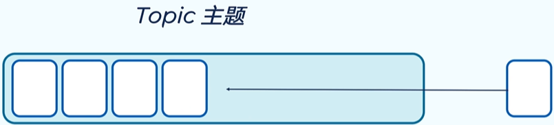
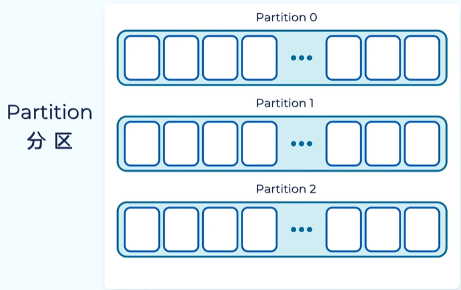
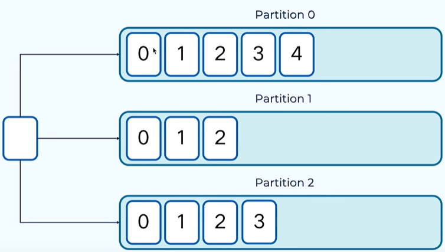
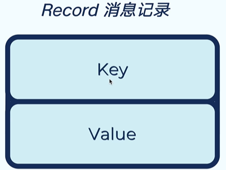
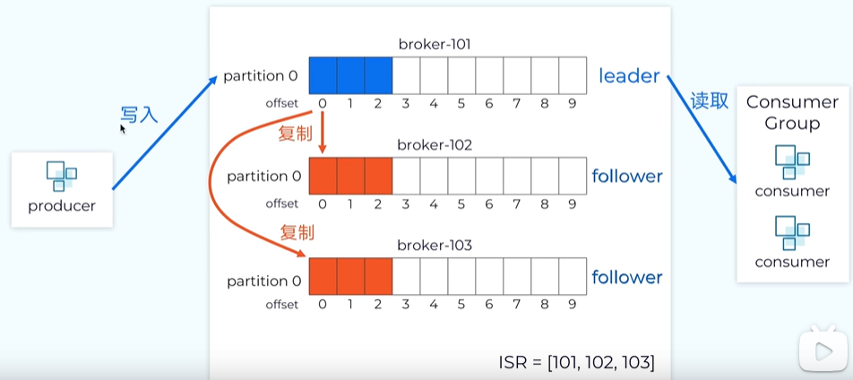

# Kafka一小时

## 简介

0.9.0版本：kafka是一个分布式，分区的，多副本的提交日志服务。

0.10.0版本：kafka是一个分布式的流处理平台。

1. 发布订阅消息队列
2. 存储记录流
3. 记录的流处理过程

kafka的优势：

1. 吞吐量高，性能好
2. 伸缩性好，支持在线水平扩展
3. 容错性和可靠性
4. 与大数据生态紧密结合，可无缝对接hadoop，strom，spark等

## 消息模型

**JMS规范**

只针对java语言，最常见的是 Apche ActiveMQ

**AMQP**

是一种协议，不只局限于java。AMQP模型有三大实体：1. 队列(queues) 2. 信箱(exchanges) 3. 绑定(bindings)     消息放到信箱里面，根据，根据绑定的路由规则，再将消息发送到队列里供消费者消费。

### 基本概念

kafka的消息存在于topic(主题，类似于数据库中的表)中，相同类型的消息存放到主题中，topic是半结构化的数据。某些情况下也可以将不同类型的消息存到同一个主题中。

主题包含多个分区。kafka将主题拆分成多个分区，不同的分区存在不同的服务器上，使得kafka具有拓展性。可以通过分区和节点的数量对kafka进行线性的拓展。

分区是一个线性增长的，不可变的提交日志。消息存储到分区后，不可变更。kafka为每条消息分配一个偏移量(记录每条消息的位置)。偏移量在每个分区中是唯一的，不可重复，递增的。

kafka中的消息是以record 键值对的形式存储的。key可以为空，如果key为空，kafka会以轮询的方式将消息写到不同的分区中。如果key不为空，相同key的消息会被写道一个分区。

相同分区不是只有一份，是有副本的。kafaka会选一个leader作为该分区的主分区。数据的读写都是在leader进行

