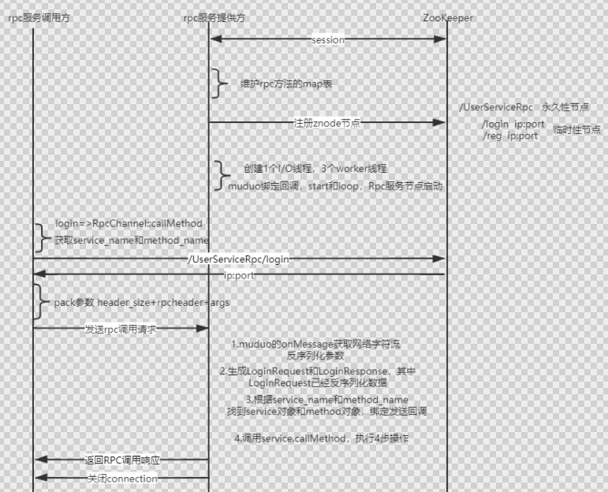
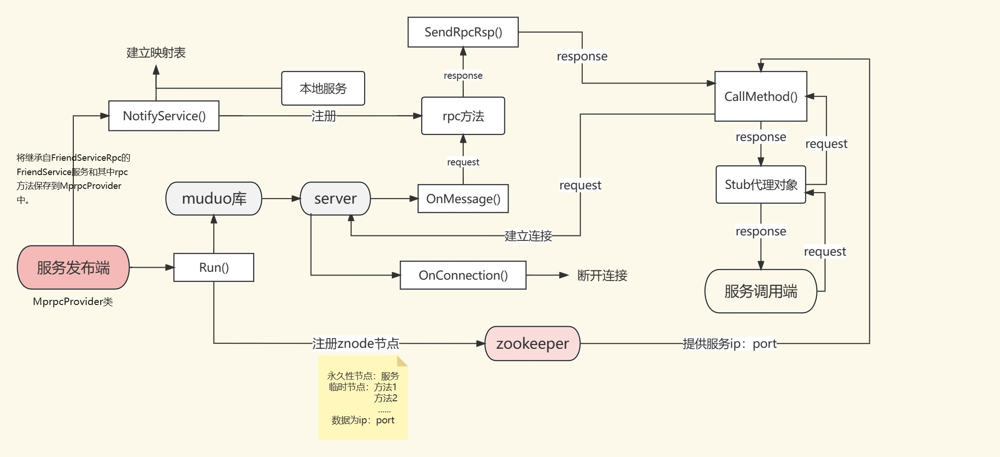

# 图片

# 项目概览

首先服务发布端和服务调用端要通过`protobuf`来进行序列化和反序列化就需要共同的`proto`文件，`proto`文件包含了`service`类型(服务)，服务中包含了`rpc`方法的描述。`proto`文件还包含了很多 `message`类型，主要是`rpc`方法的参数类型和`rpc`方法的响应类型。然后`protoc -friend.proto --cpp_out=./`将`proto`文件中描述的`message`和`service`生成对应的类到`.cc`和`.h`文件中。这样`rpc`框架的调用端和发布端就可以直接使用这些类。另外对于`rpc`消息的头也用了一个`proto`文件。

## 服务发布端

1. 首先利用类`MprpcApplication`和`MprpcConfig`初始化`mprpc`框架，主要是读取配置文件，配置文件中包含了`zookeeper`的`ip`和`port`。
2. 对于`proto`文件生成的服务类`FriendServiceRpc`中的`rpc`方法只是描述是虚函数，需要服务端自己继承`FriendServiceRpc`并重写服务中的`GetFriendsList`方法已完成服务端的调用。构建`MprpcProvider`框架类，并通过`MprpcProvider`的`NotifyService`方法将重写`FriendServiceRpc`的服务和服务中的`rpc`方法保存到`MprpcProvider`中的`map`。然后利用`MprpcProvider`中的`Run`方法启动服务端。在`Run`方法中利用`muduo`库的`TcpServer`对象进行监听(`muduo`库是典型的`reactor`模式如果是1个线程,那这个线程既是`io`线程(建立用户连接)和也是工作线程，如果是4个线程 那就是`io`线程占一个，其他线程是工作线程)，并在`TcpServer`对象绑定了新连接的回调和`rpc`调用的回调，然后将服务端的服务名和`rpc`方法名注册到`zookeeper`上。这个`rpc`回调触发时，先解析`rpc`消息头(`header_size`(4字节)） + `header_str`(服务名，方法名，参数大小) + `args_str`)，反序列化，然后构建本地`rpc`需要的`request`对象和`response`对象和发送响应的回调(在本地`rpc`业务完成后需要将响应发送回去)。然后调用`FriendServiceRpc`中重写的`rpc`方法，这个`rpc`方法完成后会调用发送响应的回调。这个回调函数主要完成的是将`rpc`方法生成的结果`responce`序列化并利用`muduo`的`TcpServer`将`response`发送回去，然后断开连接。

## 服务调用端

1. 首先利用类`MprpcApplication`和`MprpcConfig`初始化`mprpc`框架，主要是读取配置文件，配置文件中包含了`zookeeper`的`ip`和`port`。
2. 创建`MprpcChannel`类，该类中重写了`RpcChannel`的`CallMethod`的方法，(这个`CallMethod`方法将请求的服务名，方法名和方法参数拼接成规定的`rpc`请求头的格式，然后从`zookeeper`上获取要调用的方法的`ip`和`port`，然后将组装好的数据发送给`rpc`服务端)。将刚刚创建好的`MprpcChannel`类传递给继承自`FriendServiceRpc`的`FriendServiceRpc_Stub`装类。然后将远程`rpc`方法需要的`request`创建好后，利用装类调用远程的`rpc`方法。这个装类会通过刚刚传递给装类的`MprpcChannel`中的回调函数`CallMethod`进行序列化和简历`socket`进行远程`rpc`调用。

# xml, json, protobuf

xml很老了

json是基于文本存储的

protobuf是基于二进制存储的 protobuf效率更高 protobuf是紧密存储的  不携带除数据意外的任何信息   同样带宽 protobuf传输量更大

json需要键  这样键会占用空间

# zookeeper

**源码上会在1/3的timeout时间发送ping心跳消息**，防止服务发布端在`zookeeper`上注册的临时节点消失

## 原生ZkClient API存在的问题

2. 设置监听`watcher`只能是一次性的，每次出发后需要重新设置。`watcher`就是调用端可以订阅`zookeeper`某个节点(服务端)的消息，如果某个服务端ip和port发生变化，就会通知调用端。
3. `znode`节点只存储简单的`byte`字节数组，如果存储对象，需要自己转换对象生成字节数组

**b站学习zookeeper**

## 面试题总结

https://blog.csdn.net/qq_42120843/article/details/130923561?spm=1001.2014.3001.5502