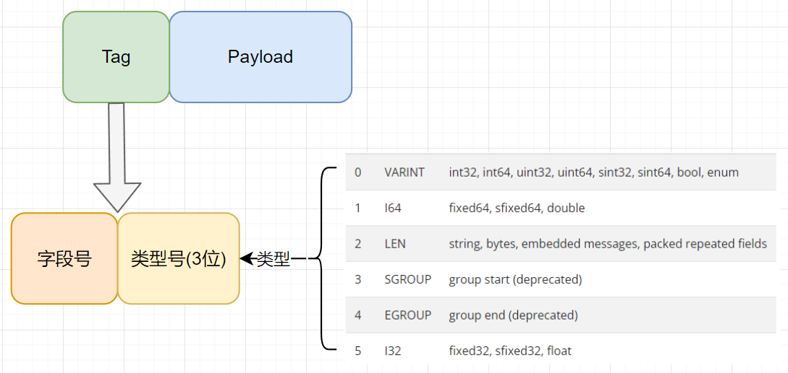

# protobuf编码方式

## 一个简单的例子

```cpp
message Test1 {
    optional int32 a = 1;
}
```

上述的`proto`文件，设置`a = 150`，那么将其序列化后，得到的数据就是`08 96 01`，然后你使用protoscope工具去解析这些数据，就得到`1 : 150`，下面我们分析一下这个例子的过程

这里我们分析一下最常用的变长整型，也就是`varints`，这个是`protobuf`的核心，允许使用1~10个字节来表示无符号64位的整数，小数字使用更小的字节数，来实现压缩数据

`protobuf`中的`varints`使用一个字节中的7位来表示数据，留一位来表示后续还有没有数据，这个表示位称为msb(most significant bit)，比如数字`1`被编码为`01`，它只占用一个字节，因此msb位是没有标记的，它的二进制格式如下：

```text
0000 0001
^ msb
```

然后上述的`150`将会被编码为`9601`，然后二进制格式如下：

```text
10010110 00000001
^ msb    ^ msb
```

可以发现按照上述的二进制格式直接转换为十进制格式并不是`150`，下面的过程给出如何进行转换的

```text
10010110 00000001        // 编码后的数据
 0010110  0000001        // 去掉首位的msb位.
 0000001  0010110        // 转换为大端序.
   00000010010110        // 组合一起.
 128 + 16 + 4 + 2 = 150  // 最后得到原始数字结果.
```

经过上面的过程，我们就可以得到150这个值了，但是1是啥意思呢，这就和`protobuf`协议的消息格式有关系了，下面我们解析一下

protobuf序列化后的数据也是一系列的`key-value`对，在protobuf里面使用列的编号来作为`key`的名字和数据类型，这些数据是需要参考`.proto`文件才能确定，protoscope是没有权限知道这些信息的，因此仅能解析出一个1，下面我们解析一下消息的结构，看看如何得到的这个1

protobuf采用了TLV(Tag-Length-Value)格式来组织数据，关于整型类型就是下面的结构`tag+payload`，主要的就是使用`tag`来表示结构体中的第几个字段和字段的类型，类型一共有6种 `VARINT, I64, LEN, SGROUP, EGROUP, and I32`，第几个字段就是定义message的时候每个成员后面的编号，向`tag`中添加类型信息的话使用`(field_number << 3) | wire_type`即可



经过上面对消息结构的分析，我们看上面`08 96 01`中的`08`，其二进制格式如下

```text
0000 1000
^ msb
```

可以得到是结构体中的第一个成员，并且类型是0，也就是`VARINT`类型，因此就得到了`1:VARINT 150`，也就分析完了。

tips

1. 由于不知定义的消息体有多少成员这里每个`kay-value`对的`tag`使用的`varints`来解析的，所以不一定只有一个字节
2. 由于`LEN`类型`payload`属于变长的，不确定有多少字节，因此在`tag`后会有一个按照`varints`类型解析的`len`字段来记录后面的`payload`占用多少字节，
3. 字段号是用来标记解析出来的信息是哪一个字段的，因此需要知道定义的`proto`文件才能知道，如果前后端不一致，可能会导致解析失败。字段的解析用不到字段号，但是序列化给对象的时候需要字段号。
