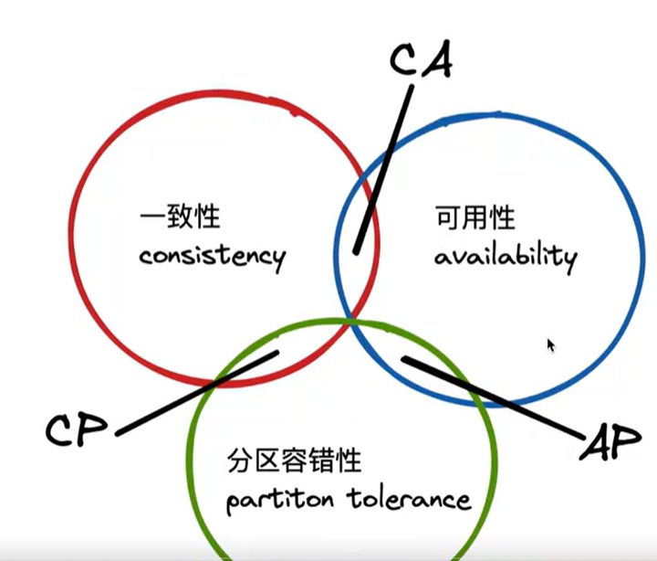
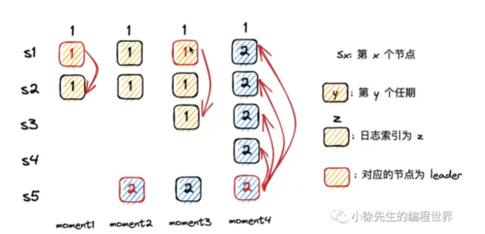

# paxos

# raft

raft是一个更易理解的共识算法。

raft问题分解，raft把公式算法分为三个子问题，**领导者选举，日志复制，安全性**，这三个子问题大体可以作为raft算法中的三个类来实现。

raft问题简化，raft对公式算法进行了极大的简化，使一台服务器只在三种状态间进行切换，服务器之间的通信仅通过两类RPC完成。

以上两点使得raft相比于其他共识算法非常的简洁。

## 1.复制状态机

## 2.状态简化

## 3.领导者选举

**正常情况：**

任何一条`AppendEntries`消息都会重置所有Raft节点的选举定时器。这样，只要`Leader`还在线，并且它还在以合理的速率（不能太慢）发出心跳或者其他的`AppendEntries`消息，`Followers`收到了`AppendEntries`消息，会重置自己的选举定时器，这样`Leader`就可以阻止任何其他节点成为一个候选人。所以只要所有环节都在正常工作，不断重复的心跳会阻止任何新的选举发生。当然，如果网络故障或者发生了丢包，不可避免的还是会有新的选举。但是如果一切都正常，我们不太可能会有一次新的选举。

**领导者选举失败的情况：**

1. 如果一次选举选出了0个`Leader`，这次选举就失败了。有一些显而易见的场景会导致选举失败，例如太多的服务器关机或者不可用了，或者网络连接出现故障。这些场景会导致你不能凑齐过半的服务器，进而也不能赢得选举，这时什么事也不会发生。

2. 一个导致选举失败的场景是，所有环节都在正常工作，没有故障，没有丢包，但是候选人们几乎是同时参加竞选，它们分割了选票（`Split Vote`）。假设我们有一个3节点的多副本系统，3个节点的选举定时器几乎同超时，进而期触发选举。首先，每个节点都会为自己投票。之后，每个节点都会收到其他节点的`RequestVote`消息，因为该节点已经投票给自己了，所以它会返回反对投票。这意味着，3个节点中的每个节点都只能收到一张投票（来自于自己）。没有一个节点获得了过半投票，所以也就没有人能被选上。接下来它们的选举定时器会重新计时，因为选举定时器只会在收到了`AppendEntries`消息时重置，但是由于没有`Leader`，所有也就没有AppendEntries消息。所有的选举定时器重新开始计时，**如果我们不够幸运的话，所有的定时器又会在同一时间到期，所有节点又会投票给自己，又没有人获得了过半投票，这个状态可能会一直持续下去。Raft不能完全避免分割选票（Split Vote），但是可以使得这个场景出现的概率大大降低。Raft通过为选举定时器随机的选择超时时间来达到这一点。一个明显的要求是，选举定时器的超时时间需要至少大于Leader的心跳间隔。不同节点的选举定时器的超时时间差（S2和S3之间）必须要足够长，使得第一个开始选举的节点能够完成一轮选举。这里至少需要大于发送一条RPC所需要的往返（Round-Trip）时间。**

## **4.日志复制**

## 5.安全性

## 6.集群成员变更

## 7.ParallelRaft

# 小徐先生 解析分布式共识算法之Raft算法

### p2分布式场景问题

**1.1** 集群节点数量有一个合适的范围，对增加节点不加以约束，会导致集群内部的网络请求成为系统瓶颈。

**1.2**分布式的优势和问题

​	纵向分布式 : 微服务

​	横向分布式 : 系统内不同节点共同承担一个职责  好处: 让第一节点压力减小(负载均衡)  避免单点故障(主从库数据备份)

不同节点需要保证**数据一致性**

### p3 CAP理论

Consitency:一致性 Availability 可用性 Partiition tlerance 分区容错性

### 领导者选举

1. follower会建立一个心跳检测定时器，定期接收leader的心跳，当超过指定时长未收到leader的心跳，转为canditate发起选举，尝试成为新leader

2. 什么样的follower有资格成为leader? 任期和日志足够新 拉票超过半数

###   为什么能保证一个任期内至多只有一个领导者？

通过领导者选举机制保证。

cnadidate选举前会自增Term，任期是单调递增的。

在选举机制上，一个follower只有一票，只能投给一个candidate。

cnadidate必须拿到半数以上的赞同票才能当选leader。

### 为什么能保证通过任期和索引相同的日志内容一定相同？

在同一个任期内只有一个领导者，在同一个任期内的日志只能由领导者颁发。

### 是否一项提议只需要被多数派通过就可以提交？

不可以。

可能出现被多数派认可的已经提交的日志被覆盖掉。

节点5在第二次成为leader时会覆盖掉日志1。

解决方法新上任的leader需要至少完成一笔本任期的写请求，才能够执行提交动作。上图，在节点1再次成为leader后必须写一条任期3的数据(防止s5成为leader)后，才能提交日志1。

### 如何解决网络分区引发的无意义选举？

在网络小分区中，选不出leader，就会一直递增任期号，在后续加入到大分区中时，由于任期号非常大会冲击原来的大分区，然是这个小分区的节点不会当选leader因为日志落后，但是原来大分区也不会有leader产生因为任期号被冲击了，但是会一段时间任期号追上来就可以了。但是这段时间耗费资源进行选举。

解决方法，让候选者发起选举前，先试探所有节点，得到大多数响应再发起选举。