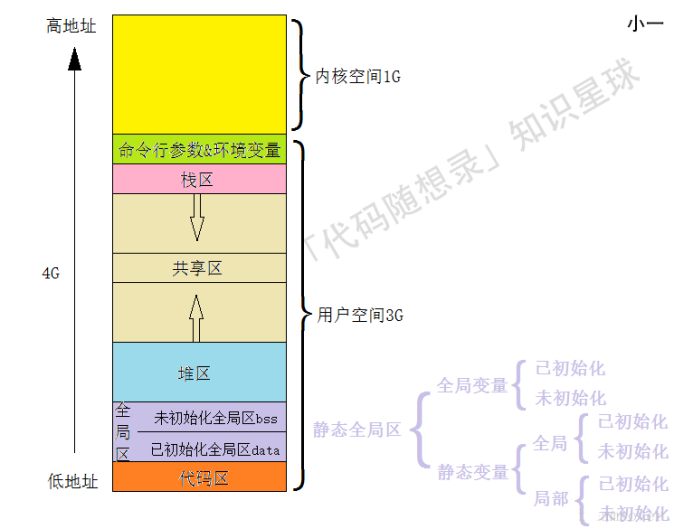
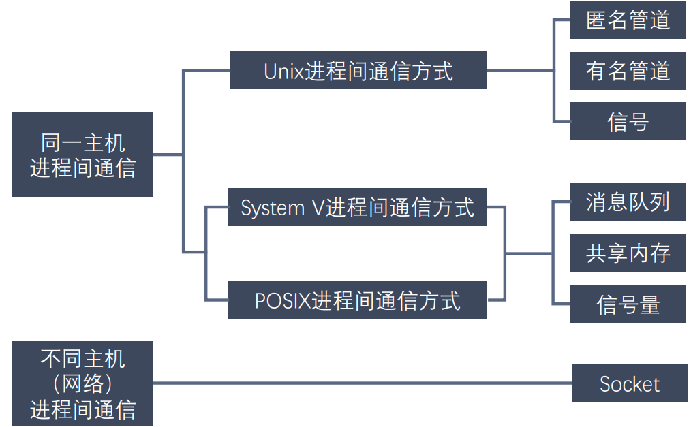
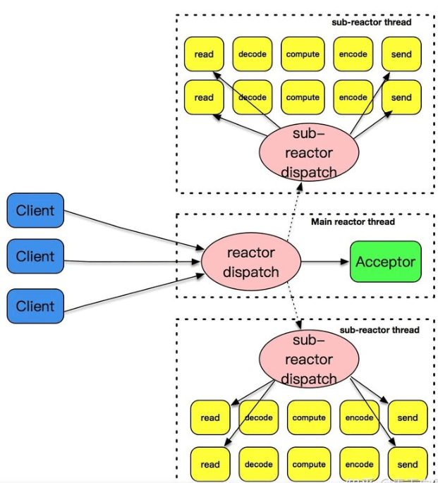
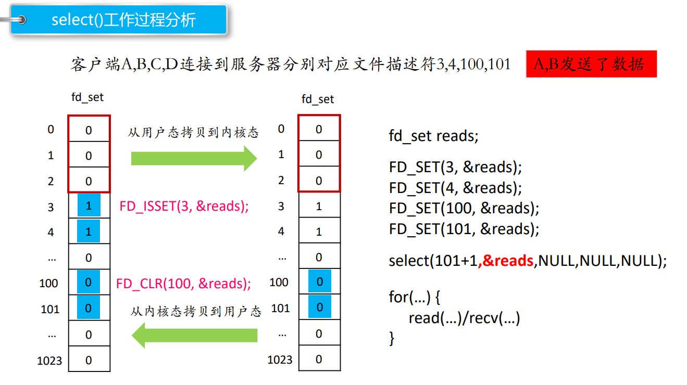
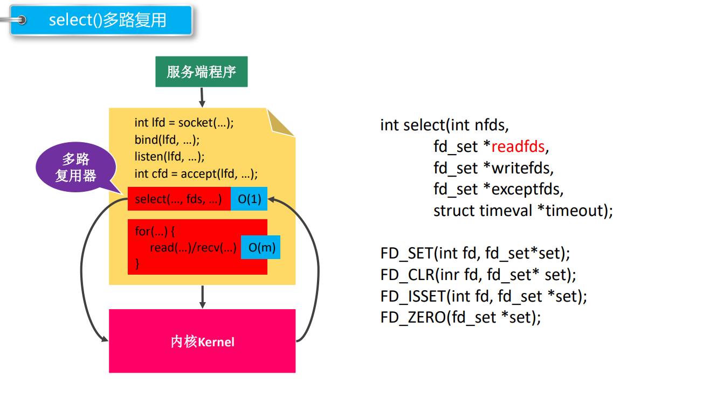
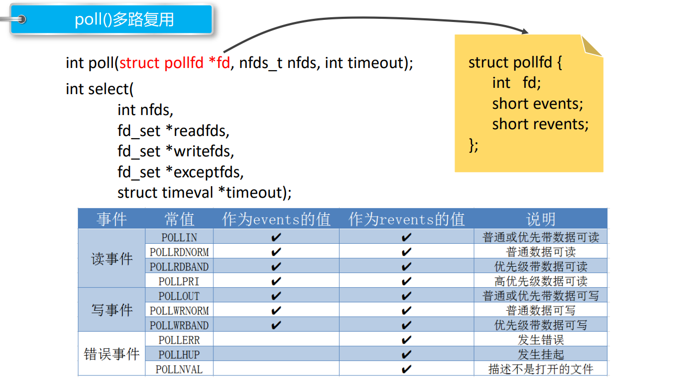
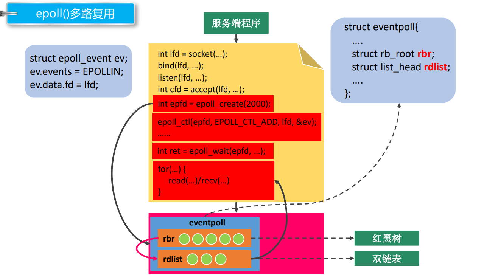
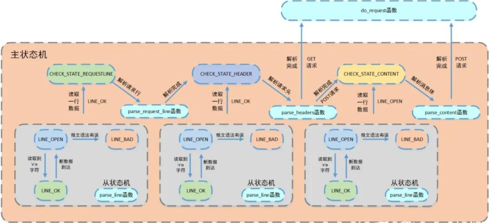

[TOC]


# 知识点

## 什么时候使用线程，什么时候使用进程？

**线程: **不同任务需要大量共享数据或频繁通信的情况下使用线程模型会比进程模型要来的好。IO密集型的情况下大多数情况下线程都会处于等IO的情况, 此时可以快速的在多个线程之间切换来提高CPU利用率。

**进程: **对于不同任务之间无需进行大量交互, 上下文切换不频繁的就可以使用多进程模型,比如守护进程, 无序和主任务进行交互, 使用多进程模型不会就信息交互的损耗, 同时可以防止多线程模型下线程崩溃导致的整个服务的崩溃。

## 进程间通信

操作系统中，每个进程会有两个栈，一个用户栈，存在于用户空间，一个内核栈，存在于内核空间。当进程在用户空间运行时，cpu堆栈指针寄存器里面的内容是用户堆栈地址，使用用户栈；当进程在内核空间时，cpu堆栈指针寄存器里面的内容是内核栈空间地址，使用内核栈。**(通过中断或系统调用进入内核态)**内核栈是内存中属于操作系统空间的一块区域，其主要用途为1.保存中断现场，对于嵌套中断，被中断程序的现场信息依次压入系统栈，中断返回时逆序弹出；保存操作系统子程序间相互调用的参数、返回值、返回点以及子程序(函数)的局部变量。




进程通信目的:

- 数据传输：一个进程需要将它的数据发送给另一个进程。 
- 通知事件：一个进程需要向另一个或一组进程发送消息，通知它（它们）发生了某种事件（如进程终止时要通知父进程）。 
- 资源共享：多个进程之间共享同样的资源。为了做到这一点，需要内核提供互斥和同步机制。  
- 进程控制：有些进程希望完全控制另一个进程的执行（如 Debug 进程），此时控制进程希望能够拦截另一个进程的所有陷入和异常，并能够及时知道它的状态改变。



- **管道** : 也叫无名（匿名）管道，它是是 UNIX 系统 IPC（进程间通信）的最古老形式， 所有的 UNIX 系统都支持这种通信机制。管道其实是一个在内核内存中维护的缓冲器，这个缓冲器的存储能力是有限的，不同的操作系统大小不一定相同。管道拥有文件的特质：读操作、写操作，匿名管道没有文件实体，有名管道有文件实体， 但不存储数据。可以按照操作文件的方式对管道进行操作。一个管道是一个字节流，使用管道时不存在消息或者消息边界的概念，从管道读取数据的进程可以读取任意大小的数据块，而不管写入进程写入管道的数据块的大小是多少。通过管道传递的数据是顺序的，从管道中读取出来的字节的顺序和它们被写入管道的顺序是完全一样的。在管道中的数据的传递方向是单向的，一端用于写入，一端用于读取，管道是半双工的。从管道读数据是一次性操作，数据一旦被读走，它就从管道中被抛弃，释放空间以便写 更多的数据，在管道中无法使用 lseek() 来随机的访问数据。

  - 创建匿名管道:`int pipe(int pipefd[2]);`匿名管道，由于没有名字，只能用于亲缘关系的进程间通信。为了克服这个缺点，提 出了有名管道（FIFO），也叫命名管道、FIFO文件。匿名管道只能在具有公共祖先的进程（父进程与子进程，或者两个兄弟进程，具有亲缘 关系）之间使用。

  - 有名管道（FIFO）不同于匿名管道之处在于它提供了一个路径名与之关联，以 FIFO 的文件形式存在于文件系统中，并且其打开方式与打开一个普通文件是一样的，这样 即使与 FIFO 的创建进程不存在亲缘关系的进程，只要可以访问该路径，就能够彼此 通过 FIFO 相互通信，因此，通过 FIFO 不相关的进程也能交换数据。一旦打开了 FIFO，就能在它上面使用与操作匿名管道和其他文件的系统调用一样的 I/O系统调用了（如read()、write()和close()）。与管道一样，FIFO 也有一 个写入端和读取端，并且从管道中读取数据的顺序与写入的顺序是一样的。FIFO 的 名称也由此而来：先入先出。有名管道（FIFO)和匿名管道（pipe）有一些特点是相同的，不一样的地方在于： 

    -  FIFO 在文件系统中作为一个特殊文件存在，但 FIFO 中的内容却存放在内存中。 
    - 当使用 FIFO 的进程退出后，FIFO 文件将继续保存在文件系统中以便以后使用。 
    - FIFO 有名字，不相关的进程可以通过打开有名管道进行通信。

    通过命令创建有名管道 :  `mkfifo`   管道名  通过函数创建有名管道 : `int mkfifo(const char *pathname, mode_t mode);` 一旦使用 mkfifo 创建了一个 FIFO，就可以使用 open 打开它，常见的文件 I/O 函数都可用于 fifo。如：close、read、write、unlink 等。FIFO 严格遵循先进先出（First in First out），对管道及 FIFO 的读总是 从开始处返回数据，对它们的写则把数据添加到末尾。它们不支持诸如 lseek() 等文件定位操作。

- **内存映射** : （Memory-mapped I/O）是将磁盘文件的数据映射到内存，用户通过修改内存就能修改磁盘文件。

  - 1.如果对mmap的返回值(ptr)做++操作(ptr++), munmap是否能够成功?
    void * ptr = mmap(...);
    ptr++;  可以对其进行++操作
    munmap(ptr, len);   // 错误,要保存地址  munmap不能成功
  - 2.如果open时O_RDONLY, mmap时prot参数指定PROT_READ | PROT_WRITE会怎样?
    错误，返回MAP_FAILED
    open()函数中的权限建议和prot参数的权限保持一致。
  - 3.如果文件偏移量为1000会怎样?
    偏移量必须是4K的整数倍，返回MAP_FAILED
  - 4.mmap什么情况下会调用失败?
    - 第二个参数：length = 0
    - 第三个参数：prot
      - 只指定了写权限
      - prot PROT_READ | PROT_WRITE
        第5个参数fd 通过open函数时指定的 O_RDONLY / O_WRONLY 
  - 5.可以open的时候O_CREAT一个新文件来创建映射区吗?
    - 可以的，但是创建的文件的大小如果为0的话，肯定不行
      - 可以对新的文件进行扩展
      - lseek()
      - truncate()
  - 6.mmap后关闭文件描述符，对mmap映射有没有影响？
        int fd = open("XXX");
        mmap(,,,,fd,0);
        close(fd); 
        映射区还存在，创建映射区的fd被关闭，没有任何影响。
  - 7.对ptr越界操作会怎样？
     void * ptr = mmap(NULL, 100,,,,,);
    4K
    越界操作操作的是非法的内存 -> 段错误


- **信号** : 信号是 Linux 进程间通信的最古老的方式之一，是事件发生时对进程的通知机制，有时也 称之为软件中断，它是在软件层次上对中断机制的一种模拟，是一种异步通信的方式。信号 可以导致一个正在运行的进程被另一个正在运行的异步进程中断，转而处理某一个突发事件。发往进程的诸多信号，通常都是源于内核。引发内核为进程产生信号的各类事件如下：

  - 对于前台进程，用户可以通过输入特殊的终端字符来给它发送信号。比如输入Ctrl+C 通常会给进程发送一个中断信号。
  - 硬件发生异常，即硬件检测到一个错误条件并通知内核，随即再由内核发送相应信号给 相关进程。比如执行一条异常的机器语言指令，诸如被 0 除，或者引用了无法访问的 内存区域。
  - 系统状态变化，比如 alarm 定时器到期将引起 SIGALRM 信号，进程执行的 CPU 时间超限，或者该进程的某个子进程退出。
  - 运行 kill 命令或调用 kill 函数。

  使用信号的两个主要目的是：让进程知道已经发生了一个特定的事情,强迫进程执行它自己代码中的信号处理程序。

  信号的特点: 简单 不能携带大量信息 满足某个特定条件才发送 优先级比较高

  `SIGINT ` 终止进程    `SIGQUIT`终止进程  `SIGKILL`  终止进程 可以杀死任何进程  `SIGSEGV`终止进程并产生core文件 `SIGPIPE`终止进程

  信号产生但是没有被处理 （未决）
      - 在内核中将所有的没有被处理的信号存储在一个集合中 （未决信号集）
          - SIGINT信号状态被存储在第二个标志位上
          - 这个标志位的值为0， 说明信号不是未决状态
          - 这个标志位的值为1， 说明信号处于未决状态

  这个未决状态的信号，需要被处理，处理之前需要和另一个信号集（阻塞信号集），进行比较
      - 阻塞信号集默认不阻塞任何的信号
          - 如果想要阻塞某些信号需要用户调用系统的API

  在处理的时候和阻塞信号集中的标志位进行查询，看是不是对该信号设置阻塞了
      - 如果没有阻塞，这个信号就被处理
          - 如果阻塞了，这个信号就继续处于未决状态，直到阻塞解除，这个信号就被处理

- 共享内存 : 共享内存允许两个或者多个进程共享物理内存的同一块区域（通常被称为段）。由于 一个共享内存段会称为一个进程用户空间的一部分，因此这种 IPC 机制无需内核介 入。所有需要做的就是让一个进程将数据复制进共享内存中，并且这部分数据会对其 他所有共享同一个段的进程可用。与管道等要求发送进程将数据从用户空间的缓冲区复制进内核内存和接收进程将数据 从内核内存复制进用户空间的缓冲区的做法相比，这种 IPC 技术的速度更快。

  - 调用 shmget() 创建一个新共享内存段或取得一个既有共享内存段的标识符（即由其 他进程创建的共享内存段）。这个调用将返回后续调用中需要用到的共享内存标识符。
  - 使用 shmat() 来附上共享内存段，即使该段成为调用进程的虚拟内存的一部分。
  - 此刻在程序中可以像对待其他可用内存那样对待这个共享内存段。为引用这块共享内存， 程序需要使用由 shmat() 调用返回的 addr 值，它是一个指向进程的虚拟地址空间 中该共享内存段的起点的指针。
  - 调用 shmdt() 来分离共享内存段。在这个调用之后，进程就无法再引用这块共享内存 了。这一步是可选的，并且在进程终止时会自动完成这一步。
  - 调用 shmctl() 来删除共享内存段。只有当当前所有附加内存段的进程都与之分离之 后内存段才会销毁。只有一个进程需要执行这一步。

- 消息队列 : [消息队列](https://so.csdn.net/so/search?q=消息队列&spm=1001.2101.3001.7020)是进程间通信的最主要方法之一，相比于其他方法而言，信号队列成功克服了信号传递信息少，管道只能承载无格式字节流以及缓冲区大小受限等缺点。在多进程之间需要协同处理某个任务时能够合理的进行进程间的同步以及数据交流。消息队列是 UNIX 下不同进程之间可实现共享资源的一种机制，UNIX允许不同进程将格式化的数据流以消息队列形式发送给任意进程。消息队列（Message Queue,简称MQ）是由内核管理的消息链接表，由消息队列标识符标识，标识符简称队列ID。消息队列提供了进程之间单向传送数据的方法，每个消息包含有一个正的长整型类型的数据段、一个非负的长度以及实际数据字节数（对应于长度），消息队列总字节数是有上限的，系统上消息队列总数也有上限。MQ传递的是消息，也就是进程间需要传递的数据，系统内核中有很多MQ，这些MQ采用链表实现并由系统内核维护，每个MQ用消息队列描述符（qid)来区分，每个MQ 的pid具有唯一性。如下图：在进程间通信时，一个进程A将消息加到由内核管理的MQ 末端，另一个进程B在MQ中获取消息（获取信息时不遵循先进先出的规则，也可以按照消息类型字段获取消息）
  
- 信号量 : 


## Reactor、Proactor和主从Reactor

服务器程序需要处理三类事件:I/O事件，信号以及定时事件，事件处理模式如下:

- Reactor模式：要求主线程（I/O处理单元）只负责监听文件描述符上是否有事件发生（可读、可写），若有，则立即通知工作线程（逻辑单元），将socket可读可写事件放入请求队列，读写数据、接受新连接以及处理客户请求均在工作线程中完成。
- Proactor模式：将所有的I/O操作和接受新连接都交给主线程和内核来处理（进行读、写），工作线程仅负责处理逻辑，如主线程读完成后`users[sockfd].read()`，选择一个工作线程来处理客户请求`pool->append(users + sockfd)`。正常proactor是用异步I/O的这样的话，尽管是主线程读写，但是调用异步I/O后，由系统内核进行读写(完成后通知主线程)，所以并不会耽搁主线程。
- 主从Reactor模式:主反应堆线程(主Reactor)通过accept方法获取已连接的套接字，然后将已连接的套接字分配给从反应堆线程(从Reactor)



​	通常使用同步I/O模型（如`epoll_wait`）实现Reactor，使用异步I/O（如`aio_read`和`aio_write`）实现Proactor。但在此项目中，我们使用的是**同步I/O模拟的Proactor**事件处理模式。

## 同步I/O与异步I/O

​	同步I/O:可以设置阻塞模式和非阻塞模式。非阻塞模式，如果是网络I/O的情况下，如果调用read后，如果内核缓冲区没有数据就直接返回，如果有内核缓冲区中有数据，要将内核缓冲区中的数据放到用户缓冲区中，然后read再返回。对于阻塞模式，如果调用read后，内核缓冲区没有数据，就一直在这里等待，直到网卡把数据放到内核缓冲区中，再将内核缓冲区中的数据放到用户缓冲区中，再返回。**所以对于同步I/O，无论是阻塞还是非阻塞，都少不了从内核缓冲区复制到用户缓冲区这一步,是由应用程序来完成的。**同步I/O要求用户自行执行

​	异步I/O:调用读写操作后，无论是否是阻塞I/O，直接返回，然后系统帮着把网卡里的数据放到内核缓冲区中，再放到用户缓冲区中，然后通知处理，也就是说异步I/O比同步I/O少了等待从内核缓冲区中复制到用户缓冲区的这一步。

**总结**

同步I/O向应用程序通知的是I/O就绪事件，异步I/O向应用程序通知的是I/O完成事件。

### 同步I/O(阻塞)：


- 当调用 read 方法时，会阻塞着，此时内核会向磁盘发起 I/O 请求，磁盘收到请求后，便会寻址，当磁盘数据准备好后，就会向内核发起 I/O 中断，告知内核磁盘数据已经准备好；
- 内核收到 I/O 中断后，就将数据从磁盘控制器缓冲区拷贝到 PageCache 里；
- 最后，内核再把 PageCache 中的数据拷贝到用户缓冲区，于是 read 调用就正常返回了。

### 异步I/O：


- 前半部分，内核向磁盘发起读请求，但是可以**不等待数据就位就可以返回**，于是进程此时可以处理其他任务；
- 后半部分，当内核将磁盘中的数据拷贝到进程缓冲区后，进程将接收到内核的**通知**，再去处理数据；

## 服务器两种并发编程模式(网络并发模型，网络并发的设计模式)

### 半同步/半异步模式(变体是半同步/半反应堆模式)

参考博客:https://zhuanlan.zhihu.com/p/58860015?hmsr=toutiao.io&utm_medium=toutiao.io&utm_source=toutiao.io	

​	综上，也就是说当一个客户端发送请求的时候，整个服务端的逻辑一分为二。第一部分，接收请求数据是异步的；第二部分，在收完数据之后的处理逻辑是同步的。所谓半同步，半异步因此得名。(我觉得这和proactor一样啊)

​	HSHA模式十分依赖异步IO，然而实现真异步通常是比较困难，即便Linux有AIO系列API，但其实十分鸡肋，内部用pthread模拟，在这方面不如Windows的IOCP。而当时IO多路复用技术的发展，带给了人们新的思路，用IO多路复用代替异步IO，对HSHA进行改造。这就是『半同步/半反应堆』模型（Half-Sync/Half-Reactor，以下简称HSHR）。

​	**半同步/半反应堆模式**

​	循环之初，Polling API（select/poll/epoll/kqueue）只监听服务端socket，当监测到服务端socket可读，就会进行进行accept，获得客户端fd放入队列。也就是说和HSHA不同，HSHR的队列中存放的不是请求数据，而是fd。工作线程从队列中取的不是数据，而是客户端fd。和HSHA不同，HSHR将IO的过程侵入到了工作线程中。**工作线程的逻辑循环内从队列取到fd后，对fd进行read/recv获取请求数据，然后进行处理，最后直接write/send客户端fd，将数据返回给客户端**。可以看出来，这种IO的方式是一种Reactor模式，这就是该模型中，半反应堆（Half-Reactor）一词的由来。当然队列中存储的元素并不是简单的int来表示fd，而是一个结构体，里面除了包含fd以外还会包含一些其他信息，比如状态之类的。如果队列是数组，则需要有状态标记，fd是否就绪，是否已被消费等等。工作线程每次取的时候不是简单的竞争队首元素，而是也要判断一下状态。当然如果是链表形式的队列，也可以通过增删节点，来表示fd是否就绪，这样工作线程每次就只需要竞争队首了，只不过在每个连接频繁发送数据的时候，会频繁的增删相同的fd节点，这样的链表操作效率未必比数组高效。

### 领导者和追随者模式

领导者和追随者模式是多个工作线程轮流获得事件源集合，轮流监听、分发并处理事件的一种模式。在任意时间点，程序都仅有一个领导者线程，它负责监听I/O事件。而其他线程都是追随者，他们休眠在线程池中等待成为新的领导者。当前的领导者如果检测到I/O事件，首先要从线程池中推选出新的领导者线程，然后处理I/O事件。此时，新的领导者等待新的I/O事件，而原来的领导者则处理I/O事件，二者实现并发。

## epoll，select，poll区别？为什么用epoll

I/O 多路复用使得程序能同时监听多个文件描述符，能够提高程序的性能，Linux 下实现 I/O 多路复用的 系统调用主要有 select、poll 和 epoll。

#### select

1. 首先要构造一个关于文件描述符的列表，将要监听的文件描述符添加到该列表中。 

2.  调用一个系统函数，监听该列表中的文件描述符，直到这些描述符中的一个或者多个进行I/O 操作时，该函数才返回。

    a.这个函数是阻塞  b.函数对文件描述符的检测的操作是由内核完成的 

3. 在返回时，它会告诉进程有多少（哪些）描述符要进行I/O操作。

```c
// sizeof(fd_set) = 128 1024
#include <sys/time.h>
#include <sys/types.h>
#include <unistd.h>
#include <sys/select.h>
int select(int nfds, fd_set *readfds, fd_set *writefds, fd_set *exceptfds, struct timeval *timeout);
- 参数：
    - nfds : 委托内核检测的最大文件描述符的值 + 1
    - readfds : 要检测的文件描述符的读的集合，委托内核检测哪些文件描述符的读的属性
        - 一般检测读操作
        - 对应的是对方发送过来的数据，因为读是被动的接收数据，检测的就是读缓冲区
        - 是一个传入传出参数
    - writefds : 要检测的文件描述符的写的集合，委托内核检测哪些文件描述符的写的属性
    	- 委托内核检测写缓冲区是不是还可以写数据（不满的就可以写）
    - exceptfds : 检测发生异常的文件描述符的集合
    - timeout : 设置的超时时间
    struct timeval {
        long tv_sec; /* seconds */
        long tv_usec; /* microseconds */
    };
    - NULL : 永久阻塞，直到检测到了文件描述符有变化
    - tv_sec = 0 tv_usec = 0， 不阻塞
    - tv_sec > 0 tv_usec > 0， 阻塞对应的时间
    - 返回值 :
        -1 : 失败
        >0(n) : 检测的集合中有n个文件描述符发生了变化

void FD_CLR(int fd, fd_set *set);// 将参数文件描述符fd对应的标志位设置为0
int FD_ISSET(int fd, fd_set *set);// 判断fd对应的标志位是0还是1， 返回值 ： fd对应的标志位的值，0，返回0， 1，返回1
void FD_SET(int fd, fd_set *set);// 将参数文件描述符fd 对应的标志位，设置为1
void FD_ZERO(fd_set *set);// fd_set一共有1024 bit, 全部初始化为0
```






#### **poll**

```c
#include <poll.h>
struct pollfd {
    int fd; /* 委托内核检测的文件描述符 */
    short events; /* 委托内核检测文件描述符的什么事件 */
    short revents; /* 文件描述符实际发生的事件 */
};
struct pollfd myfd;
myfd.fd = 5;
myfd.events = POLLIN | POLLOUT;
int poll(struct pollfd *fds, nfds_t nfds, int timeout);
- 参数：
    - fds : 是一个struct pollfd 结构体数组，这是一个需要检测的文件描述符的集合
    - nfds : 这个是第一个参数数组中最后一个有效元素的下标 + 1
    - timeout : 阻塞时长
        0 : 不阻塞
        -1 : 阻塞，当检测到需要检测的文件描述符有变化，解除阻塞
        >0 : 阻塞的时长
    - 返回值：
        -1 : 失败
        >0 (n) : 成功,n表示检测到集合中有n个文件描述符发生变化

```



#### **epoll**

```c
#include <sys/epoll.h>
/* 创建一个新的epoll实例。在内核中创建了一个数据，这个数据中有两个比较重要的数据，一个是需要检
测的文件描述符的信息（红黑树），还有一个是就绪列表，存放检测到数据发送改变的文件描述符信息（双向链表）。*/
int epoll_create(int size);
- 参数：
    size : 目前没有意义了。随便写一个数，必须大于0
    - 返回值：
        -1 : 失败
        > 0 : 文件描述符，操作epoll实例的
typedef union epoll_data {
    void *ptr;
    int fd;
    uint32_t u32;
    uint64_t u64;
} epoll_data_t;

struct epoll_event {
    uint32_t events; /* Epoll events */
    epoll_data_t data; /* User data variable */
};
常见的Epoll检测事件：
    - EPOLLIN
    - EPOLLOUT
    - EPOLLERR
// 对epoll实例进行管理：添加文件描述符信息，删除信息，修改信息
int epoll_ctl(int epfd, int op, int fd, struct epoll_event *event);
- 参数：
    - epfd : epoll实例对应的文件描述符
    - op : 要进行什么操作
        EPOLL_CTL_ADD: 添加
        EPOLL_CTL_MOD: 修改
        EPOLL_CTL_DEL: 删除
    - fd : 要检测的文件描述符
    - event : 检测文件描述符什么事情
// 检测函数
int epoll_wait(int epfd, struct epoll_event *events, int maxevents, int timeout);
- 参数：
    - epfd : epoll实例对应的文件描述符
    - events : 传出参数，保存了发送了变化的文件描述符的信息
    - maxevents : 第二个参数结构体数组的大小
    - timeout : 阻塞时间
        - 0 : 不阻塞
        - -1 : 阻塞，直到检测到fd数据发生变化，解除阻塞
        - > 0 : 阻塞的时长（毫秒）
    - 返回值：
        - 成功，返回发送变化的文件描述符的个数 > 0
        - 失败 -1
```



**总结：**

- 对于select和poll来说，所有文件描述符都是在用户态被加入其文件描述符集合的，每次调用都需要将整个集合拷贝到内核态；epoll则将整个文件描述符集合维护在内核态，每次添加文件描述符的时候都需要执行一个系统调用。系统调用的开销是很大的，而且在有很多短期活跃连接的情况下，epoll可能会慢于select和poll由于这些大量的系统调用开销。
- select使用线性表描述文件描述符集合，文件描述符有上限；poll使用链表来描述；epoll底层通过红黑树来描述，并且维护一个ready list，将事件表中已经就绪的事件添加到这里，在使用epoll_wait调用时，仅观察这个list中有没有数据即可。
- select和poll的最大开销来自内核判断是否有文件描述符就绪这一过程：每次执行select或poll调用时，它们会采用遍历的方式，遍历整个文件描述符集合去判断各个文件描述符是否有活动；epoll则不需要去以这种方式检查，当有活动产生时，会自动触发epoll回调函数通知epoll文件描述符，然后内核将这些就绪的文件描述符放到之前提到的ready list中等待epoll_wait调用后被处理。
- select和poll都只能工作在相对低效的LT模式下，而epoll同时支持LT和ET模式。
- 综上，当监测的fd数量较小，且各个fd都很活跃的情况下，建议使用select和poll；当监听的fd数量较多，且单位时间仅部分fd活跃的情况下，使用epoll会明显提升性能。


### epoll一定比select效率高吗？

不一定	

高并发场景用epoll非select，主要是select的bitmap size，能监控的fd大小最多1024， 限制僵硬。

### epoll对文件操作描述符的模式：LT（水平触发）和ET（边缘触发）

- LT（电平触发）：类似`select`，LT会去遍历在epoll事件表中每个文件描述符，来观察是否有我们感兴趣的事件发生，如果有（触发了该文件描述符上的回调函数），`epoll_wait`就会以非阻塞的方式返回。若该epoll事件没有被处理完（没有返回`EWOULDBLOCK`），该事件还会被后续的`epoll_wait`再次触发。
- ET（边缘触发）：ET在发现有我们感兴趣的事件发生后，立即返回，并且`sleep`这一事件的`epoll_wait`，不管该事件有没有结束。

在使用ET模式时，必须要保证该文件描述符是非阻塞的（确保在没有数据可读时，该文件描述符不会一直阻塞，因为ET只会通知一次，要循环调用read，一次全读完，所以如果是阻塞read，最后读完会阻塞住）；并且每次调用`read`和`write`的时候都必须等到它们返回`EWOULDBLOCK`（确保所有数据都已读完或写完）。

ET 模式在很大程度上减少了 epoll 事件被重复触发的次数，因此效率要比 LT 模式高。

## 线程安全的hash表threadsafe_lookup_table

	线程安全的查找结构，实现一个类似线程安全的map结构，但是map基于红黑树实现，假设我们要增加或者删除节点，设计思路是依次要删除或增加节点的父节点，然后修改子节点数据 。尽管这种思路可行，但是难度较大，红黑树节点的插入要修改多个节点的关系。另外加锁的流程也是锁父节点，再锁子节点，尽管在处理子节点时我们已经处理完父节点，可以对父节点解锁，继续对子节点加锁，这种情况锁的粒度也不是很精细，考虑用散列表实现。对于链表的增删改查需要加锁,所以考虑将链表封装为一个类`bucket_type`,支持数据的增删改查。将整体的查找表封装为`threadsafe_lookup_table`类，实现散列规则和调度`bucket_type`类。

​	在`threadsafe_lookup_table`类中定义`bucket_type`类，并在`bucket_type`中将`threadsafe_lookup_table`设置为友元类。在`bucket_type`类中定义一个链表，链表中存放的是pair的键值对。为保证读并发定义了一个读写锁`shared_mutex`。

```c++
using bucket_value = std::pair<Key, Value>;             // 存储元素的类型为pair 由key和value构成
using bucket_data = std::list<bucket_value>;            // 用链表存储元素
using bucket_iterator = typename bucket_data::iterator; // 链表的迭代器
bucket_data data;                                       // 链表数据
mutable std::shared_mutex mutex;                        // 共享锁 单个桶内用共享锁 可以并发读 互斥写
//在bucket_type内部定义以下函数
bucket_iterator find_entry_for(const Key & key)//内部私有查找函数  返回迭代器
Value value_for(Key const& key, Value const& default_value)//查找函数
void add_or_update_mapping(Key const& key, Value const& value)//添加key和value，找到则更新，没找到则添加
void remove_mapping(Key const& key)//删除对应的key
```

`threadsafe_lookup_table`类里用`vector`存储`bucket_type`的指针 然后利用`std::hash`作为默认hash算法

```c++
std::vector<std::unique_ptr<bucket_type>> buckets; //用vector存储桶类型
Hash hasher;    //hash<Key> 哈希表 用来根据key生成哈希值
bucket_type& get_bucket(Key const& key) const////根据key生成数字，并对桶的大小取余得到下标，根据下标返回对应的桶
Value value_for(Key const& key, Value const& default_value = Value()) //先根据key找到对应桶 然后调用底层桶的查找
void add_or_update_mapping(Key const& key, Value const& value)//先根据key找到对应桶 然后调用底层桶的加入函数
void remove_mapping(Key const& key)//先根据key找到对应桶 然后调用底层桶的删除函数
std::map<Key, Value> get_map()//把所有的pair放入map中返回
```

## 面试问题

### 为什么做这个项目

看过游双的Linux高性能服务器编程，想把书上的内容实践一下。

### 项目介绍

​	这个项目是我在学习Linux 网络编程编程过程中开发的轻量级Web服务器。

​	服务器的模型是proactor加线程池的模式，用到了IO多路复用技术，处理多个客户端的http请求，访问服务器上的图片，支持get和post。然后进行了一些优化，用C++11标准线程库实现的线程池，实现了线程安全的查找表存储用户的账户名和密码，实现了LFU缓存文件，实现了内存池进行内存分配，提高内存分配效率。

### 压力测试

命令:webbench -c 10500 -t 5 http://114.115.203.46:9006/

如果

### 线程的同步机制有哪些？

信号量，条件变量，互斥量等；

条件变量:一个线程等待某个条件为真，将自己挂起；另一个线程使得条件成立，并通知等待的线程继续，条件变量要和互斥锁一起使用。如果生产者线程进行notify的时候，消费者线程还没有处于wait状态，会出现<font color = "red">**唤醒丢失**</font>，由于错过了唤醒信号，消费者可能会一直等待。加个flag记录状态既可以解决，condition_variable的wait的参数中加个lambda表达式，判断flag状态。

信号量:最主要的是可以指明可用资源的数量。

**条件变量和信号量的最大区别就是，条件变量可以一次唤醒所有的线程，信号量一次只能唤醒一个线程。**

### 如果同时1000个客户端进行访问请求，线程数不多，怎么能即使相应处理每个？

不是每个客户连接对应一个线程，当有任务需要处理时，主线程会将任务加入到任务队列，线程进行竞争执行。还是慢，可以增大线程池里的线程数量，或者考虑集群分布式，交给其他服务器处理。

### 如果一个客户请求要占用线程很久的时间，会不会影响接下来的客户请求呢，有什么策略？

会影响，客户请求长时间占用线程资源，会影响到服务器整体的相应速度。1.可以给每个线程设定时间，类似操作系统时间片 2.直接断开连接

### 说一下服务器使用的并发模型？

**使用的是半同步半反应堆的并发模型**，采用的是同步I/O模拟的proactor，主线程充当异步线程，负责监听socket上的事件，接受新连接，读写数据，然后将数据放到队列上，当工作队列上任务到来，工作线程竞争处理业务逻辑。

### HTTP报文解析相关

链接:https://zhuanlan.zhihu.com/p/560878390



#### 为什么用状态机？

可以描述状态变化过程，让服务器可以根据不同状态或者消息类型进行相应的处理逻辑，让程序逻辑清晰易懂

主状态机是一个while循环，循环中先调用从状态机parse_line()函数解析一行，状态OK就get_line()获取这一行数据，然后根据主状态机状态(行，头，体)switch，如果当前状态是解析请求行就调用解析请求行函数、解析请求头状态就调用解析请求头函数、解析请求体就调用解析请求体函数，根据这几个函数的返回结果更新主状态机状态。从解析请求头状态到解析请求体状态，看请求体长度是不是0

#### HTTP状态码

HTTP有5种类型的状态码，具体的：

- 1xx：指示信息--表示请求已接收，继续处理。
- 2xx：成功--表示请求正常处理完毕。
  - 200 OK：客户端请求被正常处理。
  - 206 Partial content：客户端进行了范围请求。
- 3xx：重定向--要完成请求必须进行更进一步的操作。
  - 301 Moved Permanently：永久重定向，该资源已被永久移动到新位置，将来任何对该资源的访问都要使用本响应返回的若干个URI之一。
  - 302 Found：临时重定向，请求的资源现在临时从不同的URI中获得。
- 4xx：客户端错误--请求有语法错误，服务器无法处理请求。
  - 400 Bad Request：请求报文存在语法错误。
  - 403 Forbidden：请求被服务器拒绝。
  - 404 Not Found：请求不存在，服务器上找不到请求的资源。
- 5xx：服务器端错误--服务器处理请求出错。
  - 500 Internal Server Error：服务器在执行请求时出现错误。

### https协议为什么安全

HTTP协议传输的数据是明文的，不安全，SSL（Secure Sockets Layer）协议用于对HTTP协议传输的数据进行加密，从而就诞生了HTTPS。简单来说，HTTPS协议是由SSL+HTTP协议构建的可进行加密传输、身份认证的网络协议，要比http协议安全。HTTPS 是应用层协议，需要先完成 TCP 连接建立，然后走 TLS 四次握手过程后，才能建立通信安全的连接。

看小林coding:https://www.xiaolincoding.com/network/2_http/https_rsa.html#tls-%E6%8F%A1%E6%89%8B%E8%BF%87%E7%A8%8B

### GET和POST的区别

- get主要用来获取数据，post主要用来提交或修改数据。
- get的参数有长度限制，最长2048字节，而post没有限制。
- get是明文传输，可以直接通过url看到参数信息，post是放在请求体中，除非用工具才能看到。
- get的参数会附加在url中，以 " ？"分割url和传输数据，多个参数用 "&"连接， 而post会把参数放在http请求体中。
- get请求会保存在浏览器历史记录中，也可以保存在web服务器日志中。
- get请求会被浏览器主动缓存，而post不会，除非手动设置。
- get在浏览器回退时是无害的，而post会再次提交请求。
- get请求只能进行url编码，而post支持多种编码方式。
- get请求的参数数据类型只接受ASCII字符，而post没有限制。
- get是幂等的，而post不是幂等的。 幂等性：对同一URL的多个请求应该返回同样的结果。

### 登录说一下

在初始化的时候，将数据库的中的用户名和密码存到一个自己写的线程安全的查找表。

在对单个报文解析的时候，提取用户名和密码。

页面跳转，在post提交时会

### 要保存状态，怎么做？

可以利用session或者cookie的方式进行状态保存，

**cookie**就是服务器给客户端分配了一串身份标识，每次客户端发送数据的时候，都带上这个标识。

session是保存在服务器端的状态，每当一个客户发送HTTP报文过来，服务器会在自己记录的状态中去找。

Cookie + Session：采用 Cookie + Session 方式实现 SSO，其原理是在用户登录之后，认证服务器将用户信息存储在 Session 中，并生成一个 Session ID，然后将该 Session ID 存储在 Cookie 中，并返回给用户。用户在访问其他应用系统时，该系统会向认证服务器发送请求，并带上 Cookie 中的 Session ID。认证服务器通过 Session ID 来判断该用户是否已经登录过，如果已经登录过，则返回一个新的 Session ID 给应用系统，否则需要用户重新登录

### 登录中的用户名和密码你是load到本地，然后使用map匹配的，如果有10亿数据，即使load到本地后hash，也是很耗时的，你要怎么优化？

将所有的用户信息加载到内存中耗时耗利，利用hash建立多级索引的方式来加快用户验证，将10亿用户信息，利用缩小1000倍的hash算法进行hash，这是就获得了100万的hash数据，每一个hash数据代表着一个用户信息块，然后再分别对这100万的hash数据再进行hash，最后剩下1000个数据。

### 为什么要用定时器？说一下定时器工作原理

处理非活跃链接，节省系统资源。

使用SIGALRM信号来实现定时器，在创建用户连接的时候创建一个对应的定时器，设置好过期时间，放到定时器链表中，然后通过alarm函数定时发送SIGALRM信号，服务器主循环会调用定时器链表的tick()心搏函数，处理链表上的过期定时器。

定时器链表:添加定时器O(n),删除O(1)

时间堆定时器:将定时器创建成最小堆，时间最小的定时器放在堆顶，tick时循环处理堆顶定时器重新建堆，直到堆顶未过期。插入删除都是O(logn)

### 日志运行机制？

服务器初始化的时候，利用单例模式初始化日志，默认同步，可设置异步。

### 为什么要异步，和同步的区别是什么?

同步方式写入日志时,如果某条日志信息量过大,会阻塞服务器主线程,,异步日志能提高并发.

异步需要双缓冲区,双缓冲区是为了缓解内存读写速度和IO读写速度不匹配的问题，如果不开启异步线程，则不需要，因为当前进程会被IO阻塞，不存在读写速度不匹配的问题。但是当开启异步线程时，IO读写速度和内存读写速度不匹配，容易导致数据丢失，所以开启异步线程时需要使用双缓冲区。

### 如果要监控一台服务器状态,输出控制日志,应该如何将日志分发到不同机器上?

可以使用消息队列.

### 服务器压测

​	利用webbench,原理是,父进程fork若干子进程,每个子进程在用户要求时间对目标web循环发出访问请求,父子进程通过管道通信,子进程通过管道把测试记录发送给父进程,然后父进程在所有子进程退出后汇总测试结果,然后退出.

​	测试遇到的问题?普通用户fork的进程会有上限,需要该配置文件,

### 线程池线程数量怎么确定?

如果是cpu密集型任务 数量=cpu核心数+1

如果是IO密集型任务 数量 = cpu核心数*2 + 1

线程等待时间与线程cpu时间之比约高,就需要更多的线程.

### 项目中的设计模式, 单例模式

单例模式 : 在线程池、内存池、日志、连接池中都用到了

单例模式分为懒汉式和饿汉式,两者之间的区别在于船舰实例的时间不同:

- 懒汉式 : 指系统运行中，实例并不存在，只有当需要使用该实例时，才会去创建并使⽤实例。（这种方式要考虑线程安全）
- 饿汉式：指系统⼀运行，就初始化创建实例，当需要时，直接调用即可。（本身就线程安全，没有多线程的问题）
