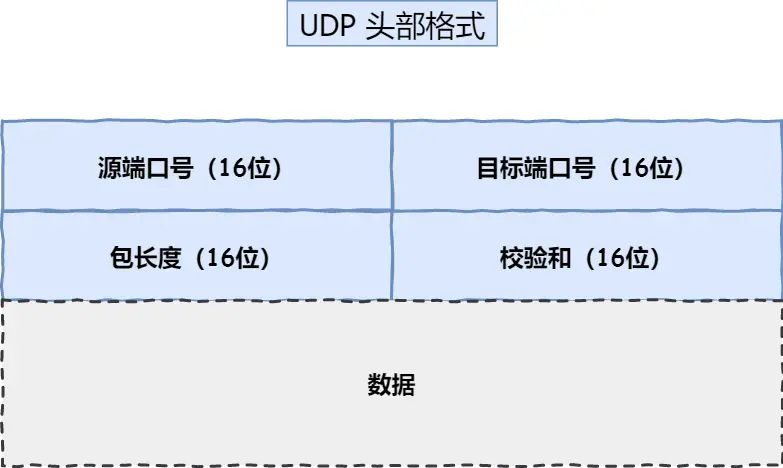
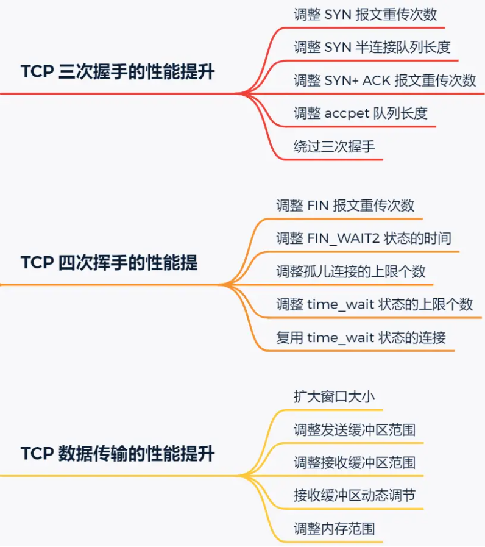
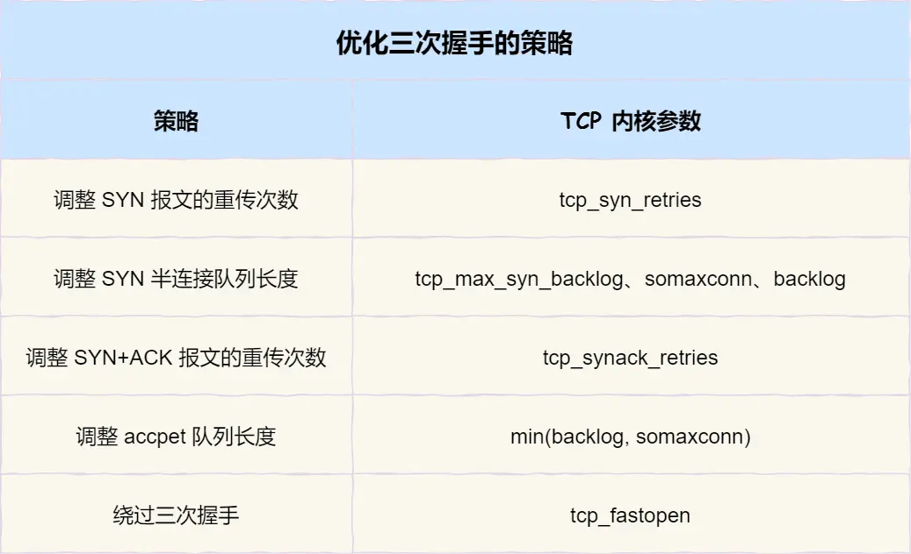
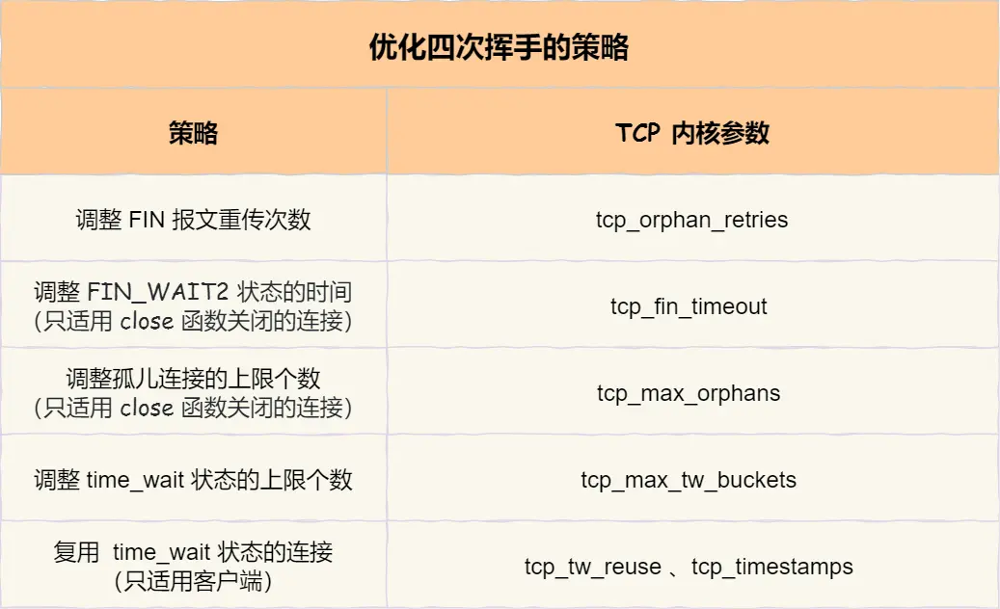
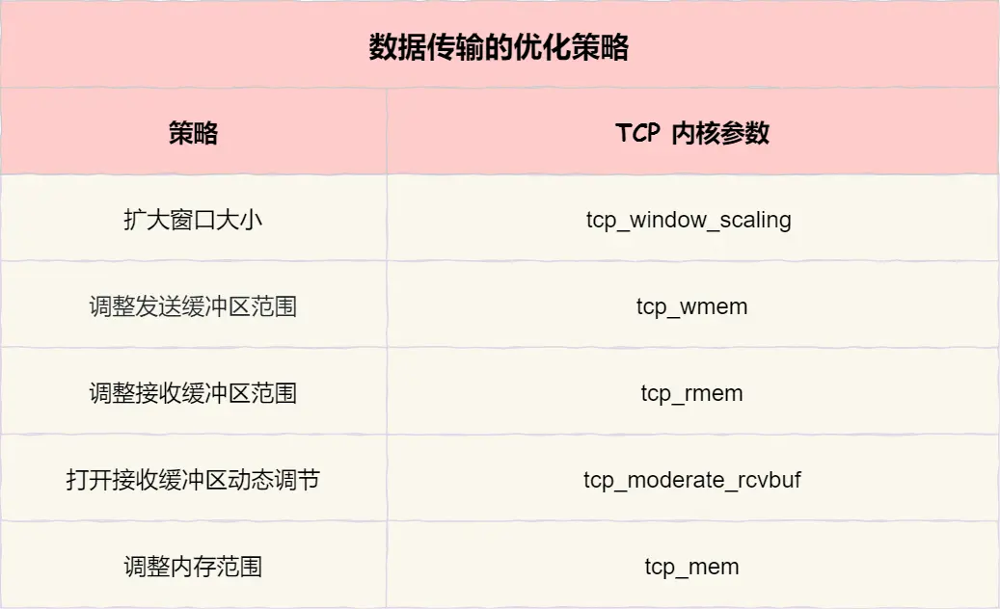

# 小林coding计算机网络

## linux系统如何收发网络包？

**收包过程：**

1. 当有网络包到达时，会通过 DMA 技术，将网络包写入到ring buffer的环形缓冲区中，接着网卡向 CPU 发起硬中断，当 CPU 根据中断表，调用中断处理函数。
2. 中断处理函数会发起软中断，内核线程 ksoftirqd 处理软中断，会来轮询处理数据。
3. ksoftirgd 线程会从 Ring Buffer 中获取数据，作为一个网络包交给网络协议栈进行逐层处理。
4. 网络接口层：检查报文的合法性。
5. 网络层：确认这个网络包是发给本机还是转发出去。
6. 传输层取出 TCP 头或 UDP 头，根据四元组找到socket，把数据放到socket的接受缓冲区中。
7. 应用层：调用 Socket 接口，将内核的 Socket 接收缓冲区的数据拷贝到应用层的缓冲区，然后唤醒用户进程。

**发包过程与收包过程相反**

## 发送网络数据时，有几次内存拷贝？
1. 第一次，调用发送数据的系统调用的时候，内核会申请一个内核态的 sk_buff 内存，将用户待发送的数据拷贝到 sk buff 内存，然后入到发送缓冲区。
2. 第二次，在使用 TCP 传输协议的情况下，从传输层进入网络层的时候，sk_buff 会被创建副本。副本 sk_buff 会被送往网络层，等它发送完的时候释放掉，然后原始的 sk buf 还保留在传输层，目的是为了实现 TCP 的可靠传输，等收到这个数据包的 ACK 时，才会释放原始的 sk_buff
3. 第三次，当IP 层发现 sk_buff 大于 MTU 时才需要进行。会再申请额外的 sk_buff，并将原来的 sk_buff 拷贝为多个小的 sk_buff。

## HTTP缓存 有哪些？

两种，**强制缓存和协商缓存**。

**强制缓存：**只要浏览器判断缓存没有过期，直接用浏览器的本地缓存，浏览器决定用不用缓存。强缓存利用HTTP 响应头里的字段实现：

- `Cache-Control`， 相对时间；
- `Expires`，绝对时间；

**协商缓存：**协商缓存就是与服务端协商之后，通过协商结果来判断是否使用本地缓存。请求的响应码是 `304`，就是浏览器可以使用本地缓存的资源。**需要配合强制缓存中 Cache-Control 字段来使用，只有在未能命中强制缓存的时候，才能发起带有协商缓存字段的请求**。

## HTTPS一定安全吗？如果有中间的假基站转发了消息怎么办？

自己不乱点，正常情况下是安全的。中间的假基站会给客户端发送证书的，浏览器会提示假基站的证书不安全。

但是如果电脑中毒了，被导入了中间人的根证书，那么等中间人的证书是合法的，这种情况下，浏览器是不会弹出证书存在问题的风险提醒的。

## HTTP1.1优点

1. **简单：**       HTTP 基本的报文格式就是 `header + body`，头部信息也是 `key-value` 简单文本的形式

2. **灵活和易于扩展：**     请求方法、URI/URL、状态码、头字段 都没有被固定死，可以自定义和扩充

3. **应用广泛和跨平台：**   HTTP 的应用范围非常的广泛，pc端浏览器和手机上的APP都用。
4. **和1.0对比： **  用了长连接

## HTTP1.1缺点

1. **没有状态**：  不能记录状态信息，可以用cookie解决。
2. **明文传输，不安全：**    通信使用明文，不验证通信方的身份，不能证明报文的完整性
3. **队头阻塞：**    服务端在处理 一个请求时耗时比较长，后面的请求的处理会被阻塞住， **HTTP/1.1 管道解决了请求的队头阻塞**，但是浏览器基本上默认关闭。

## HTTP1.1 相比 HTTP/1.0 提高了什么性能？

- 使用长连接的方式改善了 HTTP/1.0 短连接造成的性能开销。
- 支持管道（pipeline）网络传输，只要第一个请求发出去了，不必等其回来，就可以发第二个请求出去，可以减少整体的响应时间。

## HTTP1.1如何优化？

1. **避免发送HTTP请求：**       用缓存
2. **减少HTTP请求次数：**    **减少重定向的请求次数：**重定向的工作让代理服务器完成。   **合并请求：**把多个访问小文件的请求合并成一个大的请求，可以减少重复发送HTTP头。   **延迟发送请求：**请求网页的时候，只获取一部分，当用户下滑的时候再请求资源。
3. **减少HTTP响应的数据大小：**   可以对相应的资源进行压缩，一般有无损压缩和有损压缩。无损压缩常见的有gzip。有损压缩会把不重要的数据舍弃，牺牲一些质量来减少数据量、提高压缩比，经常用于压缩多媒体数据，音频、视频、图片。

## HTTP2.0优化了什么？

- **头部压缩：**     用到HPACK算法，就是在客户端和服务器同时维护一张头信息表，所有字段都会存入这个表，生成一个索引号，以后就不发送同样字段了，只发送索引号。静态表只包含了高频出现在头部的字符串，不在静态表里的头部字符串要构建**动态表**，会在编码解码的时候随时更新。
- **二进制格式：**   1.1是纯文本形式的报文，2.0用是**二进制格式**。头信息和数据体都是二进制，头信息帧和数据帧。
- **并发传输：**   用了 Stream 概念，多个 Stream 复用在一条 TCP 连接，不同的 HTTP 请求用 Stream ID 来区分。可以解决一部分队头阻塞问题，但是不能完全解决，因为底层还是TCP。
- **服务器主动推送：**   服务端可以主动向客户端发送消息，可以建立stream

## HTTP3.0做了什么优化？

- **解决了队头阻塞问题：**    因为底层是tcp，就会有队头阻塞问题，HTTP3.0使用了quic协议，是基于udp的。
- **建立连接更快：**     HTTP3.0的QUIC协议包含了TLS，会携带 TLS 里的内容，如果是TLS1.2，需要1个RTT就能完成建立连接和密钥协商。
- **连接迁移：**  基于 TCP 传输协议的 HTTP 协议，是通过四元组确定一条 TCP 连接，切换网络的时候，**要断开连接，然后重新建立连接**。QUIC协议通过连接ID标记一个连接，切换网络的时候可以复用原连接。
- **二级制格式：**   与2.0一样采用二进制帧的结构， HTTP/2 的二进制帧里需要定义 Stream，而HTTP/3 自身不需要再定义 Stream，直接使用 QUIC 里的 Stream。

## HTTPS如何优化？  TODO

## 有HTTP，为什么还要RPC？

- 纯裸 TCP 能收发数据，但是是没有边界**的数据流，上层需要定义**消息格式**用于定义**消息边界。所以就有了各种协议，HTTP 和各类 RPC 协议就是在 TCP 之上定义的应用层协议。
- **RPC 本质上不算是协议，而是一种调用方式**，而像 gRPC 和 这样的具体实现，才是协议，它们是实现了 RPC 调用的协议。目的是能像调用本地方法那样去调用远端的服务方法。
- 很多软件同时支持多端，所以对外一般用 HTTP 协议，而内部集群的微服务之间则采用 RPC 协议进行通讯。

## 扫码登陆如何实现？

**用HTTP定时轮询：**登录页面二维码出现之后，**前端**网页根本不知道用户扫没扫，不断去向**后端**服务器询问。如果间隔1~2秒发送请求会消耗带宽。所以用**长轮询**，发出请求后，给服务器留时间去响应，**只要服务器收到了扫码请求，就立马返回给客户端网页。如果超时，就立马发起下一次请求。**

## websocket

适用于**需要服务器和客户端（浏览器）频繁交互**的大部分场景，比如网页/小程序游戏，网页聊天室，以及一些类似飞书这样的网页协同办公软件。

**如何建立websocket连接？**

浏览器在 **TCP 三次握手**建立连接之后，**使用 HTTP 协议**先进行一次通信。

- 如果是**普通的 HTTP 请求**，那后续双方继续用普通 HTTP 协议进行交互。
- 如果**想建立 WebSocket 连接**，就会在 HTTP 请求里带上一些**特殊的header 头**，代表升级协议，然后服务端的响应为101。一来一回两次HTTP握手，websocket就建立完成了

## TCP头格式  UDP头格式

**tcp首部固定长度20字节，udp首部8字节。**

## TCP和UDP可以使用同一个端口吗？

**可以。**传输层的「端口号」的作用，是为了区分同一个主机上不同应用程序的数据包。 TCP 和 UDP，在内核中是两个完全独立的软件模块。TCP/UDP 各自的端口号相互独立。

## 有一个服务端监听了要给端口，它的TCP得最大连接数是多少？

对 IPv4，客户端的 IP 数最多为 `2` 的 `32` 次方，客户端的端口数最多为 `2` 的 `16` 次方，也就是服务端单机最大 TCP 连接数，约为 `2` 的 `48` 次方。

**不能达到理论上限，会受以下因素影响：**

- **文件描述符限制**

  每个 TCP 连接都是一个文件，文件描述符会被占满。Linux 对可打开的文件描述符的数量分别作了三个方面的限制：

  - **系统级**：当前系统可打开的最大数量，通过 `cat /proc/sys/fs/file-max` 查看；
  - **用户级**：指定用户可打开的最大数量，通过 `cat /etc/security/limits.conf` 查看；
  - **进程级**：单个进程可打开的最大数量，通过 `cat /proc/sys/fs/nr_open` 查看；

- **内存限制**，每个 TCP 连接都要占用一定内存，操作系统的内存是有限的，如果内存资源被占满后，会发生 OOM。

## 为什么是三次握手？不是两次、四次？

- 阻止重复历史连接的初始化（主要原因）：**两次握手的情况下，服务端没有中间状态给客户端来阻止历史连接，导致服务端可能建立一个历史连接，造成资源浪费**。
- 可以同步双方的初始序列号
- 保证双方具有接受和发送的能力

## 为什么每次建立TCP连接时，初始化的序列号都要求不一样？

- 为了防止历史报文被下一个相同四元组的连接接收（主要方面）：**如果每次建立连接，客户端和服务端的初始化序列号都是一样的话，很容易出现历史报文被下一个相同四元组的连接接收的问题**。

## 初始化序列号ISN是如何随机产生的？

起始 `ISN` 是基于时钟的，每 4 微秒 + 1，转一圈要 4.55 个小时。随机数是会基于时钟计时器递增的。

**深入解释：**

**公式：**ISN = M + F(localhost, localport, remotehost, remoteport)。

- `M` 是一个计时器，这个计时器每隔 4 微秒加 1。
- `F` 是一个 Hash 算法，根据源 IP、目的 IP、源端口、目的端口生成一个随机数值。要保证 Hash 算法不能被外部轻易推算得出，用 MD5 算法是一个比较好的选择。

可以看到，随机数是会基于时钟计时器递增的，基本不可能会随机成一样的初始化序列号。

## 既然 IP 层会分片，为什么 TCP 层还需要 MSS 呢？

答：如果一个 IP 分片丢失，整个 IP 报文的所有分片都得重传。因为 IP 层本身没有超时重传机制，它由传输层的 TCP 来负责超时和重传。一个 IP 分片丢失后，接收方的 IP 层不能组装成一个完整的 TCP 报文（头部 + 数据），不能把数据报文送到 TCP 层，所以接收方不会响应 ACK 给发送方，因为发送方迟迟收不到 ACK 确认报文，所以会触发超时重传，就会重发「整个 TCP 报文（头部 + 数据）」。

## 第一次握手丢失了，会发生什么？

会触发「超时重传」机制，重传 SYN 报文，每次超时时间时上一次的2倍。SYN 报文最大重传次数由 `tcp_syn_retries`内核参数控制，这个参数可以自定义的，一般默认是 5。

## 第二次握手丢失了，会发生什么？

客户端和服务端都会超时重传。

第二次握手报文里包含了客户端的第一次握手的 ACK 确认报文，客户端认为自己的 SYN 报文丢失了，所以**客户端就会触发超时重传机制，重传 SYN 报文**。

第二次握手中包含服务端的 SYN 报文，所以当客户端收到后，需要给服务端发送 ACK 确认报文，如果第二次握手丢失，服务端收不到第三次握手的报文，所以服务端也会发生超时重传。

## 第三次握手丢失了，会发生什么？

第三次握手丢失，服务端收不到确认报文，触发超时重传机制，重传第二次握手报文。

## 什么是SYN攻击，如何避免？

就是攻击者短时间伪造不同的IP地址的SYN报文发给服务端，会把 TCP 半连接队列打满，后续再在收到 SYN 报文就会丢弃，导致客户端不能和服务端建立连接。

**避免方法：**

- 增大TCP半连接队列
- 开启`tcp_syncookies`：  开启 `syncookies` 功能就可以在不使用 SYN 半连接队列的情况下成功建立连接，相当于绕过了 SYN 半连接来建立连接。
- 减少`SYN+ACK`报文的重传次数：   当服务端受到 SYN 攻击时，就会有大量处于 `SYN_REVC` 状态的 TCP 连接，处于这个状态的 TCP 会重传 `SYN+ACK` ，当重传超过次数达到上限后，就会断开连接。减少 `SYN-ACK` 的重传次数，可以快处于 `SYN_REVC` 状态的 TCP 连接断开。

**深入解释：**

`tcp_syncookies`具体过程：

- 当 「 SYN 队列」满之后，后续服务端收到 SYN 包，不会丢弃，而是根据算法，计算出一个 `cookie` 值；
- 将 cookie 值放到第二次握手报文的「序列号」里，然后服务端回第二次握手给客户端；
- 服务端接收到客户端的应答报文时，服务端会检查这个 ACK 包的合法性。如果合法，将该连接对象放入到「 Accept 队列」。
- 最后应用程序通过调用 `accpet()` 接口，从「 Accept 队列」取出的连接。

## 第一次挥手丢失了，会发生什么？

如果第一次挥手丢失了，那么客户端收不到服务端的 ACK 的话，就会触发超时重传，重传 FIN 报文，重发次数由 `tcp_orphan_retries` 参数控制。

## 第二次挥手丢失了，会发生什么？

ACK 报文是不会重传的，所以如果服务端的第二次挥手丢失了，客户端就会触发超时重传机制，重传 FIN 报文，直到收到服务端的第二次挥手，或者达到最大的重传次数。

## 第三次挥手丢失了，会发生什么？

服务端会重发 FIN 报文，重发次数由 `tcp_orphan_retrie`s 参数控制，这与客户端重发 FIN 报文的重传次数控制方式是一样的。

## 第四次挥手丢失了，会发生什么？

服务端没有收到 ACK 报文前，处于 LAST_ACK 状态。如果第四次挥手的 ACK 报文没有到达服务端，服务端就会重发 FIN 报文，重发次数`tcp_orphan_retries` 参数控制。

## 为什么TIME_WAIT等待的时间是2MSl？

`MSL` 是报文最大生存时间，它是任何报文在网络上存在的最长时间，超过这个时间报文将被丢弃。

如果被动关闭方没有收到断开连接的最后的 ACK 报文，就会触发超时重发 `FIN` 报文，另一方接收到 FIN 后，会重发 ACK 给被动关闭方， 一来一去正好 2 个 MSL。

## 为什么需要TIME_WAIT状态？

- 防止历史连接中的数据，被后面相同四元组的连接错误的接收 ：**序列号和初始化序列号不是无限递增的，会发生回绕为初始值的情况，所以不能根据序列号来判断新老数据**，所以需要`TIME_WAIT`状态让就连接的数据自然消失。

- 保证「被动关闭连接」的一方，能被正确的关闭：  等待足够的时间以确保最后的 ACK 能让被动关闭方接收，帮助被动关闭方正常关闭。

## TIME_WAIT过多有什么危害？

- 占用系统资源，比如文件描述符、内存资源、CPU 资源、线程资源；
- 占用端口资源，端口资源也是有限的，一般可以开启的端口为 `32768～61000`，也可以通过 `net.ipv4.ip_local_port_range`参数指定范围。

## 如何优化TIME_WAIT？  关闭TIME_WAIT?

- 打开`tcp_tw_reuse`和`tcp_timestamps`：  可以复用处于TIME_WAIT的socket给新连接用，但是这个功能只能在连接发起方用，开启后在调用 connect() 函数时，内核会随机找一个 time_wait 状态超过 1 秒的连接给新的连接复用。
- `tcp_max_tw_buckets`：  这个值默认为 18000，**当系统中处于 TIME_WAIT 的连接一旦超过这个值时，系统就会将后面的 TIME_WAIT 连接状态重置**，这个方法比较暴力。
- 程序中使用`SO_LINGER` ： 通过设置 socket 选项，来设置调用 close 关闭连接行为。如果`linger.l_onoff`为非 0， 且`linger.l_linger`值为 0，调用`close`后，会发送一个`RST`标志给对端，该TCP 连接就会跳过四次挥手，也就跳过了`TIME_WAIT`状态，直接关闭。

## 服务器出现大量TIME_WAIT状态的原因有哪些？

因为服务器主动断开了很多 TCP 连接

**服务端主动断开连接场景**

- HTTP 没有使用长连接
- HTTP 长连接超时
- HTTP 长连接的请求数量达到上限

## 服务端出现大量CLOSE_WAIT状态的原因有哪些？

**当服务端出现大量 CLOSE_WAIT 状态的连接的时候，说明服务端的程序没有调用 close 函数关闭连接**。

**没调用close原因：**

- **没有将服务端 socket 注册到 epoll**：      这样有新连接到来时，服务端没办法感知这个事件，也就不能获取到已连接的 socket，那服务端自然就没机会对 socket 调用 close 函数了。
- **有新连接到来时没有调用 accpet 获取该连接的 socket：**   导致当有大量的客户端主动断开了连接，然后服务端没机会对这些 socket 调用 close 函数，导致服务端出现很多CLOSE_WAIT 状态的连接。发生这种情况可能是因为服务端在执行 accpet 函数之前，代码卡在某一个逻辑或者提前抛出了异常。
- **通过 accpet 获取已连接的 socket 后，没有将其注册到 epoll：**       导致后续收到 FIN 报文的时候，服务端没办法感知这个事件，那服务端就没机会调用 close 函数了。发生这种情况可能是因为服务端在将已连接的 socket 注册到 epoll 之前，代码卡在某一个逻辑或者提前抛出了异常。
- **当发现客户端关闭连接后，服务端没有执行 close 函数：**      可能是因为代码漏处理，或者是在执行 close 函数之前，代码卡在某一个逻辑，比如发生死锁等等。

##  如果已经建立了连接，但是客户端突然出现故障了怎么办？

发生这种情况的时候，如果服务端一直不会发送数据给客户端，那么服务端是无法感知到客户端宕机这个事件的。TCP有保活机制可以感知。

**TCP保活机制：**TCP 保活机制会开始作用，每隔一个时间间隔，发送一个探测报文，该探测报文包含的数据非常少，如果连续几个探测报文都没有得到响应，则认为当前的 TCP 连接已经死亡，系统内核将错误信息通知给上层应用程序。

## 如果已经建立了连接，但是服务端的进程崩溃会发生什么？

TCP 的连接信息是由内核维护的，所以当服务端的进程崩溃后，内核需要回收该进程的所有 TCP 连接资源，内核会发送第一次挥手 FIN 报文，后续的挥手过程也都是在内核完成，并不需要进程的参与，所以即使服务端的进程退出了，还是能与客户端完成 TCP 四次挥手的过程。

## SOCKET编程

- 服务端和客户端初始化 `socket`，得到文件描述符；
- 服务端调用 `bind`，将 socket 绑定在指定的 IP 地址和端口;
- 服务端调用 `listen`，进行监听；
- 服务端调用 `accept`，等待客户端连接；
- 客户端调用 `connect`，向服务端的地址和端口发起连接请求；
- 服务端 `accept` 返回用于传输的 `socket` 的文件描述符；
- 客户端调用 `write` 写入数据；服务端调用 `read` 读取数据；
- 客户端断开连接时，会调用 `close`，那么服务端 `read` 读取数据的时候，就会读取到了 `EOF`，待处理完数据后，服务端调用 `close`，表示连接关闭。

这里需要注意的是，服务端调用 `accept` 时，连接成功了会返回一个已完成连接的 socket，后续用来传输数据。

## accept发生在三次握手的哪一步？

accept在三次握手之后。

accpet 系统调用并不参与 TCP 三次握手过程，它只是负责从 TCP 全连接队列取出一个已经建立连接的 socket，用户层通过 accpet 系统调用拿到了已经建立连接的 socket，就可以对该 socket 进行读写操作了。

## 没有accept，能建立tcp连接吗？

可以。

accpet 系统调用并不参与 TCP 三次握手过程，它只是从 TCP 全连接队列取出一个已经建立连接的 socket，用户层通过 accpet 系统调用拿到已经建立连接的 socket，就可以对该 socket 进行读写操作。

## 没有listen，能建立TCP连接吗？

可以。

- 客户端是可以自己连自己的形成连接（**TCP自连接**）。
- 也可以两个客户端同时向对方发出请求建立连接（**TCP同时打开**）。

## 重传机制        超时重传，快速重传，SACK，D-SACK

常见的重传机制：

- 超时重传
- 快速重传：   当收到三个相同的 ACK 报文时，会在定时器过期之前，重传丢失的报文段。
- SACK：在 TCP 头部「选项」字段里加一个 `SACK` 的东西，**可以将已收到的数据的信息发送给「发送方」**，这样发送方就可以知道哪些数据收到了，哪些数据没收到，知道了这些信息，就可以**只重传丢失的数据**。
- D-SACK：   主要**使用了SACK 来告诉「发送方」有哪些数据被重复接收。**

## TCP窗口糊涂综合症？

**TCP窗口糊涂综合症产生原因：**

1. 滑动窗口动态调整机制导致发送方发送了小包。
2. 接收方通告了小窗口。

**从两方面解决问题：**

- 接收方：
  1. 在接收方这边接受能力过小直接通告窗口为0，一般等到1/2MSS时再通告窗口。
  2. 延迟确认，让ACK包等等数据，然后一起发送。这样给了消费消息的时间，通告时可以通告更大的窗口。
  3. 累计确认，收到好几个包之后，回一个ACK
- 发送方：
  1. 减少小包的发送数量，采用Nagle算法，算法的本质是小于MSS时，进行等待不发送，攒一个大的包合并发送，等待过程中有定时器，如果超时不管大小包立即发送。

**MSS是TCP最大报文段**

## 如何优化TCP？

**如何绕过三次握手：**   TCP Fast Open 功能，可以减少 TCP 连接建立的时延。 这个功能在第一次连接时正常三次握手，服务端会返回一个cookie，在下次建立连接的时候，客户端的SYN报文会带上这个cookie和数据，服务端验证cookie有效就会接收数据。减少了握手带来的1个RTT时延。

## 如果TCP的序列号绕回初始值怎么办？

**开启TCP 时间戳**：`tcp_timestamps` 参数是默认开启的，有两个好处，**一个是便于精确计算 RTT ，另一个是能防止序列号回绕（PAWS）**。

**防止序列号绕回序列号方法：**         要求连接双方维护最近一次收到的数据包的时间戳，每收到一个新数据包都会读取数据包中的时间戳值跟最近的时间戳值做比较，**如果发现收到的数据包中时间戳不是递增的，则表示该数据包是过期的，就会直接丢弃这个数据包**。

