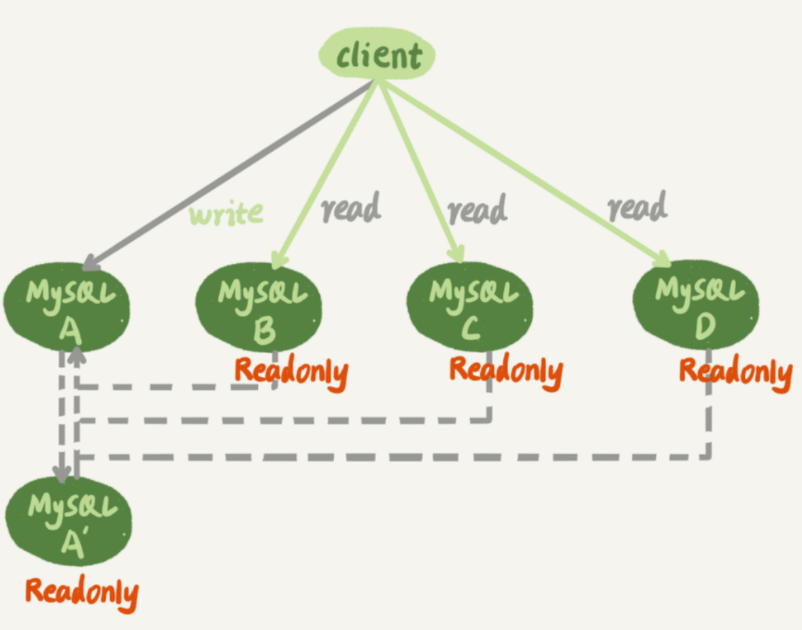
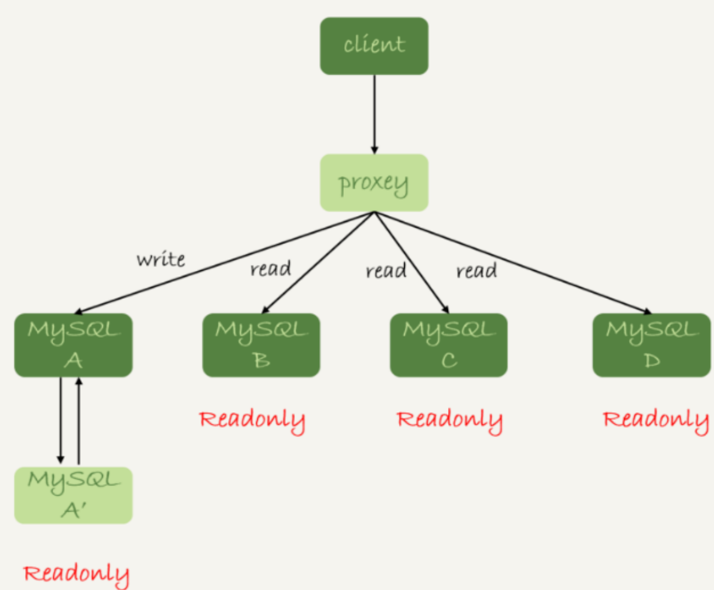
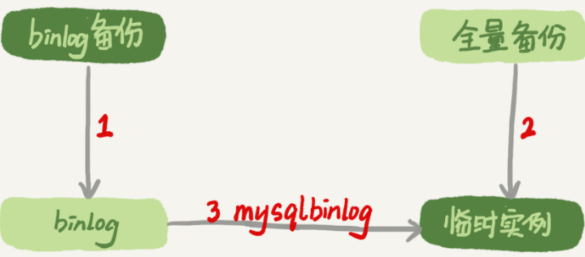

# mysql命令行

```sql
mysql -V/--version       			查看mysql版本
sudo service mysql start  			开启服务
sudo service mysql restart  		重启服务
sudo service mysql stop  			关闭服务
systemctl status mysql   			查看mysql状态
mysql -u root -p         			登录root 我的密码为123456
exit;								退出
use mysql;							选择数据库
select user,host from mysql.user;	查看mysql用户与主机权限
source [script file];         		执行脚本，脚本名要包含路径
select database();        			查看当前库
show databases;           			展示所有库
create database [database name];    创建数据库
show tables;						展示表
show columns from customers;        展示表列
describe customers;					是show columns的快捷方式
show status; 						显示服务器状态信息
show create database;				
show grants;						显示授予用户
show errors;						显示错误
show warnings;						显示警告
```

# MySQL实战45讲

## 26. 备库为什么会延迟好几个小时？

如果备库执行日志的速度持续低于主库生成日志的速度，那这个延迟就有可能成了小时级别。而且对于一个压力持续比较高的主库来说，备库很可能永远都追不上主库的节奏。

## 27. 主库出问题了，从库怎么办？

大多数场景都是一主多从结构，如下图。A为主库，A’为备库，BCD为从库。主库负责读写，从库负责读。



**基于位点的主备切换：**

主库发生故障后，A‘成为新的主库，从库BCD要改接到A’。原来节点 B 是 A 的从库，本地记录的也是 A 的位点。但是相同的日志，A 的位点和 A’的位点是不同的。因此需要先找同步位点。找位点时会找一个稍微往前的位置，当A宕机时，某一行binlog在从库B和A‘上都已经存在了，A’会把这行发给B执行，此时可能会发生冲突(一般为两种：插入数据时唯一键冲突，删除数据时找不到行)，需要手动跳过，也可以设置slave_skip_errors参数跳过，同步完成后要把参数调回来。

**GTID MySQL 5.6 版本引入了 GTID，彻底解决了这个困难。Global Transaction Identifier，也就是全局事务 ID，是一个事务在提交的时候生成的，是这个事务的唯一标识。它由两部分组成，格式是`GRTID=server_uuid:gno`，server_uuid 是一个实例第一次启动时自动生成的，是一个全局唯一的值；gno 是一个整数，初始值是 1，每次提交事务的时候分配给这个事务，并加 1。在GTID模式下，每个事务都会跟一个GTID一一对应。每个 MySQL 实例都维护了一个 GTID 集合，用来对应“这个实例执行过的所有事务”。

GTID的主备切换逻辑：在实例B上执行start slave命令，取binglog的逻辑是这样的：

1.  实例 B 指定主库 A’，基于主备协议建立连接。
2. 实例 B 把 set_b 发给主库 A’。
3. 实例 A’算出 set_a 与 set_b 的差集，也就是所有存在于 set_a，但是不存在于 set_b的 GTID 的集合，判断 A’本地是否包含了这个差集需要的所有 binlog 事务。
   - 如果不包含，表示 A’已经把实例 B 需要的 binlog 给删掉了，直接返回错误；
   - 如果确认全部包含，A’从自己的 binlog 文件里面，找出第一个不在 set_b 的事务，发给 B；

4. 之后就从这个事务开始，往后读文件，按顺序取 binlog 发给 B 去执行。

## 28. 读写分离有哪些坑？


读写分离目的是分摊主库压力，上图是客户端主动做负载均衡。还有一种架构是在mysql和客户端之间添加中间代理层proxy。



以上两种共有问题：主从延迟：客户端执行完一个更新事务后马上发起查询，如果查询选择的是从库的话，就有可能读到事务更新之前的状态。文章中成为过期读。

**处理过期读的集中方案：**

- **强制走主库方案：**对读请求分类，要求必须拿到最新结果的走主库，可以读到旧数据的走从库。这个方案最多。
- **sleep 方案：**大部分主备延迟在1秒内，在主库更新后，读从库前sleep1秒。但是有问题，如果请求为0.5秒也要等1秒，如果延迟超过1秒，还会过期读。
- **判断主备无延迟方案：**1. 判断seconds_behind_master是否等于0，但是参数是按秒来的，不精准  2. 对比位点确保主备无延迟   3. 对比GTID集合确保主备无延迟，对比备库收到的如有日志的GTID集合，和备库所有已经执行完成的GTID集合。但是不完全精准，如果主库收到了事务执行完了返回给客户端了，但是还没发给从库，此时在从库读不到。
- **配合 semi-sync 方案：**这个用来配合前一个方案。半同步复制：事务提交时，主库把binlog发给从库，从库收到后回ack表示收到，主库收到ack后才能给客户端回事务完成的确认。但是也有问题，在一主多从，还是有过期读(因为只等了一个从库的ack)，或者可能一直有延迟，一直等待。
- **等主库位点方案：**
- **等 GTID 方案：**

**等主库位点方案：**

其实在客户端在发完trx1更新后发起的select语句，只需要确保trx1执行完成就可以执行select语句了，不用等到主备无延迟的情况，因为可能trx1在备库已经完成了，但是主备之间一直有延迟，导致等不到无延迟的情况。

1. 在主库中trx1 事务更新完成后，马上执行 `show master status` 得到当前主库执行到的 File 和Position；

2. 选定一个从库执行查询语句；
3. 在从库上执行 `select master_pos_wait(File, Position, 1)`；
4. 如果返回值是 >=0 的正整数，则在这个从库执行查询语句；
5. 否则，到主库执行查询语句。


**等GTID方案：**

如果数据库开启了GTID模式，也有等GTID方案。与等主库位点方案一致。

1. 在主库中trx1 事务更新完成后，从返回包直接获取这个事务的 GTID，记为 gtid1；
2. 选定一个从库执行查询语句；
3. 在从库上执行 select wait_for_executed_gtid_set(gtid1, 1)；
4. 如果返回值是 0，则在这个从库执行查询语句；
5. 否则，到主库执行查询语句。

在实际应用中，这几个方案是可以混合使用的。比如先在客户端对请求做分类，区分哪些请求可以接受过期读，而哪些请求完全不能接受过期读；然后，对于不能接受过期读的语句，再使用等 GTID 或等位点的方案。过期读在本质上是由一写多读导致的。在实际应用中，可能会有别的不需要等待就可以水平扩展的数据库方案，但这往往是用牺牲写性能换来的，也就是需要在读性能和写性能中取权衡。

## 29. 如何判断一个数据库是不是出问题了？(不用看)

## 30. 答疑文章(二):用动态的观点看加锁

## 31. 误删数据除了跑路，还能怎么办？

**误删数据分类：**

1. 使用delete语句误删数据行；
2. 使用drop table或者truncate table语句误删数据表；
3. 使用drop database误删数据库；
4. 使用rm命令误删整个MySQL实例；

**误删行**

​	如果是使用 delete 语句误删了数据行，可以用 Flashback 工具通过闪回把数据恢复回来。Flashback 恢复数据的原理，是修改binlog 的内容，拿回原库重放。而能够使用这个方案的前提是，需要确保 binlog_format=row 和 binlog_row_image=FULL。如果时插入，那就删除，如果是删除，就插入，如果是更新，binlog里记录了修改前后的值，对调这两行位置即可。但是不建议在主库上执行执行这些操作，应该找一个从库作为临时库，在这个临时库上执行这些操作，然后讲确认过的临时库的数据，恢复回主库。因为可能发现误擦操作的时间比较晚，在误操作的基础上进行了修改，如果只恢复那几条误操作，会造成二次破坏。**事前预防：** 1. 把`sql_safe_updates`参数设置为on，这样在delete语句中没有where条件会报错。 2. 代码上线前，必须经过SQL审计。delete全表很慢，优先使用truncate table或者drop table。

**误删库/表**

需要使用全量备份，加增量日志的方式恢复。这个方案要求线上有定期的全量备份，并且实时备份 binlog。误删库恢复流程：

1. 取最近一次全量备份，假设这个库是一天一备，上次备份是当天 0 点；
2. 用备份恢复出一个临时库；
3. 从日志备份里面，取出凌晨 0 点之后的日志；
4. 把这些日志，除了误删除数据的语句外，全部应用到临时库。`mysqlbinlog`作用是解析出日志应用。



但是这样恢复不够快。原因两个：

1. 如果误删的是一张表，`mysqlbinlog`工具并不能指定只解析一个表的日志。
2.  用`mysqlbinlog`解析出日志应用，应用日志的过程之恩那个是单线程。

**一种加速的方法是，**在用备份恢复出临时实例之后，将这个临时实例设置成线上备库的从库，这样：

1. 在 start slave 之前，先通过执行 change replication filter replicate_do_table = (tbl_name) 命令，就可以让临时库只同步误操作的表；

2. 这样做也可以用上并行复制技术，来加速整个数据恢复过程。

**延迟复制备库**

​	如何缩短恢复数据需要的时间？可以考虑搭建**延迟复制备库**。一般的主备复制结构存在的问题是，如果主库上有个表被误删了，这个命令很快也会被发给所有从库，进而导致所有从库的数据表也都一起被误删了。延迟复制的备库是一种特殊的备库，指定整个备库与主库保持指定时间的延迟。这样发现误删后，在指定时间内发现后到这个备库stop slave，然后跳过误操作命令，就可以恢复出需要的数据。

**预防误删库/表的方法**

1. 给不同的权限，不给业务开发drop权限，DBA成员平时也用只读权限。
2. 指定操作规范，这样可以避免写错要删除的表名，
3. 在删除数据表之前，必须先对表做改名操作。然后，观察一段时间，确保对业务无影响以后再删除这张表。

**rm删除数据**

一般都是集群，而只是删掉了其中某一个节点的数据的话，HA 系统就会开始工作，选出一个新的主库，从而保证整个集群的正常工作。这时，在这个节点上把数据恢复回来，再接入整个集群即可。

# 数据库面经

## MyISAM和InnoDB的区别

**MyISAM和InnoDB是MySQL数据库中的两种主要存储引擎，它们在多个方面存在显著差异。**

1. **事务支持**：
   - **MyISAM**不支持事务处理，这意味着它不能保证数据的一致性和完整性，也不支持ACID特性（原子性、一致性、隔离性、持久性）。
   - **InnoDB**支持事务处理，使用ACID特性来保证数据的完整性和一致性。它允许用户进行更复杂的业务操作，如回滚未完成的事务，确保数据的一致性。
2. **锁定机制**：
   - **MyISAM**采用表级锁定，即对整个表加锁，这种锁定方式在并发访问时效率较低，容易发生锁冲突，降低并发性能。
   - **InnoDB**支持行级锁定，只锁定需要修改的行，这种锁定方式显著提高了并发性能，允许多个事务同时访问不同的行，减少了锁冲突的可能性。
3. **外键支持**：
   - **MyISAM**不支持外键约束，这意味着它不能通过外键实现关联查询和级联删除等功能。
   - **InnoDB**支持外键约束，允许通过外键建立表与表之间的关联，实现更复杂的业务逻辑。
4. **数据恢复**：
   - 由于**InnoDB**有事务日志（redo log）和回滚日志（undo log），在数据库崩溃等情况下，可以根据日志文件进行恢复，保证了数据的可恢复性。
   - **MyISAM**则没有事务日志，如果在没有备份的情况下发生数据丢失，可能难以恢复。
5. **缓存机制**：
   - **MyISAM**仅仅缓存索引，不会缓存实际数据信息，而InnoDB有自己的缓存（buffer pool），不仅缓存索引，还缓存表数据。
6. **查询性能**：
   - 在查询性能方面，**MyISAM**通常优于InnoDB，因为MyISAM可以直接定位到数据所在的内存地址，而InnoDB在查询过程中需要维护数据缓存，且查询过程需要先定位到行所在的数据块，然后再从数据块中定位到要查找的行。
