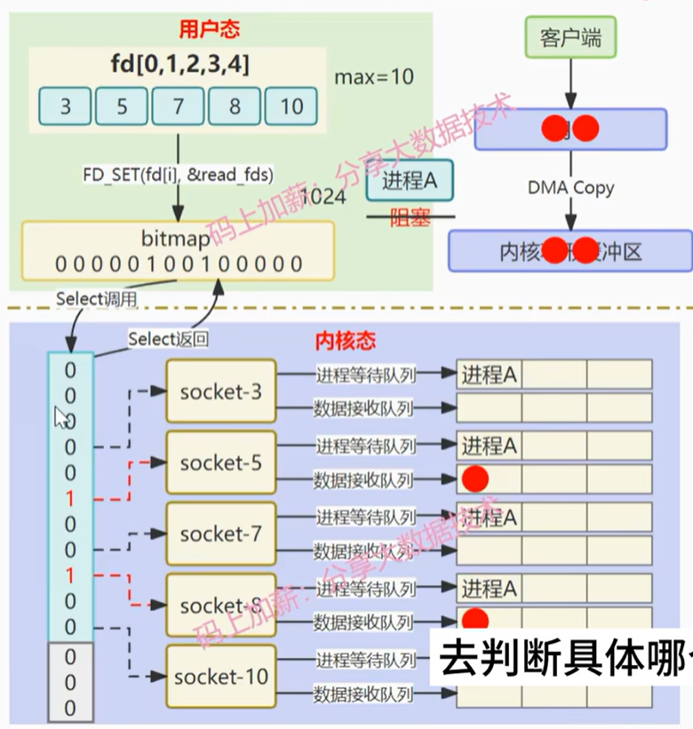
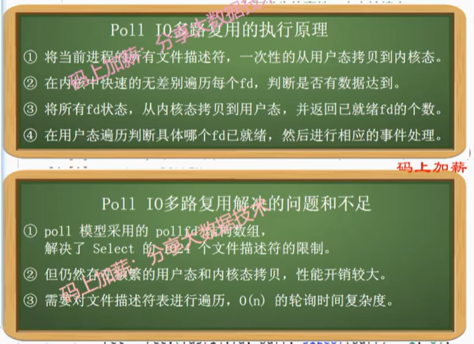
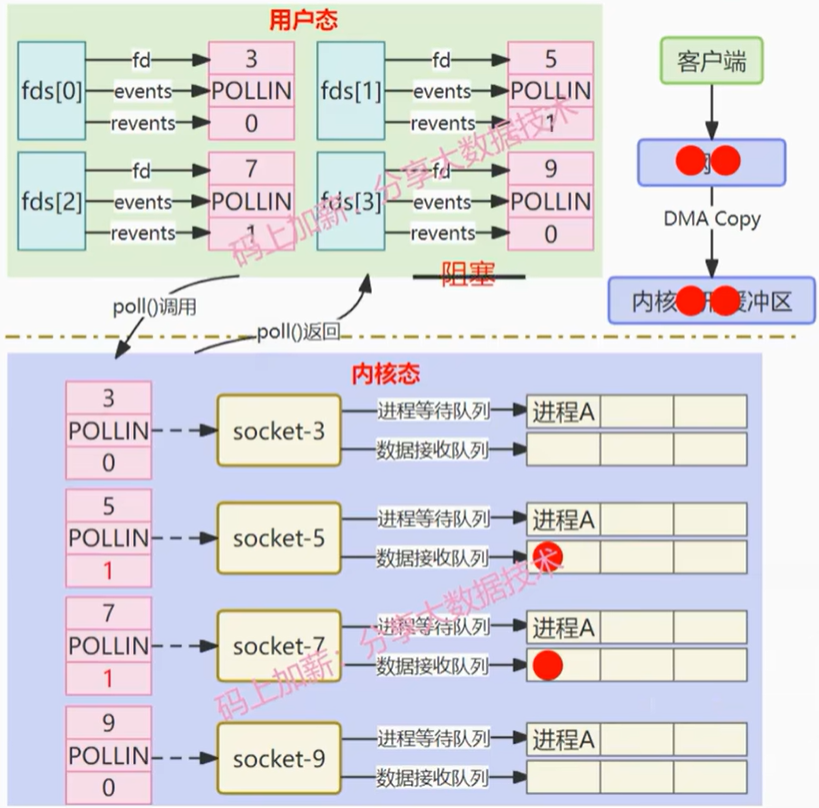
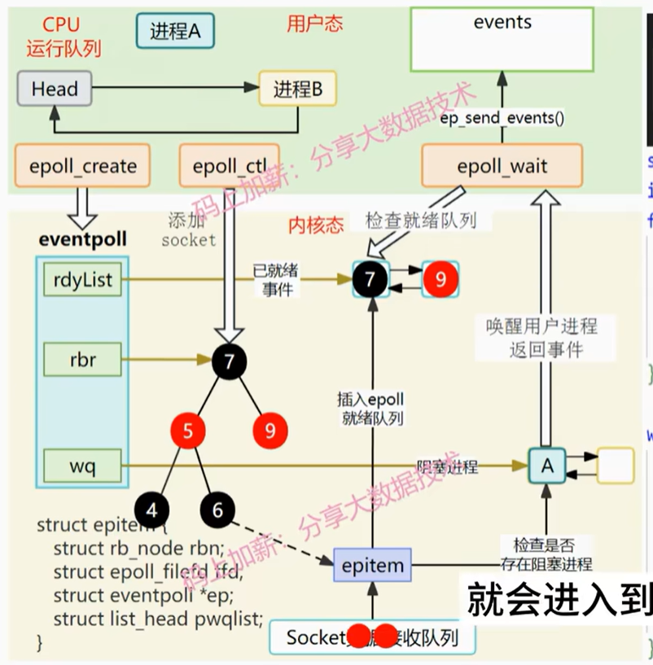

# 面试

## 目录

[TOC]

## 自我介绍

面试官好，非常有幸参加本次面试，我是陈博宇，一名哈尔滨工程大学研三在读的学生，接下来我先做简单自我介绍，在专业技能上面，我学习了c++编程语言、数据结构与算法、mysql和redis数据库、linux环境下网络编程等相关知识，并且了解c++常用新特性和标准模板库等相关内容。为了理论和实践相结合，目前我做了三个项目，第一个是一个基于linux环境下的的http服务器，另一个是为了学习rpc，实现了一个分布式的rpc框架。最后就是mit那个分布式系统的课程，跟着做实验的，raft合mapreduce差不多做完的时候收到一个小厂的实习就去实习了，做的区块链相关的东西，实习了一个月，5月份收到腾讯的实习就去腾讯了，期间做的向量化项目相关的工作，谢谢，我的自我介绍完毕

## 实习经历

### 腾讯实习

#### 介绍

腾讯大数据后台开发实习，大约是五月中旬入职实习的，从上一个公司离职后直接去了，刚开始是在平台内核组，后面组织结构变动，换到了智能湖仓研发组，一直负责公司天穹os向量化项目，这里我先介绍**项目背景**就是随着网络io的性能和磁盘读写的性能在不断的提升，cpu的性能已经逐渐成为了大数据计算的性能瓶颈，大数据的生态高度依赖于jvm，然而由于jvm的gc和偏向锁是难以逾越的性能鸿沟，虽然java社区新版本已经有了向量化操作的api，但是根据测试结果来看，性能并没有很大地突破，这也就导致各个厂商在寻找解决方法，也就有了native向量化引擎的需求，我在腾讯实习，他们的向量化方案就是使用spark+gluten+velox，我简单介绍一下这个**项目的架构**，spark是大型的分布式计算框架，gluten属于中间层粘合剂，来将spark的计算任务卸载到native引擎，velox是完全使用cpp写的native向量化引擎加速库项目，采用这个方案来把计算任务卸载到native执行，来实现向量化，提升计算性能，我的**工作内容**就是开发一些合spark语义不一样的thive的udf，来避免项目上线遇见不能解析的udf产生fallbak造成很多的性能损失

**业界其他的方案** databricks photon不开源。只有论文。  datafusion blaze使用自己的protonuf来描述算子不是使用的substrait，容易与社区脱节，不易维护。

#### 腾讯实习可能的问题

##### 什么是偏向锁

如果一个线程获得了锁，并且在接下来的时间内没有其他线程竞争该锁，那么锁将一直偏向于该线程，这样可以避免线程每次进入同步代码块时都需要执行锁的获取和释放操作，从而减少了不必要的CAS（Compare-And-Swap）操作，提高了性能。

##### 偏向锁的性能损失

偏向锁的设计初衷是为了在低竞争的情况下提高性能，但在某些情况下，它可能会导致性能损失，主要原因有以下几点：

**撤销偏向锁的开销** 当另一个线程尝试获取偏向锁时，偏向锁需要被撤销。撤销偏向锁是一个相对复杂的过程，因为它需要将锁升级为轻量级锁或重量级锁。这一过程涉及到停止当前持有偏向锁的线程、重新分配锁状态等操作，这会带来性能开销。
**线程切换频繁** 在高竞争的场景下，偏向锁频繁地被撤销和重新获取，这不仅没有减少同步开销，反而因为频繁的锁撤销而增加了额外的开销。在这种情况下，偏向锁反而可能成为性能瓶颈。
**适应性不强** 偏向锁假设大部分情况下锁是由同一个线程持有的，但在实际应用中，如果锁的持有者频繁变化，偏向锁就不再适用，反而可能拖累性能。

##### fallback性能损失的原因

spark原生实现较native向量化引擎肯定有损失
spark和向量化引擎处理数据的方式不一样需要转换

#### 腾讯实习遇见的困难

##### 感触 实习体验和想象中的不一样

大厂的实习体验和小厂还是不一样的，在小厂的时候，一共没几个人，我那个导师也相对重视我，基本上学习路线都给我说的很清除，按照他的路线去学就完全ok了，但是在腾讯不是，大家都很忙，基本上没有人管我，也没有比较清晰的学习路线，基本都是我自己找资料去学，完全靠自驱性，要不然工作进展不下去，而且我们正在做的工作文档很少，写的也不详细，这样就导致我第一周纯纯踩坑，根据文档配环境配了好久，踩了很多坑，最后导师告诉我代码分支搞错了，但是文档就是那个分支，重新来了，让我很苦恼，吃一堑长一智吧，后续有啥问题，我决定不了，就去问，前辈不会主动问我的，基本上都是我主动去问，但是他们会很有耐心的给我讲解，教我怎么解决

##### 困难 大数据小白

大数据这个方向我基本是一点都没有接触过，因此上手难度其实还是挺大的，当时小组组长告诉我我的工作内容并给我分配任务的时候，我基本属于无知状态，比较苦恼，害怕自己不能处理工作内容，处于被动状态，而且小组中前辈都比较忙，基本我不去问都不会有人来指导我的，我感觉这也就是工作的状态吧，当然后面我也适应了这个环境，找到了解决防范，通过各种渠道先把项目背景和项目框架搞清楚，然后针对自己的工作内容，寻找各种代码demo，内部的社区的都找，熟悉开发过程后再做后续的工作，在腾讯实习了三个多月，基本上一个大模块全部交给我做了。

##### 开发过程中遇见的具体问题

###### 包管理器问题排查

开发udf的时候，有一个返回值是数字类型的udf，出现很奇怪的现象，release模式下进行编译会出现coredump的问题，其他返回值类型就没事，debug模式下就没有问题，这是因为编译器优化的原因，因此比较难排查，因为没有debug信息，当时自己搞了好久，最后搜索gdb的资料，分析调用栈帧，反汇编栈帧数据找到了core在哪一个具体函数上，返回添加debug信息一点点分析，发现在folly库中添加debug信息，后面运行并没有输出，大概知道可能是链接的时候有问题，然后检索链接的相关信息，找到链接folly库的链接目录发现和同事的不一样，最后通过分析发现是编译的时候用的包管理器有问题，不应该使用vcpkg的，应该直接使用编译脚本解决依赖。最后这个问题得到解决了，比较难忘，因为卡了很久

###### java c++ 数据结构不一致问题排查

因为我是直接按照腾讯之前自研的thive的udf来实现velox版本的，当时有一个udf我是完全按照Java的实现来实现的一个算法，但是最后的结果怎么测试都不对，本地测试还有哪个idex平台进行测试，都通过不了，最后我一行一行的输出debug信息，发现有个变量转换过程中出现了负数，基本就判断出有截断的问题，然后我查阅资料发现c++的char和java的char占用类型不一样，找到问题就好解决了，后面使用cpp的wchar就解决问题了。

### 游码量化

#### 实习介绍

游码科技有限公司，当时招聘是按照量化开发工程师招的，当时面试官告诉我进去可能要做低延迟交易系统的开发，但是毕竟不是很大的公司，也就20左右个人，我工作的时候，有经验的交易系统开发的前辈还没来北京，我就先跟着导师学习链上的相关知识，这里从比特币开始了解区块链的知识，然后开始学习solana相关的知识，当时把solana加速交易的七大特性基本掌握了，了解了solana为何交易可以这么快速，掌握了solana链上程序的开发和测试环境，了解了solana链上程序的开发，当时赶上比特币奖励减半符文上线，老板让我去学习了符文相关的知识，搭建比特币全节点，然后使用go语言开发了符文的自动蚀刻工具，主要分为三个部分，首先是获取区块链mempool中的交易信息的gas费，推算出合适的gas费，然后发起蚀刻符文的交易。然后继续监控mempool中交易的gas费，适当的加速交易，避免交易被淹没损失交易费，一个月我差不多就做了这些事情，肯定有所收获，比如我去公司前都不知道区块链的东西，完全不了解web3，我这段实习经历让我了解到了web3领域，了解了去中心化的发展前景，虽然我们国家对其的政策可能没有这么自由，但是我仍然觉得这是以后不可阻挡的趋势，我后面肯定会持续关注web3相关的动态，自己可能也会涉足web3领域。

#### 游码量化实习难点

首先，完全新的领域，在没有去这里实习的之前，我对区块链和web3一点都不了解，过去之后对未知的知识多少有点力不从心，不过还好遇见了一个不错的导师，逻辑性很强，很适合当老师，基本上我按照他给我的学习路线去查找资料学习就可以了。不过查找学习资料的过程中很难，因为东西很新，资料很少，所以在学习过程中多少会有点困难，不过请教导师后，基本上知道在哪解决疑问了，首先去官网，官网没有可以看有没有discode，再不行就去推特，我记得很清晰的就是当时比特币奖励减半，符文上线的时候，我搭建比特币全节点所遇见的问题，怎么都解决不了，最后在discord上找到了解决答案。因为实习时间不长，给我的需求不多，因此遇见的困难也不多。

## 项目

### web server介绍

项目背景是向实践一下自己学的知识，并且熟悉一下linux环境下网络编程的模式和一些组件的编写，首先是Linux下i/o多路复用epoll，来做io事件触发，使用有限状态机来解析http的请求报文，来实现对get请求和post请求的响应，事件处理采用了Reactor模式和模拟的Proactor模式，采用线程池来实现客户端的并发访问，对一些不活跃连接使用定时器进行优化，实现了日志模块。我对项目进行了性能优化，首先使用了双缓冲的异步日志来实现日志的高性能写，内存池来避免频繁申请和释放内存导致的性能损耗和内存碎片，实现lfu缓存来对热点文件的缓存，挺高响应速度，精细化hash表的锁粒度来提升查询的并发量，实现了时间轮和时间堆定时器来优化定时器，使用cpp11标准实现了一个线程池等。对于项目的压力测试，本地测试（proactor），我使用webbench模拟10000个客户端访问5秒，结果显示未优化前qps是5k+，优化完后qps是15k+。

**姜龙：**

项目背景是向实践一下自己学的知识，并且熟悉一下linux环境下网络编程的模式和一些组件的编写，首先是Linux下i/o多路复用epoll，来做io事件触发，使用有限状态机来解析http的请求报文，来实现对get请求和post请求的响应，事件处理采用了Reactor模式和模拟的Proactor模式，采用线程池来实现客户端的并发访问，对一些不活跃连接使用定时器进行优化。实现了内存池来避免频繁申请和释放内存导致的性能损耗和内存碎片，实现了lfu缓存来对热点文件的缓存，挺高响应速度，精细化hash表的锁粒度来提升查询的并发量，实现了时间轮和时间堆定时器来优化定时器，使用c++11实现了一个线程池等。

#### web server项目难点

##### 难点1

在写阻塞队列的时候，遇见了一个卡死的现象，应该也不能叫做死锁，当时情况就是程序卡在了阻塞队列的析构函数中了，一直析构不了，当时这个问题折磨了我一晚上，最后我用gdb进行调试，分析调用栈，发现是阻塞到了条件变量，它没有接受到唤醒，析构不了，只能一直在等待唤醒。最后在阻塞队列析构的时候，先唤醒条件变量。

##### 难点2

还有就是项目做完之后，做压测的时候，发现吞吐量一直上不去，一直很低，但是cpu的使用率也很高，一直找不到问题所在，然后我学习了一下火焰图的绘画和分析，对程序进行性能瓶颈分析，发现在http解析的时候非常耗时，然后我就进行分析，查资料，发现我用正则表达式是最大的错误更改回了字符串解析了，通过这个分析，我发现火焰图是个好东西啊，我使用它不断优化项目性能啊，分别是日志优化，内存池优化，lfu缓存优化和高性能hash表优化

##### 难点3

找到一个bug，也不能说是bug，就是由于lfu缓存的出现，我在后台更改了文件，并不会影响到已经缓存过的内容，也就会出现既是我更改了文件，前端访问仍然是历史的版本， 但是本项目的前端并没有提供修改文件的内容的功能，因此不能算是bug，但是我还是了解了一下这个问题，就是关于缓存一致性的问题，这里我了解了一些redis做缓存时用到的缓存一致性方案，比如先删除缓存，再更新数据库（延迟双删）、先更新数据库再删除缓存（给缓存加上过期时间，针对操作失败的情况，引入消息队列），先更新数据库再更新缓存（分布式锁使得更新数据库和缓存原子执行，给缓存加上过期时间）0000，。

#### web server可能的相关问题

##### 三种定时器的区别

我认为主要的区别就是在高并发场景下的更改数据结构，所需要加的锁粒度

**详细：**
**双有序链表**每次增加定时器或者给定时器延长时间需要调整链表，因此需要对整个链表进行加锁，调整的时间复杂度是O(n)，
**时间堆**也需要对整个堆进行上锁，但是其调整的时间复杂度是O(logn)，
**时间轮**定时器调整的时候不需要对整个时间轮进行上锁，仅需要锁住涉及到的槽位即可，可以精细化锁粒度。S

##### lfu和lru

###### lfu介绍

lfu是根据缓存的访问频度来进行缓存置换的，访问一次缓存就增加其频度，优先置换低频度缓存
**实现** 双hash记录key频度和key节点的映射，频度节点指向同一频度的双向链表节点，访问一次就移动到更高频度的链表

###### lru介绍

lru是根据最近访问时间来进行缓存置换的，访问缓存后就将其放置到链表的头部，不是最近使用的就慢慢的调整到了尾部，优先置换尾部
**实现**hash表记录key节点映射

###### 为啥使用lfu

1. **webserver 页面的访问比较随机，时间相关性较低**，经常被访问的页面在下一次有更大的可能被访问，此时使用LFU更好，并且LFU能够避免周期性或者偶发性的操作导致缓存命中率下降的问题；

2. 而对于时间相关度较高（某些页面在特定时间段访问量较大，而在整体来看频率较低）的 `WebServer` 来说，在特定的时间段内，最近访问的页面在下一次有更大的可能被访问，此时使用LRU更好。目前webserver时间相关性较低,时间相关度较高的，比如用户的token session等，用户一般在一段时间内来访问，因此使用lru比较好

###### lfu缺点

会产生缓存污染，使得新生代高频数据块很难留在缓存中

**详细介绍** 换句话说就是，最近加入的数据因为起始的频率很低，容易被淘汰，而早期的热点数据会一直占据缓存。  对热点数据的访问会导致 `freq` 一直递增，我目前使用 `int` 表示 `freq_` ，实际上会有溢出的风险。

###### lfu缺点解决

总纲就是不断的衰减频率，这样就可以让新生代的高频缓存有机会留在缓存

**具体方法**
**lfu aging**（条件老化）优化 在LFU算法之上，引入访问次数平均值概念，当平均值大于最大平均值限制时，将所有节点的访问次数减去最大平均值限制的一半或一个固定值。相当于热点数据“老化”了，这样可以避免频度溢出，也能缓解缓存污染

**windows-lfu** 每一段时间将访问次数做衰减

###### redis中lfu和lru的实现方式

lru没有采用上面描述的（用链表管理缓存占用内存空间，链表操作费时），是对结构体对象中加了一个时间字段，来记录最近访问的时间，汰换的时候随机选取一定数量的key，删除最久未访问的key

lfu是利用上面的时间字段的高16位记录上次访问时间，低8位来记录频率，这个低八位会根据高16位进行衰减，而实现真正的频率，不是简单的访问次数。

###### mysql 解决预读失效，缓存污染lru

young区和old区（7：3）预读缓存先到old区（解决预读失效），在old区中的缓存第二次访问距离第一次访问时间超过1s才挪到young区（解决缓存污染），停留一秒的原因应该就是避免大量的遍历导致缓存污染

linux的解决方法和mysql相似，linux分为了两个链表，old链表第二次访问就放到了young链表

##### 内存池

这里使用类似stl中的二级内存分配子一样管理内存，首先根据8 16 32 ... 512的大小分为64个槽，每个槽中对应不同大小的内存池，当分配的内存小于512时，去内存池中对应的槽中取内存（先看看freelist中是否有内存，如果有就直接用，没有就去block中分配），当block中内存全部使用完后，就使用new分配4096内存，继续使用，大于512的直接使用new进行分配。释放的时候直接放入freelist中。


malloc自己好像是有内存池的

###### 性能损耗的原因

使用`malloc/new`申请分配堆内存时系统需要根据最先匹配、最优匹配或其它算法在内存空闲块表中查找一块空闲内存；
使用`free/delete`释放堆内存时，系统可能需要合并空闲内存块，会产生额外开销频繁使用时会产生大量内存碎片，从而降低程序运行效率

##### 高并发hash表

这里自己实现hashmap，加锁时不再锁住整个hashmap，而是锁住需要操作的hash桶，使用shared_mutex 读操作共享，添加删除操作互斥，精细化了锁粒度。（vector+list）
并且在读和写操作的时候，使用了cpp里面的`share_lock`来实现并发读，写的时候互斥

##### 双缓冲日志

这里分为前端和后端，前端和后端分别由两个缓冲区和一个缓冲队列组成，当数据落盘的时候，后端的缓冲区、缓冲队列会先和前端的进行交换，然后释放锁，后端的写磁盘不会影响前端的日志添加，这也就是细化了锁粒度。当后端写的速率较小，那么前端缓冲区写满后，会申请新的缓冲区。

##### 观察者模式和reactor模型

**观察者模式**的观察者需要直接向通知者注册，当通知者有事件时会直接和观察者进行通信，他两个直接交互

**reactor模式**不需要注册，且两者不是直接通信的，当有事件到来时，主线程会把任务压入到队列，等待线程池来消耗，也就是属于观察者不是和通知者直接通信的，而是有中间代理，这个中间代理就是阻塞队列

##### 主从状态机

主状态机有三种状态分别对应请求行的解析，请求头的解析和请求内容的解析，每个主状态机状态又分为三个从状态机状态，也就是对每一行进行解析的状态，分别对应一行已经解析完毕，行中有错误字段，行数据不完整。


##### 内存模型

c++中内存模型可以分为**基础结构和并发**

**基础结构**就是c++对象的内存布局
**并发**就是多线程下对内存访问的次序

c++中有6中内存次序，分为三种内存模式，
首先是松散的**宽松次序**，也就是任何线程看到的内存改动序列可能都不相同，完全没有关系可言，并发程度也是最高的。

然后最严格的是**先后一致次序**，也就是所有线程看到的内存改动序列都是一样的，并发程度最低。

然后还有就是**获取释放次序**，获取释放次序使得数据操作构成同步关系，一般和先行关系一块使用来达到先行的效果。

## webserver架构图


## Reactor、Proactor和主从Reactor

服务器程序需要处理三类事件:I/O事件，信号以及定时事件，事件处理模式如下:

- Reactor模式：要求主线程只负责监听文件描述符上是否有事件发生，读写数据、**接受新连接**以及处理客户请求均在工作线程中完成。
- Proactor模式：将所有的I/O操作和接受新连接都交给主线程和内核来处理（进行读、写），工作线程仅负责处理客户请求。proactor是异步I/O，所以尽管是主线程进行I/O操作，但是由系统内核进行读写，完成后通知主线程，所以并不会阻塞主线程。
- 主从Reactor模式:主Reactor通过accept得到已连接的套接字之后，然后将已连接的套接字分配给从Reactor。然后从reactor和reactor模式类似。


​	通常使用同步I/O模型（如`epoll_wait`）实现`Reactor`，使用异步I/O（如`aio_read`和`aio_write`）实现`Proactor`。但在此项目中，我使用的是**同步I/O模拟的`Proactor`**事件处理模式。

## 五种I/O模型是什么？

- 同步i/o阻：包括阻塞i/o     非阻塞i/o 

- 异步i/o

- i/o多路复用

- 信号驱动i/o


### 同步I/O

- 可以设置阻塞模式和非阻塞模式。
- **非阻塞模式：**调用read后，如果内核缓冲区没有数据就直接返回，如果有数据，要将内核缓冲区中的数据放到用户缓冲区中，然后再返回。
- **阻塞模式：**调用read后，内核缓冲区没有数据，就一直在等待，直到数据放到内核缓冲区中有数据，再把内核缓冲区中的数据放到用户缓冲区中，再返回。
- **所以对于同步I/O，无论是阻塞还是非阻塞，都得从内核缓冲区复制到用户缓冲区这一步,是由应用程序来完成的。**

**深入解释：**


- 当调用 read 方法时，会阻塞着，此时内核会向磁盘发起 I/O 请求，磁盘收到请求后，便会寻址，当磁盘数据准备好后，就会向内核发起 I/O 中断，告知内核磁盘数据已经准备好；
- 内核收到 I/O 中断后，就将数据从磁盘控制器缓冲区拷贝到 PageCache 里；
- 最后，内核再把 PageCache 中的数据拷贝到用户缓冲区，于是 read 调用就正常返回了。

### 异步I/O

调用读写操作后，无论是否是阻塞I/O，直接返回，然后系统把数据放到内核缓冲区中，再放到用户缓冲区中，然后通知应用程序处理，也就是说异步I/O比同步I/O少了等待从内核缓冲区中复制到用户缓冲区的这一步。

**总结**

同步I/O向应用程序通知的是I/O就绪事件，异步I/O向应用程序通知的是I/O完成事件。

**深入解释:**


- 前半部分，内核向磁盘发起读请求，但是可以**不等待数据就位就可以返回**，于是进程此时可以处理其他任务；
- 后半部分，当内核将磁盘中的数据拷贝到进程缓冲区后，进程将接收到内核的**通知**，再去处理数据；

### I/O多路复用

I/O 多路复用使得程序能同时监听多个文件描述符，能够提高程序的性能，Linux 下实现 I/O 多路复用的系统调用主要有 select、poll 和 epoll。

#### select

**select流程**


**select流程  文字版**

1. 先构造一个关于文件描述符的列表，将要监听的文件描述符添加到该列表中。 

2. 调用一个系统函数`select`，监听该列表中的文件描述符，直到这些描述符中的一个或者多个进行I/O 操作时，该函数才返回。调用select后会将要监听的文件描述符集合拷贝到内核缓冲区中，陷入内核态。内核判断哪个文件描述符可读。在陷入内核态之后将该进程加入到要监听的文件描述符的进程等待队列中。

3. 然后内核遍历哪个`fd`由数据到达，然后`select`返回。将文件描述符集合从内核态拷贝到用户态。

4. 然后由用户态对文件描述符集合遍历，看哪个`socket`可读。

   **详细解释：**

   

```c
// sizeof(fd_set) = 128 1024
#include <sys/time.h>
#include <sys/types.h>
#include <unistd.h>
#include <sys/select.h>
int select(int nfds, fd_set *readfds, fd_set *writefds, fd_set *exceptfds, struct timeval *timeout);
- 参数：
    - nfds : 委托内核检测的最大文件描述符的值 + 1
    - readfds : 要检测的文件描述符的读的集合，委托内核检测哪些文件描述符的读的属性
        - 一般检测读操作
        - 对应的是对方发送过来的数据，因为读是被动的接收数据，检测的就是读缓冲区
        - 是一个传入传出参数
    - writefds : 要检测的文件描述符的写的集合，委托内核检测哪些文件描述符的写的属性
    	- 委托内核检测写缓冲区是不是还可以写数据（不满的就可以写）
    - exceptfds : 检测发生异常的文件描述符的集合
    - timeout : 设置的超时时间
    struct timeval {
        long tv_sec; /* seconds */
        long tv_usec; /* microseconds */
    };
    - NULL : 永久阻塞，直到检测到了文件描述符有变化
    - tv_sec = 0 tv_usec = 0， 不阻塞
    - tv_sec > 0 tv_usec > 0， 阻塞对应的时间
    - 返回值 :
        -1 : 失败
        >0(n) : 检测的集合中有n个文件描述符发生了变化

void FD_CLR(int fd, fd_set *set);// 将参数文件描述符fd对应的标志位设置为0
int FD_ISSET(int fd, fd_set *set);// 判断fd对应的标志位是0还是1， 返回值 ： fd对应的标志位的值，0，返回0， 1，返回1
void FD_SET(int fd, fd_set *set);// 将参数文件描述符fd 对应的标志位，设置为1
void FD_ZERO(fd_set *set);// fd_set一共有1024 bit, 全部初始化为0
```


#### poll

`poll`模型对`select`进行了改进。关注的文件描述符变成了`pollfd`结构体。采用监听`pollfd`结构体的方式，没有文件描述符1024的限制。原理和`select`类似。

**poll流程：**





**深入解释**

```c
#include <poll.h>
struct pollfd {
    int fd; /* 委托内核检测的文件描述符 */
    short events; /* 委托内核检测文件描述符的什么事件 */
    short revents; /* 文件描述符实际发生的事件 */
};
struct pollfd myfd;
myfd.fd = 5;
myfd.events = POLLIN | POLLOUT;
int poll(struct pollfd *fds, nfds_t nfds, int timeout);
- 参数：
    - fds : 是一个struct pollfd 结构体数组，这是一个需要检测的文件描述符的集合
    - nfds : 这个是第一个参数数组中最后一个有效元素的下标 + 1
    - timeout : 阻塞时长
        0 : 不阻塞
        -1 : 阻塞，当检测到需要检测的文件描述符有变化，解除阻塞
        >0 : 阻塞的时长
    - 返回值：
        -1 : 失败
        >0 (n) : 成功,n表示检测到集合中有n个文件描述符发生变化

```


#### epoll

**epoll流程：**

1. `epoll_create`会在内核创建一个`eventpoll`结构体，，包含一个就绪队列（双向链表），一颗红黑树，一个等待队列存放等待的进程。
2. 然后将不同socket连接返回的文件描述符以及eventpoll的指针以及等待队列的指针组装成一个红黑树节点，将其插入到红黑树中。
3. 接下来当某个socket的数据接收队列中有数据到达，通过回调函数将包含了就绪事件的红黑树节点插入到就绪队列。
4. 然后`epoll_wait`监听到就绪队列中有数据，就把链表中的节点数据拷贝到用户空间，同时从节点中拿到对应休眠进程的信息，
5. 然后内核检查在等待队列中是否有阻塞的进程，如果阻塞的进程等待的事件刚好是就绪的事件，去唤醒这个进程。
6. 这个进程重新占用cpu，从拷贝过来的节点中拿到文件描述符，通过这个文件描述符读取对应的读缓冲区。



**深入解释：**

```c
#include <sys/epoll.h>
/* 创建一个新的epoll实例。在内核中创建了一个数据，这个数据中有两个比较重要的数据，一个是需要检
测的文件描述符的信息（红黑树），还有一个是就绪列表，存放检测到数据发送改变的文件描述符信息（双向链表）。*/
int epoll_create(int size);
- 参数：
    size : 目前没有意义了。随便写一个数，必须大于0
    - 返回值：
        -1 : 失败
        > 0 : 文件描述符，操作epoll实例的
typedef union epoll_data {
    void *ptr;
    int fd;
    uint32_t u32;
    uint64_t u64;
} epoll_data_t;

struct epoll_event {
    uint32_t events; /* Epoll events */
    epoll_data_t data; /* User data variable */
};
常见的Epoll检测事件：
    - EPOLLIN
    - EPOLLOUT
    - EPOLLERR
// 对epoll实例进行管理：添加文件描述符信息，删除信息，修改信息
int epoll_ctl(int epfd, int op, int fd, struct epoll_event *event);
- 参数：
    - epfd : epoll实例对应的文件描述符
    - op : 要进行什么操作
        EPOLL_CTL_ADD: 添加
        EPOLL_CTL_MOD: 修改
        EPOLL_CTL_DEL: 删除
    - fd : 要检测的文件描述符
    - event : 检测文件描述符什么事情
// 检测函数
int epoll_wait(int epfd, struct epoll_event *events, int maxevents, int timeout);
- 参数：
    - epfd : epoll实例对应的文件描述符
    - events : 传出参数，保存了发送了变化的文件描述符的信息
    - maxevents : 第二个参数结构体数组的大小
    - timeout : 阻塞时间
        - 0 : 不阻塞
        - -1 : 阻塞，直到检测到fd数据发生变化，解除阻塞
        - > 0 : 阻塞的时长（毫秒）
    - 返回值：
        - 成功，返回发送变化的文件描述符的个数 > 0
        - 失败 -1
```


#### select    poll  epoll总结：

- select和poll，每次调用都需要将整个文件描述符集合拷贝到内核态，有开销。
- select使用线性表描述文件描述符集合，文件描述符有上限；poll使用链表来描述；epoll底层通过红黑树来描述，并且维护一个ready list，将事件表中已经就绪的事件添加到这里，在使用epoll_wait调用时，仅观察这个list中有没有数据即可。
- epoll则将整个文件描述符集合维护在内核态，每次添加文件描述符的时候都需要执行一个系统调用。系统调用的开销大，而且在有很多短期活跃连接的情况下，epoll可能会慢于select和poll由于这些大量的系统调用开销。
- select和poll的最大开销来自内核判断是否有文件描述符就绪这一过程：每次执行select或poll调用时，它们会采用遍历的方式，遍历整个文件描述符集合去判断各个文件描述符是否有活动；epoll则不需要去以这种方式检查，epol通过l回调函数通知epoll文件描述符，然后内核将这些就绪的文件描述符放到就绪队列中等待epoll_wait调用后被处理。
- select和poll都只能工作在相对低效的LT模式下，而epoll同时支持LT和ET模式。
- 当监测的fd数量较小，且各个fd都很活跃的情况下，建议使用select和poll；当监听的fd数量较多，且单位时间仅部分fd活跃的情况下，使用epoll会明显提升性能。

#### epoll对文件操作描述符的模式：LT（水平触发）和ET（边缘触发）

- LT（水平触发）：如果epoll的就绪事件没有被处理完，这个事件还会被后续的`epoll_wait`再次触发。
- ET（边缘触发）：epoll的就绪事件只会触发一次。在使用ET模式时，必须要保证该文件描述符是非阻塞的，因为ET只会通知一次，要循环调用read，如果是阻塞I/O，读完数据会阻塞。

**总结：**

ET 模式在很大程度上减少了 epoll 事件被重复触发的次数，因此效率要比 LT 模式高。

#### epoll一定比select效率高吗？

**epoll和select对比：**

不一定，需要根据并发度来权衡，如果并发读在几百，可能poll比epoll性能好，因为监听的集合小，用poll的轮询效果比epoll好。高并发场景适合用epoll。

select能监控的fd大小最多1024， 限制僵硬。

**epoll和select，poll对比：**

当监测的fd数量较小，且各个fd都很活跃的情况下，建议使用select和poll；当监听的fd数量较多，且单位时间仅部分fd活跃的情况下，使用epoll会明显提升性能。

### 信号驱动i/o

- 信号驱动i/o就是预先告诉内核，当某个描述符准备发生某件事情的时候，让内核发送一个信号通知应用进程；
- 当进程发起一个IO操作，系统向内核注册一个信号处理函数，然后进程会返回，并不会阻塞进程；
- 当内核数据准备好时，内核使用信号通知应用线程，然后调用信号处理函数，在回调函数中读取数据；
- 一般我们说的信号驱动IO模型是一种异步非阻塞IO模型，指的是用户线程去内核空间请求数据时，直接注册一个信号处理函数，然后用户线程返回（异步），而内核空间接收到请求后，开始处理；


## 线程安全的hash表threadsafe_lookup_table

线程安全的查找结构，实现一个类似线程安全的map结构，但是map基于红黑树实现，假设我们要增加或者删除节点，设计思路是依次要删除或增加节点的父节点，然后修改子节点数据 。尽管这种思路可行，但是难度较大，红黑树节点的插入要修改多个节点的关系。另外加锁的流程也是锁父节点，再锁子节点，尽管在处理子节点时我们已经处理完父节点，可以对父节点解锁，继续对子节点加锁，这种情况锁的粒度也不是很精细，考虑用散列表实现。对于链表的增删改查需要加锁,所以考虑将链表封装为一个类`bucket_type`,支持数据的增删改查。将整体的查找表封装为`threadsafe_lookup_table`类，实现散列规则和调度`bucket_type`类。


## webserver面试问题

### 如果同时1000个客户端进行访问请求，线程数不多，怎么能即使相应处理每个？

不是每个客户连接对应一个线程，当有任务需要处理时，主线程会将任务加入到任务队列，线程进行竞争执行。还是慢，可以增大线程池里的线程数量，或者考虑集群分布式，交给其他服务器处理。

### 如果一个客户请求要占用线程很久的时间，会不会影响接下来的客户请求呢，有什么策略？

会影响，客户请求长时间占用线程资源，会影响到服务器整体的相应速度。1.可以给每个线程设定时间，类似操作系统时间片 2.直接断开连接

### 为什么用状态机解析http？

可以描述状态变化过程，让服务器可以根据不同状态或者消息类型进行相应的处理逻辑，让程序逻辑清晰易懂。

主状态机是一个while循环，循环中先调用从状态机parse_line()函数解析一行，状态OK就get_line()获取这一行数据，然后根据主状态机状态，如果当前状态是解析请求行就调用解析请求行函数、解析请求头状态就调用解析请求头函数、解析请求体就调用解析请求体函数，根据这几个函数的返回结果更新主状态机状态。

### 服务端要保存状态，怎么做？  用cookie session

**可以利用session或者cookie的方式进行状态保存**

**cookie**就是服务器给客户端分配了一串身份标识，每次客户端发送数据的时候，都带上这个标识。

**session**是保存在服务器端的状态，每当一个客户发送HTTP报文过来，服务器会在自己记录的状态中去找。

**原理：**

采用 Cookie + Session 方式，其原理是在用户登录之后，认证服务器将用户信息存储在 Session 中，生成一个 Session ID，把Session ID 存储在 Cookie 中，并返回给用户。用户下次在 Cookie 中的 Session ID。认证服务器通过 Session ID 来判断该用户是否已经登录过，如果已经登录过，则返回一个新的 Session ID 给应用系统，否则需要用户重新登录。

### 登录中的用户名和密码你是load到本地，然后使用map匹配的，如果有10亿数据，即使load到本地后hash，也是很耗时的，你要怎么优化？

将所有的用户信息加载到内存中耗时耗利，利用hash建立多级索引的方式来加快用户验证，将10亿用户信息，利用缩小1000倍的hash算法进行hash，这是就获得了100万的hash数据，每一个hash数据代表着一个用户信息块，然后再分别对这100万的hash数据再进行hash，最后剩下1000个数据。

### 为什么要用定时器？说一下定时器工作原理

处理非活跃链接，节省系统资源。使用`SIGALRM`信号来实现定时器，在创建用户连接的时候创建一个对应的定时器，设置好过期时间，放到定时器链表中，然后通过`alarm`函数定时发送`SIGALRM`信号，服务器主循环会调用定时器链表的tick()心搏函数，处理的过期定时器。

### 日志为什么要异步，和同步的区别是什么?

同步方式写入日志时,如果某条日志信息量过大,会阻塞服务器主线程,异步日志能提高并发.

异步需要双缓冲区,双缓冲区是为了缓解内存读写速度和IO读写速度不匹配的问题，如果不开启异步线程，则不需要，因为当前进程会被IO阻塞，不存在读写速度不匹配的问题。但是当开启异步线程时，IO读写速度和内存读写速度不匹配，容易导致数据丢失，所以开启异步线程时需要使用双缓冲区。

### 如果要监控一台服务器状态,输出控制日志,应该如何将日志分发到不同机器上?

可以使用消息队列.

### webbench 原理

​	利用`webbench`,原理是父进程fork若干子进程,每个子进程在用户要求时间对目标循环发出访问请求,父子进程通过管道通信,子进程通过管道把测试记录发送给父进程,然后父进程在所有子进程退出后汇总测试结果,然后退出。

```c++
webbench -c 10000 -t 5 http://114.115.203.46:9006/
```

​	测试遇到的问题，普通用户fork的进程会有上限,需要该配置文件

### 线程池线程数量怎么确定?

- **cpu密集型任务**   尽量使用较小的线程池，一般为CPU核心数+1。 因为CPU密集型任务使得CPU使用率很高，若开过多的线程数，会造成CPU过度切换。
- **IO密集型任务**  可以使用稍大的线程池，一般为2*CPU核心数。 IO密集型任务CPU使用率并不高，因此可以让CPU在等待IO的时候有其他线程去处理别的任务，充分利用CPU时间。

**深入解释：**

当线程数量太小，同一时间大量请求将被阻塞在线程队列中排队等待执行线程，此时 CPU 没有得到充分利用；当线程数量太大，被创建的执行线程同时在争取 CPU 资源，又会导致大量的上下文切换，从而增加线程的执行时间，影响了整体执行效率。

I/O 密集型任务：这种任务应用起来，系统会用大部分的时间来处理 I/O 交互，而线程在处理 I/O 的时间段内不会占用 CPU 来处理，这时就可以将 CPU 交出给其它线程使用。因此在 I/O 密集型任务的应用中，我们可以多配置一些线程，具体的计算方法是 2N。线程等待时间与线程cpu时间之比约高,就需要更多的线程。

### 项目中的设计模式, 单例模式

单例模式 : 在线程池、内存池、日志、连接池中都用到了

单例模式分为懒汉式和饿汉式,两者之间的区别在于创建实例的时机不一样:

- 懒汉式 : 只有当需要使用该实例时，才会去创建。这种方式要考虑线程安全
- 饿汉式：指系统⼀运行，就初始化创建实例，当需要时，直接调用即可。本身就线程安全，没有多线程的问题。

https://blog.csdn.net/qq_50652600/article/details/123968328

### 如果有大量客户并发建立连接，服务器端有什么机制进行处理？

- 软件优化的一个方法，加一层。可以增加一个消息队列作为中间层，这样大量的连接进来后，先缓存一下，让服务端匀速的处理，不至于一下崩溃。
- 或者是服务器扩增。
- 或者是提高服务器端处理的性能，建集群。
- 或者做分布式，服务拆分，微服务。

### mprpc项目

这个项目是为了了解一下rpc的原理，借助protobuf实现rpc的功能，并且使用protobuf实现数据的序列化和反序列化，底层的网络数据传输使用了muduo网络库，服务注册和服务发现使用了zookeeper，实现了一个rpc框架，这里使用框架时，客户端需要使用protobuf生成rpc的一些必要的类，rpc服务类，和rpc客户类，当用户使用rpc客户类调用方法时，框架就会把rpc调用的参数序列化，然后通过网络传输发送到服务端，服务端对数据进行反序列化，得到方法的参数，然后调用服务端的本地方法，设置响应数据，然后再通过框架对响应数据进行序列化，通过网络发送给客户端，客户端对数据进行反序列化得到响应数据，这些数据的序列化、网络传输、反序列化都是框架在做的事情，对用户透明，使得用户就像调用本地方法一样。

#### 核心类

解析读取zk配置信息的类
channel类主要负责数据的序列化和底层的网络发送和接受
还有一个就是服务的注册，把用户实现的服务信息注册到zk中

### raft项目

这个是mit分布式系统课程所做的项目，当时没有完全做完，收到一个小厂的实习就去实习了，抽时间做完了属于，主要就是了解了一下mapreduce合raft，发现还挺有用的，后面去腾讯大数据才发现mapreduce就是大数据的基石，spark没出来之前hadoop用的就是mapreduce，属于大数据的鼻祖了，然后raft协议也基本了解了，这个课还挺有用的，后续有时间把这个课跟完。

### 可能的面试题

#### 分布式锁实现

##### redis实现

简单实现set nx expire
改进redis的**redlock**

##### zookeeper实现

zookeeper实现分布式锁，采用临时有序节点来实现，当客户端需要加锁的时候向zookeeper申请一个临时有序节点，申请完之后，查看自己的节点是不是第一个节点，如果是第一个节点，那么就上锁成功，如果不是，说明已经有其他客户端上锁成功了，此时zookeeper采用watch命令进行监听比自己小的节点删除事件，如果删除，那么通知客户端上锁成功。

#### raft协议

看b站视频，讲的不错

#### CAP理论


#### Ceph

会把文件分片成**对象存储**（osd），均匀分布到每个节点的每个硬盘，也就是一个文件的存储也可以负载均衡到不同节点，fastDFS不可以。因此Ceph在大文件存储上很有优势，fastDFS在小文件存储有很大优势（尤其是trunk策略）

参考链接: [Ceph的存储原理_哔哩哔哩_bilibili](https://www.bilibili.com/video/BV1Wm4y1V74n/?spm_id_from=333.337.search-card.all.click&vd_source=3aa535caf6a287f00d045ee5ffb0228d)  

#### 一致性hash

将hash值组织成一个抽象的环，hash环，节点在环上，数据映射到环上，顺时针存到节点中，引入虚拟节点避免数据分布不均

#### java垃圾回收

可达性算法，根据可达性算法来判断对象是否还会被使用

### raft

#### 什么是raft算法

Raft算法是一种共识算法(做冗余实现高可用的，而不是扩展)，用于在分布式系统中实现一致性。旨在提供一种更易理解和可靠的分布式一致性算法。

Raft算法解决了分布式系统中的领导者选举、日志复制和安全性等关键问题。它将分布式系统中的节点划分为 **领导者（leader）、跟随者（follower）和候选者（candidate）** 三种角色，并通过一个选举过程来选择领导者。

在Raft算法中，领导者负责接收客户端的请求，并将请求复制到其他节点的日志中。跟随者和候选者则通过与领导者保持心跳和选举的方式来保持一致性。如果领导者失去联系或无法正常工作，系统会触发新一轮的选举过程，选择新的领导者。

Raft算法的设计目标是可理解性和可靠性。相比于其他共识算法如Paxos，Raft算法更加直观和易于理解，使得开发人员能够更容易地实现和调试分布式系统。

#### raft优缺点

Raft算法作为一种共识算法，在分布式系统中具有一些优点和缺点。

##### 优点

1. **简单易懂**：相比于其他共识算法，Raft算法的设计更加直观和易于理解，使得开发人员能够更容易地实现和调试分布式系统。
2. **安全性**：Raft算法保证了系统的安全性，通过领导者选举和日志复制等机制来确保数据的一致性和可靠性。
3. **高可用性**：Raft算法能够在领导者失效时快速进行新的领导者选举，从而保证系统的高可用性。

##### 缺点

1. **性能开销**：Raft算法对于每个写操作都需要进行日志复制，这会带来一定的性能开销。相比于其他共识算法如Paxos，Raft算法的性能可能会稍差一些。
2. **领导者单点故障**：在Raft算法中，领导者是负责处理客户端请求和日志复制的节点，如果领导者失效，整个系统的性能和可用性都会受到影响。
3. **数据一致性延迟**：在Raft算法中，当领导者发生变更时，新的领导者需要等待日志复制完成才能处理客户端请求，这可能会导致一定的数据一致性延迟。

#### 关键过程

##### 领导者选举

每个节点在任意时刻可能处于三种状态之一：领导者（leader）、跟随者（follower）和候选者（candidate）。

- 初始状态下，所有节点都是跟随者（Follower）状态。
- 如果一个跟随者在一段时间内没有收到来自领导者（Leader）的心跳消息，它会转变为候选者（Candidate）并开始选举过程。
- 候选者向其他节点发送投票请求，并请求其他节点投票给自己。
- 其他节点在收到投票请求后，如果还没有投票给其他候选者，且候选者的日志更新且比自己的日志新，就会投票给候选者。
- 如果候选者收到了多数节点的选票（包括自己的一票），那么它就成为新的领导者。
- 如果在选举过程中出现多个候选者获得相同票数的情况，那么会进行新一轮的选举，直到只有一个候选者获胜。

##### 日志复制

- Raft算法使用日志来记录系统中的所有操作。每个节点都有一个日志，其中包含一系列的日志条目。
- 当客户端向领导者发送写请求时，领导者会将该请求作为一个新的日志条目追加到自己的日志中，并向其他节点发送日志复制请求。
- 其他节点收到复制请求后，会将该日志条目追加到自己的日志中，并向领导者发送确认消息。
- 一旦领导者收到多数节点的确认消息，该日志条目被视为已提交，并将其应用到状态机中执行相应操作。

##### 安全性

- Raft算法通过多数投票机制来确保系统的安全性。任何一条已提交的日志条目都必须在多数节点上复制和执行，才能保证数据的一致性。
- 如果一个节点成为领导者，并开始复制日志条目，但在复制完成之前失去了领导者地位，那么新的领导者将继续复制剩余的日志条目。
- 如果一个节点在复制过程中发现自己的日志与领导者的日志不一致，它将回退到领导者的日志状态，并重新进行复制。

总的来说，Raft算法通过领导者选举、日志复制和安全性机制，实现了分布式系统中的一致性和可靠性。它的设计简单易懂，易于实现，并且提供了强一致性保证。

#### 集群和分布式

**集群**是将多个服务器实现同一个业务，来实现一项业务的性能提升，
**分布式**是不同的机器实现不同的业务，通过分布式部署来实现系统整体的性能提升，不同的业务可以集群部署

### zookeeper

zookeeper使用ZAB协议的
ZAB协议是保证ZK一致性的原子广播协议

#### ZK实现一致性

共三个阶段

1. **选举leader**:因为只有leader节点处理写操作
2. **数据同步**:所有follower要与leader保持数据一致性
3. **请求广播**:收到写请求的时候，会将写请求广播到所有follower节点，从而尽量使得所有节点的写操作是同时处理的

#### 为什么ZK可以用来做注册中心

- ZK可以保存对应的key-value
- ZK的watch机制可以做服务发现
- ZK底层用的多线程模型，性能也还行
- ZK可以监控每个服务的连接情况，从而通报给监控的节点，从而更新对应的服务URL

#### ZK的leader领导选举流程是怎样的

1. 首先投票给自己
2. 两两PK，赢家不做操作，输家将票改投赢家，或者赢家的赢家。
3. 如果PK是平局，则票还是投给自己
4. PK结束，输家将票数情况传给下一个PK对象
5. 如果有节点PK赢过一半以上的节点，则直接被选为leader

#### ZK节点数据是如何同步的[或者说同步流程有哪些？]

和raft一样的策略

1. 集群启动时，首先选举出leader节点
2. leader节点收到写请求
3. leader将日志发送给follower
4. follower日志持久化成功以后，返回ACK确认给leader
5. leader收到半数以上的ACK以后，leader更新内存数据
6. 将commit指令发送给从节点
7. leader节点返回响应成功

### 协程

#### 对称协程（c++20）

各个调用者和协程关系是对等的，协程可以resume到任意一个协程

#### 非对称协程

只能yeild到调用者，再由调用者resume到其他

#### 有栈协程

协程有自己的栈帧，通过改寄存器ebp和esp来实现协程的调用（栈帧可以在堆区）

[协程参考视频](https://www.bilibili.com/video/BV1y3411u7Me/?spm_id_from=333.337.search-card.all.click&vd_source=3aa535caf6a287f00d045ee5ffb0228d)

#### 无栈协程

没有自己的栈帧，状态机维护跳转位置

#### 无栈协程和有栈协程的区别

最大的区别就是是否可以在协程中调用的函数中挂起协程
**有栈协程**有自己的栈帧，当调用函数时会生成被调函数的栈帧，因此可以在任意调用层级进行让出，但是如果层级较多，内存不够用就会出现溢出错误。
**无栈协程**只是在刚开始的时候就把协程需要用到的内存分配好了，并且存入了协程中需要用到状态信息，当发生函数调用时，只能等待其函数返回后才能让出，也就是只能自己挂自己。

#### 协程和io多路复用的结合

主要是一些需要等待的事件（connext accept read write），用协程做一层包装，因为在io多路复用的时候，当可读或者可写事件没有处理完（数据没读完，对方服务器没有发完，数据没写完，缓冲区没有空间0），需要重复注册监听事件时，协程函数就把事件注册了，然后让出（这里就不一定让给调用者了（协程调度器），可以给另一个协程来处理同类事件）

参考链接 [协程和io多路复用的结合](https://www.bilibili.com/video/BV1a5411b7aZ/?spm_id_from=333.337.search-card.all.click&vd_source=3aa535caf6a287f00d045ee5ffb0228d
)

## 线程池   排序

```c++
#ifndef __THRAEDPOOL_H__
#define __THRAEDPOOL_H__

#include <atomic>
#include <condition_variable>
#include <future>
#include <iostream>
#include <mutex>
#include <queue>
#include <thread>
#include <vector>
#include <functional>

class ThreadPool
{
public:
    using Task = std::packaged_task<void()>;
    ThreadPool(const ThreadPool &) = delete;
    ThreadPool &operator=(const ThreadPool &) = delete;
    static ThreadPool &get_instance()
    {
        static ThreadPool ins;
        return ins;
    }
    ~ThreadPool()
    {
        stop();
    }
    int thread_num() // 返回当前线程池中的线程数量
    {
        return thread_num_;
    }
    template <typename F, typename... Args>
    auto commit(F &&f, Args &&...args) -> std::future<decltype(f(args...))>
    {
        using ReturnType = decltype(f(args...));
        if (stop_.load())
            return std::future<ReturnType>{};
        auto task = std::make_shared<std::packaged_task<ReturnType()>>(std::bind(std::forward<F>(f), std::forward<Args>(args)...));
        std::future<ReturnType> ret = task->get_future();
        {
            std::lock_guard<std::mutex> lock(mutex_);
            tasks_.emplace([task]
                           { (*task)(); });
        }
        cv_.notify_one();
        return ret;
    }

private:
    ThreadPool(unsigned int num = 5) : stop_(false)
    {
        if (num < 1)
            thread_num_ = 1;
        else
            thread_num_ = num;
        start();
    }
    void start()
    {
        for (int i = 0; i < thread_num_; ++i)
        {
            pool_.emplace_back([this]
                               {
                while (!this->stop_.load())//如果线程池 运行没停止
                {
                    Task task; //用于存储一会从队列取出的任务(封装好的可调用对象)
                    {
                        std::unique_lock<std::mutex> lock(this->mutex_);//要访问任务队列前  先上锁
                        this->cv_.wait(lock, [this]{ return this->stop_.load() || !this->tasks_.empty();});//队列为空 或者 线程池停止运行 阻塞在条件变量
                        if (this->tasks_.empty())
                            return;
                        task = std::move(this->tasks_.front());
                        this->tasks_.pop();
                    }
                    --this->thread_num_;//线程数量减1
                    task();//执行从任务队列中拿出的任务
                    ++this->thread_num_;//线程数量+1
                } });
        }
    }
    void stop()
    {
        stop_.store(true); // 线程池运行停止
        cv_.notify_all();  // 唤醒所有线程
        for (auto &sub_thread : pool_)
        {
            if (sub_thread.joinable())
            {
                std::cout << "joining sub thread " << sub_thread.get_id() << std::endl;
                sub_thread.join(); // 等待子线程结束
            }
        }
    }

private:
    std::mutex mutex_;              // 互斥量
    std::condition_variable cv_;    // 条件变量
    std::atomic_bool stop_;         // 线程池是否停止
    std::atomic_int thread_num_;    // 线程数量
    std::queue<Task> tasks_;        // 任务队列
    std::vector<std::thread> pool_; // 存放线程的容器
};

#endif // !__THREADPOOL_H__


// 选择排序 从未排序系列中选择一个最小的放到最前面
void selectSort(vector<int> &arr)
{
    for (int i = 0; i < arr.size(); ++i)
    {
        int minIndex = i;
        for (int j = i + 1; j < arr.size(); ++j)
        {
            minIndex = arr[j] < arr[minIndex] ? j : minIndex;
        }
        swap(arr, i, minIndex);
    }
}
// 冒泡排序
void bubbleSort(vector<int> &arr)
{
    for (int end = arr.size() - 1; end > 0; --end)
    {
        for (int i = 0; i < end; ++i)
        {
            if (arr[i] > arr[i + 1])
                swap(arr[i], arr[i + 1]);
        }
    }
}
// 插入排序
void insertSort(vector<int> &arr)
{
    for (int i = 1; i < arr.size(); ++i)
    {
        for (int j = i; j > 0 && arr[j] < arr[j - 1]; --j)
        {
            swap(arr, j, j - 1);
        }
    }
}
// 归并排序
void mergeSort(vector<int> &arr)
{
    processMerge(arr, 0, arr.size() - 1);
}

void processMerge(vector<int> &arr, int left, int right)
{
    if (left < right)
    {
        int mid = left + (right - left) / 2;
        processMerge(arr, left, mid);
        processMerge(arr, mid + 1, right);
        merge(arr, left, mid, right);
    }
}
void merge(vector<int> &arr, int left, int mid, int right)
{
    vector<int> help(right - left + 1, 0);
    int helpIndex = 0; // help下标
    int p1 = left;     // 左边有序数组第一个下标
    int p2 = mid + 1;  // 右边有序数组第一个下标
    while (p1 <= mid && p2 <= right)
        help[helpIndex++] = arr[p1] <= arr[p2] ? arr[p1++] : arr[p2++];
    while (p1 <= mid)
        help[helpIndex++] = arr[p1++];
    while (p2 <= right)
        help[helpIndex++] = arr[p2++];
    for (int i = 0; i < help.size(); ++i)
    {
        arr[left + i] = help[i];
    }
}
// 快排
void quickSort(vector<int> &arr)
{
    processQuick(arr, 0, arr.size() - 1);
}

void processQuick(vector<int> &arr, int left, int right)
{
    if (left < right)
    {
        auto temp = partition(arr, left, right);
        processQuick(arr, left, temp[0] - 1);  //<
        processQuick(arr, temp[1] + 1, right); //>
    }
}

vector<int> partition(vector<int> &arr, int left, int right)
{
    int less = left - 1; //<num区的右边界
    int more = right;    //>num区的左边界
    while (left < more)
    {                               // left表示当前值位置，arr[right]表示划分值num left<more表示 当前值没有和大于num区的边界重合时
        if (arr[left] < arr[right]) // 当前值小于划分值
            swap(arr, ++less, left++);
        else if (arr[left] > arr[right])
            swap(arr, left, --more);
        else
            ++left;
    }
    swap(arr, left, right); // 将放在最后的num元素和>num区的第一个元素进行交换
    return {less + 1, more}; // 返回等于num区元素的第一个和最后一个元素的下标
}
// 堆排序
void heapSort(vector<int> &arr)
{
    for (int i = 0; i < arr.size(); i++)
    {
        heapInsert(arr, i);
    }
    int heapSize = arr.size();
    swap(arr, 0, --heapSize);
    while (heapSize > 0)
    {
        heapify(arr, 0, heapSize);
        swap(arr, 0, --heapSize);
    }
}
void heapInsert(vector<int> &arr, int index)
{
    while (arr[index] > arr[(index - 1) / 2])
    {
        swap(arr, index, (index - 1) / 2);
        index = (index - 1) / 2;
    }
}
void heapify(vector<int> &arr, int index, int heapSize)
{
    int leftChild = index * 2 + 1; // 左孩子下标
    while (leftChild < heapSize)
    { // left < heapSize 左孩子没越界(有左孩子)
        int largest = leftChild + 1 < heapSize && arr[leftChild + 1] > arr[leftChild] ? leftChild + 1 : leftChild;
        largest = arr[index] > arr[largest] ? index : largest;
        if (largest == index)
            return;
        swap(arr, index, largest);
        index = largest;
        leftChild = index * 2 + 1;
    }
}
```

