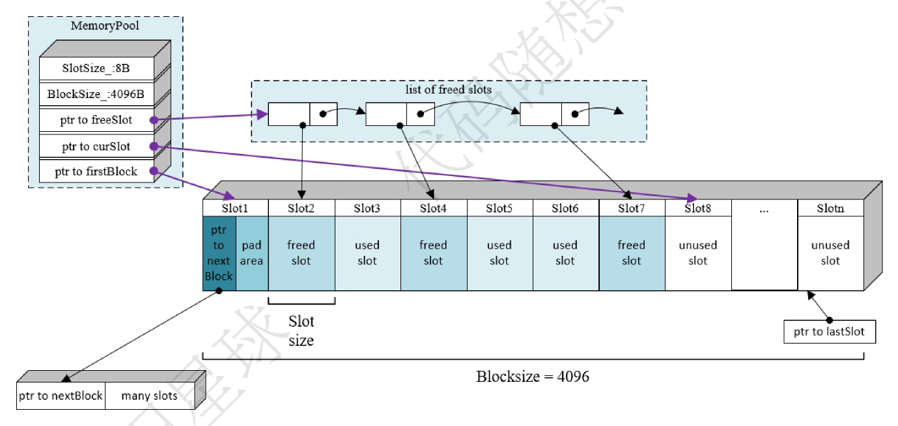
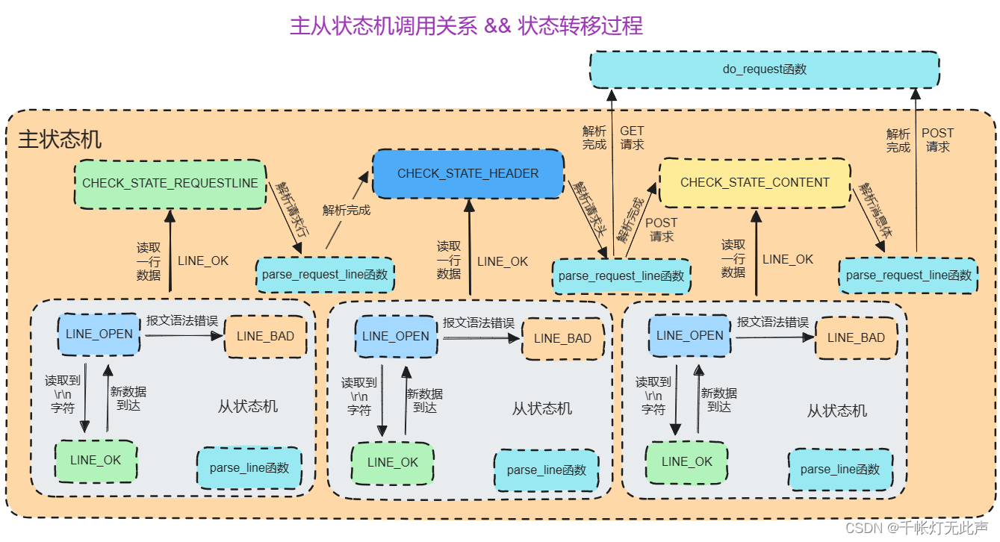
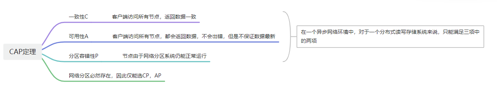

# 面试

## 目录

[TOC]

## 自我介绍

面试官好，非常有幸参加本次面试，我是陈博宇，一名哈尔滨工程大学研三在读的学生，接下来我先做简单自我介绍，在专业技能上面，我学习了c++编程语言、数据结构与算法、mysql和redis数据库、linux环境下网络编程等相关知识，并且了解c++常用新特性和标准模板库等相关内容。为了理论和实践相结合，目前我做了三个项目，第一个是一个基于linux环境下的的http服务器，另一个是为了学习rpc，实现了一个分布式的rpc框架。最后就是mit那个分布式系统的课程，跟着做实验的，raft合mapreduce差不多做完的时候收到一个小厂的实习就去实习了，做的区块链相关的东西，实习了一个月，5月份收到腾讯的实习就去腾讯了，期间做的向量化项目相关的工作，谢谢，我的自我介绍完毕

## 实习经历

### 腾讯实习

#### 介绍

腾讯大数据后台开发实习，大约是五月中旬入职实习的，从上一个公司离职后直接去了，刚开始是在平台内核组，后面组织结构变动，换到了智能湖仓研发组，一直负责公司天穹os向量化项目，这里我先介绍**项目背景**就是随着网络io的性能和磁盘读写的性能在不断的提升，cpu的性能已经逐渐成为了大数据计算的性能瓶颈，大数据的生态高度依赖于jvm，然而由于jvm的gc和偏向锁是难以逾越的性能鸿沟，虽然java社区新版本已经有了向量化操作的api，但是根据测试结果来看，性能并没有很大地突破，这也就导致各个厂商在寻找解决方法，也就有了native向量化引擎的需求，我在腾讯实习，他们的向量化方案就是使用spark+gluten+velox，我简单介绍一下这个**项目的架构**，spark是大型的分布式计算框架，gluten属于中间层粘合剂，来将spark的计算任务卸载到native引擎，velox是完全使用cpp写的native向量化引擎加速库项目，采用这个方案来把计算任务卸载到native执行，来实现向量化，提升计算性能，我的**工作内容**就是开发一些合spark语义不一样的thive的udf，来避免项目上线遇见不能解析的udf产生fallbak造成很多的性能损失

**业界其他的方案** databricks photon不开源。只有论文。  datafusion blaze使用自己的protonuf来描述算子不是使用的substrait，容易与社区脱节，不易维护。

#### 腾讯实习可能的问题

##### 什么是偏向锁

如果一个线程获得了锁，并且在接下来的时间内没有其他线程竞争该锁，那么锁将一直偏向于该线程，这样可以避免线程每次进入同步代码块时都需要执行锁的获取和释放操作，从而减少了不必要的CAS（Compare-And-Swap）操作，提高了性能。

##### 偏向锁的性能损失

偏向锁的设计初衷是为了在低竞争的情况下提高性能，但在某些情况下，它可能会导致性能损失，主要原因有以下几点：

**撤销偏向锁的开销** 当另一个线程尝试获取偏向锁时，偏向锁需要被撤销。撤销偏向锁是一个相对复杂的过程，因为它需要将锁升级为轻量级锁或重量级锁。这一过程涉及到停止当前持有偏向锁的线程、重新分配锁状态等操作，这会带来性能开销。
**线程切换频繁** 在高竞争的场景下，偏向锁频繁地被撤销和重新获取，这不仅没有减少同步开销，反而因为频繁的锁撤销而增加了额外的开销。在这种情况下，偏向锁反而可能成为性能瓶颈。
**适应性不强** 偏向锁假设大部分情况下锁是由同一个线程持有的，但在实际应用中，如果锁的持有者频繁变化，偏向锁就不再适用，反而可能拖累性能。

##### fallback性能损失的原因

spark原生实现较native向量化引擎肯定有损失
spark和向量化引擎处理数据的方式不一样需要转换

#### 腾讯实习遇见的困难

##### 感触 实习体验和想象中的不一样

大厂的实习体验和小厂还是不一样的，在小厂的时候，一共没几个人，我那个导师也相对重视我，基本上学习路线都给我说的很清除，按照他的路线去学就完全ok了，但是在腾讯不是，大家都很忙，基本上没有人管我，也没有比较清晰的学习路线，基本都是我自己找资料去学，完全靠自驱性，要不然工作进展不下去，而且我们正在做的工作文档很少，写的也不详细，这样就导致我第一周纯纯踩坑，根据文档配环境配了好久，踩了很多坑，最后导师告诉我代码分支搞错了，但是文档就是那个分支，重新来了，让我很苦恼，吃一堑长一智吧，后续有啥问题，我决定不了，就去问，前辈不会主动问我的，基本上都是我主动去问，但是他们会很有耐心的给我讲解，教我怎么解决

##### 困难 大数据小白

大数据这个方向我基本是一点都没有接触过，因此上手难度其实还是挺大的，当时小组组长告诉我我的工作内容并给我分配任务的时候，我基本属于无知状态，比较苦恼，害怕自己不能处理工作内容，处于被动状态，而且小组中前辈都比较忙，基本我不去问都不会有人来指导我的，我感觉这也就是工作的状态吧，当然后面我也适应了这个环境，找到了解决防范，通过各种渠道先把项目背景和项目框架搞清楚，然后针对自己的工作内容，寻找各种代码demo，内部的社区的都找，熟悉开发过程后再做后续的工作，在腾讯实习了三个多月，基本上一个大模块全部交给我做了。

##### 开发过程中遇见的具体问题

###### 包管理器问题排查

开发udf的时候，有一个返回值是数字类型的udf，出现很奇怪的现象，release模式下进行编译会出现coredump的问题，其他返回值类型就没事，debug模式下就没有问题，这是因为编译器优化的原因，因此比较难排查，因为没有debug信息，当时自己搞了好久，最后搜索gdb的资料，分析调用栈帧，反汇编栈帧数据找到了core在哪一个具体函数上，返回添加debug信息一点点分析，发现在folly库中添加debug信息，后面运行并没有输出，大概知道可能是链接的时候有问题，然后检索链接的相关信息，找到链接folly库的链接目录发现和同事的不一样，最后通过分析发现是编译的时候用的包管理器有问题，不应该使用vcpkg的，应该直接使用编译脚本解决依赖。最后这个问题得到解决了，比较难忘，因为卡了很久

###### java c++ 数据结构不一致问题排查

因为我是直接按照腾讯之前自研的thive的udf来实现velox版本的，当时有一个udf我是完全按照Java的实现来实现的一个算法，但是最后的结果怎么测试都不对，本地测试还有哪个idex平台进行测试，都通过不了，最后我一行一行的输出debug信息，发现有个变量转换过程中出现了负数，基本就判断出有截断的问题，然后我查阅资料发现c++的char和java的char占用类型不一样，找到问题就好解决了，后面使用cpp的wchar就解决问题了。

### 游码量化

#### 实习介绍

游码科技有限公司，当时招聘是按照量化开发工程师招的，当时面试官告诉我进去可能要做低延迟交易系统的开发，但是毕竟不是很大的公司，也就20左右个人，我工作的时候，有经验的交易系统开发的前辈还没来北京，我就先跟着导师学习链上的相关知识，这里从比特币开始了解区块链的知识，然后开始学习solana相关的知识，当时把solana加速交易的七大特性基本掌握了，了解了solana为何交易可以这么快速，掌握了solana链上程序的开发和测试环境，了解了solana链上程序的开发，当时赶上比特币奖励减半符文上线，老板让我去学习了符文相关的知识，搭建比特币全节点，然后使用go语言开发了符文的自动蚀刻工具，主要分为三个部分，首先是获取区块链mempool中的交易信息的gas费，推算出合适的gas费，然后发起蚀刻符文的交易。然后继续监控mempool中交易的gas费，适当的加速交易，避免交易被淹没损失交易费，一个月我差不多就做了这些事情，肯定有所收获，比如我去公司前都不知道区块链的东西，完全不了解web3，我这段实习经历让我了解到了web3领域，了解了去中心化的发展前景，虽然我们国家对其的政策可能没有这么自由，但是我仍然觉得这是以后不可阻挡的趋势，我后面肯定会持续关注web3相关的动态，自己可能也会涉足web3领域。

#### 游码量化实习难点

首先，完全新的领域，在没有去这里实习的之前，我对区块链和web3一点都不了解，过去之后对未知的知识多少有点力不从心，不过还好遇见了一个不错的导师，逻辑性很强，很适合当老师，基本上我按照他给我的学习路线去查找资料学习就可以了。不过查找学习资料的过程中很难，因为东西很新，资料很少，所以在学习过程中多少会有点困难，不过请教导师后，基本上知道在哪解决疑问了，首先去官网，官网没有可以看有没有discode，再不行就去推特，我记得很清晰的就是当时比特币奖励减半，符文上线的时候，我搭建比特币全节点所遇见的问题，怎么都解决不了，最后在discord上找到了解决答案。因为实习时间不长，给我的需求不多，因此遇见的困难也不多。

## 项目

### web server介绍

项目背景是向实践一下自己学的知识，并且熟悉一下linux环境下网络编程的模式和一些组件的编写，首先是Linux下i/o多路复用epoll，来做io事件触发，使用有限状态机来解析http的请求报文，来实现对get请求和post请求的响应，事件处理采用了Reactor模式和模拟的Proactor模式，采用线程池来实现客户端的并发访问，对一些不活跃连接使用定时器进行优化，实现了日志模块。我对项目进行了性能优化，首先使用了双缓冲的异步日志来实现日志的高性能写，内存池来避免频繁申请和释放内存导致的性能损耗和内存碎片，实现lfu缓存来对热点文件的缓存，挺高响应速度，精细化hash表的锁粒度来提升查询的并发量，实现了时间轮和时间堆定时器来优化定时器，使用cpp11标准实现了一个线程池等。对于项目的压力测试，本地测试（proactor），我使用webbench模拟10000个客户端访问5秒，结果显示未优化前qps是5k+，优化完后qps是15k+。

#### web server项目难点

##### 难点1

在写阻塞队列的时候，遇见了一个卡死的现象，应该也不能叫做死锁，当时情况就是程序卡在了阻塞队列的析构函数中了，一直析构不了，当时这个问题折磨了我一晚上，最后我用gdb进行调试，分析调用栈，发现是阻塞到了条件变量，它没有接受到唤醒，析构不了，只能一直在等待唤醒。最后在阻塞队列析构的时候，先唤醒条件变量。

##### 难点2

还有就是项目做完之后，做压测的时候，发现吞吐量一直上不去，一直很低，但是cpu的使用率也很高，一直找不到问题所在，然后我学习了一下火焰图的绘画和分析，对程序进行性能瓶颈分析，发现在http解析的时候非常耗时，然后我就进行分析，查资料，发现我用正则表达式是最大的错误更改回了字符串解析了，通过这个分析，我发现火焰图是个好东西啊，我使用它不断优化项目性能啊，分别是日志优化，内存池优化，lfu缓存优化和高性能hash表优化

##### 难点3

找到一个bug，也不能说是bug，就是由于lfu缓存的出现，我在后台更改了文件，并不会影响到已经缓存过的内容，也就会出现既是我更改了文件，前端访问仍然是历史的版本， 但是本项目的前端并没有提供修改文件的内容的功能，因此不能算是bug，但是我还是了解了一下这个问题，就是关于缓存一致性的问题，这里我了解了一些redis做缓存时用到的缓存一致性方案，比如先删除缓存，再更新数据库（延迟双删）、先更新数据库再删除缓存（给缓存加上过期时间，针对操作失败的情况，引入消息队列），先更新数据库再更新缓存（分布式锁使得更新数据库和缓存原子执行，给缓存加上过期时间）0000，。

#### web server可能的相关问题

##### 三种定时器的区别

我认为主要的区别就是在高并发场景下的更改数据结构，所需要加的锁粒度

**详细：**
**双有序链表**每次增加定时器或者给定时器延长时间需要调整链表，因此需要对整个链表进行加锁，调整的时间复杂度是O(n)，
**时间堆**也需要对整个堆进行上锁，但是其调整的时间复杂度是O(logn)，
**时间轮**定时器调整的时候不需要对整个时间轮进行上锁，仅需要锁住涉及到的槽位即可，可以精细化锁粒度。S

##### lfu和lru

###### lfu介绍

lfu是根据缓存的访问频度来进行缓存置换的，访问一次缓存就增加其频度，优先置换低频度缓存
**实现** 双hash记录key频度和key节点的映射，频度节点指向同一频度的双向链表节点，访问一次就移动到更高频度的链表

###### lru介绍

lru是根据最近访问时间来进行缓存置换的，访问缓存后就将其放置到链表的头部，不是最近使用的就慢慢的调整到了尾部，优先置换尾部
**实现**hash表记录key节点映射

###### 为啥使用lfu

1. **webserver 页面的访问比较随机，时间相关性较低**，经常被访问的页面在下一次有更大的可能被访问，此时使用LFU更好，并且LFU能够避免周期性或者偶发性的操作导致缓存命中率下降的问题；

2. 而对于时间相关度较高（某些页面在特定时间段访问量较大，而在整体来看频率较低）的 `WebServer` 来说，在特定的时间段内，最近访问的页面在下一次有更大的可能被访问，此时使用LRU更好。目前webserver时间相关性较低,时间相关度较高的，比如用户的token session等，用户一般在一段时间内来访问，因此使用lru比较好

###### lfu缺点

会产生缓存污染，使得新生代高频数据块很难留在缓存中

**详细介绍** 换句话说就是，最近加入的数据因为起始的频率很低，容易被淘汰，而早期的热点数据会一直占据缓存。  对热点数据的访问会导致 `freq` 一直递增，我目前使用 `int` 表示 `freq_` ，实际上会有溢出的风险。

###### lfu缺点解决

总纲就是不断的衰减频率，这样就可以让新生代的高频缓存有机会留在缓存

**具体方法**
**lfu aging**（条件老化）优化 在LFU算法之上，引入访问次数平均值概念，当平均值大于最大平均值限制时，将所有节点的访问次数减去最大平均值限制的一半或一个固定值。相当于热点数据“老化”了，这样可以避免频度溢出，也能缓解缓存污染

**windows-lfu** 每一段时间将访问次数做衰减

###### redis中lfu和lru的实现方式

lru没有采用上面描述的（用链表管理缓存占用内存空间，链表操作费时），是对结构体对象中加了一个时间字段，来记录最近访问的时间，汰换的时候随机选取一定数量的key，删除最久未访问的key

lfu是利用上面的时间字段的高16位记录上次访问时间，低8位来记录频率，这个低八位会根据高16位进行衰减，而实现真正的频率，不是简单的访问次数。

###### mysql 解决预读失效，缓存污染lru

young区和old区（7：3）预读缓存先到old区（解决预读失效），在old区中的缓存第二次访问距离第一次访问时间超过1s才挪到young区（解决缓存污染），停留一秒的原因应该就是避免大量的遍历导致缓存污染

linux的解决方法和mysql相似，linux分为了两个链表，old链表第二次访问就放到了young链表

##### 内存池

这里使用类似stl中的二级内存分配子一样管理内存，首先根据8 16 32 ... 512的大小分为64个槽，每个槽中对应不同大小的内存池，当分配的内存小于512时，去内存池中对应的槽中取内存（先看看freelist中是否有内存，如果有就直接用，没有就去block中分配），当block中内存全部使用完后，就使用new分配4096内存，继续使用，大于512的直接使用new进行分配。释放的时候直接放入freelist中。

malloc自己好像是有内存池的

###### 性能损耗的原因

使用`malloc/new`申请分配堆内存时系统需要根据最先匹配、最优匹配或其它算法在内存空闲块表中查找一块空闲内存；
使用`free/delete`释放堆内存时，系统可能需要合并空闲内存块，会产生额外开销频繁使用时会产生大量内存碎片，从而降低程序运行效率

##### 高并发hash表

这里自己实现hashmap，加锁时不再锁住整个hashmap，而是锁住需要操作的hash桶，使用shared_mutex 读操作共享，添加删除操作互斥，精细化了锁粒度。（vector+list）
并且在读和写操作的时候，使用了cpp里面的`share_lock`来实现并发读，写的时候互斥

##### 双缓冲日志

这里分为前端和后端，前端和后端分别由两个缓冲区和一个缓冲队列组成，当数据落盘的时候，后端的缓冲区、缓冲队列会先和前端的进行交换，然后释放锁，后端的写磁盘不会影响前端的日志添加，这也就是细化了锁粒度。当后端写的速率较小，那么前端缓冲区写满后，会申请新的缓冲区。

##### 观察者模式和reactor模型

**观察者模式**的观察者需要直接向通知者注册，当通知者有事件时会直接和观察者进行通信，他两个直接交互

**reactor模式**不需要注册，且两者不是直接通信的，当有事件到来时，主线程会把任务压入到队列，等待线程池来消耗，也就是属于观察者不是和通知者直接通信的，而是有中间代理，这个中间代理就是阻塞队列

##### 主从状态机

主状态机有三种状态分别对应请求行的解析，请求头的解析和请求内容的解析，每个主状态机状态又分为三个从状态机状态，也就是对每一行进行解析的状态，分别对应一行已经解析完毕，行中有错误字段，行数据不完整。

##### 内存模型

c++中内存模型可以分为**基础结构和并发**

**基础结构**就是c++对象的内存布局
**并发**就是多线程下对内存访问的次序

c++中有6中内存次序，分为三种内存模式，
首先是松散的**宽松次序**，也就是任何线程看到的内存改动序列可能都不相同，完全没有关系可言，并发程度也是最高的。

然后最严格的是**先后一致次序**，也就是所有线程看到的内存改动序列都是一样的，并发程度最低。

然后还有就是**获取释放次序**，获取释放次序使得数据操作构成同步关系，一般和先行关系一块使用来达到先行的效果。

### mprpc项目

这个项目是为了了解一下rpc的原理，借助protobuf实现rpc的功能，并且使用protobuf实现数据的序列化和反序列化，底层的网络数据传输使用了muduo网络库，服务注册和服务发现使用了zookeeper，实现了一个rpc框架，这里使用框架时，客户端需要使用protobuf生成rpc的一些必要的类，rpc服务类，和rpc客户类，当用户使用rpc客户类调用方法时，框架就会把rpc调用的参数序列化，然后通过网络传输发送到服务端，服务端对数据进行反序列化，得到方法的参数，然后调用服务端的本地方法，设置响应数据，然后再通过框架对响应数据进行序列化，通过网络发送给客户端，客户端对数据进行反序列化得到响应数据，这些数据的序列化、网络传输、反序列化都是框架在做的事情，对用户透明，使得用户就像调用本地方法一样。

#### 核心类

解析读取zk配置信息的类
channel类主要负责数据的序列化和底层的网络发送和接受
还有一个就是服务的注册，把用户实现的服务信息注册到zk中

### raft项目

这个是mit分布式系统课程所做的项目，当时没有完全做完，收到一个小厂的实习就去实习了，抽时间做完了属于，主要就是了解了一下mapreduce合raft，发现还挺有用的，后面去腾讯大数据才发现mapreduce就是大数据的基石，spark没出来之前hadoop用的就是mapreduce，属于大数据的鼻祖了，然后raft协议也基本了解了，这个课还挺有用的，后续有时间把这个课跟完。

### 可能的面试题

#### 分布式锁实现

##### redis实现

简单实现set nx expire
改进redis的**redlock**

##### zookeeper实现

zookeeper实现分布式锁，采用临时有序节点来实现，当客户端需要加锁的时候向zookeeper申请一个临时有序节点，申请完之后，查看自己的节点是不是第一个节点，如果是第一个节点，那么就上锁成功，如果不是，说明已经有其他客户端上锁成功了，此时zookeeper采用watch命令进行监听比自己小的节点删除事件，如果删除，那么通知客户端上锁成功。

#### raft协议

看b站视频，讲的不错

#### CAP理论

#### Ceph

会把文件分片成**对象存储**（osd），均匀分布到每个节点的每个硬盘，也就是一个文件的存储也可以负载均衡到不同节点，fastDFS不可以。因此Ceph在大文件存储上很有优势，fastDFS在小文件存储有很大优势（尤其是trunk策略）

参考链接: [Ceph的存储原理_哔哩哔哩_bilibili](https://www.bilibili.com/video/BV1Wm4y1V74n/?spm_id_from=333.337.search-card.all.click&vd_source=3aa535caf6a287f00d045ee5ffb0228d)  

#### 一致性hash

将hash值组织成一个抽象的环，hash环，节点在环上，数据映射到环上，顺时针存到节点中，引入虚拟节点避免数据分布不均

#### java垃圾回收

可达性算法，根据可达性算法来判断对象是否还会被使用

### raft

#### 什么是raft算法

Raft算法是一种共识算法(做冗余实现高可用的，而不是扩展)，用于在分布式系统中实现一致性。旨在提供一种更易理解和可靠的分布式一致性算法。

Raft算法解决了分布式系统中的领导者选举、日志复制和安全性等关键问题。它将分布式系统中的节点划分为 **领导者（leader）、跟随者（follower）和候选者（candidate）** 三种角色，并通过一个选举过程来选择领导者。

在Raft算法中，领导者负责接收客户端的请求，并将请求复制到其他节点的日志中。跟随者和候选者则通过与领导者保持心跳和选举的方式来保持一致性。如果领导者失去联系或无法正常工作，系统会触发新一轮的选举过程，选择新的领导者。

Raft算法的设计目标是可理解性和可靠性。相比于其他共识算法如Paxos，Raft算法更加直观和易于理解，使得开发人员能够更容易地实现和调试分布式系统。

#### raft优缺点

Raft算法作为一种共识算法，在分布式系统中具有一些优点和缺点。

##### 优点

1. **简单易懂**：相比于其他共识算法，Raft算法的设计更加直观和易于理解，使得开发人员能够更容易地实现和调试分布式系统。
2. **安全性**：Raft算法保证了系统的安全性，通过领导者选举和日志复制等机制来确保数据的一致性和可靠性。
3. **高可用性**：Raft算法能够在领导者失效时快速进行新的领导者选举，从而保证系统的高可用性。

##### 缺点

1. **性能开销**：Raft算法对于每个写操作都需要进行日志复制，这会带来一定的性能开销。相比于其他共识算法如Paxos，Raft算法的性能可能会稍差一些。
2. **领导者单点故障**：在Raft算法中，领导者是负责处理客户端请求和日志复制的节点，如果领导者失效，整个系统的性能和可用性都会受到影响。
3. **数据一致性延迟**：在Raft算法中，当领导者发生变更时，新的领导者需要等待日志复制完成才能处理客户端请求，这可能会导致一定的数据一致性延迟。

#### 关键过程

##### 领导者选举

每个节点在任意时刻可能处于三种状态之一：领导者（leader）、跟随者（follower）和候选者（candidate）。

- 初始状态下，所有节点都是跟随者（Follower）状态。
- 如果一个跟随者在一段时间内没有收到来自领导者（Leader）的心跳消息，它会转变为候选者（Candidate）并开始选举过程。
- 候选者向其他节点发送投票请求，并请求其他节点投票给自己。
- 其他节点在收到投票请求后，如果还没有投票给其他候选者，且候选者的日志更新且比自己的日志新，就会投票给候选者。
- 如果候选者收到了多数节点的选票（包括自己的一票），那么它就成为新的领导者。
- 如果在选举过程中出现多个候选者获得相同票数的情况，那么会进行新一轮的选举，直到只有一个候选者获胜。

##### 日志复制

- Raft算法使用日志来记录系统中的所有操作。每个节点都有一个日志，其中包含一系列的日志条目。
- 当客户端向领导者发送写请求时，领导者会将该请求作为一个新的日志条目追加到自己的日志中，并向其他节点发送日志复制请求。
- 其他节点收到复制请求后，会将该日志条目追加到自己的日志中，并向领导者发送确认消息。
- 一旦领导者收到多数节点的确认消息，该日志条目被视为已提交，并将其应用到状态机中执行相应操作。

##### 安全性

- Raft算法通过多数投票机制来确保系统的安全性。任何一条已提交的日志条目都必须在多数节点上复制和执行，才能保证数据的一致性。
- 如果一个节点成为领导者，并开始复制日志条目，但在复制完成之前失去了领导者地位，那么新的领导者将继续复制剩余的日志条目。
- 如果一个节点在复制过程中发现自己的日志与领导者的日志不一致，它将回退到领导者的日志状态，并重新进行复制。

总的来说，Raft算法通过领导者选举、日志复制和安全性机制，实现了分布式系统中的一致性和可靠性。它的设计简单易懂，易于实现，并且提供了强一致性保证。

#### 集群和分布式

**集群**是将多个服务器实现同一个业务，来实现一项业务的性能提升，
**分布式**是不同的机器实现不同的业务，通过分布式部署来实现系统整体的性能提升，不同的业务可以集群部署

### zookeeper

zookeeper使用ZAB协议的
ZAB协议是保证ZK一致性的原子广播协议

#### ZK实现一致性

共三个阶段

1. **选举leader**:因为只有leader节点处理写操作
2. **数据同步**:所有follower要与leader保持数据一致性
3. **请求广播**:收到写请求的时候，会将写请求广播到所有follower节点，从而尽量使得所有节点的写操作是同时处理的

#### 为什么ZK可以用来做注册中心

- ZK可以保存对应的key-value
- ZK的watch机制可以做服务发现
- ZK底层用的多线程模型，性能也还行
- ZK可以监控每个服务的连接情况，从而通报给监控的节点，从而更新对应的服务URL

#### ZK的leader领导选举流程是怎样的

1. 首先投票给自己
2. 两两PK，赢家不做操作，输家将票改投赢家，或者赢家的赢家。
3. 如果PK是平局，则票还是投给自己
4. PK结束，输家将票数情况传给下一个PK对象
5. 如果有节点PK赢过一半以上的节点，则直接被选为leader

#### ZK节点数据是如何同步的[或者说同步流程有哪些？]

和raft一样的策略

1. 集群启动时，首先选举出leader节点
2. leader节点收到写请求
3. leader将日志发送给follower
4. follower日志持久化成功以后，返回ACK确认给leader
5. leader收到半数以上的ACK以后，leader更新内存数据
6. 将commit指令发送给从节点
7. leader节点返回响应成功

### 协程

#### 对称协程（c++20）

各个调用者和协程关系是对等的，协程可以resume到任意一个协程

#### 非对称协程

只能yeild到调用者，再由调用者resume到其他

#### 有栈协程

协程有自己的栈帧，通过改寄存器ebp和esp来实现协程的调用（栈帧可以在堆区）

[协程参考视频](https://www.bilibili.com/video/BV1y3411u7Me/?spm_id_from=333.337.search-card.all.click&vd_source=3aa535caf6a287f00d045ee5ffb0228d)

#### 无栈协程

没有自己的栈帧，状态机维护跳转位置

#### 无栈协程和有栈协程的区别

最大的区别就是是否可以在协程中调用的函数中挂起协程
**有栈协程**有自己的栈帧，当调用函数时会生成被调函数的栈帧，因此可以在任意调用层级进行让出，但是如果层级较多，内存不够用就会出现溢出错误。
**无栈协程**只是在刚开始的时候就把协程需要用到的内存分配好了，并且存入了协程中需要用到状态信息，当发生函数调用时，只能等待其函数返回后才能让出，也就是只能自己挂自己。

#### 协程和io多路复用的结合

主要是一些需要等待的事件（connext accept read write），用协程做一层包装，因为在io多路复用的时候，当可读或者可写事件没有处理完（数据没读完，对方服务器没有发完，数据没写完，缓冲区没有空间0），需要重复注册监听事件时，协程函数就把事件注册了，然后让出（这里就不一定让给调用者了（协程调度器），可以给另一个协程来处理同类事件）

参考链接 [协程和io多路复用的结合](https://www.bilibili.com/video/BV1a5411b7aZ/?spm_id_from=333.337.search-card.all.click&vd_source=3aa535caf6a287f00d045ee5ffb0228d
)
